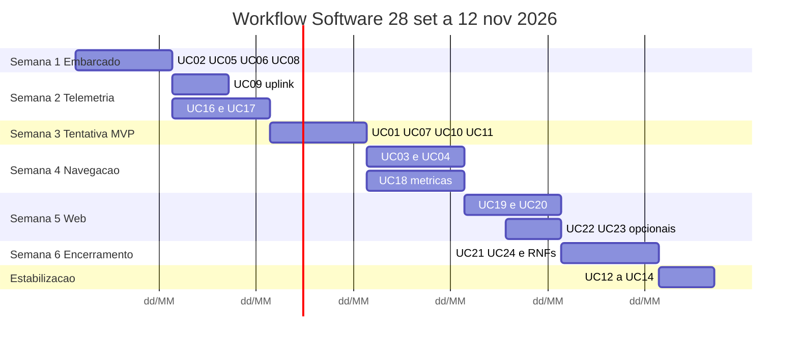

# Backlog Funcional e Não Funcional do Micromouse

Documento **complementar** à documentação do projeto: não substitui nem altera os arquivos já entregues pela equipe.

Este arquivo é a **fonte de verdade** do Grupo 01 sobre **o que está planejado ser desenvolvido** na frente **Software** (Firmware, Backend e Frontend). Os itens do **backlog funcional e não funcional** rastreiam os requisitos (RF/RNF) listados em [2 - Requisitos.md](2%20-%20Requisitos.md) — norma de escopo e prioridade — e indicam **quais casos de uso (UC)** realizam cada requisito. A **especificação de comportamento** do Micromouse (fluxos, escopo, limites e atores) está nas descrições dos UC neste mesmo documento.

TAP, EAP, demais frentes de engenharia e contraste com projetos de referência: [Referências](#referências).

---

## Backlog funcional

Requisitos da seção **Software** (fonte em [Referências](#referências)), ligados aos **casos de uso**. **Ordem das linhas:** mesma de **RF01–RF37** em [2 - Requisitos.md](2%20-%20Requisitos.md#software). Prioridade conforme o documento de origem. Detalhamento de fluxos: [Descrição dos casos de uso](#descrição-dos-casos-de-uso).

| Área     | Requisito                                                  | Prioridade  | Casos de uso relacionados                                                                              |
| -------- | ---------------------------------------------------------- | ----------- | ------------------------------------------------------------------------------------------------------ |
| Frontend | RF01 — Visualizar telemetria do robô                       | Must Have   | UC19, UC20                                                                                             |
| Frontend | RF02 — Visualizar os dados da execução                     | Must Have   | UC19                                                                                                   |
| Frontend | RF03 — Visualizar histórico de execuções                   | Must Have   | UC19                                                                                                   |
| Frontend | RF04 — Visualizar execução em tempo real                   | Should Have | UC20, UC24                                                                                             |
| Frontend | RF05 — Visualizar os dados captados no health-check        | Must Have   | UC01, UC20                                                                                             |
| Backend  | RF06 — Fornecer dados de uma execução em tempo real        | Should Have | UC20                                                                                                   |
| Backend  | RF07 — Consulta ao histórico de execuções                  | Must Have   | UC19                                                                                                   |
| Backend  | RF08 — Receber telemetria do micromouse                    | Must Have   | UC17, UC09                                                                                             |
| Backend  | RF09 — Registrar trajeto no labirinto                      | Must Have   | UC18, UC19                                                                                             |
| Backend  | RF10 — Registrar início de corrida                         | Must Have   | UC16, UC01                                                                                             |
| Backend  | RF11 — Calcular consumo de bateria                         | Must Have   | UC18                                                                                                   |
| Backend  | RF12 — Calcular velocidade média                           | Must Have   | UC18                                                                                                   |
| Backend  | RF13 — Calcular tempo de conclusão                         | Must Have   | UC18, UC10                                                                                             |
| Backend  | RF14 — Calcular comparação de tempo gasto entre execuções  | Should Have | UC23                                                                                                   |
| Backend  | RF15 — Registrar informações sobre a falha de uma execução | Must Have   | UC07, UC15, UC01, UC21, UC24                                                                           |
| Backend  | RF16 — Registrar os status de uma execução                 | Must Have   | UC16, UC01, UC10, UC21, UC24                                                                           |
| Backend  | RF17 — Garantir unicidade entre as execuções               | Must Have   | UC16                                                                                                   |
| Backend  | RF18 — Registrar uma única execução por vez                | Must Have   | UC16, UC21, UC24                                                                                       |
| Backend  | RF19 — Enviar feedback de execução recusada                | Must Have   | UC16, UC01, UC20, UC15 (abertura duplicada — [Anexo A](#modelo-execução-lógica--tentativa-persistida)) |
| Firmware | RF20 — Detectar paredes e obstáculos                       | Must Have   | UC06, UC03, UC05, UC01                                                                                 |
| Firmware | RF21 — Controlar a movimentação do Micromouse              | Must Have   | UC05, UC03, UC04, UC13, UC24                                                                           |
| Firmware | RF22 — Calcular velocidade do Micromouse                   | Must Have   | UC05, UC09                                                                                             |
| Firmware | RF23 — Monitorar bateria                                   | Must Have   | UC08, UC01, UC09                                                                                       |
| Firmware | RF24 — Transmitir telemetria para o sistema web            | Must Have   | UC09, UC17, UC24 (recepção do comando de aborto Bluetooth)                                             |
| Firmware | RF25 — Sinalizar estado do robô                            | Could Have  | UC11, UC01, UC07, UC10                                                                                 |
| Firmware | RF26 — Detectar chegada ao objetivo                        | Must Have   | UC10, UC04                                                                                             |
| Firmware | RF27 — Configurar modo de operação                         | Could Have  | UC02                                                                                                   |
| Firmware | RF28 — Rastrear localização e trajeto no labirinto         | Must Have   | UC05, UC03, UC09, UC15                                                                                 |
| Firmware | RF29 — Realizar um health-check antes de uma execução      | Should Have | UC01, UC15, UC16 (cada `tentativa_id`)                                                                 |
| Backend  | RF30 — Encerrar execução em andamento                      | Must Have   | UC24, UC01                                                                                             |
| Backend  | RF31 — Detectar perda de comunicação                       | Must Have   | UC21, UC20                                                                                             |
| Backend  | RF32 — Detectar estouro do tempo limite                    | Must Have   | UC21                                                                                                   |
| Backend  | RF33 — Armazenar os dados finais da execução               | Must Have   | UC18                                                                                                   |
| Backend  | RF34 — Consultar execuções de um labirinto                 | Must Have   | UC19                                                                                                   |
| Backend  | RF35 — Consultar execuções de todos os labirintos          | Must Have   | UC19                                                                                                   |
| Backend  | RF36 — Consultar detalhes de uma execução                  | Must Have   | UC19                                                                                                   |
| Backend  | RF37 — Registrar paredes detectadas                        | Could Have  | UC22, UC03                                                                                             |

Casos de uso **UC12**, **UC13** e **UC14** são melhorias opcionais (EAP) sem RF dedicado na seção Software; apoiam RF21, RF28 e RF37 quando implementados. **UC15** (nova **tentativa** na mesma **execução lógica**) materializa RF15/RF17/RF18/RF28 — sem RF próprio. **Troca/recarga de bateria** entre tentativas é procedimento **Energia/Estruturas** (TAP — robô em repouso); **não** há UC de Software — ver [Referências](#referência--demais-áreas-fora-deste-backlog).

---

## Backlog não funcional

Requisitos **RNF01–RNF13** da seção Software (fonte em [Referências](#referências)). **Ordem das linhas:** mesma de **RNF01–RNF13** em [2 - Requisitos.md](2%20-%20Requisitos.md#software). RNFs de Estruturas, Energia e Eletrônica permanecem no documento de requisitos (ver [demais áreas](#referência--demais-áreas-fora-deste-backlog)).

| Área     | Requisito                                         | Prioridade  | Casos de uso relacionados / métrica                                                                             |
| -------- | ------------------------------------------------- | ----------- | --------------------------------------------------------------------------------------------------------------- |
| Frontend | RNF01 — Integridade dos dados                     | Must Have   | UC19, UC20 — valores iguais aos recebidos, sem arredondamento enganoso                                          |
| Frontend | RNF02 — Tempo de resposta da interface            | Must Have   | UC20 — UI atualizada em ≤ 2 s após recebimento                                                                  |
| Frontend | RNF03 — Arquitetura das informações               | Must Have   | UC19 — organização clara da página de execução                                                                  |
| Backend  | RNF04 — Latência no acompanhamento em tempo real  | Should Have | UC20 — atraso fim a fim 3–5 s                                                                                   |
| Backend  | RNF05 — Persistência dos dados                    | Must Have   | UC18, UC19 — dados após reinício do servidor                                                                    |
| Backend  | RNF06 — Não interferência na corrida              | Must Have   | UC09, UC24 — uplink de telemetria; **único downlink permitido (TAP):** comando Bluetooth de encerramento (RF30) |
| Backend  | RNF07 — Independência da execução                 | Must Have   | UC03, UC04 — corrida continua se backend cair                                                                   |
| Backend  | RNF08 — Tolerância a perda de conexão             | Must Have   | UC17, UC21 — reconexão; dados já recebidos mantidos                                                             |
| Backend  | RNF09 — Validação dos dados recebidos             | Must Have   | UC17 — descartar mensagens inválidas                                                                            |
| Backend  | RNF10 — Funcionamento em rede local               | Should Have | UC17, UC19 — sem dependência de internet pública                                                                |
| Backend  | RNF11 — Capacidade de processamento da telemetria | Should Have | UC17 — ≥ 10 msg/s sem fila crescente                                                                            |
| Backend  | RNF12 — Desenvolvimento próprio                   | Must Have   | UC16–UC23 — stack da equipe                                                                                     |
| Backend  | RNF13 — Documentação da API                       | Should Have | UC17 — protocolo e endpoints no repositório                                                                     |

---

## Descrição dos casos de uso {#descrição-dos-casos-de-uso}

Cada caso de uso segue o mesmo padrão: **nome**, **descrição breve**, **atores**, **pré-condições**, **fluxo básico** e **fluxos alternativos** (desvios do básico). Quando não houver desvio, a seção de alternativos indica *Nenhum*. **Requisitos** e limites de escopo aparecem ao final de cada UC para rastreabilidade com o backlog.

Tabelas, modelos de persistência e detalhes de interface ficam nos [Anexos complementares](#anexos-complementares) (final deste documento).

### Atores

Nos fluxos, **Operador** = operador da equipe; **Sistema web** = sistema de telemetria (backend + frontend); **Micromouse** = sistema embarcado (firmware integrado a hardware, energia e mecânica).

| Ator                               | Descrição                                                                                             |
| ---------------------------------- | ----------------------------------------------------------------------------------------------------- |
| **Operador da equipe**             | Integrante que liga o robô, configura DIP, inicia tentativa via fluxo acordado e consulta telemetria. |
| **Micromouse (sistema embarcado)** | Firmware + hardware + energia + mecânica executando navegação autônoma.                               |
| **Sistema de telemetria (web)**    | Backend + frontend que recebe, persiste e exibe dados; não comanda o robô durante a corrida.          |
| **Professores / banca**            | Avaliam critérios de aceite, tempo e envio de telemetria.                                             |

Cronograma sugerido de implementação dos UC (frente Software): [Workflow de desenvolvimento](#workflow-de-desenvolvimento-software).

**Numeração contínua (UC01–UC24):** **UC01–UC07** embarcado (preparação, labirinto, falha); **UC08–UC14** telemetria local, sinalização e melhorias EAP; **UC15** retomada na mesma execução lógica; **UC16–UC20** registro, ingestão, métricas, histórico e acompanhamento web; **UC21** e **UC24** encerramento automático e manual; **UC22** e **UC23** (*Could* / *Should*) paredes no backend e comparação de tempos — citados no backlog, sem seção detalhada neste documento. Não há UC de troca de bateria (procedimento Energia/Estruturas).

---

### UC01 — Preparar tentativa (health-check)

Antes de liberar a corrida autônoma, verifica se o Micromouse está apto (energia, sensores, movimento mínimo). Ocorre **a cada nova tentativa persistida** (`tentativa_id`), **inclusive** quando `attempt_index` > 1 na **mesma** `execucao_id` (retomada **UC15** ou nova abertura **UC16**) — **não** basta o health-check da tentativa anterior. Durante `health-check` a telemetria fica na UI (**UC20**, RF05); falha crítica encerra **esta** tentativa como `failed` sem navegar. Exploração (UC03/UC04) só após aprovação e transição para `running`.

**Atores:** Operador, Micromouse, Sistema web

**Pré-condições:** Robô ligado; backend disponível; **primeira tentativa** de uma execução lógica via **UC16** (ou retomada via **UC15**); nenhuma **tentativa** aberta (RF18).

**Fluxo básico**

1. Operador posiciona o robô na célula inicial.
2. Firmware entra em status `health-check`.
3. Verifica bateria acima do mínimo.
4. Amostra sensores e executa autoteste curto de motores.
5. Envia telemetria inicial ao backend (UC09 → UC17); backend confirma recepção válida associada à execução.
6. Se **3, 4 e 5** forem aprovados, transiciona para `running` (RF10).

**Fluxos alternativos**

- **3a — Bateria abaixo do mínimo:** UC11 (buzzer/LED); tentativa → `failed` (`low_battery`, RF15); não entra em `running`. Recarregar/trocar fonte (**Energia/Estruturas**); depois **UC16/UC01** (não UC15).
- **4a — Sensor ou motores reprovados:** tentativa → `failed` (`health_check_failed`); reparo; depois **UC16/UC01** (**UC16 — 2a** se ainda houver tentativa aberta).
- **4b — Operador aborta no autoteste:** **UC24** (tentativa `failed`); mesma `**execucao_id`** → **UC16** + **UC01** (nova tentativa), ou nova execução TAP (RF10) se política da equipe exigir.
- **5a — Telemetria inicial inválida ou ausente (UC17/RNF09):** `health-check` ou `failed` (`telemetry_failed`); corrigir link; depois **UC16/UC01**.

**Pós-condições:** Aprovado → `running`. Reprovado → `failed` com motivo e dados de health-check persistidos (RF15, RF16, Frontend RF05).

**Requisitos:** RF29, RF15, RF16, RF10, Frontend RF05. **Entregas:** autoteste no firmware, telemetria inicial, execução no backend, área UI health-check (RF05). **Fora do escopo:** calibração permanente em bancada; reparo mecânico neste UC.

---

### UC02 — Configurar modo de operação

Escolhe parâmetros de operação via **DIP switch de 4 vias** (Eletr. RF9) sem reprogramar o firmware entre tentativas. Ao energizar, o embarcado lê **SW1–SW4** (ON = interruptor para cima / lógico 1, conforme wiring da PCB) e carrega a configuração abaixo. O valor lido deve ser **repetido na telemetria** (campo `maze_type` / equivalente) para o backend alinhar com RF10.

**Atores:** Operador, Micromouse

**Pré-condições:** Robô em repouso; corrida não iniciada.

**Fluxo básico**

1. Operador ajusta SW1–SW4 conforme [opções iniciais](#uc02-opções-iniciais-dip).
2. Ao energizar, firmware decodifica a combinação e aplica limites de mapa, objetivo e perfil de velocidade.
3. Parâmetros permanecem fixos até encerrar a execução de forma manual ou automática; não alterar DIP com execução aberta.

**Fluxos alternativos**

- **2a — SW1+SW2 reservados (ON+ON):** firmware recusa iniciar corrida (LED/buzzer de erro) ou assume **4×4** com aviso na telemetria — comportamento único a documentar no repositório antes da prova.

**Requisitos:** RF27, Eletr. RF9. *Tabelas DIP (SW1–SW4):* [Anexo — UC02 opções DIP](#uc02-opções-iniciais-dip). **Fora do escopo:** downlink de navegação na corrida (exceto UC24); escolha de labirinto pela UI web (configuração é só hardware + telemetria).

---

### UC03 — Explorar labirinto e mapear

Com labirinto desconhecido, percorre células de forma sistemática (DFS ou equivalente documentado), detecta paredes e constrói mapa interno até permitir rota ao objetivo ou esgotar o tempo.

**Atores:** Micromouse

**Pré-condições:** Status `running`; posição inicial conhecida; mapa vazio.

**Fluxo básico**

1. **include** UC06 (ler paredes).
2. Atualiza mapa na célula atual (RF28).
3. DFS escolhe próxima célula adjacente não visitada sem parede.
4. **include** UC05 até a nova célula.
5. Repete até mapa permitir rota ao objetivo ou limite de tempo.

**Fluxos alternativos**

- **4a — Falha de movimento:** UC07 → tentativa corrente `failed`; `**execucao_id` em andamento**; **outra tentativa** = **UC15** (não UC16). Encerramento total: **UC24** / **UC21** → depois **UC16** (nova execução TAP).

**Requisitos:** RF28, RF20, RF21, Eletr. RF1. **Fora do escopo:** LiDAR/câmera; mapa pré-carregado; controle remoto do próximo passo.

*Contraste:* referências externas usam ToF além da célula imediata — fora do escopo TAP; IR limita-se à célula vizinha salvo calibração extra.

---

### UC04 — Navegar até objetivo

Com mapa de UC03 (ou em paralelo), calcula sequência de células até a área objetivo e executa movimentos de forma autônoma, respeitando 10 minutos e proibição de comandos externos.

**Atores:** Micromouse

**Pré-condições:** Mapa suficiente para rota ao objetivo; ou exploração intercalada (UC03).

**Fluxo básico**

1. Calcula sequência até a área objetivo (RF26).
2. Para cada passo: UC06 → UC05.
3. Em trechos conhecidos, pode aplicar UC12 (Estrut. RF03).
4. **include** UC10 ao entrar na área objetivo (canto diametralmente oposto à partida — TAP).

**Fluxos alternativos**

- **2a–4a — UC07 no percurso:** parada recuperável → **UC15** (nova `**tentativa_id`**, mesmo `**execucao_id`**) ou encerramento terminal (**UC24** / **UC21**).

**Pós-condições:** Tentativa corrente `success` ou `failed`; `**execucao_id` concluida** só com UC10; tempo (RF13) na tentativa bem-sucedida.

**Requisitos:** RF26, RF21, RF28, RF24. **Fora do escopo:** teleoperação; edição de mapa pelo operador na corrida.

---

### UC05 — Executar primitiva de movimento

Realiza avanço de uma célula (18 cm), giro 90° ou parada; aciona motores de passo, atualiza odometria em malha aberta e alimenta telemetria.

**Atores:** Micromouse

**Pré-condições:** Motores calibrados; caminho livre conforme UC06.

**Fluxo básico**

1. Seleciona primitiva (avanço ou giro 90°).
2. Gera trenas STEP/DIR (Eletr. RF6).
3. Atualiza contadores de odometria.
4. Atualiza célula/orientação (RF28).
5. Emite telemetria (**include** UC09).

**Fluxos alternativos**

- **2a — Parede inesperada no avanço:** UC07 (`collision`).

**Requisitos:** RF21, RF22, Eletr. RF2. **Fora do escopo:** odometria por encoder; UC13 salvo implementação explícita.

---

### UC06 — Detectar paredes na célula

Interpreta sensores IR na célula e orientação atuais para classificar parede ou abertura à frente, à esquerda e à direita (piso preto / parede branca / topo vermelho).

**Atores:** Micromouse

**Pré-condições:** Sensores calibrados para piso/parede/topo.

**Fluxo básico**

1. Amostra sensores (≥ 10 Hz).
2. Aplica filtro/mediana conforme firmware.
3. Classifica abertura/parede (frente, esquerda, direita).
4. Retorna conjunto à navegação (UC03/UC04/UC05).

**Fluxos alternativos:** *Nenhum.*

**Requisitos:** RF20, Eletr. RF1, RF8. **Fora do escopo:** distância em cm para UI; ToF/visão; paredes além da célula imediata sem extensão calibrada.

*Contraste:* validar IR na iluminação da sala (AP7/AP12).

---

### UC07 — Detectar falha de movimento

Identifica colisão, travamento ou desvio inaceitável durante UC05, interrompe motores e registra o incidente (RF15). **Fecha a tentativa persistida corrente** (`failed` + motivo + **célula final**), mas a **execução lógica** permanece **em andamento** para **UC15**, salvo **UC24** / **UC21**.

**Atores:** Micromouse, Sistema web

**Pré-condições:** Comando de movimento em andamento ou concluído; **tentativa** persistida aberta (`running`).

**Fluxo básico**

1. Detecta parede inesperada, timeout de passos ou célula inalterada.
2. Para motores.
3. Define **célula de retomada** = última célula válida **antes** do movimento que falhou (RF28); registra célula do incidente e motivo (`collision`, `stuck`, etc.) — RF15.
4. **Encerra a tentativa corrente** (UC18/RF33): `tentativa_id` → `**failed`**; grava **célula final** (em geral célula de retomada); RF09 fechado **nesta** transação.
5. Aciona RF25/UC11; telemetria final da tentativa (UC09). `**execucao_id**` continua **em andamento** (não é “nova execução” de negócio).

**Fluxos alternativos**

- **5a — Desistir do desafio (terminal):** **UC21** cancela `execucao_id`. **UC24** só encerra a tentativa — ver **UC24** (nova tentativa na mesma execução via **UC16**).
- **5b — Retomar na mesma execução:** **UC15** (`attempt_index` + 1). **UC16** antes de `failed` → **RF19** (**UC16 — 2a**).

**Requisitos:** RF15, RF16, RF21, RF25, RF28. **Fora do escopo:** replanejamento automático sem intervenção; downlink de diagnóstico.

---

### UC08 — Monitorar energia embarcada

Lê tensão da bateria (ADC), converte em indicador de carga e inclui nas mensagens de telemetria; alerta quando insuficiente para tentativa segura.

**Atores:** Micromouse

**Pré-condições:** ADC/divisor energizado (Eletr. RF3).

**Fluxo básico**

1. Amostra tensão periodicamente.
2. Converte em percentual ou mAh (acordo com Energia).
3. Inclui em cada pacote de telemetria (UC09).
4. Se abaixo do mínimo, sinaliza antes/durante corrida (apoia UC01).

**Fluxos alternativos:** *Nenhum.*

**Requisitos:** RF23, Energia RF04, RF05.

---

### UC09 — Transmitir telemetria

Envia periodicamente via Bluetooth célula, bateria, timestamp e demais campos acordados. No downlink, aceita **somente** comando de encerramento (UC24 / RNF06).

**Atores:** Micromouse, Sistema web

**Pré-condições:** Bluetooth pareado ao gateway do backend.

**Fluxo básico**

1. Monta mensagem (JSON ou formato documentado) com campos mínimos e status.
2. Envia em intervalo ≤ 500 ms (meta RNF11).
3. Backend valida (RNF09) e persiste (UC17).

**Fluxos alternativos**

- **2a — Falha de link:** robô continua UC03/UC04 (RNF07); backend marca perda (RF31 → UC21).

**Requisitos:** RF24, Backend RF08, RNF06, RNF07. **Fora do escopo:** teleoperação de trajeto; vídeo.

---

### UC10 — Detectar chegada ao objetivo

Verifica se o Micromouse entrou na **área de objetivo** definida pelo **TAP**: partida em um **canto** do labirinto e meta no **canto diametralmente oposto** (conjunto de células derivado do tipo 4×4 / 8×4 / 12×4 — UC02). Ao confirmar, para motores, marca `success` e dispara tempo de conclusão no backend.

**Atores:** Micromouse

**Pré-condições:** Tipo de labirinto (UC02); célula inicial no canto de partida; **células-objetivo** no canto oposto documentadas no firmware (TAP).

**Fluxo básico**

1. Após UC05, compara célula lógica atual (RF28) com o conjunto-objetivo.
2. Se **não** pertence ao conjunto → retorna a UC04/UC03 (sem `success`).
3. Se pertence: para motores; `**tentativa_id` → `success**` (RF16); `**execucao_id` → concluida**; telemetria final (UC09); backend calcula tempo de conclusão (RF13); opcional UC11.

**Fluxos alternativos**

- **1a / 2a — Sem meta:** **UC07** → **UC15** na mesma execução. **UC24** → **UC16** (nova tentativa, canto inicial). **UC21** cancela a execução lógica (terminal).
- **3a — Pedido de abertura duplicada:** tentar **UC16** ou novo autoteste com tentativa ainda aberta → **RF19** (**UC16 — 2a**).

**Requisitos:** RF26, RF28, RF16, RF13, RF24; TAP (critérios de aceite).

---

### UC11 — Sinalizar estado visual e sonoro

Feedback local por LED e buzzer (início, falha, sucesso), complementar à telemetria web.

**Atores:** Micromouse

**Pré-condições:** LED e buzzer acionados (Eletr. RF10).

**Fluxo básico**

1. Ao entrar em `running`, indicar início.
2. Em UC07, indicar erro/colisão.
3. Em UC10 com sucesso, indicar conclusão.

**Fluxos alternativos:** *Nenhum.*

**Requisitos:** RF25, Eletr. RF5, RF10.

---

### UC12 — Aumentar velocidade em trecho mapeado

Em segmentos com paredes já conhecidas, eleva perfil de velocidade em UC05 para reduzir tempo, mantendo tração e odometria válidas.

**Atores:** Micromouse

**Pré-condições:** UC03 ou UC04 ativo; segmento seguro no mapa (RF28).

**Fluxo básico**

1. Identifica sequência de células sem incerteza.
2. Eleva perfil de velocidade em UC05 (Estrut. RF03).

**Fluxos alternativos:** *Nenhum.*

**Requisitos:** Estrut. RF03 (melhoria opcional EAP).

---

### UC13 — Executar curva contínua

Opcionalmente substitui parar–girar–avançar por arco de 90° com acionamento diferencial dos motores de passo.

**Atores:** Micromouse

**Pré-condições:** Calibração fina dos dois motores (RF21).

**Fluxo básico**

1. Executa perfil de passos diferencial no lugar de parada + giro + avanço.
2. Atualiza orientação e célula ao final (RF28).

**Fluxos alternativos:** *Nenhum.*

**Requisitos:** RF21 (melhoria opcional EAP).

---

### UC14 — Persistir mapa em flash

Opcionalmente grava mapa de UC03 em flash quando não há corrida ativa, para recuperação após reset na bancada.

**Atores:** Micromouse

**Pré-condições:** Corrida **não** em andamento; flash disponível no MCU.

**Fluxo básico**

1. Serializa mapa de UC03.
2. Grava em flash.
3. Após reset, opcionalmente restaura antes de nova tentativa.

**Fluxos alternativos:** *Nenhum.*

**Requisitos:** Melhoria opcional (EAP); apoia RF28. **Fora do escopo:** escrita durante os 10 min de prova; sync automático com backend (UC22).

---

### UC15 — Retomar execução após falha no trajeto

Continua a **mesma execução lógica** (`execucao_id`), abrindo **nova tentativa persistida** (**novo `tentativa_id`** — RF17, nova transação no banco). **Não** cria nova execução lógica. Operador reposiciona na **célula de retomada**; firmware mantém mapa (UC03) e retoma UC04/UC03.

**Atores:** Operador, Micromouse, Sistema web

**Pré-condições:** `execucao_id` **em andamento**; tentativa anterior encerrada por UC07; célula de retomada definida (RF28); robô em repouso (TAP); nenhuma tentativa aberta (RF18).

**Fluxo básico**

1. Operador reposiciona e orienta o Micromouse na **célula de retomada**.
2. Operador confirma **Retomar** na UI (Frontend RF04).
3. Backend cria **nova tentativa** ligada ao `**execucao_id`**: novo `**tentativa_id`**, `attempt_index` + 1, `**multiple_attempts = true**`; célula de partida = retomada; status inicial `**health-check**` (RF16) — **sem** novo `execucao_id`.
4. **include UC01** na célula de retomada (RF29): bateria, sensores, autoteste curto de motores e telemetria inicial validada (UC17) **desta** tentativa; mapa UC03 intacto; posição lógica = retomada; leitura UC06 na célula se necessário.
5. Só após UC01 aprovado → `running`; UC09 associa telemetria ao **novo** `tentativa_id`; navegação UC03/UC04 continua.

**Fluxos alternativos**

- **3a — Retomar antes do UC07 fechar a tentativa:** **RF19** (**UC16 — 2a**). Retomada só após a tentativa interrompida estar `failed`.
- **4a — Checagens reprovadas:** reparo e nova tentativa (**UC16** + **UC01**) ou **UC24** se operador encerrar a tentativa manualmente.

**Requisitos:** RF15, RF16, RF17, RF18, RF28, RF10, RF21, **RF29**; **UC01**; UC07, UC16, UC03, UC04, UC09, UC20 (RF05); UC18, RF33. **Fora do escopo:** novo `execucao_id`; teleoperação; retomada após execução lógica **cancelada/concluída**; pular UC01 porque a execução lógica já teve autoteste em tentativa anterior.

---

### UC16 — Registrar execução de corrida

Abre **execução lógica** (`execucao_id`) na **primeira** tentativa do desafio **ou** **tentativa** filha no mesmo `execucao_id` (**UC15** após UC07, **UC16** após **UC24** ou falha de autoteste). Cada abertura gera `**tentativa_id`** (RF17) e status RF16.

**Atores:** Sistema web, Micromouse

**Pré-condições:** Nenhuma **tentativa** aberta (RF18). **Nova execução TAP (RF10):** conforme política da equipe. **Nova tentativa na mesma execução:** `execucao_id` **em andamento**; tentativa anterior `**failed`**.

**Fluxo básico**

1. Se **primeira** tentativa do desafio: cria `**execucao_id`**, labirinto, **nº tentativa TAP** (RF10), `multiple_attempts = false`.
2. Cria `**tentativa_id**` (RF17); `**attempt_index = 1**` ou incremento via **UC15** / **UC16** (pós-**UC24**); `multiple_attempts = true` se > 1.
3. Registra **célula de partida** (canto inicial ou retomada); timestamp; status inicial `**health-check`** (RF16); em seguida o fluxo aciona **UC01** antes de `running` (RF10/RF29).

**Fluxos alternativos**

- **2a — Tentativa ainda aberta:** Não é possível registrar outra corrida enquanto a atual estiver em `health-check` ou `running` (**RF18**). O backend recusa e mostra mensagem (**RF19**). Mesma regra se a abertura vier de **UC01** ou da tela ao vivo (**UC20**). Só depois de `success` ou `failed` — escolher **UC15** ou **UC16** conforme [Anexo A](#modelo-execução-lógica--tentativa-persistida).

**Requisitos:** RF10, RF16, RF17, RF18, RF19, RF33.

---

### UC17 — Receber e validar telemetria

Backend (e gateway Bluetooth) recebe pacotes de UC09, valida schema e faixas, descarta inválidos e associa leituras à execução corrente.

**Atores:** Sistema web, Micromouse

**Pré-condições:** UC09 enviando mensagens; gateway Bluetooth ativo.

**Fluxo básico**

1. Recebe payload.
2. Valida formato, campos obrigatórios e célula dentro do labirinto (RNF09).
3. Associa à **tentativa** corrente (`tentativa_id`; `execucao_id` para agregação).
4. Descarta inválidas sem derrubar o serviço.

**Fluxos alternativos:** *Nenhum.*

**Requisitos:** RF08, RNF09, RNF08, RNF13.

---

### UC18 — Calcular métricas da execução

Deriva trajeto, consumo de bateria, velocidade média e tempo de conclusão (quando UC10) e grava pacote final da execução.

**Atores:** Sistema web

**Pré-condições:** UC17 persistindo leituras.

**Fluxo básico**

1. Atualiza consumo de bateria (RF11).
2. Calcula velocidade média (RF12).
3. Registra sequência de células (RF09) **por `tentativa_id`**.
4. Por tentativa: `**start_cell**`, `**end_cell**`, status final; na execução lógica: lista de tentativas, `multiple_attempts`, `attempt_index`.
5. Ao UC10 na tentativa bem-sucedida: tempo de conclusão (RF13); `**execucao_id` → concluida**.
6. Grava pacote final (RF33) por tentativa e resumo da execução lógica (RNF13).

**Fluxos alternativos:** *Nenhum.*

**Requisitos:** RF09, RF11–RF13, RF33.

---

### UC19 — Consultar histórico e detalhes

Operador lista execuções passadas (por labirinto ou geral) e abre detalhe com trajeto, métricas, status e motivo de falha.

**Atores:** Operador, Sistema web

**Pré-condições:** Dados persistidos (RNF05).

**Fluxo básico**

1. Operador filtra por labirinto ou visão geral (RF34, RF35).
2. Lista execuções em ordem decrescente (Frontend RF03).
3. Abre detalhe com trajeto e métricas (RF36, RF02); visão *Trajeto percorrido* conforme [Anexo — UC19 marcadores](#anexo-uc19-marcadores).

**Fluxos alternativos:** *Nenhum.*

**Requisitos:** Frontend RF01–RF03, Backend RF07, RF34–RF36, RNF01; UC02, UC10; RF15, RF09.

---

### UC20 — Acompanhar execução ativa

Durante `health-check` ou `running`, a UI atualiza telemetria por polling, mostra “última atualização” e bloco de health-check (**RF05** — [regra por tentativa](#anexo-uc20-health-check)); inclui **Encerrar execução** (modal **UC24**) e, após **UC07**, **Retomar** (**UC15**).

**Atores:** Operador, Sistema web

**Pré-condições:** Tentativa corrente em `health-check` ou `running` (RF16).

**Fluxo básico**

1. UI faz polling (Frontend RF04 / Backend RF06) vinculado ao `tentativa_id` aberto.
2. Exibe última telemetria e “última atualização há X s”.
3. Em `health-check`, mostra bloco de autoteste (Frontend RF05) até UC01 liberar `running`; após **Retomar (UC15)**, repete o bloco para a nova tentativa.

**Fluxos alternativos**

- **3a — “Nova corrida” ou autoteste com tentativa ainda ativa:** **RF19** (**UC16 — 2a**). Após falha no trajeto, usar **Retomar (UC15)**.
- **3b — Sem tentativa aberta, execução em andamento (ex.: após UC24):** ação **Nova tentativa** → **UC16** + **UC01** na mesma `execucao_id`.

**Requisitos:** Frontend RF04, RF05, RF06; RNF02, RNF04; RF18, RF19 (ações de abertura).

---

### UC21 — Encerrar execução (automático)

Fecha **execução lógica** sem ação do operador: estouro de 10 min (RF32) ou ausência prolongada de telemetria (RF31). Encerra a **tentativa** aberta (`failed`) e marca `**execucao_id` cancelada**; persiste (UC18/RF33); libera RF18 para **nova execução lógica** (UC16 / RF10). **Não** envia aborto Bluetooth (distinto de UC24).

**Atores:** Sistema web

**Pré-condições:** `**execucao_id` em andamento** ou tentativa aberta; sem `success` por UC10.

**Fluxo básico**

1. Monitora duração e heartbeat de UC17 (por `**tentativa_id**` / agregado da execução lógica).
2. Ao violar limiar → tentativa `failed` + motivo (RF15); `**execucao_id` cancelada**.
3. UC18 grava pacote final (RF33).
4. RF18 permite nova **execução lógica** (UC16).

**Fluxos alternativos:** *Nenhum.*

**Requisitos:** RF31, RF32, RF15, RF16, RF33. **Fora do escopo:** UC24; downlink ao Micromouse. *Comparativo com UC24:* [Anexo — Encerramento UC21 × UC24](#anexo-encerramento-uc21-uc24).

---

### UC24 — Encerrar execução (manual — operador)

Operador encerra a **tentativa em curso** pela UI (**UC20** / Frontend RF04), com motivo registrado (RF15). A `**tentativa_id`** passa a `**failed`**; a `**execucao_id**` **permanece aberta** (`em_andamento`) para **nova tentativa** na mesma execução lógica (**UC16** + **UC01**, `attempt_index` + 1) — distinto de **UC21**, que **cancela** a execução lógica. RF30, persistência UC18/RF33, RF18 liberado. Aborto Bluetooth conforme TAP/RNF06 quando aplicável.

**Atores:** Operador, Sistema web, Micromouse

**Pré-condições:** Tentativa em `health-check` ou `running`.

**Fluxo básico**

1. Operador aciona **Encerrar execução** na UI e preenche o modal ([Anexo — UC24 modal](#anexo-uc24-modal)): motivo obrigatório + observação opcional (≤ 100 caracteres).
2. Ao confirmar **Encerrar como falha**: backend grava `**tentativa_id` → `failed`**, motivo e observação (RF15/RF16); `**execucao_id` continua `em_andamento`** (sem tentativa aberta).
3. Se aplicável (TAP / RNF06): backend envia comando Bluetooth de aborto; firmware para motores (RF21) e cancela navegação.
4. UC09 envia telemetria final da tentativa, se o link ainda existir.
5. UC18 persiste pacote final (RF33), incluindo motivo manual e observação para **UC19**.
6. RF18 liberado; operador pode abrir **nova tentativa** na **mesma** `**execucao_id`** (**UC16** + **UC01**, canto inicial / DIP, `attempt_index` + 1). **UC15** não se aplica (retomada só após **UC07**).

**Fluxos alternativos**

- **1a — Cancelar:** nenhuma alteração de status.
- **1b — Observação com mais de 100 caracteres:** UI impede envio ou backend recusa (RNF09); operador encurta o texto.
- **3a — Sem Bluetooth no aborto:** backend conclui registro com motivo da UI; operador para o robô fisicamente (TAP) se necessário.
- **6a — Nova tentativa:** reposicionar no canto, **UC02** se necessário, **UC16** (mesma execução) + **UC01**; opcional recarga (**Energia/Estruturas**).
- **6b — Encerrar de fato a execução lógica (desistir do desafio):** após UC24, não abrir UC16; aguardar **UC21** se aplicável, ou política da equipe para marcar `execucao_id` **cancelada** (fora do fluxo feliz deste UC).

**Pós-condições:** Tentativa corrente `**failed`** (motivo/observação em **UC19**); **nenhuma tentativa aberta**; `**execucao_id` em andamento** — permitida **nova tentativa** (**UC16**) sobre essa execução. Encerramento **terminal** da execução lógica: **UC21** ou `success` (**UC10**), não o UC24 sozinho.

**Requisitos:** RF30, RF15, RF16, RF18, RF21, RF24, RF33; Frontend RF04; UC09, UC18, UC20; RNF06, RNF09. *UI:* [Anexo — UC24 modal](#anexo-uc24-modal). *Comparativo com UC21:* [Anexo — Encerramento UC21 × UC24](#anexo-encerramento-uc21-uc24).

---

## Referências {#referências}

Documentos oficiais do repositório e material de contraste externo. Este arquivo **2.1** detalha backlog e UC da frente **Software**; normas de prova, hardware e mecânica permanecem nos demais artefatos.

### Documentos do projeto

| Documento                                  | Conteúdo relevante para os UC                                                                                                                                              |
| ------------------------------------------ | -------------------------------------------------------------------------------------------------------------------------------------------------------------------------- |
| [1 - TAP](1%20-%20TAP.md)                  | Regras de prova (10 min, 3 tentativas, labirintos 4×4 / 8×4 / 12×4), critérios de aceite, limites de teleoperação (exceção: encerramento manual / UC24), envelope 16,5 cm. |
| [2 - Requisitos.md](2%20-%20Requisitos.md) | RF/RNF por frente: **Software** (backlog deste doc), **Estruturas**, **Energia**, **Eletrônica**.                                                                          |
| [3 - EAP.md](3%20-%20EAP.md)               | Decomposição de produto (estrutura, energia, eletrônica, software); melhorias opcionais citadas em UC12–UC14 e visualização em UC19.                                       |

### Referência — demais áreas (fora deste backlog) {#referência--demais-áreas-fora-deste-backlog}

Os casos de uso abaixo descrevem comportamento de sistema, mas **não** têm linhas no backlog funcional/não funcional de Software — dependem das frentes indicadas.

| UC / tema                                          | Frente                   | Onde consultar                                                                                                 |
| -------------------------------------------------- | ------------------------ | -------------------------------------------------------------------------------------------------------------- |
| UC05, UC06, UC11 — sensores, motores, LED/buzzer   | Eletrônica + Firmware    | [Eletrônica](2%20-%20Requisitos.md#eletrônica); hardware no [TAP](1%20-%20TAP.md) (orçamento)                  |
| **UC08** — leitura/monitoramento de bateria (RF23) | Energia + Firmware       | Telemetria e limiar no UC01; requisitos de célula em [Energia](2%20-%20Requisitos.md#energia)                  |
| Troca/recarga de fonte entre tentativas            | Energia + Estruturas     | Procedimento físico (compartimento, RF06/RF07 Energia, Estrut. RF06); **sem UC neste documento** — TAP repouso |
| UC01, UC10 — dimensões, pista, objetivo            | TAP + Estruturas         | [TAP](1%20-%20TAP.md); envelope e tração em [Estruturas](2%20-%20Requisitos.md#estruras)                       |
| RNFs de Energia/Eletrônica/Estruturas              | Fora do backlog Software | Seções correspondentes em [2 - Requisitos.md](2%20-%20Requisitos.md)                                           |

Prioridades e IDs de requisito **fora da seção Software** não são repetidos aqui; use o documento de requisitos como fonte única.

---

## Workflow de desenvolvimento 

Planejamento **sequencial e incremental** dos casos de uso deste documento, alinhado às dependências técnicas (embarcado → telemetria → execução web → navegação → interface → encerramentos). Não substitui o cronograma oficial do TAP/EAP; serve como **ordem de entrega sugerida** para a frente Software.

| Marco            | Período                | Objetivo da fase                                 |
| ---------------- | ---------------------- | ------------------------------------------------ |
| **Início**       | Seg **28/set/2026**    | Kick-off do ciclo de 1,5 mês                     |
| **Término alvo** | **12/nov/2026** (qui.) | Integração Software pronta para prova em bancada |

**Duração:** 45 dias corridos (~6 semanas + 4 dias de estabilização).

### Visão por semana

| Semana            | Intervalo       | Foco                   | Casos de uso (entrega principal)            | Entregável verificável                                                                   |
| ----------------- | --------------- | ---------------------- | ------------------------------------------- | ---------------------------------------------------------------------------------------- |
| **1**             | 28/set – 04/out | Base embarcada         | UC02, UC06, UC08, UC05                      | Robô lê paredes, move uma célula/giro, reporta bateria; DIP aplicado no boot             |
| **2**             | 05/out – 11/out | Canal de telemetria    | UC09, UC16, UC17                            | Mensagens Bluetooth recebidas e validadas; execução aberta no backend                    |
| **3**             | 12/out – 18/out | Tentativa mínima       | UC01, UC07, UC10, UC11 (*Could*)            | Health-check → `running` → objetivo em pista 4×4 simulada; falha de movimento registrada |
| **4**             | 19/out – 25/out | Navegação autônoma     | UC03, UC04, UC18                            | DFS + rota ao objetivo; métricas e pacote final persistidos (RF33)                       |
| **5**             | 26/out – 01/nov | Operação via web       | UC19, UC20, UC22 (*Could*), UC23 (*Should*) | Histórico, polling em tempo real; mapa de paredes / comparação de tempos se couber       |
| **6**             | 02/nov – 08/nov | Encerramentos e RNFs   | UC21, UC24, RNF01–RNF13                     | Timeout, perda de link, aborto manual com downlink; RNFs medidos em teste                |
| **Estabilização** | 09/nov – 12/nov | Integração e opcionais | UC12, UC13, UC14 (*Could*)                  | Testes 8×4/12×4; buffer antes da entrega; troca de bateria com equipe Energia/Estruturas |

### Ordem recomendada dentro de cada semana

Ordem numérica aproximada quando houver paralelismo entre Firmware, Backend e Frontend:

1. **Sem. 1:** UC02 → UC06 → UC08 → UC05 (Firmware; depende de Eletrônica/Energia integradas).
2. **Sem. 2:** UC09 (Firmware) em paralelo com UC16 → UC17 (Backend); fixar formato de mensagem (RNF13).
3. **Sem. 3:** UC01 (Firmware + Backend + Frontend RF05) → UC07 → UC10 → UC11.
4. **Sem. 4:** UC03 → UC04 (Firmware); UC18 (Backend) acompanha telemetria desde sem. 2.
5. **Sem. 5:** UC16/UC18 estáveis → UC19 → UC20; UC22/UC37 e UC23/RF14 se sobrar capacidade.
6. **Sem. 6:** UC21 → UC24 (Backend + Frontend RF04 + downlink Firmware); revisão RNFs e testes de carga (RNF11).

### Diagrama de cronograma (Gantt)

### Dependências críticas (não inverter)

- **UC05** e **UC06** antes de **UC03/UC04**.
- **UC09** + **UC17** antes de **UC01** com telemetria na UI.
- **UC16** (registro) e **UC17** (ingestão) antes de **UC01** com telemetria na UI; **UC18** (métricas/RF33) acompanha desde a sem. 2.
- **UC24** (aborto manual / downlink) somente após **UC09** estável e acordo TAP documentado (RNF06).

---

## Anexos complementares 

Material de apoio aos casos de uso: persistência, configuração hardware, UI e comparativos. Não substitui o padrão **descrição → atores → pré-condições → fluxos → requisitos** de cada UC.

### Anexo A — Modelo execução lógica × tentativa persistida {#modelo-execução-lógica--tentativa-persistida}

Dois níveis na persistência (backend / RF33), alinhados ao RF17 e RF18:

| Nível                    | Papel                                                                                                      | Identificador                                     | RF16 (`health-check` … `failed`)                                                            |
| ------------------------ | ---------------------------------------------------------------------------------------------------------- | ------------------------------------------------- | ------------------------------------------------------------------------------------------- |
| **Execução lógica**      | Agrupa todas as **tentativas** do mesmo desafio (labirinto, mapa no robô). **Não** é recriada na retomada. | `execucao_id`                                     | `em_andamento` / `concluida` / `cancelada` (agrupamento — mapear em RF16 ou campo próprio). |
| **Tentativa persistida** | Transação no banco: abertura **UC16** ou nova tentativa após **UC07** via **UC15**. RF09 por tentativa.    | `tentativa_id` (RF17); `attempt_index` (1, 2, 3…) | Status da tentativa: `health-check`, `running`, `success`, `failed`.                        |

**Retomada (UC07 → UC15):** tentativa corrente → `failed` + célula final; `**execucao_id` em andamento**; **UC15** cria novo `tentativa_id`, `attempt_index` + 1, `multiple_attempts` se > 1.

**RF18:** no máximo **uma** tentativa em `health-check` ou `running`.

**Outra tentativa (RF18 / RF19):** com tentativa aberta, backend recusa (**RF19**). Após `success` ou `failed`:

| Situação                                       | Próximo passo                                                      |
| ---------------------------------------------- | ------------------------------------------------------------------ |
| Parou no labirinto (UC07), mesma execução      | **UC15** — novo `tentativa_id`, `attempt_index` + 1                |
| **UC24** (fim manual da tentativa)             | **UC16** + **UC01** — **mesma** `execucao_id`, `attempt_index` + 1 |
| Autoteste falhou, **UC21** ou nova corrida TAP | **UC16** (+ UC01/UC02) — nova `execucao_id` ou política RF10       |

Fluxos alternativos que citam abertura duplicada remetem a **UC16 — 2a** ou a esta tabela.

**TAP (RF10):** conta **execuções lógicas** na prova, distinto de `attempt_index` (retomadas UC15).

Encerramento terminal da **execução lógica:** **UC21**, `**success` (UC10)** ou **UC01** irrecuperável. **UC24** encerra só a **tentativa** (execução pode continuar).

**Leitura dos RF em `2 - Requisitos.md`:** RF17 = unicidade de `tentativa_id`; RF18 = uma tentativa aberta; RF10 = corridas TAP vs `attempt_index` interno.

### Anexo — UC02 opções DIP {#uc02-opções-iniciais-dip}

Codificação **v1** (Grupo 01). SW1–SW2 labirinto; SW3 velocidade; SW4 flash (UC14).

| SW1 | SW2 | **Labirinto** | Limites (UC03/UC04/UC10)                                    |
| --- | --- | ------------- | ----------------------------------------------------------- |
| OFF | OFF | **4×4**       | Grade 4×4; partida canto acordado; meta canto oposto (TAP). |
| ON  | OFF | **8×4**       | Grade 8×4; mesma regra de cantos opostos.                   |
| OFF | ON  | **12×4**      | Grade 12×4; idem.                                           |
| ON  | ON  | *Reservado*   | Ver UC02 **2a**.                                            |

| SW3 | Perfil     | Comportamento                                              |
| --- | ---------- | ---------------------------------------------------------- |
| OFF | Exploração | Conservador; UC12 off.                                     |
| ON  | Misto      | Conservador com incerteza; UC12 em trechos seguros (RF28). |

| SW4 | Uso          | Comportamento                         |
| --- | ------------ | ------------------------------------- |
| OFF | Mapa vazio   | UC03 mapa zerado.                     |
| ON  | Flash (UC14) | Restaura mapa se válido; senão vazio. |

| Cenário                | SW1 | SW2 | SW3 | SW4 |
| ---------------------- | --- | --- | --- | --- |
| Testes pista 4×4 local | OFF | OFF | OFF | OFF |
| Simulado 8×4           | ON  | OFF | ON  | OFF |
| Prova 12×4 cautela     | OFF | ON  | OFF | OFF |

### Anexo — UC19 marcadores (*Trajeto percorrido*) {#anexo-uc19-marcadores}

Grade pelo **tipo de labirinto** da execução (UC02 — 4×4, 8×4, 12×4); escala **0,18 m/célula**. Com `multiple_attempts`, um trecho por `tentativa_id` (partida, falha/meta, polyline RF09).

| Marcador     | Origem                  | Regra                                                                                                                                                           |
| ------------ | ----------------------- | --------------------------------------------------------------------------------------------------------------------------------------------------------------- |
| **LARGADA**  | Célula inicial          | Canto TAP (ex. A1); UC01/UC02.                                                                                                                                  |
| **OBJETIVO** | Células-meta            | **Depende do labirinto (UC02):** meta no canto **oposto** à partida **dentro** do retângulo 4×4 / 8×4 / 12×4 (UC10/RF26). Persistir `labirinto_tipo` para a UI. |
| **FALHA**    | RF15 / fim de tentativa | Por `tentativa_id`: incidente ou `end_cell` (UC07). Uma FALHA por trecho se `multiple_attempts`.                                                                |

Opcional: paredes (**RF37** / **UC22**) sobre a grade.

### Anexo — UC20 health-check por tentativa {#anexo-uc20-health-check}

Cada `**tentativa_id**` (incl. `attempt_index` > 1 após **UC15**) passa de novo por `**health-check`** e **UC01** antes de `running`. A UI (**RF05**) mostra autoteste **da tentativa corrente**, sem reutilizar dados da tentativa anterior. Após **Retomar**, o bloco RF05 reinicia.

### Anexo — UC24 modal *Encerrar execução* {#anexo-uc24-modal}

Modal acionado por **Encerrar execução** (ex.: *Encerrar a execução #0042?* — id na UI). Contexto: **última célula** (RF28/telemetria) e **tempo** decorrido. A tentativa será registrada como **falha** com o motivo escolhido.

| Campo               | Obrigatório | Regra                                                                                                                     |
| ------------------- | ----------- | ------------------------------------------------------------------------------------------------------------------------- |
| **Motivo da falha** | Sim         | RF15: `**collision`** — Colisão com parede; `**stuck`** — Robô travado ou parado; `**out_of_track**` — Saiu do labirinto. |
| **Observação**      | Não         | Texto livre; **máx. 100 caracteres** (Frontend; Backend RNF09 se exceder). Ex.: *roda direita patinou na curva*.          |

**Cancelar** — fecha modal, tentativa segue aberta. **Encerrar como falha** — submete motivo + observação (fluxo **UC24**).

### Anexo — Encerramento UC21 × UC24 {#anexo-encerramento-uc21-uc24}

Complemento a **UC21** e **UC24**. **UC21** cancela a execução lógica; **UC24** encerra a tentativa (execução pode receber **UC16**). Uplink UC09; downlink conforme TAP/RNF06.

|                            | **UC21 — Automático**                                    | **UC24 — Manual**                                         |
| -------------------------- | -------------------------------------------------------- | --------------------------------------------------------- |
| **Quem dispara**           | Sistema web (RF31, RF32)                                 | Operador → RF30                                           |
| **Quando**                 | Tempo > 10 min ou telemetria ausente                     | `health-check` ou `running`                               |
| **Motivo RF15**            | `time_exceeded`, perda de link, etc.                     | `collision`, `stuck`, `out_of_track` + observação (≤ 100) |
| **Parada do carrinho**     | Não obrigatória via Bluetooth (RNF07)                    | Aborto Bluetooth se TAP/RNF06                             |
| **Persistência**           | Tentativa `failed` + `execucao_id` cancelada (UC18/RF33) | Idem                                                      |
| **Próxima corrida (RF10)** | UC16 após RF18                                           | Idem; opcional UC01                                       |

