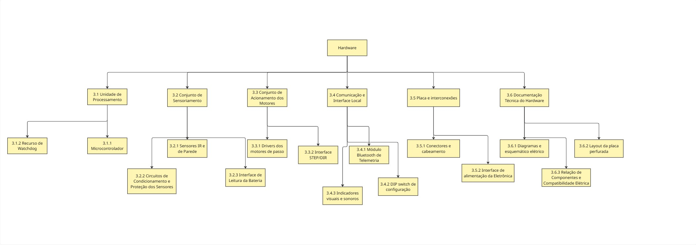

# Estrutura Analítica de Produto

# EAP Geral do Micromouse

### Figura 1 – Estrutura Geral da EAP do Projeto Micromouse

# 1. Sub-sistema: Estrutura

| **ID** | **Componente** | **Descrição** | **Dados Técnicos** | **Comentários** |
|:------:|----------------|---------------|--------------------|-----------------|
| 1 | **Sub-sistema: Estrutura** | Conjunto mecânico, base de fixação e sistema de locomoção do robô  | Dimensões:  103x 92 x 33mm. | Agrupa chassi, suportes, atuadores e rodagem. |
| 1.1 | Chassi | Base estrutural impressa em 3D para suporte dos motores, circuitos, suporte de pilhas e sensores.  Material: PLA. | Fabricado via FDM.  Garante leveza, rigidez mecânica e pontos de fixação com furação para parafusos M2/M3.  | Funciona como base mecânica principal e suporte dos componentes.   |
| 1.2 | Suporte | Compartimento de fixação e alojamento das pilhas.  | Transmissão direta no eixo dos motores Nema 8\. | Fixado diretamente sobre a estrutura do chassi. |
| 1.3 | Carenagem | Proteção externa da eletrônica e dos motores. | Estrutura aberta. | Não cotado no orçamento (chassi aberto exposto). |
| 1.4 | Atuadores | Motores de passo para movimentação diferencial (Esquerdo e Direito). | 2x Nema 8\. | Responsáveis pela tração e precisão dos movimentos no labirinto. |
| 1.5 | Transmissão | Acoplamento de força do motor para as rodas. | Transmissão direta no eixo dos motores Nema 11\. | Sem necessidade de caixas de redução adicionais ou correias  |
| 1.6 | Rodas/Hélices | Conjunto de rodagem e ponto de apoio. | 2x Rodas de 40 mm (borracha silicone ou neoprene) \+ 1x Roda boba omnidirecional (caster).  | Garante o contato com o solo e o equilíbrio do robô. |

### Figura 2 – EAP do Sub-sistema de Estrutura

# 1. Sub-sistema: Energia
| **ID** | **Componente** | **Descrição** | **Dados Técnicos** | **Comentários** |
|:------:|----------------|---------------|--------------------|-----------------|
| 2 | **Sub-sistema: Fonte Energética** | Conjunto responsável por armazenar, converter, proteger, distribuir e monitorar a energia que alimenta todos os demais subsistemas embarcados do Micromouse. | Autonomia mínima de 30 min de operação contínua; massa e volume dentro do envelope de 16,5 × 16,5 cm. | Atende aos requisitos 1 a 10 da frente de Energia. |
| 2.1 | Alimentação | Fonte primária de energia embarcada, transportada pelo próprio robô. Duas opções em avaliação: pack de pilhas AA e bateria LiPo, com seleção manual entre elas. | Pilhas: 4 × AA em série, 6,0 V nominais (alcalinas) ou 4,8 V (NiMH). LiPo: 2S (7,4 V) ou 3S (11,1 V). Capacidade alvo ≥ 1500 mAh. | Capacidade obtida do consumo estimado (≈1,8 A médio) × 0,5 h, dividido pelos 80% de capacidade utilizável e acrescido de 30% de margem. Valor a confirmar após a medição real de consumo nos testes de energia (AP12). |
| 2.2 | Eletrônica de Potência | Conversão e adequação da tensão da fonte para os níveis exigidos por cada subsistema, com barramentos separados para potência e lógica. | Barramento lógico regulado (5 V e/ou 3,3 V), corrente ≥ 1 A; barramento de potência dimensionado para o pico dos motores (estimado entre 2,7 A e 4 A). | O barramento lógico não pode compartilhar a linha dos motores, sob pena de reinicialização do microcontrolador. Fronteira com a Eletrônica a alinhar: os drivers dos motores podem ser alocados aqui ou no subsistema de Hardware. |
| 2.3 | Proteções | Elementos que impedem danos ao conjunto em falhas elétricas: sobrecorrente, curto-circuito, inversão de polaridade e descarga profunda da bateria. | Elemento de sobrecorrente dimensionado acima do pico de operação; proteção de polaridade na entrada; corte por subtensão referenciado à tensão mínima por célula do fabricante. | Itens de proteção não constam da tabela de requisitos de Energia após a última revisão; confirmar com a professora se permanecem nesta frente ou migram para a Eletrônica. |
| 2.4 | Gerenciamento de Energia | Monitoramento da carga disponível e sinalização do estado de energia do robô ao usuário e ao software embarcado. | Sinal de medição compatível com a faixa de entrada analógica do microcontrolador; indicação visual de robô energizado e de carga mínima. | Fornece o dado de telemetria "consumo de bateria" exigido no slide 11. Método de medição ainda em aberto: leitura de tensão, medição de corrente em série ou contagem de carga. |
| 2.5 | Distribuição e Seleção de Fonte | Caminho elétrico entre a fonte e os demais subsistemas: chaveamento geral, seleção da fonte ativa, conectores e cabeamento. | Conectores compatíveis com a corrente de pico; seleção manual de fonte com bloqueio de conexão simultânea; referencial de terra comum entre os barramentos. | A seleção deve impedir que as duas fontes fiquem ligadas ao mesmo tempo. Cabeamento e conectores devem suportar o pico de corrente, não apenas a média. |
| 2.6 | Suporte e Fixação da Fonte | Compartimento e fixação mecânica da fonte de energia à estrutura, permitindo instalação e remoção sem ferramentas especiais. | Fixação capaz de resistir a vibração e colisão sem deslocamento; acesso à fonte sem desmontar a estrutura. | Viabiliza a troca ou recarga entre tentativas, permitida apenas com o robô em repouso. Interface com a frente de Estruturas quanto ao ponto de fixação e à distribuição de massa. |

  

 ### Figura 3 – EAP do Sub-sistema de Fonte Energética

# 3. Sub-sistema: Eletrônica/Hardware

# 3.1 Unidade de processamento

| ID | Nome | Descrição |
|---|---|---|
| **3.1** | **Unidade de processamento** | Núcleo eletrônico que executa o firmware e interliga sensores, motores e telemetria. **Dados Técnicos:** Microcontrolador, interfaces de entrada/saída e recurso de recuperação de travamentos. **Comentários:** Modelo a definir no projeto conceitual conforme a quantidade de pinos, as interfaces e os níveis elétricos necessários. |
| 3.1.1 | Microcontrolador | Componente responsável pela leitura dos sensores e geração dos sinais de controle e comunicação. **Dados Técnicos:** Entradas digitais/analógicas para sensores, bateria e DIP switch; saídas para drivers, LED e buzzer; interface para Bluetooth, sem multiplexação adicional. **Comentários:** Mapa de pinos e compatibilidade elétrica documentados; leitura dos sensores, acionamento dos motores e transmissão de telemetria funcionando simultaneamente durante 10 minutos, sem travamentos ou reinicializações não planejadas (RF1–RF6, RF9, RNF1 e RNF9). |
| 3.1.2 | Recurso de watchdog | Circuito ou função de supervisão para recuperação do microcontrolador em caso de travamento do firmware. **Dados Técnicos:** Watchdog interno ou externo, com configuração e tempo de atuação definidos com a equipe de Firmware. **Comentários:** Recuperação verificada por travamento induzido em bancada; comportamento após reinicialização documentado (RNF6). |

# 3.2 Conjunto de sensoriamento

| ID | Nome | Descrição |
|---|---|---|
| **3.2** | **Conjunto de sensoriamento** | Componentes e circuitos que disponibilizam informações do ambiente e da bateria ao microcontrolador. **Dados Técnicos:** Sensores infravermelhos, condicionamento de sinais, proteção de entradas e interface de leitura da bateria. **Comentários:** Montagem alinhada com Estrutura e grandeza de bateria alinhada com Energia (RF1, RF3 e RF8). |
| 3.2.1 | Sensores infravermelhos de paredes | Sensores para detecção de paredes à esquerda, à direita e à frente do robô. **Dados Técnicos:** Previsão do TAP: 1 sensor que será posicionado mais à frente da estrutura, abrangendo 180 graus. Referências preliminares HW-201 e módulo identificado como LM393. **Comentários:** Detecção a validar em células de 18 cm, paredes de 5 cm de altura e 1,2 cm de espessura, brancas com topo vermelho e piso preto (RF1). |
| 3.2.2 | Circuitos de condicionamento e proteção dos sensores | Circuitos que adequam os sinais dos sensores às entradas do microcontrolador. **Dados Técnicos:** Filtragem, amplificação quando necessária, ajuste de limiar e proteção contra picos de tensão e descargas eletrostáticas; valores a dimensionar. **Comentários:** Leituras estáveis e níveis elétricos compatíveis. A resposta às superfícies da pista deve ser verificada por calibração e testes (RF8 e RNF5). |
| 3.2.3 | Interface de leitura da bateria | Circuito de aquisição do sinal de bateria para monitoramento e telemetria. **Dados Técnicos:** Divisor de tensão ligado ao conversor analógico-digital (ADC), dimensionado conforme a tensão máxima da fonte e a faixa de entrada do microcontrolador. **Comentários:** Leituras comparadas com instrumento de referência. Energia define a fonte e a grandeza disponível; Firmware trata os dados para estimativa de carga (RF3; Energia RF04; Software RF23). |

# 3.3 Conjunto de acionamento dos motores

| ID | Nome | Descrição |
|---|---|---|
| **3.3** | **Conjunto de acionamento dos motores** | Eletrônica responsável pelo acionamento independente dos motores de passo e pelas interfaces usadas na estimativa de movimento. **Dados Técnicos:** Dois canais de acionamento, compatíveis com os motores e com a alimentação fornecida por Energia. **Comentários:** Avanço, curvas e paradas verificados em conjunto com Firmware e Estrutura (RF2). |
| 3.3.1 | Drivers dos motores de passo | Circuitos dedicados ao fornecimento de corrente e à sequência de acionamento das fases de cada motor. **Dados Técnicos:** Um canal por motor; corrente e tensão compatíveis com os motores previstos no TAP como Nema 11; proteção contra sobrecorrente nos enrolamentos. **Comentários:** Modelo e dissipação a dimensionar pelas especificações dos motores escolhidos; funcionamento dentro dos limites elétricos e térmicos dos componentes (RF2 e RF7). |
| 3.3.2 | Interface STEP/DIR | Conexões dos sinais de passo e direção entre microcontrolador e drivers. **Dados Técnicos:** Linhas independentes para os dois motores, com níveis lógicos compatíveis e pinagem documentada. **Comentários:** Firmware utiliza os pulsos enviados para estimar deslocamento e velocidade em malha aberta; esta interface não mede a rotação real das rodas (RF6; Software RF21 e RF22). |

# 3.4 Comunicação e interface local

| ID | Nome | Descrição |
|---|---|---|
| **3.4** | **Comunicação e interface local** | Componentes de transmissão de telemetria, configuração prévia e sinalização do estado do robô. **Dados Técnicos:** Módulo Bluetooth, DIP switch de quatro vias, LED, buzzer e circuitos de acionamento. **Comentários:** Interfaces e comportamento definidos em conjunto com Software. |
| 3.4.1 | Módulo Bluetooth de telemetria | Enlace sem fio para envio dos dados do microcontrolador ao dispositivo receptor integrado ao sistema web. **Dados Técnicos:** HM-10 BLE 4.0 como referência preliminar do TAP; módulo, alimentação, interface com o microcontrolador e receptor a confirmar. **Comentários:** Envio de dados reais validado de ponta a ponta. Protocolo, formato e conexão do receptor ao backend definidos com Software; navegação autônoma mesmo sem comunicação (RF4; Software RF24 e RNF07). |
| 3.4.2 | DIP switch de configuração | Interface física para seleção do modo de operação sem reprogramação. **Dados Técnicos:** Quatro vias conectadas a entradas digitais com níveis lógicos definidos; tabela de combinações a documentar com Firmware. **Comentários:** Configuração lida antes da corrida, respeitando a restrição de intervenção durante o percurso (RF9; Software RF27). Prioridade Should Have na Eletrônica. |
| 3.4.3 | Indicadores visuais e sonoros | LED e buzzer para indicação de início, erro/colisão e conclusão do percurso. **Dados Técnicos:** Resistor limitador e/ou estágio de chaveamento dimensionado para a corrente dos indicadores e os limites das saídas do microcontrolador. **Comentários:** Estados acionados e identificáveis durante os testes com Firmware (RF5 e RF10; Software RF25). Prioridade Should Have na Eletrônica. |

# 3.5 Placa e interconexões

| ID | Nome | Descrição |
|---|---|---|
| **3.5** | **Placa e interconexões** | Base física e elétrica de integração dos componentes embarcados. **Dados Técnicos:** Placa perfurada para personalização por soldagem. **Comentários:** Disposição compacta, fixação segura e acesso para manutenção em conjunto com Estrutura (RNF3 e RNF4). |
| 3.5.1 | Conectores e cabeamento | Interligações entre placa, sensores, motores e fonte de energia. **Dados Técnicos:** Conectores padronizados, polaridade e pinagem identificadas; JST de quatro vias como referência preliminar para os motores. **Comentários:** Conexões firmes e acessíveis, com prevenção de inversão e sem mau contato durante o movimento (RNF1, RNF3 e RNF7). |
| 3.5.2 | Interface de alimentação da eletrônica | Conexões de entrada e distribuição local das tensões fornecidas por Energia aos componentes eletrônicos. **Dados Técnicos:** Barramentos compatíveis com lógica, sensores e drivers; desacoplamento local e organização das conexões para reduzir interferências. **Comentários:** Tensões nos componentes dentro das faixas especificadas, inclusive no acionamento dos motores; regulação, fonte e proteções de potência definidas por Energia (RNF1 e RNF2). |

# 3.6 Documentação técnica do hardware

| ID | Nome | Descrição |
|---|---|---|
| **3.6** | **Documentação técnica do hardware** | Conjunto de arquivos que descreve a eletrônica e permite reproduzir a montagem do produto. **Dados Técnicos:** Diagrama de blocos, esquemático elétrico, pinagem, diagrama de conexões, layout da PCB e relação de componentes. **Comentários:** Arquivos de hardware versionados em `hw/` e descrição no projeto conceitual de hardware; evidências de validação no documento de testes de hardware (RNF8). |
| 3.6.1 | Diagramas e esquemático elétrico | Representação dos blocos funcionais e das ligações elétricas do hardware. **Dados Técnicos:** Diagrama de blocos, símbolos e identificação dos componentes, alimentação, pinagem e conexões com sensores, drivers e módulo Bluetooth. **Comentários:** Correspondência entre esquemático, mapa de pinos e montagem; interfaces com Energia e Firmware identificadas (RNF8). |
| 3.6.2 | Layout da Placa Perfurada | Arquivo de projeto com a disposição dos componentes e o roteamento das trilhas da placa própria. **Dados Técnicos:** Contorno de até 12 cm × 12 cm; posições de conectores e fixações; trilhas de potência e sinais organizadas para reduzir interferência nas leituras. **Comentários:** Dimensões e montagem compatíveis com Estrutura; ligações coerentes com o esquemático; verificação de regras elétricas e de layout documentada, com eventuais exceções justificadas (RNF1, RNF3, RNF4 e RNF8). |
| 3.6.3 | Relação de componentes e compatibilidade elétrica | Registro dos componentes selecionados, incluindo microcontrolador, drivers e demais circuitos integrados da placa. **Dados Técnicos:** Referência no esquemático, modelo, quantidade, função, tensão de operação, corrente de consumo ou de acionamento e níveis de sinal aplicáveis; folhas de dados dos fabricantes como suporte. **Comentários:** Componentes identificados e compatíveis entre si e com a alimentação; limites elétricos e térmicos registrados para orientar montagem, orçamento e testes (RF7, RNF2, RNF8 e RNF9). |

### Figura 4 – EAP do Sub-sistema de Eletrônica/Hardware

# 4. Sub-sistema: Software

# 4.1 Gerenciamento

| ID | Nome | Descrição |
|---|---|---|
| **4.1** | **Gerenciamento** | Atividades de organização, planejamento e documentação do desenvolvimento do software. |
| 4.1.1 | Requisitos | Definição e organização dos requisitos do software. |
| 4.1.1.1 | Requisitos funcionais | Funções que o software deverá executar. |
| 4.1.1.2 | Requisitos não funcionais | Restrições e características de qualidade do software. |
| 4.1.2 | Planejamento | Organização do desenvolvimento e acompanhamento do projeto. |
| 4.1.2.1 | Backlog | Lista e priorização das funcionalidades e atividades. |
| 4.1.2.2 | Sprints | Divisão do desenvolvimento em ciclos de trabalho. |
| 4.1.2.3 | Cronograma | Planejamento temporal das atividades. |
| 4.1.3 | Documentação | Documentação técnica e de desenvolvimento do software. |
| 4.1.3.1 | Diagrama UML | Representação da arquitetura e estrutura do software. |
| 4.1.3.2 | GitHub | Versionamento, armazenamento e gerenciamento do código-fonte. |

# 4.2.1 Front End

| ID | Nome | Descrição |
|---|---|---|
| **4.2.1** | **Front End** | Interface responsável pela visualização e interação com os dados do Micromouse. |
| 4.2.1.1 | Visualização | Apresentação das informações do sistema ao usuário. |
| 4.2.1.2 | Labirinto | Representação visual do labirinto. |
| 4.2.1.3 | Mapeamento | Visualização do mapa construído pelo robô. |
| 4.2.1.4 | Telemetria | Consumo de dados advindos do robô|
| 4.2.1.5 | Rotas | Visualização da rota planejada ou percorrida pelo robô. |
| 4.2.1.6 | Interface | Interface de interação e acompanhamento do funcionamento do sistema. |

# 4.2.2 Back End

| ID | Nome | Descrição |
|---|---|---|
| **4.2.2** | **Back End** | Camada responsável pelo processamento, comunicação e gerenciamento dos dados. |
| 4.2.2.1 | API | Interface para comunicação entre os componentes do sistema. |
| 4.2.2.2 | Comunicação | Gerenciamento da comunicação entre o sistema e o Micromouse. |
| 4.2.2.3 | Dados | Gerenciamento e processamento dos dados recebidos. |
| 4.2.2.3.1 | Banco | Armazenamento dos dados do sistema. |
| 4.2.2.3.2 | Processamento | Tratamento e processamento dos dados. |

# 4.2.3 Software Embarcado

| ID | Nome | Descrição |
|---|---|---|
| **4.2.3** | **Software Embarcado** | Software executado no sistema embarcado do Micromouse para controlar o robô e realizar a navegação. |
| 4.2.3.1 | Controle | Controle da movimentação e dos componentes do robô. |
| 4.2.3.1.1 | Motores | Controle de velocidade, direção e acionamento dos motores. |
| 4.2.3.1.2 | Sensores | Leitura e processamento das informações dos sensores. |
| 4.2.3.2 | Navegação | Algoritmos responsáveis pela navegação e resolução do labirinto. |
| 4.2.3.2.1 | DFS | Algoritmo utilizado para determinar caminhos e distâncias no labirinto. |
| 4.2.3.2.2 | Mapeamento | Construção e atualização do mapa do labirinto durante a execução. |
| 4.2.3.3 | Telemetria | Gerenciamento das informações enviadas pelo Micromouse para acompanhamento externo. |
| 4.2.3.3.1 | Envio | Envio dos dados de funcionamento, navegação e sensores. |
| 4.2.3.4 | Diagnóstico | Monitoramento do funcionamento do sistema e identificação de possíveis falhas. |
| 4.2.3.5 | Comunicação | Comunicação do software embarcado com os demais componentes do sistema. |

# 4.3 Validação

| ID | Nome | Descrição |
|---|---|---|
| **4.3** | **Validação** | Verificação do funcionamento correto dos componentes e da integração do software. |
| 4.3.1 | Integração | Integração entre os diferentes componentes do sistema. |
| 4.3.1.1 | Frontend–Backend | Integração entre a interface e os serviços do sistema. |
| 4.3.1.2 | Backend–Sistema Embarcado | Integração entre o backend e o sistema embarcado. |
| 4.3.2 | Testes | Testes para verificar o funcionamento e atendimento aos requisitos. |
| 4.3.2.1 | Testes unitários | Verificação individual dos componentes de software. |
| 4.3.2.2 | Testes de navegação | Verificação dos algoritmos de navegação e resolução do labirinto. |
| 4.3.2.3 | Testes de telemetria | Verificação do envio e recebimento das informações de telemetria. |

  

### Figura 5 – EAP do Sub-sistema de Software