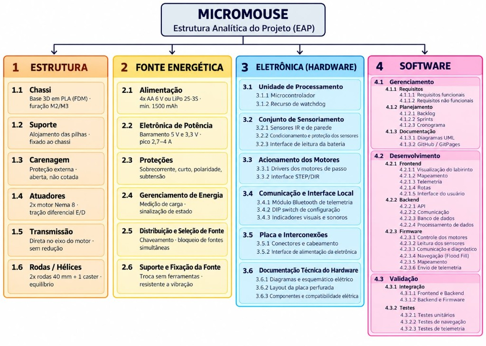
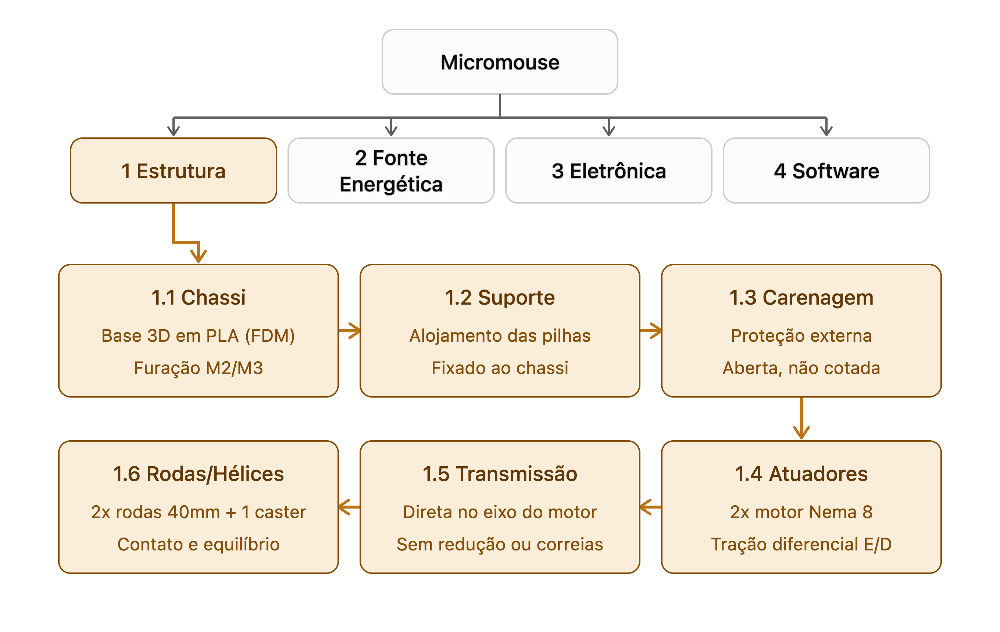
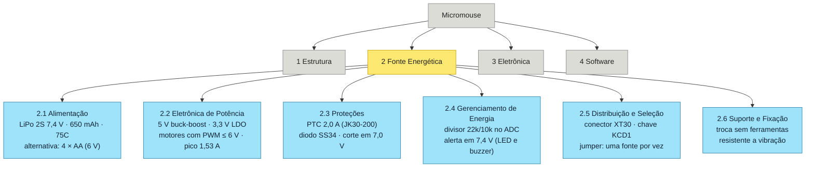
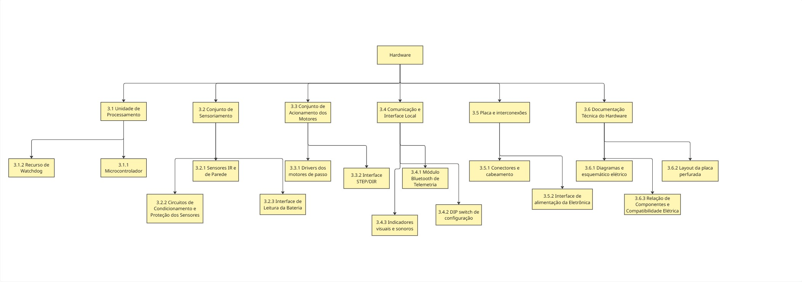
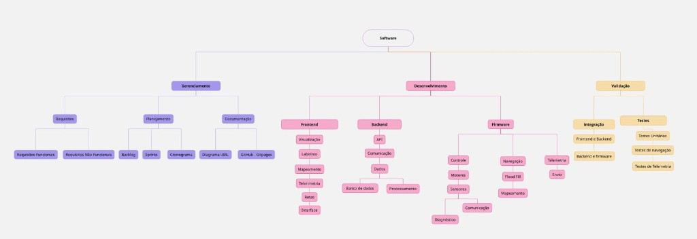

# Estrutura Analítica de Produto

# EAP Geral do Micromouse

### Figura 1 – Estrutura Geral da EAP do Projeto Micromouse

# 1. Sub-sistema: Estrutura

| **ID** | **Componente** | **Descrição** | **Dados Técnicos** | **Comentários** |
|:------:|----------------|---------------|--------------------|-----------------|
| 1 | **Sub-sistema: Estrutura** | Conjunto mecânico, base de fixação e sistema de locomoção do robô | Dimensões: 92 × 103 mm (placa base). | Agrupa chassi, suportes, atuadores e rodagem. |
| 1.1 | Chassi | Placa monoplano que serve de base estrutural e suporte dos demais componentes. | Acrílico 3 mm (corte a laser) ou impressão 3D em PETG/PLA; 92 × 103 mm; furação para parafusos M2/M3. | Funciona como base mecânica principal; geometria ajustada para giros de 90° e 180° dentro da célula. |
| 1.2 | Suporte | Berço para alojamento e fixação da bateria, e suporte/torre para os sensores de distância ToF. | Suporte de bateria impresso em 3D (PLA/PETG); torre de sensores ToF com fixação modular a 0° e ±45°, altura de 2,5 cm. | Bateria posicionada sobre o eixo de tração, concentrando massa sobre as rodas. |
| 1.3 | Carenagem | Cobertura externa da eletrônica e dos motores. | Design aberto (sem carenagem); placa aparente. | Reduz massa, facilita dissipação térmica e manutenção. |
| 1.4 | Atuadores | Motores para movimentação diferencial (esquerdo e direito). | 2x Motor Redutor DC 6V N20 com encoder, 750 RPM, ≈30 g cada. | Tração diferencial com odometria em malha fechada; controle PID de velocidade por motor. |
| 1.5 | Transmissão | Acoplamento de força do motor para as rodas. | Roda acoplada diretamente ao eixo de saída da caixa de redução do motor N20. | Sem correias ou engrenagens externas; folga interna da caixa de redução compensada pelo realinhamento com as paredes. |
| 1.6 | Rodas/Hélices | Conjunto de rodagem e ponto de apoio. | 2x Rodas de 34 mm × 6,5 mm com borracha vulcanizada + 1x *Sphere Caster* de 10 mm (nylon) para apoio frontal. | Garante o contato com o solo, evita patinagem e permite apoio omnidirecional sem arrasto nos giros. |

### Figura 2 – EAP do Sub-sistema de Estrutura

# 1. Sub-sistema: Energia
| **ID** | **Componente** | **Descrição** | **Dados Técnicos** | **Comentários** |
|:------:|----------------|---------------|--------------------|-----------------|
| 2 | **Sub-sistema: Fonte Energética** | Conjunto responsável por armazenar, converter, proteger, distribuir e monitorar a energia que alimenta todos os demais subsistemas embarcados do Micromouse. | Autonomia mínima de 30 min de operação contínua; massa e volume dentro do envelope de 16,5 × 16,5 cm. | Atende aos requisitos RF01 a RF07 e RNF01 a RNF04 da frente de Energia. |
| 2.1 | Alimentação | Fonte de energia embarcada, transportada pelo próprio robô: bateria LiPo como fonte principal e pacote de pilhas AA como alternativa, com seleção manual entre elas. | **LiPo 2S (7,4 V), 650 mAh, C-rating ≥ 20C** (adotada: Tattu 650 mAh 75C), 43 g, 57 × 31 × 12 mm, conector XT30. Alternativa: 4 × AA em série (6,0 V). Energia exigida: 2,60 Wh; disponível: 4,81 Wh. Recarga pelo IMAX B3, com balanceamento. | Energia de 3 tentativas no pior caso (1,60 Wh), dividida pelos 80% utilizáveis da LiPo e acrescida de 30% de margem (justificativa na [seção 4.1 do 4.2](4.2%20-%20Projeto%20conceitual%20de%20energia.md)). Autonomia resultante ≈ 72 min. Valores a confirmar com a medição de consumo nos testes de energia (7.2). |
| 2.2 | Eletrônica de Potência | Conversão e adequação da tensão da fonte para os níveis exigidos por cada subsistema, com barramentos separados para potência e lógica. | 5 V para o ESP32 e o LDO por conversor **buck-boost** (≥ 1 A, entrada de 3,5 V a 8,4 V); 3,3 V para ToF e encoders por LDO (≥ 200 mA); motores ligados à bateria pela ponte H, com PWM limitado a 6 V médios (Dmáx = 6,0 V / Vbateria). Corrente de pico: **1,53 A** (bloqueio das duas rodas). | O buck-boost mantém os 5 V tanto com a LiPo quanto com as pilhas descarregando. O barramento lógico não compartilha a linha dos motores, para evitar reinicialização do microcontrolador. A ponte H (TB6612FNG) fica no subsistema de Hardware. |
| 2.3 | Proteções | Elementos que impedem danos ao conjunto em falhas elétricas: sobrecorrente, curto-circuito, inversão de polaridade e descarga profunda da bateria. | Fusível rearmável PTC com hold de 2,0 A e trip de 3,5 a 4,0 A (MF-MSMF200 ou JK30-200, o adotado); diodo Schottky SS34 contra inversão de polaridade; corte por subtensão em 3,5 V/célula (7,0 V) e alerta em 3,7 V/célula (7,4 V), feitos pelo firmware. | A proteção de polaridade segue o diodo SS34 do esquemático da Eletrônica, que também o orça. O corte por subtensão é feito pelo firmware, a partir da leitura do item 2.4. |
| 2.4 | Gerenciamento de Energia | Monitoramento da carga disponível e sinalização do estado de energia do robô ao usuário e ao software embarcado. | Leitura da tensão da bateria por divisor 22 kΩ / 10 kΩ (÷ 3,2) no ADC do ESP32 (GPIO36); LED e buzzer no alerta de carga mínima. | Fornece o dado de telemetria de bateria. O método adotado é a leitura de tensão, convertida em porcentagem pela curva de descarga. |
| 2.5 | Distribuição e Seleção de Fonte | Caminho elétrico entre a fonte e os demais subsistemas: chaveamento geral, seleção da fonte ativa, conectores e cabeamento. | Conector XT30 (≈ 15 A, polarizado) na entrada do robô e no pacote de pilhas AA; chave geral KCD1 (10 A); seleção manual de fonte com bloqueio de conexão simultânea; referencial de terra comum entre os barramentos. | A seleção deve impedir que as duas fontes fiquem ligadas ao mesmo tempo. Cabeamento e conectores devem suportar o pico de corrente, não apenas a média. |
| 2.6 | Suporte e Fixação da Fonte | Compartimento e fixação mecânica da fonte de energia à estrutura, permitindo instalação e remoção sem ferramentas especiais. | Berço para a bateria de 57 × 31 × 12 mm e 43 g; fixação capaz de resistir a vibração e colisão sem deslocamento; acesso à fonte sem desmontar a estrutura. | Viabiliza a troca ou recarga entre tentativas, permitida apenas com o robô em repouso. Interface com a frente de Estruturas quanto ao ponto de fixação e à distribuição de massa. |

```mermaid
flowchart TD
    M["Micromouse"] --> E1["1 Estrutura"]
    M --> E2["2 Fonte Energética"]
    M --> E3["3 Eletrônica"]
    M --> E4["4 Software"]
    E2 --> A["2.1 Alimentação<br/>LiPo 2S 7,4 V · 650 mAh · 75C<br/>alternativa: 4 × AA (6 V)"]
    E2 --> B["2.2 Eletrônica de Potência<br/>5 V buck-boost · 3,3 V LDO<br/>motores com PWM ≤ 6 V · pico 1,53 A"]
    E2 --> C["2.3 Proteções<br/>PTC 2,0 A (JK30-200)<br/>diodo SS34 · corte em 7,0 V"]
    E2 --> D["2.4 Gerenciamento de Energia<br/>divisor 22k/10k no ADC<br/>alerta em 7,4 V (LED e buzzer)"]
    E2 --> F["2.5 Distribuição e Seleção<br/>conector XT30 · chave KCD1<br/>jumper: uma fonte por vez"]
    E2 --> G["2.6 Suporte e Fixação<br/>troca sem ferramentas<br/>resistente a vibração"]
    classDef pai fill:#dcdcd7,stroke:#888,color:#222
    classDef foco fill:#fde972,stroke:#c9a400,color:#222
    classDef item fill:#9fe3fb,stroke:#2b7fa8,color:#123
    class M,E1,E3,E4 pai
    class E2 foco
    class A,B,C,D,F,G item
```

### Figura 3 – EAP do Sub-sistema de Fonte Energética

## Histórico de Versões (EAP — Energia 2)

| Versão | Data | Descrição | Autor(es) |
| :----: | :--: | --------- | --------- |
| 1.0 | 07/10/2026 | Itens **2.1** a **2.4** alinhados ao projeto conceitual de energia v1.4: LiPo 2S 500 mAh 20C, pico de 1,53 A, PTC de 2,0 A / 3,5 A, alerta em 7,4 V e corte em 7,0 V, divisor de 22 kΩ / 10 kΩ. Figura 3 refeita no próprio documento, no lugar da imagem que apontava para uma branch excluída [#162](https://github.com/fcte-pi1/2026_2_PI1_Grupo01_Juliana/issues/162). | [João Marcos Moraes de Andrade](https://github.com/JJOAOMARCOSS), [Giovana Martins de Brito](https://github.com/Giih-martins) |
| 1.1 | 08/10/2026 | Itens **2.1**, **2.3**, **2.5** e **2.6** alinhados ao projeto conceitual de energia v1.5 e à lista de compras: LiPo 2S 650 mAh 75C (4,81 Wh, ≈ 72 min, 43 g, 57 × 31 × 12 mm), conector XT30, chave KCD1 e PTC JK30-200; requisitos atendidos atualizados para RF01–RF07 e RNF01–RNF04 [#166](https://github.com/fcte-pi1/2026_2_PI1_Grupo01_Juliana/issues/166). | [João Marcos Moraes de Andrade](https://github.com/JJOAOMARCOSS), [Giovana Martins de Brito](https://github.com/Giih-martins) |

# 3. Sub-sistema: Eletrônica/Hardware

# 3.1 Unidade de processamento

| ID | Nome | Descrição |
|---|---|---|
| **3.1** | **Unidade de processamento** | Núcleo eletrônico que executa o firmware e interliga sensores, motores e telemetria. **Dados Técnicos:** Microcontrolador, interfaces de entrada/saída e recurso de recuperação de travamentos. **Comentários:** Modelo a definir no projeto conceitual conforme a quantidade de pinos, as interfaces e os níveis elétricos necessários. |
| 3.1.1 | Microcontrolador | Componente responsável pela leitura dos sensores e geração dos sinais de controle e comunicação. **Dados Técnicos:** Entradas digitais/analógicas para sensores, bateria e DIP switch; saídas para drivers, LED e buzzer; interface para Bluetooth, sem multiplexação adicional. **Comentários:** Mapa de pinos e compatibilidade elétrica documentados; leitura dos sensores, acionamento dos motores e transmissão de telemetria funcionando simultaneamente durante 10 minutos, sem travamentos ou reinicializações não planejadas (RF1–RF6, RF9, RNF1 e RNF9). |
| 3.1.2 | Recurso de watchdog | Circuito ou função de supervisão para recuperação do microcontrolador em caso de travamento do firmware. **Dados Técnicos:** Watchdog interno ou externo, com configuração e tempo de atuação definidos com a equipe de Firmware. **Comentários:** Recuperação verificada por travamento induzido em bancada; comportamento após reinicialização documentado (RNF6). |

# 3.2 Conjunto de sensoriamento

| ID | Nome | Descrição |
|---|---|---|
| **3.2** | **Conjunto de sensoriamento** | Componentes e circuitos que disponibilizam informações do ambiente e da bateria ao microcontrolador. **Dados Técnicos:** Sensores ToF (Time-of-Flight), condicionamento de sinais, proteção de entradas e interface de leitura da bateria. **Comentários:** Montagem alinhada com Estrutura e grandeza de bateria alinhada com Energia (RF1, RF3 e RF8). |
| 3.2.1 | Sensores ToF de distância | Sensores baseados em tempo de voo da luz (ToF) para medição precisa de distância em relação às paredes (frente, esquerda e direita). **Dados Técnicos:** Sensores ToF com alcance de até 2 metros de distância. **Comentários:** Detecção a validar em células de 18 cm, paredes de 5 cm de altura e 1,2 cm de espessura, brancas com topo vermelho e piso preto (RF1). |
| 3.2.2 | Circuitos de condicionamento e proteção dos sensores | Circuitos que adequam os sinais dos sensores às entradas do microcontrolador. **Dados Técnicos:** Filtragem, amplificação quando necessária, ajuste de limiar e proteção contra picos de tensão e descargas eletrostáticas; valores a dimensionar. **Comentários:** Leituras estáveis e níveis elétricos compatíveis. A resposta às superfícies da pista deve ser verificada por calibração e testes (RF8 e RNF5). |
| 3.2.3 | Interface de leitura da bateria | Circuito de aquisição do sinal de bateria para monitoramento e telemetria. **Dados Técnicos:** Divisor de tensão ligado ao conversor analógico-digital (ADC), dimensionado conforme a tensão máxima da fonte e a faixa de entrada do microcontrolador. **Comentários:** Leituras comparadas com instrumento de referência. Energia define a fonte e a grandeza disponível; Firmware trata os dados para estimativa de carga (RF3; Energia RF04; Software RF23). |

# 3.3 Conjunto de acionamento dos motores

| ID | Nome | Descrição |
|---|---|---|
| **3.3** | **Conjunto de acionamento dos motores** | Eletrônica responsável pelo acionamento independente dos motores DC com encoder e pelas interfaces usadas na estimativa de movimento e controle de velocidade. **Dados Técnicos:** Dois canais de acionamento (ponte H ou drivers para motores DC), compatíveis com os motores N20 e com a alimentação fornecida por Energia. **Comentários:** Avanço, curvas e paradas verificados em conjunto com Firmware e Estrutura (RF2). |
| 3.3.1 | Drivers dos motores | Circuitos dedicados ao fornecimento de corrente e controle de velocidade/sentido (Ponte H) para cada motor DC. **Dados Técnicos:** Um canal por motor (ou driver de ponte H duplo); corrente e tensão compatíveis com os motores DC N20 de 6 V; proteção contra sobrecorrente. **Comentários:** Modelo e dissipação a dimensionar pelas especificações dos motores escolhidos; funcionamento dentro dos limites elétricos e térmicos dos componentes (RF2 e RF7). |
| 3.3.2 | Interface PWM / Direção e Leitura de Encoders | Conexões dos sinais de PWM, direção e leitura dos encoders dos motores entre microcontrolador e drivers/hardware. **Dados Técnicos:** Sinais PWM e de controle de sentido para os drivers, além das entradas de sinal dos encoders de cada motor N20 para realimentação em malha fechada. **Comentários:** Firmware utiliza os sinais dos encoders para medir a rotação real e controlar a velocidade e o deslocamento em malha fechada (RF6; Software RF21 e RF22). |

# 3.4 Comunicação e interface local

| ID | Nome | Descrição |
|---|---|---|
| **3.4** | **Comunicação e interface local** | Componentes de transmissão de telemetria, configuração prévia e sinalização do estado do robô. **Dados Técnicos:** Módulo Bluetooth, DIP switch de quatro vias, LED, buzzer e circuitos de acionamento. **Comentários:** Interfaces e comportamento definidos em conjunto com Software. |
| 3.4.1 | Módulo Bluetooth de telemetria | Enlace sem fio para envio dos dados do microcontrolador ao dispositivo receptor integrado ao sistema web. **Dados Técnicos:** Bluetooth clássico integrado da ESP32, perfil SPP (`BluetoothSerial`), recebido como porta serial no notebook da equipe; substitui o HM-10 BLE previsto no TAP. **Comentários:** Envio de dados reais validado de ponta a ponta. Protocolo, formato e conexão do receptor ao backend definidos com Software; navegação autônoma mesmo sem comunicação (RF4; Software RF24 e RNF07). |
| 3.4.2 | DIP switch de configuração | Interface física para seleção do tipo de labirinto (vias 1–2) e dos modos de operação (vias 3–4) sem reprogramação. **Dados Técnicos:** Quatro vias conectadas a entradas digitais com níveis lógicos definidos; tabela de combinações no projeto conceitual de software (4.4). **Comentários:** Configuração lida antes da corrida, respeitando a restrição de intervenção durante o percurso (RF9; Software RF27). Prioridade Should Have na Eletrônica. |
| 3.4.3 | Indicadores visuais e sonoros | LED e buzzer para indicação de início, erro/colisão e conclusão do percurso. **Dados Técnicos:** Resistor limitador e/ou estágio de chaveamento dimensionado para a corrente dos indicadores e os limites das saídas do microcontrolador. **Comentários:** Estados acionados e identificáveis durante os testes com Firmware (RF5 e RF10; Software RF25). Prioridade Should Have na Eletrônica. |

# 3.5 Placa e interconexões

| ID | Nome | Descrição |
|---|---|---|
| **3.5** | **Placa e interconexões** | Base física e elétrica de integração dos componentes embarcados. **Dados Técnicos:** Placa perfurada para personalização por soldagem. **Comentários:** Disposição compacta, fixação segura e acesso para manutenção em conjunto com Estrutura (RNF3 e RNF4). |
| 3.5.1 | Conectores e cabeamento | Interligações entre placa, sensores, motores e fonte de energia. **Dados Técnicos:** Conectores padronizados, polaridade e pinagem identificadas; JST de quatro vias como referência preliminar para os motores. **Comentários:** Conexões firmes e acessíveis, com prevenção de inversão e sem mau contato durante o movimento (RNF1, RNF3 e RNF7). |
| 3.5.2 | Interface de alimentação da eletrônica | Conexões de entrada e distribuição local das tensões fornecidas por Energia aos componentes eletrônicos. **Dados Técnicos:** Barramentos compatíveis com lógica, sensores e drivers; desacoplamento local e organização das conexões para reduzir interferências. **Comentários:** Tensões nos componentes dentro das faixas especificadas, inclusive no acionamento dos motores; regulação, fonte e proteções de potência definidas por Energia (RNF1 e RNF2). |

# 3.6 Documentação técnica do hardware

| ID | Nome | Descrição |
|---|---|---|
| **3.6** | **Documentação técnica do hardware** | Conjunto de arquivos que descreve a eletrônica e permite reproduzir a montagem do produto. **Dados Técnicos:** Diagrama de blocos, esquemático elétrico, pinagem, diagrama de conexões, layout da PCB e relação de componentes. **Comentários:** Arquivos de hardware versionados em `hw/` e descrição no projeto conceitual de hardware; evidências de validação no documento de testes de hardware (RNF8). |
| 3.6.1 | Diagramas e esquemático elétrico | Representação dos blocos funcionais e das ligações elétricas do hardware. **Dados Técnicos:** Diagrama de blocos, símbolos e identificação dos componentes, alimentação, pinagem e conexões com sensores, drivers e módulo Bluetooth. **Comentários:** Correspondência entre esquemático, mapa de pinos e montagem; interfaces com Energia e Firmware identificadas (RNF8). |
| 3.6.2 | Layout da Placa Perfurada | Arquivo de projeto com a disposição dos componentes e o roteamento das trilhas da placa própria. **Dados Técnicos:** Contorno de até 12 cm × 12 cm; posições de conectores e fixações; trilhas de potência e sinais organizadas para reduzir interferência nas leituras. **Comentários:** Dimensões e montagem compatíveis com Estrutura; ligações coerentes com o esquemático; verificação de regras elétricas e de layout documentada, com eventuais exceções justificadas (RNF1, RNF3, RNF4 e RNF8). |
| 3.6.3 | Relação de componentes e compatibilidade elétrica | Registro dos componentes selecionados, incluindo microcontrolador, drivers e demais circuitos integrados da placa. **Dados Técnicos:** Referência no esquemático, modelo, quantidade, função, tensão de operação, corrente de consumo ou de acionamento e níveis de sinal aplicáveis; folhas de dados dos fabricantes como suporte. **Comentários:** Componentes identificados e compatíveis entre si e com a alimentação; limites elétricos e térmicos registrados para orientar montagem, orçamento e testes (RF7, RNF2, RNF8 e RNF9). |

### Figura 4 – EAP do Sub-sistema de Eletrônica/Hardware

# 4. Sub-sistema: Software

# 4.1 Gerenciamento

| ID | Nome | Descrição |
|---|---|---|
| **4.1** | **Gerenciamento** | Atividades de organização, planejamento e documentação do desenvolvimento do software. |
| 4.1.1 | Requisitos | Definição e organização dos requisitos do software. |
| 4.1.1.1 | Requisitos funcionais | Funções que o software deverá executar. |
| 4.1.1.2 | Requisitos não funcionais | Restrições e características de qualidade do software. |
| 4.1.2 | Planejamento | Organização do desenvolvimento e acompanhamento do projeto. |
| 4.1.2.1 | Backlog | Lista e priorização das funcionalidades e atividades. |
| 4.1.2.2 | Sprints | Divisão do desenvolvimento em ciclos de trabalho. |
| 4.1.2.3 | Cronograma | Planejamento temporal das atividades. |
| 4.1.3 | Documentação | Documentação técnica e de desenvolvimento do software. |
| 4.1.3.1 | Diagrama UML | Representação da arquitetura e estrutura do software. |
| 4.1.3.2 | GitHub | Versionamento, armazenamento e gerenciamento do código-fonte. |

# 4.2.1 Front End

| ID | Nome | Descrição |
|---|---|---|
| **4.2.1** | **Front End** | Interface responsável pela visualização e interação com os dados do Micromouse. |
| 4.2.1.1 | Visualização | Apresentação das informações do sistema ao usuário. |
| 4.2.1.2 | Labirinto | Representação visual do labirinto. |
| 4.2.1.3 | Mapeamento | Visualização do mapa construído pelo robô. |
| 4.2.1.4 | Telemetria | Consumo de dados advindos do robô|
| 4.2.1.5 | Rotas | Visualização da rota planejada ou percorrida pelo robô. |
| 4.2.1.6 | Interface | Interface de interação e acompanhamento do funcionamento do sistema. |

# 4.2.2 Back End

| ID | Nome | Descrição |
|---|---|---|
| **4.2.2** | **Back End** | Camada responsável pelo processamento, comunicação e gerenciamento dos dados. |
| 4.2.2.1 | API | Interface para comunicação entre os componentes do sistema. |
| 4.2.2.2 | Comunicação | Gerenciamento da comunicação entre o sistema e o Micromouse. |
| 4.2.2.3 | Dados | Gerenciamento e processamento dos dados recebidos. |
| 4.2.2.3.1 | Banco | Armazenamento dos dados do sistema. |
| 4.2.2.3.2 | Processamento | Tratamento e processamento dos dados. |

# 4.2.3 Software Embarcado

| ID | Nome | Descrição |
|---|---|---|
| **4.2.3** | **Software Embarcado (Firmware)** | Software executado no Micromouse para controlar o robô, navegar no labirinto e enviar telemetria. |
| 4.2.3.1 | Controle | Controle da movimentação e dos componentes do robô. |
| 4.2.3.1.1 | Motores | Controle de velocidade, direção e acionamento dos motores DC N20 com leitura de encoder para malha fechada (RF21). |
| 4.2.3.1.2 | Sensores | Leitura e processamento dos sensores de paredes e demais entradas usadas na navegação (RF20). |
| 4.2.3.2 | Navegação | Algoritmos responsáveis pela navegação e resolução do labirinto. |
| 4.2.3.2.1 | Flood Fill (método Adachi) | Algoritmo utilizado para determinar caminhos e distâncias no labirinto, com as células de objetivo definidas pelo tipo lido no DIP switch (RF26, RF27). |
| 4.2.3.2.2 | Mapeamento | Construção e atualização do mapa de paredes durante a execução (RF28, RF42). |
| 4.2.3.3 | Telemetria | Gerenciamento das informações enviadas pelo Micromouse para acompanhamento externo. |
| 4.2.3.3.1 | Envio | Transmissão periódica de célula, bateria, status e demais dados ao backend (RF24). |
| 4.2.3.4 | Diagnóstico | Monitoramento do funcionamento do sistema, health-check e identificação de falhas de componente (RF29). |
| 4.2.3.5 | Comunicação | Enlace Bluetooth serial com o sistema web (RF24, RF39). |

# 4.3 Validação

| ID | Nome | Descrição |
|---|---|---|
| **4.3** | **Validação** | Verificação do funcionamento correto dos componentes e da integração do software. |
| 4.3.1 | Integração | Integração entre os diferentes componentes do sistema. |
| 4.3.1.1 | Frontend–Backend | Integração entre a interface e os serviços do sistema. |
| 4.3.1.2 | Backend–Sistema Embarcado | Integração entre o backend e o sistema embarcado. |
| 4.3.2 | Testes | Testes para verificar o funcionamento e atendimento aos requisitos. |
| 4.3.2.1 | Testes unitários | Verificação individual dos componentes de software. |
| 4.3.2.2 | Testes de navegação | Verificação do **flood fill (método Adachi)** e do mapeamento em labirintos 4×4, 8×4 e 12×4 (RF26, RF27). |
| 4.3.2.3 | Testes de telemetria | Verificação do envio e recebimento das informações de telemetria. |

### Figura 5 – EAP do Sub-sistema de Software

> **Algoritmo de navegação:** a definição oficial do pacote **4.2.3.2.1** é **Flood Fill (método Adachi)** (tabela acima). Versões antigas da figura ou rascunhos que citavam **DFS** estão obsoletos; o firmware segue o [4.4 — Projeto conceitual de software](4.4%20-%20Projeto%20conceitual%20de%20software.md#decisao-flood-fill-adachi).

## Histórico de Versões (EAP — Software 4.2.3)

| Versão | Data | Descrição | Autor(es) |
| :----: | :--: | --------- | --------- |
| 1.0 | 25/09/2026 | Item **4.2.3.2.1** atualizado de DFS para **Flood Fill (método Adachi)**, alinhado ao projeto conceitual de software (0.2) e ao glossário. | [Wanjo Christopher Paraizo Escobar](https://github.com/wChrstphr) |
| 1.1 | 02/10/2026 | Itens **3.4.2** e **4.2.3.2.1** alinhados ao tipo de labirinto selecionado no DIP switch (vias 1–2), conforme esclarecimento do professor. | [Wanjo Christopher Paraizo Escobar](https://github.com/wChrstphr) |