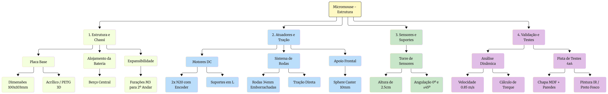
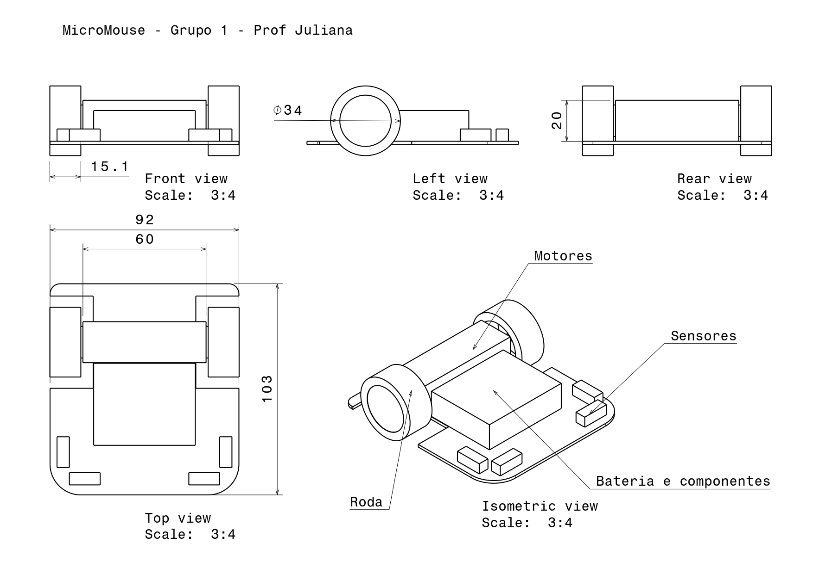
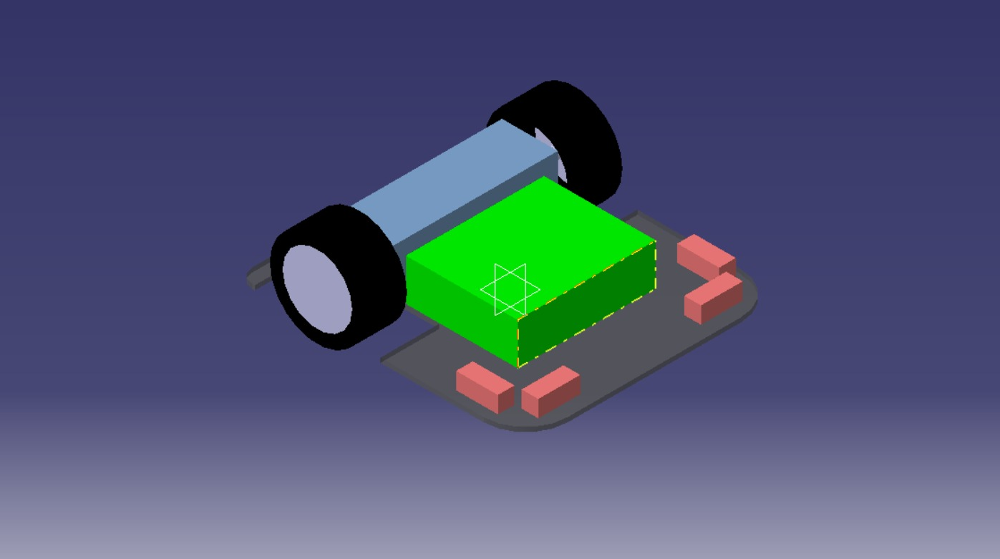

## 1. Visão Geral do Projeto

A seleção de materiais e componentes do Micromouse foi guiada pela busca pelo menor peso possível, alta eficiência mecânica, repetibilidade de movimento e cumprimento estrito das dimensões do labirinto ($18\,\text{cm} \times 18\,\text{cm}$ com paredes de $1{,}2\,\text{cm}$).

O robô adota velocidade operacional moderada: não busca velocidade máxima, mas mantém ritmo suficiente para concluir o percurso com ampla folga dentro do tempo limite de $10$ minutos.

### Fluxograma Geral do Projeto

O fluxograma abaixo apresenta, de forma resumida, a organização dos principais elementos abordados neste documento, desde os requisitos do projeto até a definição estrutural, componentes, dimensões, modelagem CAD e justificativas das decisões de projeto.

---

## 2. Projeto Conceitual da Estrutura e Atuadores

### 2.1 Materiais Utilizados

A Tabela apresenta a Lista de Materiais (BOM) consolidada.

| Item | Componente / Descrição | Qtd. | Finalidade / Observações Técnicas |
|---|---|---:|---|
| **1. Sistema de Tração e Apoio** | | | |
| 1.1 | Micro Motor DC N20 com Encoder ($6\,\text{V}$, $600\,\text{RPM}$, $\approx 30\,\text{g}$/un) | 2 un | Atuador principal de tração com odometria em malha fechada. |
| 1.2 | Roda emborrachada $34\,\text{mm} \times 6{,}5\,\text{mm}$ (Eixo D $3\,\text{mm}$) | 2 un | Tração com alto atrito, garantindo repetibilidade. |
| 1.3 | Suporte em L (*Bracket*) para Motor N20 | 2 un | Fixação mecânica rígida dos motores no chassi. |
| 1.4 | Rodízio de Esfera (*Sphere Caster* $360^\circ$) $10\,\text{mm}$ | 1 un | Apoio frontal omnidirecional sem arrasto angular. |
| **2. Chassi e Estrutura Base** | | | |
| 2.1 | Placa Base do Chassi ($92 \times 103\,\text{mm}$) | 1 un | Acrílico $3\,\text{mm}$ (laser) ou impressão 3D PETG/PLA. |
| 2.2 | Suporte impresso em 3D (PLA/PETG) para Bateria | 1 un | Acomodação centralizada sobre o eixo de tração. |
| 2.3 | Suportes/Torre para Sensores de Distância (PLA/PETG) | 1 un | Fixação modular ($0^\circ$ e $\pm45^\circ$) na altura de $2{,}5\,\text{cm}$. |
| **3. Elementos de Fixação e Contingência** | | | |
| 3.1 | Kit de Parafusos e Porcas M2 e M3 (Aço inox) | 1 kit | Montagem de motores, *caster* e componentes. |
| 3.2 | Espaçadores M3 Sextavados em Nylon ($15\,\text{mm}$) | 4 un | Reserva para expansão opcional em 2º andar (por exemplo, giroscópio). |
| 3.3 | Fita Dupla Face de Alta Fixação / Abraçadeiras | 1 un | Fixação auxiliar de componentes e cabos. |
| **4. Pista de Testes $4 \times 4$ (Requisito da Disciplina)** | | | |
| 4.1 | Chapa de MDF de $72\,\text{cm} \times 72\,\text{cm}$ ($15\,\text{mm}$) | 1 un | Base física do labirinto de testes. |
| 4.2 | Ripas de MDF/Madeira ($5\,\text{cm} \times 1{,}2\,\text{cm}$) | 12 m | Paredes das células do labirinto. |
| 4.3 | Tinta Spray Preto Fosco | 1 lata | Pintura do piso do labirinto (absorção de luz IR). |
| 4.4 | Tinta Spray Branco e Tinta Vermelha (topo) | 1 lata | Pintura padronizada das paredes do labirinto. |

### 2.2 Justificativa da Escolha dos Materiais Base

- **Placa do Chassi Base (Acrílico $3\,\text{mm}$ vs. Impressão 3D PETG):** O acrílico fornece alta rigidez e acabamento plano por corte a laser; a impressão 3D em PETG/PLA permite integrar os berços da bateria e suportes diretamente na peça.
- **Apoio Omnidirecional (*Sphere Caster* em Nylon):** Escolhido para eliminar o arrasto mecânico e travamentos angulares comuns em rodízios pivotantes em rotações de $90^\circ$ e $180^\circ$.
- **Elementos de Fixação em Nylon:** A escolha de espaçadores sextavados M3 em nylon reduz a massa da estrutura em comparação com conexões metálicas em latão.
- **Motor DC com Encoder (N20) vs. Motor de Passo (Nema 8/11):** O N20 pesa cerca de $30\,\text{g}$ e mede $12 \times 10 \times 24\,\text{mm}$, enquanto motores Nema são mais pesados e volumosos. Além disso, o motor de passo opera normalmente em malha aberta e pode perder passos sem que o controlador perceba, comprometendo a odometria. O motor DC com encoder mede o movimento real da roda, permite correção contínua por realimentação e consome corrente apenas quando está em movimento.

### 2.3 Partes Fundamentais do Projeto

A tabela abaixo sintetiza as especificações funcionais dos subsistemas mecânicos do robô.

| Elemento | Solução Adotada | Função e Justificativa Técnica |
|---|---|---|
| **Chassi Base** | Placa monoplano de $92 \times 103\,\text{mm}$ (Acrílico $3\,\text{mm}$ ou PETG) | Elemento estrutural principal. Geometria ajustada para rotações de $90^\circ$ e $180^\circ$ dentro de uma única célula. |
| **Atuadores** | 2x Micro Motores DC N20 ($6\,\text{V}$, $600\,\text{RPM}$, $\approx 30\,\text{g}$) com Encoders | Tração diferencial e odometria em malha fechada. Alto torque específico em dimensões compactas ($12 \times 10 \times 24\,\text{mm}$). |
| **Transmissão** | Roda acoplada diretamente ao eixo de saída da caixa de redução do motor | Não há correia ou engrenagem externa, o que elimina folga adicional. A folga interna da caixa de redução do N20 é pequena e não é medida pelo encoder (fixado ao eixo do motor); seu efeito é atenuado pelo realinhamento com as paredes após os giros. |
| **Rodas e Pneus** | Rodas de $34\,\text{mm} \times 6{,}5\,\text{mm}$ com borracha vulcanizada | Diâmetro que permite velocidade máxima de até $0{,}85\,\text{m/s}$, com operação prevista a $0{,}4\,\text{m/s}$. A borracha evita a patinagem, mantendo a precisão da odometria. |
| **Apoio Frontal** | Esfera Deslizante Omnidirecional (*Sphere Caster* $10\,\text{mm}$) em Nylon | Apoio em 3 pontos sem arrasto angular em giros de $90^\circ$ e $180^\circ$ sobre o próprio eixo. |
| **Suportes dos Motores** | Suportes em L (*Brackets*) com parafusos M2 | Fixação mecânica rígida ao chassi, mantendo o alinhamento paralelo dos eixos. |
| **Torre de Sensores** | Suporte angulado impresso em 3D (PLA/PETG) para sensores de distância | Posiciona os sensores na altura ideal de $2{,}5\,\text{cm}$ ($25\,\text{mm}$) do solo (centro da parede de $50\,\text{mm}$) com angulações de $0^\circ$ e $\pm45^\circ$. A leitura por distância (e não apenas binária) permite centralizar o robô no corredor. |
| **Alojamento da Bateria** | Berço central com trava mecânica no chassi | Distribuição uniforme de peso sobre o eixo de tração, estabilizando o Centro de Gravidade (CG). |
| **Carenagem / Cobertura** | *Design* aberto / Placa aparente | Descarte de carenagem para otimizar dissipação térmica, manutenção e menor massa total. |

---

## 3. Especificações Técnicas dos Atuadores e Análise Eletromecânica

A tabela abaixo resume os parâmetros nominais dos atuadores selecionados (Micro Motores N20), as metas de desempenho adotadas e as características geométricas da tração.

| Parâmetro | Símbolo / Unidade | Valor Projetado |
|---|---|---:|
| Massa Estimada do Robô | $m$ (g) | $200\,\text{g}$ ($0{,}20\,\text{kg}$) |
| Raio da Roda | $r$ (mm) | $17\,\text{mm}$ ($0{,}017\,\text{m}$) |
| Diâmetro da Roda | $D$ (mm) | $34\,\text{mm}$ ($0{,}034\,\text{m}$) |
| Quantidade de Motores | $n$ | 2 (Tração Diferencial) |
| Tensão Nominal de Operação | $V$ (V) | $6{,}0\,\text{V}$ |
| Velocidade Angular Sem Carga | RPM | $600\,\text{RPM}$ |
| Velocidade Máxima Atingível (eficiência de $80\%$) | $v_{\text{máx,ef}}$ (m/s) | $0{,}85\,\text{m/s}$ |
| Velocidade Operacional de Cruzeiro | $v_{\text{op}}$ (m/s) | $0{,}40\,\text{m/s}$ |
| Velocidade de Giro (roda) | $v_{\text{giro}}$ (m/s) | $0{,}25\,\text{m/s}$ |
| Aceleração de Projeto | $a$ (m/s²) | $1{,}6\,\text{m/s}^2$ |
| Torque de *Stall* (por motor) | $T_{\text{stall}}$ ($\text{N}\cdot\text{m}$) | $0{,}0245\,\text{N}\cdot\text{m}$ ($0{,}25\,\text{kgf}\cdot\text{cm}$) |
| Corrente sem Carga (por motor) | $I_0$ (mA) | $60\,\text{mA}$ |
| Corrente de Cruzeiro (por motor, estimada) | $I_{\text{cruz}}$ (mA) | $150\,\text{mA}$ |
| Corrente de *Stall* / Pico (por motor) | $I_{\text{pico}}$ (A) | $0{,}80\,\text{A}$ |
| Resolução do Encoder | PPR | A confirmar no *datasheet* do modelo adquirido |
| Dimensões do Chassi (largura com rodas: $99\,\text{mm}$) | $L \times C \times A$ (mm) | $92 \times 103 \times 50\,\text{mm}$ |

### 3.1 Análise Dinâmica e Dimensionamento de Torque

#### Velocidade Linear ($v_{\text{máx}}$ e $v_{\text{op}}$)

A velocidade angular sem carga do motor ($\omega$) a $600\,\text{RPM}$ é:

$$
\omega = \frac{600 \times 2\pi}{60} = 20\pi \approx 62{,}83\,\text{rad/s}
$$

A velocidade linear teórica na roda de $r = 0{,}017\,\text{m}$ é:

$$
v_{\text{máx}} = \omega \times r = 62{,}83 \times 0{,}017 \approx 1{,}068\,\text{m/s}
$$

Considerando eficiência mecânica de $80\%$, obtém-se a velocidade máxima efetivamente atingível:

$$
v_{\text{máx,ef}} \approx 0{,}85\,\text{m/s}
$$

Como o robô não precisa ser veloz, adota-se uma velocidade operacional de cruzeiro de $v_{\text{op}} = 0{,}4\,\text{m/s}$. A rotação correspondente na roda é:

$$
\omega_{\text{op}} = \frac{v_{\text{op}}}{r} = \frac{0{,}4}{0{,}017} \approx 23{,}5\,\text{rad/s} \approx 225\,\text{RPM}
$$

ou seja, cerca de $37\%$ da rotação sem carga do motor. Essa reserva de rotação mantém o controle em malha fechada distante da saturação e permite ao PID compensar perturbações sem esgotar a tensão disponível.

Em velocidade constante, o robô percorre uma célula ($18\,\text{cm}$) em:

$$
t_{\text{cruzeiro}} = \frac{0{,}18}{0{,}4} = 0{,}45\,\text{s}
$$

#### Aceleração e Torque Requerido por Motor ($T_{\text{motor}}$)

Para garantir arranques e retomadas suaves, com baixo risco de patinagem, adota-se a aceleração de $a = 1{,}6\,\text{m/s}^2$, o que leva o robô de $0$ a $0{,}4\,\text{m/s}$ em:

$$
\Delta t = \frac{v_{\text{op}}}{a} = \frac{0{,}4\,\text{m/s}}{1{,}6\,\text{m/s}^2} = 0{,}25\,\text{s}
$$

A Força de Tração Total ($F_{\text{total}}$) necessária para acelerar a massa de $m = 0{,}20\,\text{kg}$ é:

$$
F_{\text{total}} = m \cdot a
= 0{,}20\,\text{kg} \times 1{,}6\,\text{m/s}^2
= 0{,}32\,\text{N}
$$

O torque total necessário nas rodas é:

$$
T_{\text{total}} = F_{\text{total}} \cdot r
= 0{,}32\,\text{N} \times 0{,}017\,\text{m}
= 0{,}00544\,\text{N}\cdot\text{m}
$$

Dividindo o esforço entre os 2 motores de tração:

$$
T_{\text{motor}}
= \frac{T_{\text{total}}}{2}
= \frac{0{,}00544}{2}
= 0{,}00272\,\text{N}\cdot\text{m}
\approx 0{,}0277\,\text{kgf}\cdot\text{cm}
$$

**Análise da Margem de Operação:** O torque exigido por motor durante a aceleração ($0{,}0277\,\text{kgf}\cdot\text{cm}$, ou $0{,}27\,\text{N}\cdot\text{cm}$) corresponde a apenas **$11\%$ do torque de *stall*** do motor N20 ($0{,}25\,\text{kgf}\cdot\text{cm}$). Mesmo que a massa final chegue a $300\,\text{g}$, o torque por motor sobe para cerca de $0{,}41\,\text{N}\cdot\text{cm}$ ($\approx 17\%$ do *stall*), mantendo ampla margem de segurança contra sobreaquecimento e saturação. Vale ressaltar que o torque disponível do motor diminui com o aumento da rotação; como a operação ocorre a apenas $37\%$ da rotação sem carga, a margem real permanece confortável.

#### Tempo de Avanço e de Giro

Considerando aceleração e frenagem com $a = 1{,}6\,\text{m/s}^2$, a distância percorrida em cada rampa é $d_a = v^2/(2a) = 0{,}05\,\text{m}$. O tempo para avançar uma célula partindo do repouso e parando ao final é:

$$
t_{\text{célula}} = 2 \times 0{,}25 + \frac{0{,}18 - 2 \times 0{,}05}{0{,}4} = 0{,}50 + 0{,}20 = 0{,}70\,\text{s}
$$

Quando o robô atravessa células consecutivas sem parar, o tempo por célula se aproxima do valor de cruzeiro ($0{,}45\,\text{s}$).

Nos giros sobre o próprio eixo, a bitola de $92{,}5\,\text{mm}$ (centro a centro das rodas) faz cada roda percorrer, em um giro de $90^\circ$, o arco:

$$
s_{90^\circ} = \frac{\pi}{2}\cdot\frac{B}{2} = \frac{\pi}{2}\cdot 0{,}04625 \approx 0{,}0727\,\text{m}
$$

Com velocidade de giro de $0{,}25\,\text{m/s}$ e a mesma aceleração, obtém-se $t_{90^\circ} \approx 0{,}45\,\text{s}$. Para o giro de $180^\circ$, o arco dobra ($\approx 0{,}145\,\text{m}$) e o tempo é $t_{180^\circ} \approx 0{,}75\,\text{s}$.

#### Estimativa do Tempo de Percurso

Em um cenário pessimista de $200$ avanços de célula com parada ($0{,}70\,\text{s}$ cada) e $100$ giros de $90^\circ$ ($0{,}45\,\text{s}$ cada):

$$
t_{\text{total}} \approx 200 \times 0{,}70 + 100 \times 0{,}45 = 185\,\text{s} \approx 3\,\text{min}
$$

valor bem inferior ao limite de $10$ minutos, o que confirma que a velocidade moderada adotada é suficiente e deixa margem para erros, recuperações e reexploração do labirinto.

#### Demanda Elétrica dos Atuadores

A corrente do motor é aproximadamente proporcional ao torque: $I \approx I_0 + (I_{\text{pico}} - I_0)\,T/T_{\text{stall}}$. Na aceleração de projeto, com $T/T_{\text{stall}} \approx 0{,}11$, resulta $I \approx 0{,}06 + 0{,}74 \times 0{,}11 \approx 0{,}14\,\text{A}$ por motor. Adota-se o valor conservador de $150\,\text{mA}$ por motor.

- **Corrente em Cruzeiro:** $I_{\text{cruzeiro}} \approx 2 \times 150\,\text{mA} = 300\,\text{mA}$ ($0{,}30\,\text{A}$).
- **Corrente de Pico (Bloqueio):** $I_{\text{pico\_total}} = 2 \times I_{\text{stall}} = 2 \times 0{,}80\,\text{A} = 1{,}60\,\text{A}$. Esse valor só ocorre com as rodas travadas, mas o *driver* de motores (ponte H) e a bateria devem ser dimensionados para suportá-lo.

---

## 4. Detalhamento Geométrico e Modelagem em CAD

### 4.1 O Desenho em CAD e Definição das Cotas

A modelagem tridimensional em CAD valida a integração espacial dos subsistemas antes da fabricação física. As dimensões foram ajustadas para garantir rotações completas ($90^\circ$ e $180^\circ$) no interior de uma única célula do labirinto ($180 \times 180\,\text{mm}$ com espaço livre interno de $168 \times 168\,\text{mm}$). Para o giro sobre o próprio eixo, o critério é a diagonal do chassi, $\sqrt{92^2 + 103^2} \approx 138{,}1\,\text{mm}$, inferior aos $168\,\text{mm}$ livres, desde que o eixo de rotação coincida com o centro geométrico e nenhum componente (sensores, bateria) ultrapasse o contorno de $92 \times 103\,\text{mm}$ (as rodas, com largura total de $99\,\text{mm}$, também ficam dentro do limite de $168\,\text{mm}$).

### 4.2 Dimensões e Cotas

| Parâmetro Geométrico | Cota / Valor | Justificativa / Impacto Operacional |
|---|---:|---|
| **Largura do Chassi ($L$)** | $92\,\text{mm}$ (largura total com rodas: $99\,\text{mm}$) | A placa possui recortes nas posições das rodas, pois as faces internas das rodas ($86\,\text{mm}$) ficam dentro do contorno da placa. A largura total do robô é definida pelas rodas e garante $34{,}5\,\text{mm}$ de folga lateral por lado no corredor de $168\,\text{mm}$. |
| **Comprimento Total ($C$)** | $103\,\text{mm}$ | Diagonal de $\approx 138{,}1\,\text{mm}$ permite giros de $90^\circ$ e $180^\circ$ no próprio eixo sem colisão com as paredes. |
| **Altura do Chassi Base ($A_b$)** | $3\,\text{mm}$ | Espessura para acrílico/PETG com alta rigidez e baixa massa. |
| **Altura dos Sensores ($h_s$)** | $25\,\text{mm}$ ($2{,}5\,\text{cm}$) | Centralização exata do feixe óptico na altura média da parede de $50\,\text{mm}$. |
| **Diâmetro das Rodas ($D$)** | $34\,\text{mm}$ | Permite velocidade máxima de $\approx 0{,}85\,\text{m/s}$ a $600\,\text{RPM}$, com folga sobre a velocidade operacional de $0{,}4\,\text{m/s}$. |
| **Bitola ($B$)** | $86\,\text{mm}$ entre faces internas das rodas ($92{,}5\,\text{mm}$ centro a centro) | Define a cinemática dos giros. O valor centro a centro é o usado no cálculo do arco de giro e deve ser calibrado experimentalmente. |

#### 4.3 Representação Técnica — Assembly

A representação técnica do Assembly apresenta a configuração estrutural do
Micromouse, suas principais vistas e as dimensões utilizadas no projeto.

#### 4.4 Modelo Tridimensional

O modelo tridimensional apresenta a estrutura do Micromouse e a integração
dos principais componentes mecânicos e estruturais.

---

## 5. Explicação do Desenho e Integração dos Componentes

A arquitetura do desenho fundamenta-se na simetria, compacidade, repetibilidade de movimento e centralização de massa.

### 5.1 Arranjo da Tração Diferencial

Motores N20 dispostos transversalmente no centro do chassi para que as rotações em torno do próprio eixo ocorram sem deslocamento do centro geométrico do robô.

### 5.2 Apoio Frontal Omnidirecional

*Sphere Caster* de $10\,\text{mm}$ na extremidade frontal, definindo um plano estável em três pontos sem atrito lateral em curvas.

### 5.3 Distribuição de Massa

A bateria é posicionada sobre o eixo dos motores, garantindo que $\approx 40\%$ da massa atue como força normal nas rodas para maximizar a tração.

### 5.4 Torre de Sensores Centralizada

Posicionamento frontal mantendo os feixes a $2{,}5\,\text{cm}$ do solo (metade da altura da parede) com angulações em $0^\circ$ e $\pm45^\circ$, evitando vazamento do sinal por cima da parede.

### 5.5 Estratégia de Controle e de Giro

O desempenho mecânico projetado depende de uma estratégia de controle coerente com a escolha de motores DC com encoder:

- **Controle de velocidade:** cada motor é controlado por um PID de velocidade em malha fechada, com realimentação do encoder e saída em PWM, garantindo que as duas rodas cumpram a referência de velocidade.
- **Centralização no corredor:** os sensores de distância (medição contínua, e não apenas detecção binária de parede) geram o erro lateral (distância à parede esquerda menos a da direita), que ajusta a referência de velocidade de cada roda. O controle é, portanto, em cascata: o sensor define a referência e o encoder garante seu cumprimento.
- **Giros de $90^\circ$ e $180^\circ$:** executados por odometria, com aceleração limitada para evitar patinagem. A bitola efetiva é calibrada experimentalmente (por exemplo, comandando várias voltas completas e ajustando o parâmetro), e o robô se realinha com as paredes após o giro. Durante o giro as leituras dos sensores variam rapidamente e não são usadas para controle.
- **Correção de odometria:** os sensores a $\pm45^\circ$ detectam a abertura de uma nova célula, e o encoder registra o ponto em que isso ocorreu, permitindo recalibrar a posição a cada célula e evitar acúmulo de erro.
- **Giroscópio (opcional):** devido à velocidade moderada, encoder e realinhamento pelas paredes são suficientes. Reserva-se espaço no chassi (espaçadores M3) e pinos de comunicação para a inclusão de um giroscópio caso os testes revelem imprecisão nos giros.
- **Ruído elétrico:** os motores de escovas podem contaminar as leituras analógicas dos sensores. Preveem-se capacitores cerâmicos de $\approx 100\,\text{nF}$ nos terminais dos motores, desacoplamento na alimentação dos sensores, separação física entre fios de motores e de sensores e leitura com o emissor ligado e desligado (subtração da luz ambiente).

---

## 6. Justificativa das Principais Decisões de Projeto

A tabela abaixo sintetiza o embasamento das decisões técnicas adotadas para suprir as demandas mecânicas e de software.

| Decisão de Projeto | Solução Implementada | Motivo / Justificativa Técnica |
|---|---|---|
| **Geometria e Manobras** | Formato compacto $92 \times 103\,\text{mm}$ com eixos centralizados | Permite giros de $90^\circ$ e $180^\circ$ no próprio eixo dentro do limite de $168\,\text{mm}$ de uma célula (diagonal de $\approx 138{,}1\,\text{mm}$). |
| **Tipo de Motor** | Motor DC N20 com encoder e PID em malha fechada | Menor massa e volume que motores de passo, mantém desempenho em rotações mais altas, mede o movimento real e corrige erros, e consome corrente apenas em movimento. |
| **Perfil de Velocidade** | Cruzeiro de $0{,}4\,\text{m/s}$ e aceleração de $1{,}6\,\text{m/s}^2$ | Velocidade moderada: reduz patinagem, vibração e ruído nos sensores, mantém o motor a $\approx 11\%$ do torque de *stall* e conclui o percurso em cerca de $3$ min (limite de $10$ min). |
| **Repetibilidade Odométrica** | Pneus vulcanizados + *Sphere Caster* + encoder + aceleração limitada | Reduz patinagem e arrasto, garantindo repetibilidade de contagem nos encoders. A folga interna da caixa de redução é pequena e compensada pelo realinhamento com as paredes. |
| **Tipo de Sensor** | Sensores de distância (medição contínua) a $0^\circ$ e $\pm45^\circ$ | Permitem centralizar o robô no corredor (folga de $34{,}5\,\text{mm}$ por lado), parar a distância definida da parede e recalibrar a odometria; a detecção de parede é obtida por limiar em *software*. |
| **Altura dos Sensores ($2{,}5\,\text{cm}$)** | Torre frontal com feixe alinhado a $25\,\text{mm}$ do solo | Ponto focal ideal no centro da parede ($50\,\text{mm}$), rebaixando o CG e prevenindo leituras falsas por cima da parede. |
| **Distribuição de Massa / CG** | Bateria sobre o eixo central e placa monoplano | Mantém o CG próximo ao solo e evita perda de aderência nas acelerações. |
| **Ausência de Carenagem** | *Design* aberto com componentes aparentes | Reduz a massa morta em $15$--$25\,\text{g}$, otimiza troca térmica e facilita a manutenção. |

### 6.1 Análise do Compromisso entre Velocidade, Massa e Estabilidade

- **Massa Reduzida vs. Tração e Repetibilidade:** Ao limitar a massa total a $\approx 200\,\text{g}$, a força de inércia permanece baixa. O acoplamento rígido e a alta aderência dos pneus garantem que a odometria mantenha alta repetibilidade em acelerações e frenagens.
- **Velocidade Moderada vs. Tempo de Percurso:** A velocidade de $0{,}4\,\text{m/s}$ sacrifica desempenho máximo, mas ganha em confiabilidade: menos patinagem, leituras de sensores mais estáveis, menor consumo e ampla margem no tempo de prova. A capacidade máxima do conjunto ($\approx 0{,}85\,\text{m/s}$) permanece disponível caso seja desejável aumentar o ritmo após a validação.
- **Geometria Monoplano vs. Capacidade de Expansão:** A decisão por uma base de andar único atende ao requisito primário de estabilidade dinâmica. A adição do padrão de furações M3 garante a expansibilidade futura (por exemplo, giroscópio) sem penalizar o projeto conceitual inicial.

---

## 7. Considerações Finais

O projeto estrutural do Micromouse integra os requisitos dimensionais do labirinto, a seleção dos materiais, os atuadores, o sistema de tração, os sensores e a modelagem geométrica em CAD.

As decisões de projeto foram orientadas principalmente pela necessidade de manter uma estrutura compacta, leve e estável, garantindo espaço para os componentes e condições adequadas para os movimentos de 90° e 180° dentro do labirinto. A adoção de motores DC com encoder, controle PID em malha fechada, sensores de distância e velocidade operacional moderada ($0{,}4\,\text{m/s}$) atende ao tempo de prova com ampla folga, mantém os atuadores muito abaixo de seu limite de torque e favorece a repetibilidade dos movimentos.
