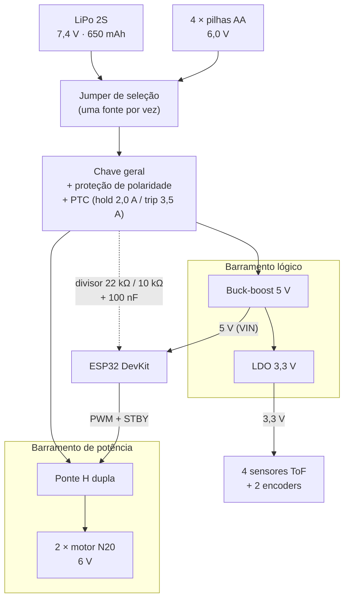

# Análise de Consumo Energético do Produto

Com relação ao consumo energético do produto desenvolvido, será necessário apresentar cálculos de consumo dos diversos componentes utilizados e explicar as decisões de projeto para atender a estas demandas.

- **Identificação dos Subsistemas Elétricos:** listem todos os componentes que consumirão energia, como sensores, microcontroladores, atuadores e módulos de armazenamento de dados. Para cada componente, registrem a tensão de operação (V), corrente média (mA) e tempo estimado de uso (s).
- **Cálculo da Energia Consumida por Componente:** utilizem a fórmula: $E = V I t$, onde $E$ é a energia em joules, $V$ é a tensão em volts, $I$ a corrente em ampères e $t$ o tempo em segundos. Realizem esse cálculo para cada componente do sistema.
- **Estimativa do Consumo Total de Energia:** somem as energias de todos os componentes para obter o consumo energético total estimado do sistema por execução.
- **Escolha da Fonte de Alimentação:** com base no consumo total, convertam para watt-hora: 1 Wh = 3600 J. Adicionem e justifiquem uma margem de segurança (pesquisar o que é usual para este tipo de sistema), e selecionem uma bateria ou fonte que supra a demanda.
- **Planejamento do Circuito de Alimentação:** analisem a necessidade de inclusão de reguladores de tensão, proteções contra sobrecorrente, e isolamento para atuadores. Como as oscilações de tensão serão controladas?
- Monitoramento via _software_: implementem, no _software_ embarcado, rotinas para medir a tensão da bateria e registrar dados de tempo de operação. Coletem os dados para análise.

---

## Projeto Conceitual de Energia

Análise de consumo energético do Micromouse, dimensionamento da fonte e planejamento do circuito de alimentação.

> **Premissas desta análise.** Onde um parâmetro ainda não foi medido, foi adotado um valor de referência, indicado como **[premissa]**, a ser substituído pelo valor real nos testes de energia (AP12).
>
> **Atuadores:** 2 micromotores DC N20 com encoder, 6 V e 600 RPM, conforme o projeto conceitual de Estrutura. Substituem os motores de passo considerados na versão anterior deste documento.
>
> **Microcontrolador:** ESP32 (placa DevKit), confirmado pela Eletrônica. A comunicação sem fio é processada nativamente pelo próprio SoC, sem módulo Bluetooth externo.
>
> **Sensores:** 4 sensores de distância por tempo de voo (ToF), referência VL53L0X, posicionados a 25 mm do solo conforme o projeto conceitual de Estrutura.
>
> **Cenário de cálculo:** uma tentativa de 10 minutos (600 s), conforme o limite de tempo do desafio. A autonomia é depois estendida para as três tentativas previstas por labirinto (RNF02 de Energia).

---

### 1. Identificação dos Subsistemas Elétricos

Tabela 1: Subsistemas elétricos e parâmetros de operação

| Componente | Qtd. | Tensão de operação (V) | Corrente média (mA) | Tempo de uso (s) | Fonte do dado |
|---|:--:|:--:|:--:|:--:|---|
| Micromotor DC N20 com encoder | 2 | 6,0 | 150 em cruzeiro (800 de pico em bloqueio) | 185 a 600 | Projeto conceitual de Estrutura, Tabela 3 |
| Ponte H de acionamento | 2 canais | — | — | 185 a 600 | Perdas tratadas como rendimento (item 2) |
| Encoder acoplado ao motor | 2 | 3,3 | 8 cada | 600 | **[premissa]** encoder magnético de quadratura |
| ESP32 DevKit (processamento e comunicação) | 1 | 5,0 (pino VIN) | 120 | 600 | **[premissa]** média entre transmissão (180 a 240 mA), recepção (95 a 100 mA) e modem-sleep (30 a 68 mA) |
| Sensor de distância ToF VL53L0X | 4 | 3,3 | 20 cada (40 de pico) | 600 | Folha de dados do módulo |
| LED indicador de estado | 1 | 5,0 | 10 | 60 | **[premissa]** acionamento intermitente |
| Buzzer | 1 | 5,0 | 30 | 10 | **[premissa]** acionamento pontual |

Fonte: [João Marcos](https://github.com/JJOAOMARCOSS) e [Giovana Martins](https://github.com/Giih-martins), 2026.

**Sobre módulos de armazenamento de dados.** O Micromouse não embarca cartão de memória nem memória externa. O mapa e o estado da execução são gravados na memória flash interna do próprio ESP32 (NVS, conforme o RF42 do Software), e os dados da execução são transmitidos ao sistema web e ali armazenados em banco (RF33 do Software). Como a flash é interna ao SoC, seu consumo já está contido na corrente do ESP32.

**Observação sobre os motores DC.** Diferentemente dos motores de passo, os motores DC consomem corrente apenas quando estão em movimento, e essa corrente é proporcional ao torque exigido. Com o robô parado, o consumo do acionamento cai a zero. Por isso o tempo de uso considerado não é o da tentativa inteira, e sim o tempo em que o robô efetivamente se desloca, tratado em dois cenários na seção 3.

**Observação sobre a tensão dos sensores.** As entradas do ESP32 operam em 3,3 V. Os módulos VL53L0X comunicam por I²C e devem ser alimentados em **3,3 V**, mesma tensão dos encoders, de modo que nenhum conversor de nível é necessário nas linhas de sinal.

---

### 2. Cálculo da Energia Consumida por Componente

#### 2.1 Motores DC e acionamento

A corrente de um motor DC é aproximadamente proporcional ao torque exigido. O projeto conceitual de Estrutura estima **150 mA por motor em cruzeiro**, valor já conservador em relação aos 140 mA calculados para a aceleração de projeto.

Com dois motores a 6,0 V:

$$P_{motores} = 2 \times 6{,}0 \times 0{,}150 = 1{,}80\ \text{W}$$

Considerando rendimento de 85% na ponte H e na adequação de tensão a partir do barramento de 7,4 V:

$$P_{entrada} = \frac{1{,}80}{0{,}85} = 2{,}12\ \text{W}$$

Na forma $E = V \cdot I \cdot t$, vista do lado da fonte de 7,4 V, a corrente equivalente do conjunto de tração é:

$$I_{equivalente} = \frac{2{,}12}{7{,}4} = 0{,}286\ \text{A}$$

Para o tempo de percurso estimado pela Estrutura, de 185 s:

$$E_{motores} = 7{,}4 \times 0{,}286 \times 185 = 392\ \text{J}$$

Para o pior caso, em que o robô se desloca durante toda a tentativa de 600 s:

$$E_{motores} = 7{,}4 \times 0{,}286 \times 600 = 1.271\ \text{J}$$

**Corrente de pico.** Com as duas rodas travadas, a corrente de bloqueio chega a 0,80 A por motor, ou 1,60 A no conjunto, o que corresponde a 9,6 W na saída e cerca de **1,53 A drenados da fonte de 7,4 V**. Essa condição é transitória, mas define o dimensionamento da ponte H, do fusível e do C-rating da bateria.

#### 2.2 Demais componentes

Aplicando $E = V \cdot I \cdot t$:

Tabela 2: Energia consumida pelos demais componentes

| Componente | V (V) | I (A) | P (W) | t (s) | E (J) |
|---|:--:|:--:|:--:|:--:|:--:|
| ESP32 DevKit | 5,0 | 0,120 | 0,600 | 600 | 360,0 |
| Sensores ToF (4 × VL53L0X) | 3,3 | 0,080 | 0,264 | 600 | 158,4 |
| Encoders (2 unidades) | 3,3 | 0,016 | 0,053 | 600 | 31,7 |
| LED indicador | 5,0 | 0,010 | 0,050 | 60 | 3,0 |
| Buzzer | 5,0 | 0,030 | 0,150 | 10 | 1,5 |
| **Subtotal na saída dos reguladores** | | | | | **554,6** |

Fonte: [João Marcos](https://github.com/JJOAOMARCOSS) e [Giovana Martins](https://github.com/Giih-martins), 2026.

Considerando rendimento de 85% nos reguladores da linha lógica:

$$E_{lógica} = \frac{554{,}6}{0{,}85} = 652{,}4\ \text{J}$$

O ESP32 responde por 65% do consumo da lógica. Vale registrar que a placa DevKit alimenta o SoC de 3,3 V a partir dos 5 V do pino VIN por meio de um regulador linear embarcado, o que descarta cerca de um terço dessa energia em calor. Alimentar o SoC diretamente pela linha de 3,3 V reduziria o consumo, mas contorna as proteções da placa, e por isso a alimentação por VIN foi mantida.

---

### 3. Estimativa do Consumo Total de Energia

O consumo é apresentado em dois cenários de tempo de deslocamento.

Tabela 3: Consumo total de energia por subsistema

| Subsistema | Percurso estimado (185 s de deslocamento) | Pior caso (600 s de deslocamento) |
|---|:--:|:--:|
| Motores DC e acionamento | 392 J (37,5%) | 1.271 J (66,1%) |
| Lógica (ESP32, sensores ToF, encoders e sinalização) | 652 J (62,5%) | 652 J (33,9%) |
| **Total por tentativa de 10 min** | **1.044 J** | **1.923 J** |
| **Equivalente em watt-hora** | **0,290 Wh** | **0,534 Wh** |

Fonte: [João Marcos](https://github.com/JJOAOMARCOSS) e [Giovana Martins](https://github.com/Giih-martins), 2026.

Para as três tentativas previstas por labirinto, conforme o RNF02 de Energia:

$$E_{desafio} = 3 \times 0{,}534 = 1{,}60\ \text{Wh (pior caso)}$$

O dimensionamento adota o **pior caso**, de 1,60 Wh, por não depender da estimativa de tempo de percurso.

**Conclusão da análise.** A troca dos motores de passo por motores DC com encoder inverteu o quadro do consumo. Com os motores de passo, o acionamento respondia por 81,5% da energia; agora, no cenário de percurso estimado, os motores ficam em 37,5% e a **lógica passa a ser o maior consumidor**. A razão é que o motor DC drena corrente apenas quando se desloca, enquanto o motor de passo drenava corrente nominal mesmo parado.

Dentro da lógica, o ESP32 é o item dominante. Duas medidas reduzem esse consumo e devem ser avaliadas com a Eletrônica: manter o rádio em modem-sleep entre os envios de telemetria e colocar os sensores ToF em modo de espera quando o robô estiver parado.

---

### 4. Escolha da Fonte de Alimentação

#### 4.1 Margem de segurança adotada

Duas correções se aplicam sobre a energia calculada:

**Profundidade de descarga (DoD).** Baterias de lítio não devem ser descarregadas abaixo de cerca de 3,5 V por célula sob carga, o que torna utilizável aproximadamente **80% da capacidade nominal**. Descargas mais profundas causam perda permanente de capacidade e aumento da resistência interna.

**Margem de projeto.** A prática usual em robótica móvel é dimensionar com **25% a 30% de folga** sobre o consumo calculado [[4]](#ref4), e o RNF03 de Energia exige no mínimo 30%. Adotou-se **30%**. A Tabela 4 mostra de onde vem esse valor: cada parcela cobre uma fonte de incerteza que o cálculo acima não considera.

Tabela 4: Composição da margem de segurança

| Fator | Por que reduz a energia disponível | Parcela estimada |
|---|---|:--:|
| Erro na estimativa de consumo | O consumo foi calculado sem medição em bancada: o ESP32 com Bluetooth e os picos dos ToF vêm de folhas de dados e de medições de terceiros [[2]](#ref2), [[3]](#ref3), e o rendimento de 85% dos reguladores é estimado. É a maior incerteza do cálculo. | 10% a 15% |
| Envelhecimento da bateria | A LiPo perde capacidade a cada ciclo de carga; o fim de vida costuma ser definido em 80% da capacidade nominal [[9]](#ref9). Com os testes e as provas do semestre, espera-se uma perda de 5% a 10% até a apresentação final. | 5% a 10% |
| Temperatura | A capacidade cai em ambientes frios [[10]](#ref10). O robô opera em sala, entre 20 °C e 25 °C, então o efeito é pequeno. | 0% a 5% |
| Taxa de descarga | Correntes altas reduzem a capacidade entregue [[11]](#ref11). Em regime a corrente é baixa (0,43 A, cerca de 0,9C), mas os picos de bloqueio das rodas chegam a 1,53 A. | 2% a 5% |
| **Total** | | **17% a 35%** |

Fonte: [João Marcos](https://github.com/JJOAOMARCOSS) e [Giovana Martins](https://github.com/Giih-martins), 2026.

A soma das parcelas fica entre 17% e 35%. Os 30% adotados ficam na parte de cima dessa faixa, porque o maior fator, o erro na estimativa de consumo, só será conhecido com a medição em bancada (seção 7.2). Uma margem maior exigiria uma bateria maior, com mais massa sobre um robô limitado a 16,5 cm, sem ganho real, já que a bateria escolhida ainda tem folga além da margem (seção 4.4).

A margem não repete a correção de DoD. A DoD é um limite de uso que vale sempre, mesmo com consumo exato; a margem cobre o que o cálculo pode ter errado.

$$E_{fonte} = \frac{E_{desafio}}{0{,}80} \times 1{,}30 = \frac{1{,}60}{0{,}80} \times 1{,}30 = 2{,}60\ \text{Wh}$$

#### 4.2 Capacidade necessária por opção de fonte

Tabela 5: Capacidade necessária por opção de fonte

| Fonte | Tensão nominal | Corrente média | Capacidade necessária | Avaliação |
|---|:--:|:--:|:--:|---|
| 4 × pilhas AA alcalinas | 6,0 V | 0,53 A | 434 mAh | Viável em regime, com ressalva no pico |
| LiPo 2S | 7,4 V | 0,43 A | 352 mAh | **Recomendada** |
| LiPo 3S | 11,1 V | 0,29 A | 234 mAh | Viável, porém desnecessária |

Fonte: [João Marcos](https://github.com/JJOAOMARCOSS) e [Giovana Martins](https://github.com/Giih-martins), 2026.

#### 4.3 Verificação das pilhas AA

Em regime de cruzeiro, com 0,53 A a 6,0 V, quatro pilhas AA em série apresentam queda de 0,3 a 0,6 V sobre a resistência interna somada de 0,6 a 1,2 Ω. A tensão sob carga permanece entre 5,4 e 5,7 V, e a capacidade necessária de 434 mAh é confortável diante dos cerca de 2.000 mAh nominais.

**Ressalva no pico.** Na condição de bloqueio das rodas, com 1,6 A, a queda sobe para 1,0 a 1,9 V e a tensão despenca para a faixa de 4,1 a 5,0 V, ou cerca de 3,7 a 4,6 V depois da queda do diodo de proteção (seção 5.3). Nessa situação o conversor buck-boost ainda sustenta os 5 V da lógica, desde que aceite entrada a partir de 3,5 V (Tabela 7), mas a tensão disponível para os motores cai, e o robô pode não conseguir se desprender sozinho de um travamento. Esse é o argumento técnico que sustenta a LiPo como fonte principal e as pilhas como alternativa de contingência.

#### 4.4 Fonte selecionada

**Bateria LiPo 2S (7,4 V), 650 mAh, com C-rating mínimo de 20C**, com o pacote de 4 pilhas AA mantido como fonte alternativa, selecionável por jumper conforme o RF03 de Energia. O modelo adotado na compra é a Tattu 650 mAh 2S 75C, com conector de força XT30 e plugue de balanceamento JST-XH [[12]](#ref12).

Tabela 6: Verificação da fonte selecionada

| Critério | Valor exigido | Valor da fonte escolhida |
|---|:--:|:--:|
| Energia disponível | 2,60 Wh | 4,81 Wh (7,4 V × 0,65 Ah) |
| Corrente média em operação | 0,43 A | — |
| Corrente de pico | 1,53 A (bloqueio das duas rodas) | ≈ 49 A (0,65 Ah × 75C) |
| Autonomia resultante | 30 min | ≈ 72 min no pior caso de deslocamento |
| Massa e dimensões | — | 43 g; 57 × 31 × 12 mm |

Fonte: [João Marcos](https://github.com/JJOAOMARCOSS) e [Giovana Martins](https://github.com/Giih-martins), 2026.

**Folga real.** A bateria entrega mais do que a margem pede: 4,81 Wh contra 2,60 Wh, ou 85% acima do valor que já inclui os 30%. Descontada só a DoD, a energia utilizável é de 3,85 Wh (4,81 × 0,80), mais que o dobro dos 1,60 Wh do pior caso. Mesmo que todas as parcelas da Tabela 4 ocorram no limite superior, a autonomia de 30 min fica garantida.

**Por que 650 mAh.** O cálculo pede no mínimo 352 mAh. A versão 1.2 deste documento reduziu a capacidade de 800 para 500 mAh, acompanhando a queda do consumo. Na cotação, porém, as baterias de 500 mAh encontradas eram peças de reposição de brinquedos e de airsoft, sem taxa de descarga informada e com conectores próprios desses aparelhos. A de 650 mAh é o menor tamanho de marca conhecida, com especificação completa e à venda no Brasil, pelo mesmo preço da de 800 mAh. A escolha acrescenta cerca de 13 g em relação à de 500 mAh: a bateria passa a representar 21% da massa alvo de 200 g definida pela Estrutura, em vez de 15%, e ainda fica abaixo da de 800 mAh.

**Conector de força.** A bateria é ligada ao robô por um conector, e não soldada, porque precisa ser retirada para a recarga e trocada pelo pacote de pilhas entre tentativas (RF06 e RF07 de Energia). O XT30 foi adotado por três motivos: é o conector que já vem na bateria escolhida; tem formato assimétrico, que impede o encaixe invertido e complementa o diodo de proteção de polaridade (seção 5.3); e suporta cerca de 15 A contínuos, muito acima do pico de 1,53 A, como pede o item 2.5 da EAP. O XT60, previsto antes, suporta 60 A e é maior e mais pesado, sem ganho nesta faixa de corrente. São necessários dois conectores: um na entrada do robô e outro, do lado oposto, soldado ao suporte das pilhas AA, de modo que as duas fontes usem a mesma entrada.

**Recarga.** O carregador IMAX B3 carrega pelo plugue de balanceamento, com corrente de cerca de 0,75 A, o que corresponde a 1,2C nesta bateria. Fica um pouco acima do 1C usual, dentro do aceito para LiPo de modelismo, e completa a carga em cerca de uma hora.

A LiPo 2S foi mantida sobre a 3S porque os motores são de 6 V, e partir de 11,1 V exigiria descartar mais tensão na adequação, sem nenhum ganho.

#### 4.5 Verificação do torque disponível

O motor N20 selecionado entrega **0,0245 N·m de torque de bloqueio** por unidade. O projeto conceitual de Estrutura calcula, para a massa de 200 g e a aceleração de projeto de 1,6 m/s², um torque exigido de 0,00272 N·m por motor, ou **11% do torque de bloqueio**.

Mesmo que a massa final chegue a 300 g, a exigência sobe para cerca de 17% do torque de bloqueio. A margem é ampla, bem diferente da situação estreita que existia com o motor de passo Nema 8, cujo torque de retenção de 1,4 N·cm deixava pouca folga.

Vale registrar a consequência energética dessa folga: como a corrente do motor DC acompanha o torque, operar a 11% do bloqueio mantém a corrente próxima dos 150 mA estimados, e não das centenas de miliampères que um motor sobrecarregado drenaria.

#### 4.6 Verificação geométrica do giro dentro da célula

A célula do labirinto tem 180 mm com paredes de 12 mm de espessura, restando **168 mm de vão livre**. O chassi mede 92 × 103 mm, o que resulta em uma diagonal de:

$$d = \sqrt{92^2 + 103^2} = 138{,}1\ \text{mm}$$

O projeto conceitual de Estrutura posiciona os motores **transversalmente no centro do chassi**, de modo que o eixo de rotação coincide com o centro geométrico. Nessa condição o diâmetro varrido no giro é a própria diagonal, e restam **29,9 mm de folga**, cerca de 15 mm por lado.

Essa definição resolve a questão levantada na versão anterior deste documento: se o eixo das rodas estivesse deslocado para a frente, o raio até os cantos traseiros cresceria e, com o eixo a menos de 35 mm da frente, o diâmetro varrido ultrapassaria os 168 mm disponíveis. Com o eixo centralizado, a condição está satisfeita com margem.

A largura total com as rodas é de 99 mm, também dentro do limite, deixando 34,5 mm de folga por lado no corredor.

---

### 5. Planejamento do Circuito de Alimentação

#### 5.1 Arquitetura adotada: barramentos separados

Imagem 1: Arquitetura do circuito de alimentação

Os dois barramentos compartilham o terra, com os retornos encontrando-se em um único ponto (seção 5.4). A linha tracejada é a medição da tensão da fonte (seção 6.1).

Fonte: [João Marcos](https://github.com/JJOAOMARCOSS) e [Giovana Martins](https://github.com/Giih-martins), 2026.

**Isolamento dos atuadores.** A separação entre potência e lógica é o ponto central do circuito, e atende diretamente ao RNF01 de Energia. Os motores são a origem dos picos de corrente; mantê-los em barramento próprio impede que essas variações cheguem ao microcontrolador e aos sensores.

Com motores DC de escovas, essa separação ganha um motivo adicional: o comutador gera ruído elétrico de banda larga que pode contaminar as leituras dos sensores e a contagem dos encoders. O projeto conceitual de Estrutura já prevê capacitores cerâmicos de cerca de 100 nF nos terminais dos motores, medida que complementa a separação de barramentos.

O isolamento adotado é **elétrico por barramento**, e não galvânico por optoacoplador. A opção se justifica porque os sinais de PWM e de encoder precisam de referência comum entre microcontrolador e driver, e porque o isolamento galvânico acrescentaria componentes, consumo e atraso de propagação sem ganho proporcional em um sistema de baixa tensão como este.

O jumper de seleção deve ser do tipo que **impede a conexão simultânea das duas fontes**, conforme o RF03 de Energia.

#### 5.2 Reguladores de tensão

Tabela 7: Reguladores de tensão

| Linha | Tensão | Corrente mínima | Tipo recomendado | Justificativa |
|---|:--:|:--:|---|---|
| Alimentação do ESP32 (pino VIN) e do LDO de 3,3 V | 5 V | 1 A | Conversor **buck-boost** com entrada de 3,5 V a 8,4 V | Precisa entregar 5 V tanto a partir da LiPo cheia (8,4 V) quanto das pilhas descarregadas, que chegam a cerca de 3,7 V no pico depois do diodo de proteção. Alimenta o ESP32 (picos de 240 mA no rádio), o LDO dos sensores (até 176 mA nos picos dos ToF), o LED e o buzzer: cerca de 0,46 A no pior caso, por isso 1 A |
| Sensores ToF e encoders | 3,3 V | 200 mA | Regulador LDO a partir dos 5 V | Quatro ToF a 20 mA e dois encoders a 8 mA, com margem para os picos de 40 mA dos sensores |
| Motores | 6 V efetivos | 2 A | Ponte H com controle por PWM | A tensão média de 6 V é obtida limitando o ciclo de trabalho do PWM em função da tensão medida no barramento, sem necessidade de regulador dedicado |

Fonte: [João Marcos](https://github.com/JJOAOMARCOSS) e [Giovana Martins](https://github.com/Giih-martins), 2026.

A escolha do buck-boost é o que viabiliza o requisito de múltiplas fontes: sem ele, a linha lógica funcionaria com a LiPo mas falharia com as pilhas na segunda metade da descarga.

**Sobre a tensão dos motores.** Os N20 são de 6 V, mas a tensão do barramento de potência não é fixa: vai de 8,4 V com a LiPo plenamente carregada até 7,0 V no corte, e fica perto de 6,0 V com as pilhas. Um limite fixo de ciclo de trabalho não serve para toda essa faixa. Os 81% calculados para a tensão nominal de 7,4 V aplicariam 6,8 V aos motores com a bateria cheia, 13% acima do nominal.

Como o controle já é feito por PID com saída em PWM e a tensão da fonte já é medida (seção 6), o limite passa a ser calculado a partir da tensão lida:

$$D_{máx} = \min\left(\frac{6{,}0\ \text{V}}{V_{bateria}},\ 1\right)$$

Tabela 8: Limite de ciclo de trabalho pela tensão da fonte

| Situação da fonte | Tensão no barramento | Ciclo de trabalho máximo |
|---|:--:|:--:|
| LiPo plenamente carregada | 8,4 V | 71% |
| LiPo na tensão nominal | 7,4 V | 81% |
| LiPo no corte por subtensão | 7,0 V | 86% |
| Pacote de 4 pilhas AA | 6,0 V ou menos | 100% |

Fonte: [João Marcos](https://github.com/JJOAOMARCOSS) e [Giovana Martins](https://github.com/Giih-martins), 2026.

O limite é recalculado a cada nova média de tensão (seção 6.2) e aplicado no firmware sobre a saída do PID, e não deixado a cargo apenas do controlador. Uma vantagem secundária é que o robô mantém o mesmo desempenho do início ao fim da descarga, já que a tensão média nos motores deixa de cair junto com a bateria.

#### 5.3 Proteções

Tabela 9: Proteções do circuito de alimentação

| Proteção | Implementação | Ponto de atuação |
|---|---|---|
| Sobrecorrente e curto-circuito | Fusível rearmável (PTC) na saída da fonte | **Hold de 2,0 A e trip de 3,5 a 4,0 A** (referência: Bourns MF-MSMF200, SMD; adotado na compra: JK30-200, PTH, 30 V) |
| Inversão de polaridade | Diodo Schottky SS34 (3 A, 40 V) em série na entrada, o mesmo do esquemático da Eletrônica [[8]](#ref8). A queda de 0,3 a 0,4 V é compensada pelo limite de PWM, que é calculado pela tensão medida, e somada à leitura nos limites de alerta e corte (seção 6.1) | Evita dano na troca de bateria ou de pilhas entre tentativas |
| Descarga profunda da LiPo | Corte por subtensão feito pelo firmware, em 3,5 V por célula (7,0 V no pacote 2S), precedido de alerta em 3,7 V por célula (7,4 V) | Preserva a vida útil e evita risco de segurança |
| Bloqueio prolongado do motor | Detecção por software: encoder parado com PWM ativo por mais de 1 s | Desliga a ponte H e registra a falha como `stuck` (RF15 do Software) |
| Desenergização em repouso | Pino de standby da ponte H | Acionado sempre que o robô estiver parado ou aguardando comando |
| Sobretensão nos motores | Limite de ciclo de trabalho do PWM calculado pela tensão medida (Tabela 8) | Mantém a tensão média nos motores em até 6 V em toda a faixa de 6,0 a 8,4 V do barramento |

Fonte: [João Marcos](https://github.com/JJOAOMARCOSS) e [Giovana Martins](https://github.com/Giih-martins), 2026.

A proteção contra bloqueio prolongado merece atenção especial. Ao contrário do motor de passo, que simplesmente perde passos, o motor DC travado drena a corrente de bloqueio continuamente, aquecendo motor e ponte H. Como o encoder informa se o eixo está girando, a detecção é direta em software, e a implementação é de baixo custo.

**Escolha do PTC.** O fusível rearmável é especificado por duas correntes: a de *hold*, até a qual ele garantidamente não abre, e a de *trip*, a partir da qual ele garantidamente abre. O hold de 2,0 A fica acima do pico de 1,53 A do bloqueio das duas rodas, de modo que um travamento transitório não desliga o robô. O trip, de 3,5 A no MF-MSMF200 e de 4,0 A no JK30-200 adotado, fica bem abaixo da corrente que a LiPo é capaz de entregar (cerca de 49 A, 0,65 Ah × 75C), de modo que um curto-circuito é interrompido antes de danificar a fiação ou a bateria. Entre o hold e o trip o comportamento depende da temperatura e do tempo, faixa que só é atingida em falha. O JK30-200 foi adotado por ser PTH, mais fácil de soldar na placa perfurada que o MF-MSMF200, que é SMD.

O corte por subtensão é feito pelo firmware, a partir da leitura da seção 6: o esquemático da Eletrônica não tem circuito de corte dedicado. Um circuito desse tipo, ou uma bateria com placa de proteção embutida, protegeria a LiPo mesmo se o firmware travasse, e fica como melhoria caso os testes mostrem necessidade. Para que o aviso chegue de fato antes, o **alerta fica em 3,7 V por célula (7,4 V)**, acima do **corte em 3,5 V por célula (7,0 V)**. Na região final da curva de descarga da LiPo, essa diferença de 0,4 V no pacote corresponde a alguns minutos de operação, tempo suficiente para encerrar a tentativa em curso e trocar a bateria.

#### 5.4 Controle das oscilações de tensão

Os picos de corrente dos motores e o ruído das escovas são as principais fontes de instabilidade. Cinco medidas atuam sobre isso:

1. **Capacitores cerâmicos de 100 nF nos terminais de cada motor**, conforme já previsto pela Estrutura, para suprimir o ruído gerado pelo comutador na origem.
2. **Capacitor eletrolítico de desacoplamento na entrada da ponte H.** Valor típico de 100 µF, posicionado o mais próximo possível do driver, para fornecer a corrente dos transitórios de partida sem puxá-la da fonte.
3. **Capacitores cerâmicos de 100 nF junto aos pinos de alimentação** do ESP32 e de cada sensor ToF. Junto ao ESP32, acrescentar um eletrolítico de 100 µF para sustentar os picos de transmissão do rádio.
4. **Capacitor de saída no conversor buck-boost**, conforme a folha de dados do componente escolhido, para atenuar o ripple de chaveamento.
5. **Traçado de terra em estrela**, com os retornos de potência e de lógica encontrando-se em um único ponto, próximo ao terminal negativo da fonte, e separação física entre os fios dos motores e os dos sensores.

**Critério de aceitação:** a tensão da linha lógica não deve variar além de ±5% do valor nominal durante os picos de corrente, e o microcontrolador não deve reiniciar em nenhuma manobra. A verificação é feita com osciloscópio na linha de 5 V, com o robô executando giros e reversões, que são os piores casos.

---

### 6. Monitoramento via Software

#### 6.1 Circuito de medição

A leitura é feita por **divisor resistivo** entre o positivo da fonte e uma entrada analógica do ESP32, dimensionado para a maior tensão possível na entrada: 8,4 V, que é a tensão de um pacote LiPo 2S plenamente carregado.

O ADC do ESP32 opera na faixa de 0 a 3,3 V, e não de 0 a 5 V. A razão de divisão mínima é, portanto, 8,4 / 3,3 = 2,55. Adota-se o mesmo divisor já previsto pela Eletrônica no projeto conceitual de hardware, com razão 3,2:

- R1 = 22 kΩ, R2 = 10 kΩ → razão 3,2 → 8,4 V lidos como 2,63 V
- Corrente pelo divisor: 8,4 / 32 kΩ = 0,26 mA (consumo desprezível)
- Capacitor de 100 nF em paralelo com R2, para filtrar o ruído das escovas dos motores

**Queda do diodo de proteção.** No esquemático da Eletrônica o divisor fica depois do diodo SS34, que protege também o ADC contra a inversão de polaridade. Por isso a tensão lida é a da bateria menos a queda do diodo, de 0,3 a 0,4 V conforme a corrente. Sem correção, o corte de 7,0 V só dispararia com a bateria em cerca de 7,35 V, e o alerta, com ela já perto de 7,75 V. O firmware soma a queda à leitura antes de comparar com os limites, com valor inicial de 0,35 V calibrado nos testes de energia (7.2). O limite de PWM (Tabela 8) usa a leitura sem essa soma, porque a ponte H também recebe a tensão já depois do diodo.

Tabela 10: Tensões na entrada do ADC

| Ponto | Tensão da fonte | Depois do SS34 (−0,35 V) | Tensão no ADC |
|---|:--:|:--:|:--:|
| LiPo plenamente carregada | 8,4 V | 8,05 V | 2,52 V |
| Alerta de carga mínima da LiPo | 7,4 V | 7,05 V | 2,20 V |
| Corte por subtensão da LiPo | 7,0 V | 6,65 V | 2,08 V |
| Pilhas AA novas | 6,0 V | 5,65 V | 1,77 V |
| Alerta de carga mínima das pilhas | 5,0 V | 4,65 V | 1,45 V |

Fonte: [João Marcos](https://github.com/JJOAOMARCOSS) e [Giovana Martins](https://github.com/Giih-martins), 2026.

O mesmo divisor serve para as duas fontes. O firmware precisa saber qual fonte está ativa para converter a tensão em percentual de carga pela curva correta.

O ADC do ESP32 tem não linearidade conhecida nos extremos da faixa: com a atenuação máxima, a resposta é mais linear entre cerca de 0,15 e 2,45 V. Os pontos que disparam decisões, o alerta e o corte, ficam dentro dessa região (2,20 V e 2,08 V); apenas a leitura da bateria plenamente carregada fica um pouco acima dela, onde um pequeno erro não altera nenhuma ação do robô. Ainda assim, a não linearidade reforça a necessidade da média móvel prevista na seção 6.2 e de uma calibração por dois pontos contra multímetro durante os testes de energia.

#### 6.2 Rotinas embarcadas

Tabela 11: Rotinas embarcadas de monitoramento da bateria

| Rotina | O que faz | Requisito atendido |
|---|---|---|
| Leitura periódica da tensão | Amostra a entrada analógica em intervalo fixo e aplica média móvel de pelo menos 8 amostras, para descartar o ruído das escovas | RF23 do Software |
| Conversão para nível de carga | Converte a tensão lida em percentual de carga, pela curva de descarga da fonte ativa | RF11 do Backend |
| Contagem do tempo de operação | Registra o tempo decorrido desde o início da execução | RF13 do Backend |
| Alerta de carga mínima | Aciona o LED e o buzzer ao atingir o limite da fonte ativa: 3,7 V por célula na LiPo (7,4 V, acima do corte de 7,0 V), ou 5,0 V no pacote de pilhas | RF05 de Energia, RF25 do Software |
| Bloqueio de partida | Reprova o health-check se a carga estiver abaixo do mínimo para uma tentativa | RF29 do Software |
| Envio na telemetria | Inclui o nível de bateria em cada mensagem enviada ao sistema web | RF24 do Software |
| Desenergização em repouso | Aciona o standby da ponte H sempre que o robô estiver parado ou aguardando comando | RF39 e RF41 do Software |
| Detecção de bloqueio | Compara a contagem do encoder com o PWM aplicado e desliga o acionamento se o eixo não girar | RF15 do Software |
| Limite de ciclo de trabalho | Recalcula o PWM máximo como 6,0 V dividido pela tensão medida, a cada nova média, para não exceder os 6 V nominais dos motores (Tabela 8) | RF21 do Software |

Fonte: [João Marcos](https://github.com/JJOAOMARCOSS) e [Giovana Martins](https://github.com/Giih-martins), 2026.

#### 6.3 Dados a coletar para análise

> **Situação atual:** a coleta ainda não foi realizada, pois depende da montagem do protótipo. O plano de coleta abaixo será executado nos testes de energia (AP12), e os resultados substituirão as premissas desta análise.

Devem ser registrados, a cada execução:

- Tensão da fonte no início e no fim da tentativa
- Tempo total de operação até atingir a tensão de corte
- Corrente média medida, para comparação com os 0,43 A estimados na LiPo 2S
- Corrente média por motor em cruzeiro, para verificar a estimativa de 150 mA
- Corrente média do ESP32 isolada, para verificar a premissa de 120 mA
- Tempo efetivo de deslocamento dentro da tentativa, para verificar a estimativa de 185 s
- Ocorrência de reinicializações do microcontrolador
- Comportamento com cada uma das duas fontes, para validar o requisito de seleção

---

## Referências Bibliográficas

> <a id="ref1">1.</a> Projeto Conceitual da Estrutura e Atuadores, Grupo 01, 2026 (Tabelas 1 a 5)

> <a id="ref2">2.</a> Folha de dados do sensor VL53L0X e consumo do módulo em medição, [Pololu](https://www.pololu.com/product/2490) e [STMicroelectronics](https://www.st.com/resource/en/datasheet/vl53l0x.pdf)

> <a id="ref3">3.</a> Consumo de corrente do ESP32 em transmissão, recepção e modem-sleep, [Last Minute Engineers](https://lastminuteengineers.com/esp32-sleep-modes-power-consumption/)

> <a id="ref4">4.</a> Prática de margem de 25% a 30% e verificação de C-rating em robótica móvel, [Robotics Engineering Lab](https://roboticsengineeringlab.com/articles/robot-arm-battery-power)

> <a id="ref5">5.</a> Limite de descarga e capacidade utilizável de 80% em baterias LiPo, [Zbotic](https://zbotic.in/lipo-battery-guide-voltage-c-rating-safety/)

> <a id="ref6">6.</a> Folha de dados do fusível rearmável MF-MSMF200 (hold de 2,0 A e trip de 3,5 A), [Bourns](https://www.bourns.com/docs/Product-Datasheets/mf-msmf.pdf)

> <a id="ref7">7.</a> Faixa de medição do ADC do ESP32 por atenuação, [Espressif](https://docs.espressif.com/projects/esp-idf/en/stable/esp32/api-reference/peripherals/adc_oneshot.html)

> <a id="ref8">8.</a> Projeto Conceitual de Hardware, Grupo 01, 2026 (divisor de 22 kΩ / 10 kΩ e proteção da bateria)

> <a id="ref9">9.</a> BU-808: How to Prolong Lithium-based Batteries (perda de capacidade por ciclo e fim de vida em 80%), [Battery University](https://batteryuniversity.com/article/bu-808-how-to-prolong-lithium-based-batteries)

> <a id="ref10">10.</a> BU-502: Discharging at High and Low Temperatures (capacidade em função da temperatura), [Battery University](https://batteryuniversity.com/article/bu-502-discharging-at-high-and-low-temperatures)

> <a id="ref11">11.</a> BU-501: Basics about Discharging (efeito da taxa de descarga na capacidade entregue), [Battery University](https://batteryuniversity.com/article/bu-501-basics-about-discharging)

> <a id="ref12">12.</a> Tattu 650 mAh 2S1P 75C 7,4 V com conector XT30 (capacidade, taxa de descarga, massa, dimensões e conectores), [Helitec](https://helitec.com.br/TATTU-650MAH-2S-75C-XT30)

---

## Histórico de Versões

| Versão | Data | Descrição | Autor(es) | Revisor(es) | Detalhes da revisão |
| :----: | :--: | --------- | ----------- | ------ | :---: |
| 1.0 | 26/09/2026 | Criação do Projeto Conceitual de Energia: identificação dos subsistemas elétricos, cálculo do consumo por componente, estimativa do consumo total, escolha da fonte de alimentação, planejamento do circuito de alimentação e monitoramento via software [#24](https://github.com/fcte-pi1/2026_2_PI1_Grupo01_Juliana/issues/24). | [João Marcos Moraes de Andrade](https://github.com/JJOAOMARCOSS) | [Giovana Martins de Brito](https://github.com/Giih-martins) | Revisão |
| 1.1 | 28/09/2026 | Atualização após as definições da Eletrônica: substituição do módulo HM-10 pelo ESP32 nativo, alimentação dos sensores em 3,3 V por compatibilidade com as entradas do ESP32 e redimensionamento do divisor do ADC para a faixa de 3,3 V [#24](https://github.com/fcte-pi1/2026_2_PI1_Grupo01_Juliana/issues/24). | [João Marcos Moraes de Andrade](https://github.com/JJOAOMARCOSS) | [Giovana Martins de Brito](https://github.com/Giih-martins) | Revisão da troca do HM-10 pelo ESP32 e da nova faixa do divisor do ADC. |
| 1.2 | 28/09/2026 | Revisão completa após o projeto conceitual de Estrutura: substituição dos motores de passo Nema 8 por micromotores DC N20 com encoder, adoção de 4 sensores de distância ToF, recálculo do consumo em dois cenários de deslocamento, redução da capacidade da bateria de 800 para 500 mAh, inclusão do limite de PWM e da detecção de bloqueio, e confirmação da geometria de giro com o eixo centralizado [#24](https://github.com/fcte-pi1/2026_2_PI1_Grupo01_Juliana/issues/24). | [João Marcos Moraes de Andrade](https://github.com/JJOAOMARCOSS) | [Giovana Martins de Brito](https://github.com/Giih-martins) | Revisão do recálculo do consumo com os motores N20, do novo dimensionamento da bateria e das proteções do acionamento. |
| 1.3 | 03/10/2026 | Correções técnicas: alerta de carga mínima da LiPo elevado para 3,7 V por célula, acima do corte de 3,5 V; limite de PWM calculado pela tensão medida no lugar dos 81% fixos; PTC especificado por hold de 2,0 A e trip de 3,5 A; divisor do ADC alinhado ao da Eletrônica (22 kΩ / 10 kΩ); diagrama de blocos refeito como figura [#160](https://github.com/fcte-pi1/2026_2_PI1_Grupo01_Juliana/issues/160). | [João Marcos Moraes de Andrade](https://github.com/JJOAOMARCOSS) | [Giovana Martins de Brito](https://github.com/Giih-martins) | Revisão dos limites de alerta e corte, do limite de PWM e da especificação do PTC. |
| 1.4 | 07/10/2026 | Justificativa da margem de segurança de 30%, pedida pela professora: composição da margem por fator de incerteza (Tabela 4), relação com a DoD e folga real da bateria escolhida; proteção de polaridade alinhada ao diodo SS34 do esquemático da Eletrônica, no lugar do MOSFET de canal P, com a queda do diodo somada à leitura nos limites de alerta e corte (Tabela 10); buck-boost especificado para 1 A e entrada de 3,5 V a 8,4 V, já que alimenta também o LDO; corte por subtensão definido como função do firmware; tabelas seguintes renumeradas [#184](https://github.com/fcte-pi1/2026_2_PI1_Grupo01_Juliana/issues/184). | [João Marcos Moraes de Andrade](https://github.com/JJOAOMARCOSS) | [Giovana Martins de Brito](https://github.com/Giih-martins) | Revisão da composição da margem e das referências. |
| 1.5 | 08/10/2026 | Alinhamento à lista de compras: bateria de 500 para 650 mAh (Tattu 75C, 4,81 Wh, ≈ 72 min, 43 g), com a justificativa da escolha; conector de força XT30 justificado, no lugar do XT60; recarga pelo IMAX B3; PTC adotado JK30-200 (PTH), equivalente ao MF-MSMF200 [#166](https://github.com/fcte-pi1/2026_2_PI1_Grupo01_Juliana/issues/166). | [João Marcos Moraes de Andrade](https://github.com/JJOAOMARCOSS) | [Giovana Martins de Brito](https://github.com/Giih-martins) | Revisão da bateria, do conector e do PTC adotados. |
