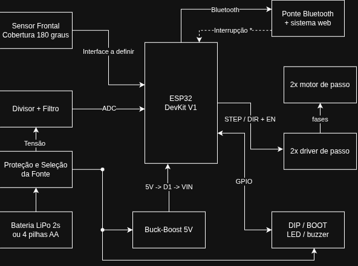
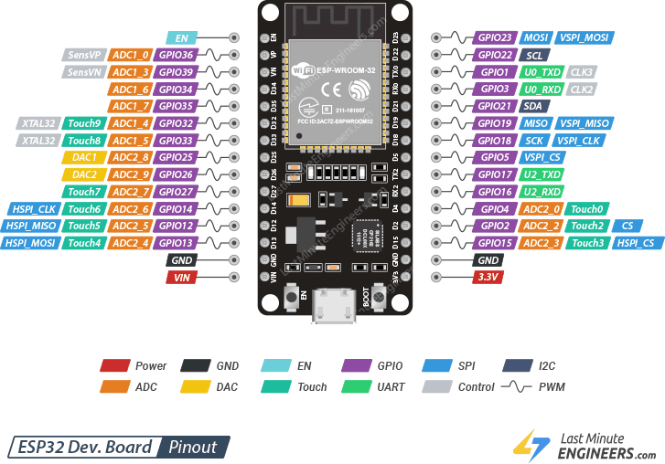
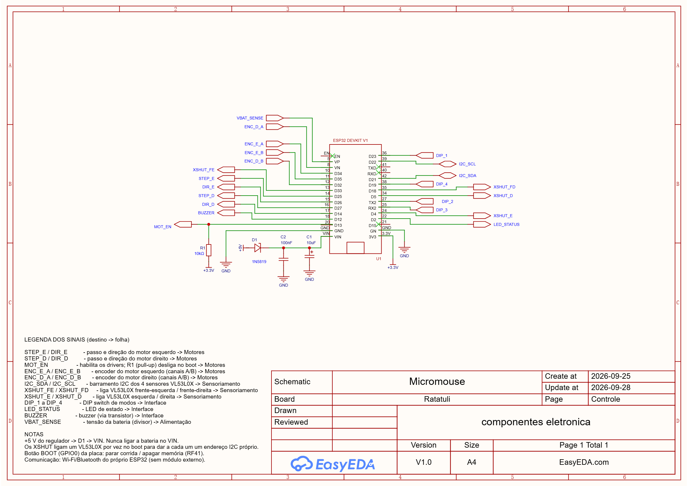

# Projeto Conceitual de Hardware

## Visão geral do hardware

O hardware do Micromouse Ratatouille integra alimentação embarcada, sensoriamento de paredes, processamento, acionamento dos motores e comunicação com o sistema de telemetria. A ESP32 DevKit V1 executa o firmware, recebe as informações do ambiente e da bateria e controla o movimento diferencial das rodas.

Esta descrição consolida o projeto de Controle e Comunicação e os conteúdos de arquitetura, subsistemas e interfaces da entrega da Dupla 1. O diagrama de blocos apresenta a organização funcional; a documentação elétrica identifica os componentes e terminais de conexão.

## Diagrama de blocos

Imagem 1: Diagrama de blocos

Fonte: [João Vitor](https://github.com/Jauzimm) e [Ana Victória](https://github.com/navicg), 2026.

**Arquivo editável no Draw.io:** [Acessar diagrama de blocos](https://drive.google.com/file/d/1VfPdJNL6B-8TP88l285cGgVQZQHgnTrJ/view?usp=sharing)

A fonte embarcada alimenta os caminhos de potência e de regulação da lógica. O conversor buck-boost fornece a linha de 5 V que chega à placa pelo diodo D1 e pelo terminal VIN. O divisor e o filtro disponibilizam ao ADC a informação de tensão da fonte. Os circuitos compartilham a referência GND.

A ESP32 recebe o sensoriamento frontal e as entradas locais, envia os sinais STEP/DIR e de habilitação aos drivers e comanda os indicadores. Os drivers energizam os enrolamentos dos motores. A telemetria segue por Bluetooth para a ponte e o sistema web, externos ao robô.

A linha tracejada indicada como "Interrupção" no diagrama representa apenas uma proposta de intervenção manual sobre o robô; não configura controle remoto do trajeto pela ponte ou pelo sistema web.

## Principais subsistemas

Tabela 1: Principais subsistemas

| Subsistema | Função e conexões | Justificativa de projeto |
|---|---|---|
| Alimentação e proteção | Seleção da fonte embarcada, chaveamento e distribuição de energia para lógica e motores. | Permitir operação autônoma e organizar os caminhos de alimentação. |
| Regulação de tensão | Conversor buck-boost de 5 V e regulador de 3,3 V da placa ESP32. | Adequar a alimentação à unidade de processamento. |
| Sensoriamento de paredes | Um sensor frontal com cobertura de 180°, ligado à unidade de processamento. | Fornecer informações do ambiente para a navegação. |
| Monitoramento da bateria | Divisor e filtro conectados ao ADC da ESP32. | Disponibilizar a tensão da fonte ao firmware e à telemetria. |
| Processamento e controle | ESP32 DevKit V1, responsável pela aquisição das entradas, execução do firmware e geração dos sinais de controle. | Concentrar o controle embarcado e manter a navegação autônoma. |
| Acionamento dos motores | Dois drivers de passo comandam os dois motores e suas rodas. | Controlar cada roda independentemente para avanço, curvas e parada. |
| Configuração e sinalização | DIP switch, botão BOOT, LED e buzzer, com os respectivos circuitos de interface. | Disponibilizar entradas locais e indicar estados do robô. |
| Comunicação | Rádio integrado da ESP32 conectado por Bluetooth à ponte do sistema web. | Transmitir os dados sem exigir uma placa de comunicação adicional. |
| Integração mecânica | Chassi, suportes, placa perfurada, rodas e caster. | Manter fixação e alinhamento dentro do envelope de 16,5 × 16,5 cm. |

Fonte: [João Vitor](https://github.com/Jauzimm) e [Ana Victória](https://github.com/navicg), 2026.

### Sensoriamento, movimento e telemetria

O sensoriamento adotado é frontal, com cobertura de 180°. A cobertura angular não equivale, por si só, à identificação independente de paredes à frente, à esquerda e à direita.

O acionamento utiliza STEP/DIR: os pulsos solicitam passos aos drivers e o sinal de direção determina o sentido do movimento. Os motores recebem corrente pelos drivers, não diretamente pelos GPIOs da ESP32.

A contagem dos pulsos comandados permite estimar deslocamento e velocidade, mas não comprova a execução física de cada passo. A leitura do divisor fornece tensão da bateria, não uma medição direta de corrente ou carga acumulada.

## Controle e Comunicação

Este subsistema reúne a unidade de processamento, a supervisão de funcionamento, a comunicação e as interfaces com os demais circuitos. Relaciona-se à unidade de processamento da [EAP](3%20-%20EAP.md) e aos requisitos de comunicação, watchdog e capacidade de I/O da [Eletrônica](2%20-%20Requisitos.md).

---

### 1. Microcontrolador

A unidade de processamento é a **ESP32 DevKit V1 de 30 pinos**, identificada nos materiais do projeto. A placa reúne regulador de 3,3 V, interface USB de programação e botões de reset e BOOT. O firmware é executado nessa unidade, sem constituir um bloco físico separado.

A escolha reúne processamento, entradas e saídas e rádio integrado na mesma placa. A organização do firmware separa as funções de aquisição e movimento das funções de comunicação; a navegação deve continuar autônoma em caso de falha da rede ou do sistema web.

#### Alimentação e limites elétricos

| Elemento | Aplicação no projeto |
|---|---|
| VIN | Recebe a alimentação proveniente da linha regulada de 5 V, através de D1. A queda no diodo deve ser considerada; VIN não é GPIO. |
| 3V3 | Terminal da linha de 3,3 V da placa; distinto de VIN. |
| GND | Referência comum aos circuitos. Os retornos de potência e lógica devem ser organizados separadamente. |
| GPIOs | Sinais lógicos de 3,3 V; não devem receber sinais de 5 V. |
| GPIO36 / VP | Entrada ADC1_CH0, sem capacidade de saída nem resistores internos de pull-up/pull-down. |

A bateria não se conecta diretamente ao ADC: o sinal passa pelo divisor e pelo filtro. A faixa de aquisição depende da configuração do ADC; 2,45 V não deve ser apresentado como um limite universal de entrada.

**Referência técnica:** [ESP32 Pinout Reference — Last Minute Engineers](https://lastminuteengineers.com/esp32-pinout-reference/), seções *Input Only GPIOs*, *ADC Pins* e *Power Pins*.

---

### 2. Watchdog e segurança

O projeto estabelece supervisão por watchdog para recuperação de travamentos e adota **motores desligados** como estado seguro. A recuperação do controlador deve preservar esse estado até a retomada do controle pelo firmware.

A linha `MOT_EN` centraliza a interface de habilitação dos drivers. O resistor R1 de 10 kΩ conecta essa linha a 3,3 V. O botão BOOT é uma entrada da placa tratada pelo firmware; não constitui um dispositivo independente de corte da alimentação dos motores.

---

### 3. Comunicação

A telemetria utiliza **Bluetooth integrado à ESP32**, com uma ponte no notebook para encaminhamento ao sistema web. A interface de rádio pertence à unidade de processamento e não exige um GPIO externo dedicado.

O sistema web recebe os dados do robô; o controle do trajeto permanece no firmware embarcado. A comunicação deve preservar a independência da navegação em relação ao receptor e ao backend.

### 4. GPIOs e pinagem

Imagem 2: GPIOs da placa ESP32 DevKit V1 de 30 pinos

Fonte: [João Vitor](https://github.com/Jauzimm) e [Ana Victória](https://github.com/navicg), 2026.

**Figura 2 —** GPIOs da ESP32 DevKit V1. Fonte: [Last Minute Engineers — ESP32 Pinout Reference](https://lastminuteengineers.com/esp32-pinout-reference/).

A tabela reúne as atribuições registradas para os circuitos de alimentação, movimento e interface local. Os números indicam GPIOs, não a posição física dos terminais no conector.

| Pino da ESP32 | Sinal | Tipo | Conexão | Frente |
|---|---|---|---|---|
| VP / GPIO36 | `VBAT_SENSE` | Entrada analógica — ADC1_CH0 | Divisor e filtro de leitura da bateria | Energia |
| D25 / GPIO25 | `STEP_E` | Saída digital | Entrada de passo do driver esquerdo | Motores |
| D26 / GPIO26 | `DIR_E` | Saída digital | Entrada de direção do driver esquerdo | Motores |
| D27 / GPIO27 | `STEP_D` | Saída digital | Entrada de passo do driver direito | Motores |
| D14 / GPIO14 | `DIR_D` | Saída digital | Entrada de direção do driver direito | Motores |
| D13 / GPIO13 | `MOT_EN` | Saída digital | Habilitação dos drivers; R1 de 10 kΩ para 3,3 V | Motores |
| D23, D22, D21 e D19 | `DIP_1` a `DIP_4` | Entradas digitais com pull-up interno | DIP switch de quatro vias, com contatos para GND | Interface |
| D2 / GPIO2 | `LED_STATUS` | Saída digital | Circuito do LED de estado | Interface |
| D12 / GPIO12 | `BUZZER` | Saída digital | Estágio de acionamento do buzzer | Interface |
| GPIO0 | BOOT | Entrada local | Botão BOOT da placa | Interface |
| VIN | Alimentação de entrada | Alimentação | Linha de 5 V através de D1 | Energia |
| 3V3 / GND | Alimentação lógica / referência | Alimentação | Linha de 3,3 V e terra comum | Energia |

---

### 5. Esquemático: folha "Controle"

Imagem 1: Folha "Controle" do esquemático

Desenhada no EasyEDA Pro. Cada pino usado sai por uma porta de rede com o nome da Tabela 2; as folhas das outras frentes usam os mesmos nomes, e é isso que as conecta.

Componentes: **U1** ESP32 DevKit V1 · **D1** 1N5819 (+5 V → VIN, impede que o USB alimente o regulador externo) · **C1** 10 µF e **C2** 100 nF (filtro no VIN) · **R1** 10 kΩ (pull-up do MOT_EN).

Verificação (DRC): nenhum erro fatal. Os avisos de "rede ligada a um só pino" são esperados até as demais folhas serem desenhadas. O erro de footprint do U1 não afeta a montagem em placa perfurada.
