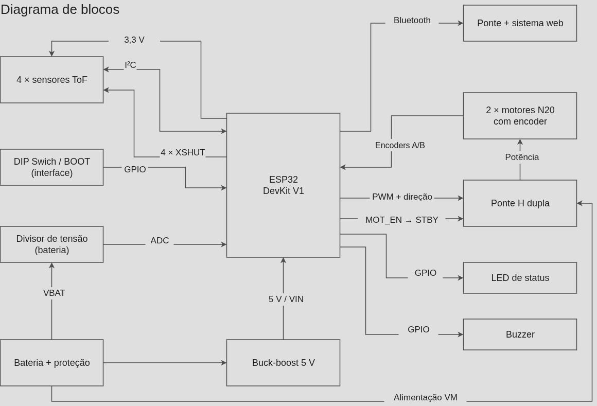
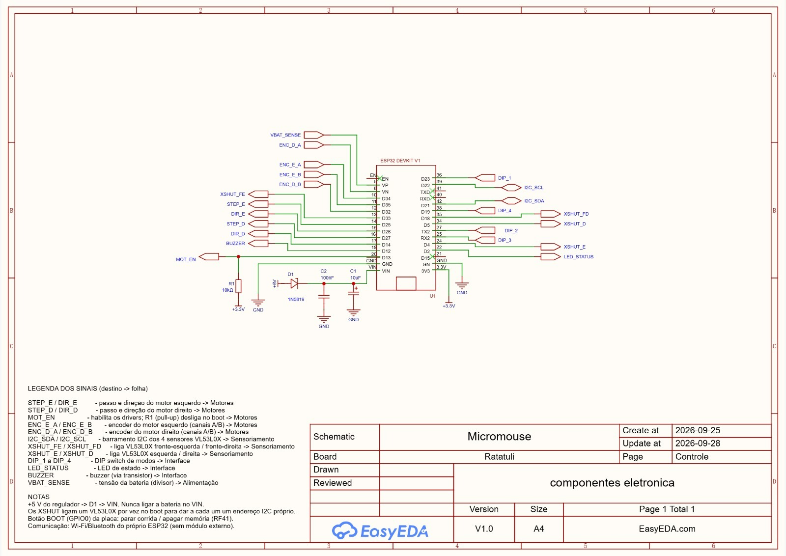
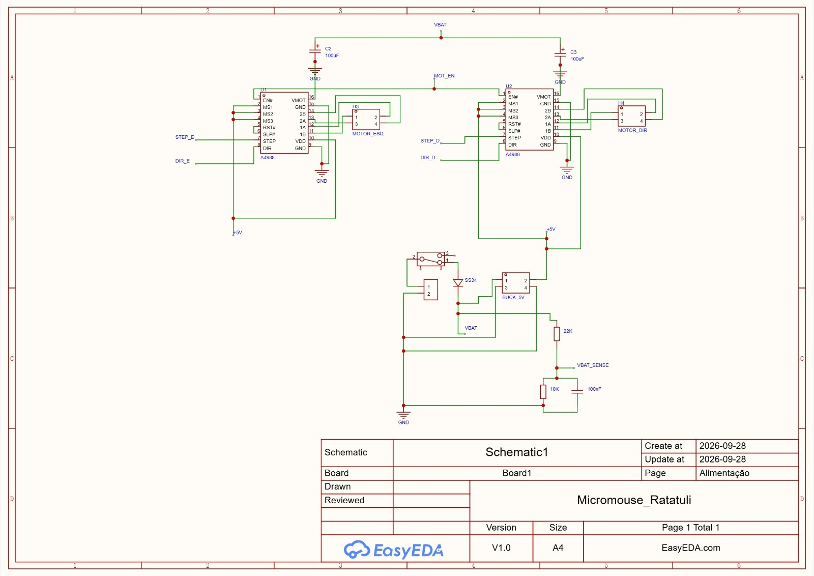

# Projeto Conceitual de Hardware

## Visão geral do hardware

O hardware do Micromouse Ratatuli integra alimentação embarcada, sensoriamento de paredes, processamento, acionamento dos motores e comunicação com o sistema de telemetria. A ESP32 DevKit V1 executa o firmware, recebe as informações do ambiente e da bateria e controla o movimento diferencial das rodas.

Após um realinhamento arquitetural com as equipes de Estrutura e Energia, o projeto de hardware evoluiu da sua versão inicial (motores de passo e sensores infravermelhos binários) para uma arquitetura de *malha fechada*, visando maior precisão de odometria e redução de peso.

Esta descrição consolida o projeto de Controle e Comunicação e os conteúdos de arquitetura, subsistemas e interfaces da entrega da Dupla 1.

## Diagrama de blocos

Imagem 1: Diagrama de blocos

Fonte: [João Vitor](https://github.com/Jauzimm) e [Ana Victória](https://github.com/navicg), 2026.

**Arquivo editável no Draw.io:** [Acessar diagrama de blocos](https://drive.google.com/file/d/13IjQpCpPuco8ucV6TGSQnXqrh3lygKUP/view?usp=sharing)

A fonte embarcada alimenta os caminhos de potência e de regulação da lógica. O conversor buck-boost fornece a linha de 5 V que chega à placa pelo terminal VIN. O divisor e o filtro disponibilizam ao ADC a informação de tensão da fonte. Os circuitos compartilham a referência GND.

A ESP32 recebe o sensoriamento via I²C, envia os sinais PWM e direção para a ponte H, e processa os pulsos de interrupt dos Encoders A/B. A telemetria segue por Bluetooth para a ponte do sistema web.

## Principais subsistemas e Justificativas

Tabela 1: Principais subsistemas

| Subsistema | Função e conexões | Justificativa de projeto |
|---|---|---|
| *Alimentação e proteção* | Fonte embarcada, conversor Buck-Boost 5 V e divisor analógico. | Buck-boost garante 5 V estáveis na ESP32 (pino VIN) durante toda a curva de descarga da bateria. |
| *Sensoriamento de paredes* | 4 sensores Time-of-Flight (ToF, ex: VL53L0X) conectados via I²C e pinos XSHUT. | Medir distância absoluta em milímetros permite aplicar controle PID para centralizar o robô nos labirintos. |
| *Acionamento e Odometria* | 2 motores DC N20 com encoders, controlados por Ponte H Dupla (ex: TB6612FNG). | Encoders (A/B) fornecem odometria real (malha fechada), evitando falhas no mapa por derrapagem (slip). Menor peso e consumo. |
| *Processamento e controle* | ESP32 DevKit V1, gerando sinais PWM e gerindo rádio Bluetooth. | Concentrar processamento e rádio nativo sem ocupar espaço com módulos externos. |
| *Configuração e sinalização* | DIP switch, botão BOOT, LED e buzzer. | Entradas locais para facilitar calibrações de pista sem reprogramação. |

Fonte: [João Vitor](https://github.com/Jauzimm) e [Ana Victória](https://github.com/navicg), 2026.

### Sensoriamento, movimento e telemetria

O sensoriamento utiliza quatro sensores ToF conectados ao barramento I²C. As linhas XSHUT permitem habilitá-los sequencialmente para atribuir endereços distintos durante a inicialização.

O acionamento dos motores DC N20 utiliza sinais PWM e de direção para a ponte H dupla. Os motores recebem corrente pela ponte H, não diretamente pelos GPIOs da ESP32. Os encoders A/B fornecem realimentação da rotação das rodas para o controle em malha fechada e a estimativa de deslocamento e velocidade.

A odometria por encoders continua sujeita a erros por derrapagem das rodas. A leitura do divisor fornece tensão da bateria, não uma medição direta de corrente ou carga acumulada.

## Controle e Comunicação

Este subsistema reúne a unidade de processamento, a supervisão de funcionamento, a comunicação e as interfaces com os demais circuitos. Relaciona-se à unidade de processamento da [EAP](3%20-%20EAP.md) e aos requisitos de comunicação, watchdog e capacidade de I/O da [Eletrônica](2%20-%20Requisitos.md).

---

### 1. Microcontrolador

A unidade de processamento é a **ESP32 DevKit V1 de 30 pinos**, identificada nos materiais do projeto. A placa reúne regulador de 3,3 V, interface USB de programação e botões de reset e BOOT. O firmware é executado nessa unidade, sem constituir um bloco físico separado.

A escolha reúne processamento, entradas e saídas e rádio integrado na mesma placa, além de suporte a I²C e à leitura dos encoders por interrupções. A organização do firmware separa as funções de aquisição e movimento das funções de comunicação; a navegação deve continuar autônoma em caso de falha da rede ou do sistema web.

#### Alimentação e limites elétricos

| Elemento | Aplicação no projeto |
|---|---|
| VIN | Recebe a alimentação proveniente da linha regulada de 5 V, através de D1. A queda no diodo deve ser considerada; VIN não é GPIO. |
| 3V3 | Terminal da linha de 3,3 V da placa; distinto de VIN. |
| GND | Referência comum aos circuitos. Os retornos de potência e lógica devem ser organizados separadamente. |
| GPIOs | Sinais lógicos de 3,3 V; não devem receber sinais de 5 V. |
| GPIO36 / VP | Entrada ADC1_CH0, sem capacidade de saída nem resistores internos de pull-up/pull-down. |

A bateria não se conecta diretamente ao ADC: o sinal passa pelo divisor e pelo filtro. A faixa de aquisição depende da configuração do ADC; 2,45 V não deve ser apresentado como um limite universal de entrada.

**Referência técnica:** [ESP32 Pinout Reference — Last Minute Engineers](https://lastminuteengineers.com/esp32-pinout-reference/), seções *Input Only GPIOs*, *ADC Pins* e *Power Pins*.

---

### 2. Watchdog e segurança

O projeto estabelece supervisão por watchdog para recuperação de travamentos e adota **motores desligados** como estado seguro. A recuperação do controlador deve preservar esse estado até a retomada do controle pelo firmware.

Na arquitetura V2, a interface de habilitação da ponte H é prevista pela linha `MOT_STBY`. A folha de Controle ainda apresenta a rede legada `MOT_EN` e R1 de 10 kΩ para 3,3 V; a polaridade de habilitação e o resistor deverão ser adequados à ponte H escolhida para garantir motores desligados durante a inicialização. O botão BOOT é uma entrada da placa tratada pelo firmware; não constitui um dispositivo independente de corte da alimentação dos motores.

---

### 3. Comunicação

A telemetria utiliza **Bluetooth integrado à ESP32**, com uma ponte no notebook para encaminhamento ao sistema web. A interface de rádio pertence à unidade de processamento e não exige um GPIO externo dedicado.

O sistema web recebe os dados do robô; o controle do trajeto permanece no firmware embarcado. A comunicação deve preservar a independência da navegação em relação ao receptor e ao backend.

### 4. GPIOs e pinagem

Imagem 2: GPIOs da placa ESP32 DevKit V1 de 30 pinos

Fonte: [João Vitor](https://github.com/Jauzimm) e [Ana Victória](https://github.com/navicg), 2026.

**Figura 2 —** GPIOs da ESP32 DevKit V1. Fonte: [Last Minute Engineers — ESP32 Pinout Reference](https://lastminuteengineers.com/esp32-pinout-reference/).

A tabela reúne o planejamento de sinais para a **Arquitetura V2 (N20 + ToF)**. Os nomes representam redes funcionais; a alocação final dos GPIOs de acionamento deverá ser consolidada com a escolha da ponte H.

Tabela 2: Planejamento de sinais da arquitetura V2

| Pino / Rede | Tipo | Função principal |
|---|---|---|
| `I2C_SDA / I2C_SCL` | Comunicação | Barramento de leitura das distâncias dos sensores ToF |
| `XSHUT_1` a `XSHUT_4` | Saída digital | Habilitação sequencial dos ToFs para troca de endereço I²C; na folha de Controle, `XSHUT_FE`, `XSHUT_FD`, `XSHUT_E` e `XSHUT_D` |
| `PWM_E / PWM_D` | Saída digital | Controle de velocidade dos motores pela ponte H |
| `IN1 / IN2` (por motor) | Saída digital | Sentido de rotação de cada motor, conforme a ponte H escolhida |
| `ENC_E_A / ENC_E_B` e `ENC_D_A / ENC_D_B` | Entrada por interrupção | Leitura dos canais A/B dos encoders dos dois motores |
| `MOT_STBY` | Saída digital | Standby da ponte H e economia de energia |
| `DIP_1` a `DIP_4` | Entrada com pull-up interno | Seleção de modos |
| `LED_STATUS / BUZZER` | Saída digital | Sinalização visual e sonora de diagnóstico |
| `VBAT_SENSE` (`GPIO36 / VP`) | Entrada analógica — ADC1_CH0 | Leitura da tensão da bateria pelo divisor e filtro |
| GPIO0 / BOOT | Entrada local | Botão BOOT da placa |
| VIN | Alimentação | Linha de 5 V através de D1 |
| 3V3 / GND | Alimentação lógica / referência | Linha de 3,3 V e terra comum |

Fonte: [João Vitor](https://github.com/Jauzimm) e [Ana Victória](https://github.com/navicg), 2026.

#### Restrições dos pinos utilizados

- GPIO36 / VP é uma entrada sem resistores internos de pull-up/pull-down. A bateria deve ser medida obrigatoriamente por divisor de tensão e filtro.
- Na folha de Controle atualizada, GPIO21 e GPIO22 são usados como `I2C_SDA` e `I2C_SCL`. As entradas `DIP_2` e `DIP_3` foram deslocadas para os terminais TX2 e RX2.
- GPIO25, GPIO26, GPIO27, GPIO14 e GPIO13 ainda aparecem com as redes legadas `STEP_E`, `DIR_E`, `STEP_D`, `DIR_D` e `MOT_EN`; sua distribuição final deverá contemplar todos os sinais exigidos pela ponte H.
- GPIO0, GPIO2 e GPIO12 são pinos de *strapping*: as cargas externas devem preservar as condições de inicialização. GPIO12 deve permanecer baixo durante o boot; GPIO0 baixo durante o reset seleciona a gravação.
- O EN da placa é o sinal de habilitação/reset do ESP32 e não se confunde com a habilitação dos motores (`MOT_EN` na folha em transição; `MOT_STBY` no planejamento V2).

A programação e o diagnóstico utilizam a interface USB da placa, ligada à UART0 pelo conversor USB–serial. **Referência:** [ESP32 Pinout Reference — GPIO Pins, UART Pins, Strapping Pins e Enable Pin](https://lastminuteengineers.com/esp32-pinout-reference/).

O [mapa complementar de funções dos terminais](figs/esp32-pinout-referencia.png) permanece disponível como referência de pinagem.

## Documentação Elétrica (Esquemáticos Preliminares)

O registro elétrico foi desenhado no EasyEDA Pro.

> **Nota técnica de revisão (Transição V1 → V2):** Devido à mudança de escopo arquitetural solicitada pela equipe de Energia durante o fechamento deste documento, os esquemáticos apresentam um estado de transição. A folha "Controle" (Imagem 3) já incorpora o barramento I²C, os pinos XSHUT e as entradas de encoder, mas ainda conserva os nomes `STEP_E / DIR_E`, `STEP_D / DIR_D` e `MOT_EN`, além da legenda de acionamento por passos. Essas redes e a habilitação deverão ser revisadas para a ponte H. A folha "Alimentação e Motores" (Imagem 4) preserva temporariamente o circuito V1 com drivers A4988 para motores de passo, que será substituído por uma ponte H dupla (ex.: TB6612FNG) para os motores DC N20 na próxima etapa de projeto da PCB, mantendo o divisor de tensão e a proteção reversa da bateria já consolidados.

### Folha "Controle"

Imagem 3: Folha "Controle" do esquemático (Atualizada para interfaces V2)

A folha atualizada em 28/09/2026 substitui a imagem anterior de Controle. As portas de rede identificam as conexões com as demais folhas; os nomes da interface de motores ainda precisam ser compatibilizados com o planejamento da Tabela 2.

Componentes: **U1** ESP32 DevKit V1 · **D1** 1N5819 (+5 V → VIN, impede que o USB alimente o regulador externo) · **C1** 10 µF e **C2** 100 nF (filtro no VIN) · **R1** 10 kΩ (pull-up da rede legada `MOT_EN`, a revisar para a ponte H).

O resultado de DRC registrado para a versão anterior não constitui validação desta revisão; a verificação deverá ser refeita após a compatibilização das folhas.

### Folha "Alimentação e Motores"

Imagem 4: Folha "Alimentação e Motores" do esquemático (Transição V1)

A folha, identificada como "Alimentação" na imagem, apresenta dois drivers A4988, os conectores dos motores, o bloco `BUCK_5V`, a proteção com diodo SS34 e o divisor de 22 kΩ / 10 kΩ com filtro de 100 nF para `VBAT_SENSE`. A identificação do conversor e a interface de acionamento ainda deverão ser alinhadas à arquitetura V2, que prevê buck-boost de 5 V e ponte H para os motores N20.

## Referências

- **LAST MINUTE ENGINEERS.** [ESP32 Pinout Reference](https://lastminuteengineers.com/esp32-pinout-reference/). Referência técnica e fonte da Figura 2 e do mapa complementar de terminais. Acesso em: 27/09/2026.
