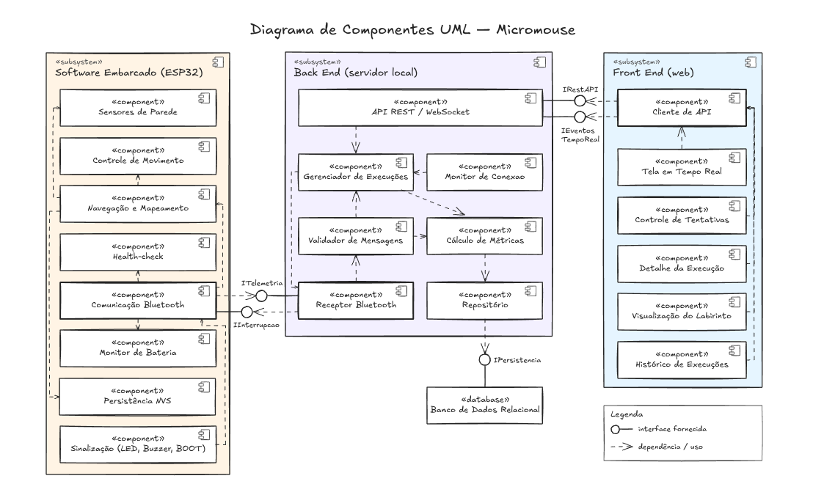

# Projeto Conceitual de Software

- [Explicações adicionais](https://drive.google.com/file/d/1WWIz6609c7Y7zAQRBWHSbX0t2vEJ2z1A/view?usp=sharing)
- [Noções de UML](https://drive.google.com/file/d/1l1yt2ittHuRKIXVXYT76P1HriR07pK-t/view?usp=sharing)

A documentação do _software_ deverá conter, no mínimo, os itens a seguir:

- **Diagrama BPMN para entender o software proposto:** deve deixar claro os principais atores do sistema, suas atividades (de negócios), insumos e resultados.
- **Backlog funcional do software:**
  - Escrito no formato de histórias de usuário ou casos de uso (decisão da equipe);
  - Ao declarar o backlog de requisitos funcionais, usar a classificação de MoSCoW (Must have, Should have e Could have), para um melhor entendimento do próprio backlog.
- **Backlog não-funcional do software:**
  - Descrever os requisitos não-funcionais de forma objetiva;
  - Mais facilmente, mais rapidamente, são descrições subjetivas não-válidas. Um exemplo de requisito não-funcional de desempenho: "a página deve carregar em até 5s quando em conexão 4G". 
- **Diagrama de casos de uso**, contendo os atores do sistema, os requisitos com os quais eles interagem e os tipos de relacionamentos entre requisitos realizados por um mesmo ator (ex.: include, extend). Obs.: este é um diagrama sobre requisitos funcionais.
- **Descrição da arquitetura da solução de software proposta:**
  - Propósito do software (qual o seu papel no sistema);
  - Estilo arquitetural contendo:
    - Padrão adotado: MVC, MVP, Microsserviços, Monolítico, etc (Justificar);
    - Linguagens de programação: Java, Python, C\#, JavaScript, etc.
    - Frameworks e bibliotecas: Spring Boot, .NET Core, React, Angular, Django, etc.
    - Banco de dados: Relacional (PostgreSQL, MySQL, etc) X NãoSQL (MongoDB,etc). 
  - Diagrama de alto nível: representação esquemática dos componentes da arquitetura, suas responsabilidades e comunicações, esclarecendo a composição do front-end e do back-end.
- **Persistência de dados:** diagrama de entidade relacionamento do banco de dados usado na solução proposta.
- **Análise de dados:** as variáveis definidas nos requisitos do projeto em abordagem numérica e gráfica.
- **Diagrama de estados** esclarecendo os estados assumidos pelo software e os eventos que causam as mudanças de estado do software.
- **Protótipo funcional do software, navegável**.

## Diagrama de Componentes

O diagrama de componentes representa a arquitetura de alto nível da solução de software do Micromouse, segundo a notação UML 2. Ele mostra como o sistema se divide em três subsistemas — **Software Embarcado**, **Back End** e **Front End** —, quais componentes compõem cada um, que responsabilidade cada componente tem e por quais interfaces eles se comunicam. A divisão em subsistemas segue a EAP de Software (4.2.1 Front End, 4.2.2 Back End e 4.2.3 Software Embarcado), o que permite rastrear cada componente até as histórias de usuário do backlog.

Figura 1: Diagrama de componentes da solução de software

Fonte: Autoria própria, 2026. <a href="https://excalidraw.com/#room=d95802af8c4f8f64d5c3,0oBJ6b5SgHZaEy919NR_0g">Abrir o diagrama no Excalidraw</a>.

### Notação utilizada

| Elemento | Representação | Significado |
|---|---|---|
| Subsistema | Retângulo com o estereótipo `«subsystem»` | Agrupa os componentes de uma mesma parte do sistema (embarcado, back end ou front end). |
| Componente | Retângulo com o estereótipo `«component»` e o ícone de componente | Unidade de software com responsabilidade bem definida e substituível. |
| Banco de dados | Retângulo com o estereótipo `«database»` | Componente responsável pelo armazenamento persistente. |
| Interface fornecida | Círculo ligado ao componente por uma linha contínua ("pirulito") | Serviço que o componente oferece aos demais. |
| Dependência / interface requerida | Seta tracejada | O componente de origem usa o componente ou a interface de destino. |

Fonte: Autoria própria, 2026.

### Componentes

#### Software Embarcado (ESP32)

| Componente | Responsabilidade | Histórias |
|---|---|---|
| Sensores de Parede | Detecta a presença de paredes à frente, à esquerda e à direita em cada célula. | US32 |
| Controle de Movimento | Executa avanço de uma célula, giros de 90° e 180° e parada, e estima a velocidade. | US33, US34 |
| Navegação e Mapeamento | Mantém a posição atual, a sequência de células visitadas e o mapa de paredes; deduz o tipo de labirinto e detecta a chegada ao objetivo. | US38, US39, US40 |
| Health-check | Verifica comunicação, bateria e mobilidade das rodas antes de liberar a tentativa. | US41 |
| Monitor de Bateria | Lê o nível e o consumo de bateria. | US35 |
| Comunicação Bluetooth | Monta e transmite a telemetria ao back end e recebe o comando de interrupção. | US36 |
| Persistência NVS | Grava mapa, posição, estado da execução e labirintos resolvidos na memória flash, permitindo retomar após reinicialização. | US43 |
| Sinalização (LED, Buzzer, BOOT) | Sinaliza início, erro e conclusão e trata o botão BOOT como parada de emergência e limpeza de memória. | US37, US42 |

Fonte: Autoria própria, 2026.

#### Back End

| Componente | Responsabilidade | Histórias |
|---|---|---|
| Receptor Bluetooth | Recebe as mensagens de telemetria do robô e envia o comando de interrupção no encerramento manual. | US10, US22 |
| Validador de Mensagens | Verifica formato, campos obrigatórios e limites de célula; descarta mensagens inválidas sem interromper o serviço. | RNF-B09 |
| Gerenciador de Execuções | Controla o ciclo de vida da execução lógica e das tentativas (abertura, status, limite de 3 tentativas, retomada, encerramento) e associa cada mensagem à tentativa aberta. | US12, US18–US22, US30, US31 |
| Monitor de Link | Acompanha o tempo desde a última mensagem e o tempo total da tentativa, sinalizando perda de comunicação e estouro dos 10 minutos. | US23, US24 |
| Cálculo de Métricas | Calcula consumo de bateria, velocidade média, tempo total e variação em relação ao melhor tempo do labirinto. | US13–US16 |
| Repositório | Centraliza a gravação e a consulta dos dados de execuções, tentativas, trajeto e paredes. | US11, US25–US29 |
| API REST / SSE | Expõe os dados e as ações ao front end: consultas e comandos por REST e envio da telemetria em tempo real por SSE. | US08, US09 |
| Banco de Dados Relacional | Armazena os dados de forma persistente, mantendo-os após a reinicialização do servidor. | RNF-B05 |

Fonte: Autoria própria, 2026.

#### Front End

| Componente | Responsabilidade | Histórias |
|---|---|---|
| Cliente de API | Único ponto de comunicação do front end com o back end: faz as requisições REST e mantém a conexão SSE. | — |
| Tela em Tempo Real | Exibe a telemetria da tentativa em andamento e o tempo desde a última atualização. | US01, US04 |
| Controle de Tentativas | Mostra o contador de tentativas e as ações Encerrar execução, Retomar execução (*n*/3) e Nova tentativa (*n*/3). | US07, US22 |
| Detalhe da Execução | Apresenta os dados finais de uma execução e o bloco separado do health-check. | US02, US05 |
| Visualização do Labirinto | Desenha o trajeto célula a célula e destaca a célula da falha. | US06 |
| Histórico de Execuções | Lista todas as execuções e permite filtrar por labirinto. | US03, US26, US27 |

Fonte: Autoria própria, 2026.

### Interfaces

Tabela X: Interfaces entre componentes

| Interface | Fornecida por | Requerida por | Meio | Finalidade |
|---|---|---|---|---|
| `ITelemetria` | Receptor Bluetooth | Comunicação Bluetooth (robô) | Bluetooth (uplink) | Envio da telemetria: célula atual, bateria, velocidade, status e timestamp. |
| `IInterrupcao` | Comunicação Bluetooth (robô) | Receptor Bluetooth | Bluetooth (downlink) | Único comando permitido do back end para o robô: interromper a tentativa no encerramento manual (RNF-B06). |
| `IRestAPI` | API REST / SSE | Cliente de API | HTTP (REST) | Consultas de execuções e histórico e comandos do operador (encerrar, retomar, nova tentativa). |
| `IEventosTempoReal` | API REST / SSE | Cliente de API | HTTP (Server-Sent Events) | Envio contínuo da telemetria da tentativa em andamento, do servidor para a interface. |
| `ISQL` | Banco de Dados Relacional | Repositório | SQL | Gravação e consulta dos dados persistidos. |

Fonte: Autoria própria, 2026.

### Conexões e fluxos principais

**1. Telemetria em tempo real (robô → tela).** No robô, a Comunicação Bluetooth reúne os dados da Navegação e Mapeamento, do Health-check e do Monitor de Bateria e os envia pela interface `ITelemetria`. No back end, o Receptor Bluetooth repassa cada mensagem ao Validador de Mensagens, que descarta as inválidas. As mensagens válidas seguem para o Gerenciador de Execuções, que as associa à tentativa aberta e aciona o Cálculo de Métricas. Métricas e dados da tentativa são gravados pelo Repositório no banco por meio de `ISQL`. A API envia a atualização ao front end pela interface `IEventosTempoReal`, e o Cliente de API a distribui à Tela em Tempo Real e ao Controle de Tentativas. Esse caminho atende aos limites de 2 s (RNF-B02) e 3 s fim a fim (RNF-B04).

**2. Consulta de histórico.** O Histórico de Execuções, o Detalhe da Execução e a Visualização do Labirinto pedem os dados ao Cliente de API, que usa `IRestAPI`. A API consulta o Gerenciador de Execuções, que obtém os registros no Repositório.

**3. Encerramento manual.** O operador aciona Encerrar execução no Controle de Tentativas. O comando chega à API por `IRestAPI`, e o Gerenciador de Execuções marca a tentativa como `failed` e usa o Receptor Bluetooth para enviar o comando pela interface `IInterrupcao` ao robô. Essa é a única comunicação do back end para o robô, conforme o RNF-B06.

**4. Encerramento automático.** O Monitor de Link avisa o Gerenciador de Execuções quando a telemetria para de chegar além do intervalo configurado ou quando a tentativa passa de 10 minutos. O Gerenciador encerra a tentativa e cancela a execução lógica sem enviar nenhum comando ao robô (UC21).

**5. Dependências internas do robô.** A Navegação e Mapeamento usa os Sensores de Parede e o Controle de Movimento para se deslocar e registra o mapa na Persistência NVS. A Sinalização usa a Comunicação Bluetooth para informar o encerramento pelo botão BOOT. Como os módulos de navegação não dependem do back end, uma falha no servidor ou na rede não interrompe a corrida (RNF-B07).

### Histórico de versões

Tabela 2: Evolução do diagrama de componentes (figura e documentação da seção)

| Versão | Data | Autor(es) | Descrição | Commit |
|:------:|:----:|-----------|-----------|:------:|
| 1.0 | 2026-09-27 | AmandaaMoura; Karoline Luz da Conceição | Publicação da figura UML em `docs/figs/diagrama-de-componentes.png`. | [b57d8db](https://github.com/fcte-pi1/2026_2_PI1_Grupo01_Juliana/commit/b57d8db) |
| 1.1 | 2026-09-27 | AmandaaMoura; Karoline Luz da Conceição | Documentação da seção: introdução, notação, tabelas de componentes, interfaces, fluxos principais e link do Excalidraw na legenda da figura. | [754b520](https://github.com/fcte-pi1/2026_2_PI1_Grupo01_Juliana/commit/754b520) |
| 1.2 | 2026-09-27 | AmandaaMoura | Histórico de versões da seção, vinculado aos commits acima. | — |

Fonte: Autoria própria, 2026.

