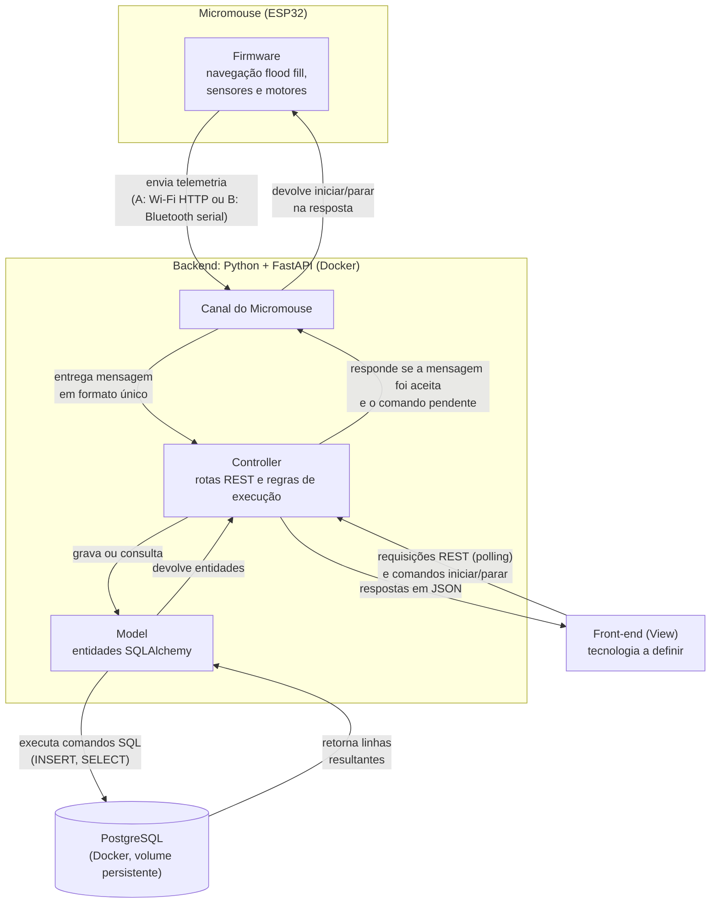

# Projeto Conceitual de Software

- [Explicações adicionais](https://drive.google.com/file/d/1WWIz6609c7Y7zAQRBWHSbX0t2vEJ2z1A/view?usp=sharing)
- [Noções de UML](https://drive.google.com/file/d/1l1yt2ittHuRKIXVXYT76P1HriR07pK-t/view?usp=sharing)


A documentação do _software_ deverá conter, no mínimo, os itens a seguir:

- **Diagrama BPMN para entender o software proposto:** deve deixar claro os principais atores do sistema, suas atividades (de negócios), insumos e resultados.
- **Backlog funcional do software:**
  - Escrito no formato de histórias de usuário ou casos de uso (decisão da equipe);
  - Ao declarar o backlog de requisitos funcionais, usar a classificação de MoSCoW (Must have, Should have e Could have), para um melhor entendimento do próprio backlog.
- **Backlog não-funcional do software:**
  - Descrever os requisitos não-funcionais de forma objetiva;
  - Mais facilmente, mais rapidamente, são descrições subjetivas não-válidas. Um exemplo de requisito não-funcional de desempenho: "a página deve carregar em até 5s quando em conexão 4G". 
- **Diagrama de casos de uso**, contendo os atores do sistema, os requisitos com os quais eles interagem e os tipos de relacionamentos entre requisitos realizados por um mesmo ator (ex.: include, extend). Obs.: este é um diagrama sobre requisitos funcionais.
- **Descrição da arquitetura da solução de software proposta:**
  - Propósito do software (qual o seu papel no sistema);
  - Estilo arquitetural contendo:
    - Padrão adotado: MVC, MVP, Microsserviços, Monolítico, etc (Justificar);
    - Linguagens de programação: Java, Python, C\#, JavaScript, etc.
    - Frameworks e bibliotecas: Spring Boot, .NET Core, React, Angular, Django, etc.
    - Banco de dados: Relacional (PostgreSQL, MySQL, etc) X NãoSQL (MongoDB,etc). 
  - Diagrama de alto nível: representação esquemática dos componentes da arquitetura, suas responsabilidades e comunicações, esclarecendo a composição do front-end e do back-end.
- **Persistência de dados:** diagrama de entidade relacionamento do banco de dados usado na solução proposta.
- **Análise de dados:** as variáveis definidas nos requisitos do projeto em abordagem numérica e gráfica.
- **Diagrama de estados** esclarecendo os estados assumidos pelo software e os eventos que causam as mudanças de estado do software.
- **Protótipo funcional do software, navegável**.

## Arquitetura da solução de software

### Propósito do software

O software do projeto tem dois papéis complementares dentro do sistema do Micromouse:

1. **Firmware embarcado (ESP32):** lê os sensores de parede à frente, à esquerda e à direita de cada célula, controla os motores de passo nos deslocamentos e nos giros de 90° e 180° e executa a navegação autônoma com o algoritmo **flood fill (método Adachi)**. O robô não recebe nenhuma informação prévia sobre o labirinto: sabe apenas que a área de objetivo fica no canto diametralmente oposto ao de partida. Para isso, o firmware:
    - mantém um mapa das paredes conhecidas em cada célula e recalcula as distâncias até o objetivo sempre que descobre uma parede nova;
    - deduz o tipo do labirinto (4x4, 8x4 ou 12x4) pela extensão das células visitadas e, a partir dele, escolhe a célula de objetivo candidata (RF27);
    - só declara a chegada depois de confirmar que as bordas daquele tamanho estão fechadas (RF26);
    - grava o mapa, a posição e o estado da execução na memória flash, para retomar de onde parou após uma falha de componente (RF38, RF42);
    - executa toda a exploração dentro do limite de 10 minutos por execução;
    - envia a telemetria (posição, trajeto e bateria) em uma tarefa separada, no outro núcleo da ESP32, sem interferir no laço de navegação.
2. **Sistema de Telemetria (web):** é a plataforma de acompanhamento usada pela equipe e pela banca. Recebe e valida as mensagens enviadas pelo Micromouse, registra cada execução (trajeto, bateria, velocidade, tempo, status, retomadas e falhas), mantém o histórico e disponibiliza esses dados para visualização, durante e após a execução.

O Sistema de Telemetria envia ao robô **apenas os comandos de iniciar e parar** a execução: nunca comandos de navegação, e nunca altera a memória do robô sobre o labirinto (RNF06). Uma falha no servidor ou na rede não interrompe a execução, que continua de forma autônoma (RNF07). Esta seção detalha principalmente a arquitetura do Sistema de Telemetria; o firmware aparece nos pontos em que se comunica com ele.

### Padrão arquitetural: MVC com a View desacoplada

O Sistema de Telemetria adota o padrão **MVC (Model-View-Controller)** em um **backend monolítico**, com a camada de visualização **desacoplada** e comunicando-se com o backend por uma API REST em JSON.

| Camada | Responsabilidade no sistema | Onde fica |
| :--- | :--- | :--- |
| **Model** | Representa as entidades do domínio (Execução, trajeto, retomadas, tentativas rejeitadas) e sua persistência, garantindo a integridade dos dados (RF17, RNF01, RNF05). | Backend: modelos SQLAlchemy sobre o PostgreSQL |
| **Controller** | Recebe a telemetria e as requisições do front-end, valida as mensagens (RNF09) e aplica as regras de execução: uma execução por vez (RF18), tentativa rejeitada (RF19), chegada à área de objetivo (RF26), perda de comunicação (RF31), tempo limite (RF32) e retomada (RF38). Também registra os comandos de iniciar e parar pedidos pelo operador (RF39). Devolve os dados em JSON. | Backend: rotas do FastAPI |
| **View** | Apresenta a execução em tempo real, o histórico e os detalhes de cada execução ao usuário, consumindo a API do backend. | Front-end: aplicação própria, com tecnologia a definir pela equipe de front-end |

**Justificativa da escolha:**

- **Domínio pequeno e bem delimitado.** O sistema recebe mensagens de um único robô, processa no máximo cerca de 10 mensagens por segundo (RNF11) e atende poucos usuários ao mesmo tempo. Um único backend organizado em MVC resolve esse volume sem a complexidade operacional de vários serviços.
- **Microsserviços foram descartados** porque exigiriam comunicação entre serviços, implantação de várias peças e observabilidade distribuída, um custo que não se justifica para o tamanho do problema e para o prazo da disciplina.
- **Separação clara de responsabilidades.** As regras de execução ficam concentradas no Controller, e o Model isola o acesso ao banco. Isso facilita dividir o trabalho entre os membros e testar as regras de forma independente da interface.

### Linguagens de programação, frameworks e bibliotecas

| Parte | Linguagem | Frameworks e bibliotecas | Papel |
| :--- | :--- | :--- | :--- |
| Backend | Python | **FastAPI** | Define as rotas da API REST (Controller) e gera automaticamente a documentação OpenAPI dos endpoints, atendendo ao RNF13. |
| Backend | Python | **Pydantic** | Valida o formato, os campos obrigatórios e as faixas das mensagens de telemetria antes de qualquer processamento (RNF09). |
| Backend | Python | **SQLAlchemy** | ORM que implementa a camada Model e faz o mapeamento das entidades para as tabelas do PostgreSQL. |
| Backend | Python | **Uvicorn** | Servidor ASGI que executa a aplicação FastAPI. |
| Front-end | A definir | A definir pela equipe de front-end | Implementa a View, consumindo a API REST. |
| Firmware | C | A definir pela equipe de firmware | Navegação com flood fill, leitura dos sensores, controle dos motores e envio de telemetria na ESP32. |

**Por que Python com FastAPI:**

- Python tem sintaxe simples e um ecossistema amplo e bem documentado, o que reduz a curva de aprendizado em um projeto de prazo curto.
- A documentação interativa dos endpoints é gerada a partir do próprio código, o que mantém a documentação da API sempre atualizada (RNF13).
- O suporte nativo a operações assíncronas permite receber telemetria e atender às consultas do front-end ao mesmo tempo, sem atraso acumulado (RNF11).
- Todo o backend é desenvolvido pela equipe, sem plataformas prontas de telemetria ou dashboard (RNF12).

**Por que usar o Pydantic:**

Toda mensagem de telemetria precisa ser conferida antes de ser gravada: se os campos obrigatórios existem, se têm o tipo certo e se os valores fazem sentido (RNF09). Sem o Pydantic, essa conferência teria que ser escrita à mão, campo por campo, em cada rota:

```python
# Sem Pydantic: cada campo é verificado manualmente
def receber_telemetria(mensagem: dict):
    if "celula" not in mensagem or not isinstance(mensagem["celula"], str):
        raise ErroDeValidacao("campo 'celula' ausente ou inválido")
    if "bateria" not in mensagem or not isinstance(mensagem["bateria"], (int, float)):
        raise ErroDeValidacao("campo 'bateria' ausente ou inválido")
    if mensagem["bateria"] < 0:
        raise ErroDeValidacao("campo 'bateria' fora da faixa")
    if mensagem.get("status") not in ("health-check", "running", "success", "failed"):
        raise ErroDeValidacao("campo 'status' inválido")
    # ... e ainda converter o texto do horário de envio para data e hora
```

Com o Pydantic, o formato da mensagem é declarado uma única vez, como uma classe:

```python
# Com Pydantic: as regras ficam declaradas em um só lugar
class Telemetria(BaseModel):
    celula: str
    bateria: float = Field(ge=0)
    status: Literal["health-check", "running", "success", "failed"]
    enviado_em: datetime
```

O exemplo é ilustrativo; o formato final das mensagens será definido no diagrama de componentes. Usar o Pydantic é mais simples e mais seguro do que não usá-lo porque:

- **Menos código repetido:** a regra de cada campo aparece uma vez, na classe, em vez de se repetir em cada rota que recebe ou devolve dados.
- **Validação automática:** o FastAPI aplica a classe na entrada da rota. Uma mensagem inválida é recusada antes de chegar à lógica da execução, com uma resposta que indica qual campo falhou, e o serviço continua funcionando (RNF09).
- **Conversão de tipos:** valores como o horário de envio chegam como texto e são convertidos automaticamente para data e hora, sem código extra.
- **Documentação gerada a partir do código:** a mesma classe aparece na documentação automática da API, então o formato documentado é sempre o formato validado (RNF13).
- **Menos chance de erro:** esquecer uma verificação manual em uma rota deixaria passar dados inválidos para o banco; com a classe, todas as rotas usam as mesmas regras.

### Banco de dados: relacional com PostgreSQL

O sistema usa um banco de dados **relacional**, o **PostgreSQL**.

**Por que relacional:**

- Os dados têm estrutura fixa e relações claras: cada execução pertence a um labirinto e possui um trajeto (sequência de células), eventos de retomada e, quando falha, um motivo. Esse formato se representa naturalmente em tabelas relacionadas, que serão detalhadas no diagrama entidade-relacionamento.
- As consultas previstas são típicas de banco relacional: filtrar execuções por labirinto (RF34), listar todas em ordem cronológica (RF03, RF35) e comparar tempos entre execuções (RF14).
- Chaves primárias, chaves estrangeiras e transações garantem a unicidade de cada execução (RF17) e impedem registros incompletos ou inconsistentes (RNF01).
- Um banco não relacional (como o MongoDB) seria vantajoso para dados sem esquema definido, o que não é o caso: a telemetria tem campos conhecidos e validados na entrada.

**Por que PostgreSQL:**

- Suporta com folga a escrita contínua da telemetria ao mesmo tempo que o front-end consulta a execução em andamento a cada 1 a 2 segundos.
- Oferece restrições de integridade (`UNIQUE`, `CHECK`, chaves estrangeiras) que reforçam no próprio banco as regras do domínio.
- Tem imagem oficial para Docker e integração madura com o SQLAlchemy.
- Os dados ficam em um volume persistente, preservados após reiniciar o servidor ou o computador (RNF05).

### Ambiente de execução

O backend e o banco são executados com **Docker Compose** no notebook da equipe, com dois serviços:

| Serviço | Conteúdo | Observação |
| :--- | :--- | :--- |
| `api` | Aplicação FastAPI executada pelo Uvicorn | Expõe a API REST para o Micromouse e para o front-end. |
| `db` | PostgreSQL | Usa um volume nomeado para persistir os dados (RNF05). |

Todo o sistema sobe com um único comando (`docker compose up`), da mesma forma em qualquer máquina da equipe, o que evita diferenças de ambiente entre os membros. O sistema funciona inteiramente em **rede local**, sem depender de acesso à internet (RNF10).

### Comunicação entre as partes

#### Entre o Micromouse e o Sistema de Telemetria

O Micromouse envia telemetria e o sistema devolve, na resposta de cada mensagem, apenas os comandos de iniciar ou parar a execução, quando houver algum pendente (RNF06, RF39). Para que a escolha do meio de transmissão não afete o restante da arquitetura, o backend possui um componente **Canal do Micromouse**. Ele recebe as mensagens por qualquer transporte, entrega-as ao Controller em um formato único e devolve ao robô a resposta com o comando pendente. O Controller, o Model, o banco e o front-end são os mesmos em qualquer caso.

A ESP32 oferece Wi-Fi e Bluetooth integrados, e as duas opções foram avaliadas:

| Critério | Opção A: Wi-Fi (HTTP) | Opção B: Bluetooth (serial) |
| :--- | :--- | :--- |
| Canal do Micromouse | Um endpoint do próprio FastAPI, cujo retorno leva o comando pendente. Não há componente extra. | Um processo "ponte" no notebook, que lê a porta serial Bluetooth, separa as mensagens, trata reconexões (RNF08), repassa à API e escreve de volta na porta serial o comando pendente. |
| Infraestrutura de rede | Rede local própria, sem internet: a própria ESP32 cria a rede (modo ponto de acesso) ou o notebook ou um celular cria um hotspot. Não depende da rede da universidade. | Conexão ponto a ponto com o notebook, sem rede nem endereço IP. |
| Dependência do sistema operacional | Nenhuma: qualquer máquina na rede recebe. | Pareamento e porta serial diferentes em cada sistema (`/dev/rfcomm0` no Linux, `COMx` no Windows). O WSL2 não acessa o adaptador Bluetooth. |
| Testes sem o robô | Simples: basta um script ou `curl` imitando o Micromouse. | Exige simular uma porta serial. |
| Ambiente com muitas redes de 2,4 GHz | Mais sujeito a congestionamento, pois opera em canal fixo. | Mais robusto, pois alterna de frequência continuamente. |
| Restrições de hardware | Com o Wi-Fi ativo, os pinos do ADC2 da ESP32 ficam indisponíveis; a leitura da bateria deve usar o ADC1. | Sem restrição relevante. |

**Consumo de energia não é critério de desempate.** Segundo o datasheet da ESP32 (Tabela 15), a transmissão consome cerca de 130 mA em Bluetooth (0 dBm) e de 180 a 240 mA em Wi-Fi (+14 a +19,5 dBm), enquanto a recepção consome de 95 a 100 mA nos dois casos [[1]](#ref-arq-1). Em três execuções de 10 minutos, essa diferença representa algumas dezenas de mAh, pouco perto do consumo dos motores de passo, que dominam o dimensionamento da bateria.

**Decisão:** a arquitetura é desenhada com o Canal do Micromouse abstrato. A **Opção A (Wi-Fi com rede local própria)** é a preferida, por ter o menor custo de integração no software. A **Opção B (Bluetooth)** fica documentada como alternativa, caso o congestionamento de 2,4 GHz se mostre um problema nos testes. A escolha final depende do alinhamento com as equipes de eletrônica e firmware.

**Como os comandos chegam ao robô.** O comando viaja na resposta da telemetria, e não em uma conexão própria, para que a ESP32 não precise manter um servidor escutando nem que o backend conheça o endereço do robô:

1. Com o robô parado, esperando o início, o firmware envia um health-check a cada 1 segundo. O backend abre a execução no primeiro deles.
2. O operador clica em **iniciar** na interface. O Controller guarda o comando, e a resposta ao health-check seguinte o entrega ao robô, que passa para "running".
3. Durante a corrida, o robô envia apenas a telemetria normal. Se o operador clicar em **parar**, o comando segue na resposta da mensagem seguinte; o robô para e envia "failed" com motivo encerrado_operador.
4. Se o robô não confirmar o comando em até 3 segundos, a interface mostra "parada não confirmada" (RF40). Nesse caso, e sempre que a rede cair, a parada é feita pelo botão BOOT do robô (RF41).

No firmware, o envio da telemetria roda em uma tarefa do FreeRTOS no outro núcleo da ESP32. O laço de navegação apenas consulta uma sinalização de "parar", sem nunca esperar pela rede. Assim, uma queda de comunicação não atrasa nem interrompe a corrida (RNF07).

#### Entre o front-end e o backend

O front-end consome a API REST do backend em JSON. Para o acompanhamento em tempo real, ele usa **polling**: consulta a execução em andamento a cada 1 a 2 segundos e exibe o tempo desde a última atualização (RF04). Esse intervalo atende aos limites de 2 segundos para exibir novos dados (RNF02) e de 3 a 5 segundos de atualização durante a execução (RNF04). O polling foi escolhido por ser o mecanismo mais simples de implementar em qualquer tecnologia de front-end. O uso de WebSocket, em que o backend empurra os dados ao front-end, fica como evolução futura.

### Diagrama de alto nível

O diagrama a seguir mostra os blocos da solução, suas responsabilidades e como se comunicam. Os componentes internos do backend e o formato das mensagens são detalhados no diagrama de componentes.



<font size="2"><p style="text-align: center">Fonte: [Wanjo Christopher Paraizo Escobar](https://github.com/wChrstphr), 2026.</p></font>

**Como os dados circulam em uma consulta.** Quando o front-end pede os dados da execução em andamento, a requisição chega ao Controller, que pede ao Model as informações necessárias. O Model não guarda os dados em memória: ele monta a consulta SQL, envia ao PostgreSQL e recebe de volta as linhas resultantes, que converte em entidades (execução, trajeto, retomadas). O Controller usa essas entidades para montar a resposta em JSON e devolve ao front-end, que atualiza a tela. Na gravação da telemetria o caminho é o mesmo, mas o Model envia um comando de inserção e o banco confirma o registro.

| Bloco | Responsabilidade |
| :--- | :--- |
| Firmware | Navega de forma autônoma pelo labirinto com o flood fill e envia a telemetria. Do sistema web, recebe apenas os comandos de iniciar e parar, nunca comandos de navegação (RNF06). |
| Canal do Micromouse | Recebe as mensagens do Micromouse, independentemente do transporte, entrega-as ao Controller e devolve ao robô o comando pendente. |
| Controller | Valida as mensagens, aplica as regras de execução (início, retomada, tentativa rejeitada, chegada ao objetivo, tempo limite), guarda os comandos de iniciar e parar e atende às consultas do front-end. |
| Model | Representa as entidades do domínio e faz a persistência no banco. |
| PostgreSQL | Armazena execuções, trajetos, retomadas e tentativas rejeitadas de forma persistente. |
| Front-end | Exibe a execução em tempo real, o histórico e os detalhes de cada execução, e oferece ao operador os botões de iniciar e parar. |

### Algoritmo de navegação

#### Restrições do problema

- O robô **não recebe nenhuma informação prévia** sobre o labirinto: nem o formato das paredes, nem o tamanho. Sabe apenas que parte de um beco sem saída em um canto e que a área de objetivo fica no **canto diametralmente oposto**.
- Os labirintos possíveis são 4x4, 8x4 e 12x4, com células de 18 cm, e cada execução tem limite de 10 minutos.
- Basta chegar ao objetivo uma vez por execução; não há corrida de volta nem corrida rápida posterior.
- Os sensores enxergam apenas as paredes da célula atual (frente, esquerda e direita), e os giros de 90° e 180° dos motores de passo custam tempo.

#### Estado da arte

| Algoritmo | Como funciona | Vantagens | Desvantagens | Fontes |
| :--- | :--- | :--- | :--- | :--- |
| Busca em profundidade (DFS) | Segue um caminho até não haver saída e então volta pela pilha até a última bifurcação com opção não explorada. | Não precisa saber onde fica o objetivo; implementação simples. | Não garante o menor caminho e perde tempo explorando o labirinto inteiro; o retrocesso gera muitos giros de 180°. | [[7, p. 24, 28]](#ref-arq-7) |
| Flood fill | Atribui a cada célula a distância até o objetivo e move o robô sempre para a vizinha de menor distância. | Direciona a busca ao objetivo; o mesmo mapa de distâncias serve para explorar e para seguir o caminho. | Precisa conhecer a posição do objetivo para numerar as células. | [[6, p. 503]](#ref-arq-6), [[9]](#ref-arq-9) |
| Flood fill modificado | Igual ao flood fill, mas recalcula apenas as células afetadas pela parede nova. | Percorre as mesmas células que o flood fill com muito menos atualizações de distância. | Implementação mais complexa; o ganho só aparece em labirintos grandes. | [[6, p. 503, 506]](#ref-arq-6), [[7, p. 29]](#ref-arq-7) |
| A\* | Busca guiada por uma estimativa da distância restante até o objetivo. | Encontra o menor caminho. | Usa mais memória, pois guarda toda a lista aberta; em um labirinto 5x5 não se diferenciou do flood fill. | [[8, p. 366, 368, 372]](#ref-arq-8) |

Segundo Law, o flood fill venceu primeiros lugares em competições internacionais de micromouse, e sua versão modificada é a mais usada nelas [[6, p. 503]](#ref-arq-6). Nos cinco labirintos de competição testados pelo autor, as duas versões percorreram exatamente o mesmo número de células; a diferença esteve só no esforço de cálculo, por exemplo 135.936 contra 3.197 atualizações de distância no labirinto da IEEE Region 6 de 2012 [[6, p. 506, Tabela I]](#ref-arq-6). Sharma e Munshi chegam à mesma recomendação para competições [[7, p. 29]](#ref-arq-7).

#### O método Adachi

O método Adachi (足立法) foi criado por Yoshihiko Adachi quando ele era estudante e membro do Fukuyama Microcomputer Club, e foi apresentado em 1984 [[10, seção 4-5]](#ref-arq-10), [[11]](#ref-arq-11). Até então, a abordagem comum era **percorrer o labirinto inteiro primeiro e só depois calcular o caminho mínimo** [[10, seção 4-5]](#ref-arq-10). A ideia do método, como descrita pela JSDKK, é:

1. Olhar para o labirinto como um **mapa em branco até o objetivo** e imaginar o caminho mais curto até ele.
2. Seguir esse caminho. Ao encontrar uma parede, **levá-la em conta, junto com as paredes já vistas, e recalcular** o caminho mais curto.
3. Repetir até chegar.

Em outras palavras, o método **trata toda parede desconhecida como inexistente** (未知の壁を無いものとして考える). É o mesmo raciocínio de uma pessoa perdida que sabe onde fica a saída: ela supõe o caminho mais curto, vai conferir e, se estiver bloqueado, pensa de novo [[10, seção 4-5]](#ref-arq-10). A mesma fonte afirma que os métodos de busca predominantes hoje são evoluções do método Adachi e que quase todos os mouses de nível mais alto o utilizam [[10, seção 4-5]](#ref-arq-10).

**Como o "caminho mais curto" é calculado: o flood fill.** Harrison descreve o flood fill (ou algoritmo de Bellman) como o método mais simples disponível a um micromouse [[9]](#ref-arq-9):

1. Guardar um valor por célula do labirinto.
2. Colocar o valor 0 na célula de objetivo.
3. Percorrer todas as células e garantir que cada uma tenha um valor igual a 1 a mais que o da sua vizinha acessível de menor valor.
4. Repetir o passo 3 até que os valores parem de mudar.

Depois disso, cada célula guarda sua distância até o objetivo, e basta o robô "descer" os valores, indo sempre para a vizinha de valor menor. O cálculo só precisa ser refeito quando uma decisão é necessária, isto é, em uma bifurcação, e pode ser distribuído em pequenos pedaços enquanto o robô se move [[9]](#ref-arq-9). Combinado com a hipótese de Adachi, as células ainda não visitadas entram no cálculo como se não tivessem paredes, então todo o labirinto tem distância definida desde o início.

**As quatro variantes de Adachi.** Harrison reconstruiu, a partir de anotações em japonês, os quatro métodos que Adachi apresentou para a fase de busca [[11]](#ref-arq-11):

| Variante | Comportamento | Observação |
| :--- | :--- | :--- |
| Método 0 | Vai e volta entre a largada e o objetivo, sempre pelo melhor caminho a partir de onde está, até que o melhor caminho entre os dois não passe por nenhuma célula inexplorada. | Pode desperdiçar tempo e corridas, pois precisa tocar a largada e o objetivo em cada passagem. |
| Método 1 | Procura as células inexploradas que estão no melhor caminho calculado entre a largada e o objetivo, calculando duas rotas a cada decisão. | O caminho ótimo pode mudar durante a exploração e fazer o robô trocar de alvo. |
| Método 2 | Alterna entre a largada e o objetivo, mas inverte o sentido assim que o caminho até o alvo atual já é ótimo, sem precisar tocá-lo. | Corrige o principal defeito do método 0. |
| Método 3 | Usa o método 0 para encontrar o objetivo pela primeira vez e depois passa para o método 1. | É uma otimização do método 1 com uma busca inicial mais rápida. |

Todas as variantes compartilham o núcleo descrito pela JSDKK; elas diferem no que fazer **depois** de chegar ao objetivo, quando o robô procura o caminho mínimo para as corridas rápidas. Como neste projeto basta chegar ao objetivo uma vez, o que interessa é esse núcleo, que corresponde à primeira ida do método 0 (e à fase inicial do método 3).

#### Decisão: flood fill com o método Adachi

O firmware usa o **flood fill com a hipótese de Adachi** (paredes desconhecidas tratadas como inexistentes e recálculo a cada parede nova), no lugar da DFS registrada anteriormente na EAP. Os motivos são:

- **É o que a literatura e as competições indicam.** O flood fill e suas variantes são os mais usados e premiados [[6, p. 503]](#ref-arq-6), [[10, seção 4-5]](#ref-arq-10). Nas fontes consultadas, a DFS aparece apenas como alternativa inferior, por não garantir o menor caminho e explorar o labirinto inteiro [[7, p. 24, 28]](#ref-arq-7).
- **Vai direto ao objetivo.** O robô não precisa varrer o labirinto, o que reduz tempo, giros de 180° e desgaste da bateria dentro do limite de 10 minutos.
- **Tolera erro no mapa.** Como o caminho é recalculado a cada parede descoberta, uma leitura diferente da esperada apenas muda as distâncias. Na DFS, uma parede lida errada corrompe a pilha de retrocesso.
- **Custo computacional desprezível.** Com no máximo 144 células no mapa (ver abaixo), recalcular todas as distâncias leva muito menos que o tempo de atravessar uma célula. Por isso, o flood fill simples é suficiente e mais fácil de depurar do que a versão modificada, cujo ganho só aparece em labirintos grandes [[6, p. 506]](#ref-arq-6).

#### Adaptação ao labirinto de tamanho desconhecido

Nas fontes consultadas, o flood fill é aplicado a labirintos de **tamanho e objetivo conhecidos**. Neste projeto, o tamanho só é descoberto durante a execução. As regras abaixo são **inferências da equipe** a partir dessa restrição, não resultados tirados da literatura.

**Referencial do robô.** A largada é a célula (0, 0). O eixo **y** aponta para a abertura do beco da largada e é sempre positivo. O eixo **x** é o lateral: na largada, o robô não sabe se o labirinto se estende para a direita ou para a esquerda, e o sinal de x é fixado na primeira abertura lateral que ele encontrar. Com o sinal fixado, x também passa a ser sempre positivo, e o mapa cabe em uma matriz de 12 × 12 células.

**Mapa na memória.** Cada célula guarda 4 bits de paredes (norte, sul, leste e oeste), um bit de "visitada" e a distância até o objetivo. O mapa, a posição, o estado da execução e os tipos de labirinto já resolvidos ficam gravados na flash (RF42).

**Tipo do labirinto e objetivo candidato.** O firmware acompanha a maior coordenada visitada em cada eixo (a extensão). Como os labirintos são sempre Nx4:

| Extensão observada | Tipo | Objetivo candidato |
| :--- | :--- | :--- |
| Nenhum eixo passou de 3 | 4x4 (provisório) | (3, 3) |
| Um eixo passou de 3, mas não de 7 | 8x4 | (7, 3) ou (3, 7), conforme o eixo longo |
| Um eixo passou de 7 | 12x4 | (11, 3) ou (3, 11) |

Enquanto o sinal de x não estiver fixado, os objetivos espelhados também entram no cálculo. O flood fill aceita vários objetivos ao mesmo tempo: basta colocar 0 em todas as células candidatas. Os tipos já resolvidos com sucesso em execuções anteriores são retirados dos candidatos (por exemplo, com o 4x4 resolvido, o robô começa com (7, 3) e (3, 7)).

**Prova de borda antes de declarar a chegada (RF26).** Paredes internas e externas são iguais, então chegar ao (3, 3) com parede à direita e acima não prova que o labirinto é 4x4. A regra usa um fato das regras do desafio: **o objetivo é sempre alcançável a partir da largada**. Se uma linha inteira de 4 paredes estiver fechada, nada além dela é alcançável e, portanto, ali termina o labirinto.

| Tipo | Linhas que precisam estar inteiramente fechadas |
| :--- | :--- |
| 4x4 | x = 3\|4 e y = 3\|4 |
| 8x4 | a linha 7\|8 do eixo longo (o eixo curto já tem 4 células por definição) |
| 12x4 | nenhuma, pois não existe labirinto maior |

Enquanto a borda não estiver provada, os segmentos ainda desconhecidos dessa linha viram alvos do flood fill, e o robô vai conferi-los. Se algum estiver aberto, o labirinto continua, o tipo avança e o objetivo candidato muda.

**Desempate por giros.** Quando duas vizinhas têm a mesma distância, o robô prefere seguir em frente, depois girar 90° e, por último, girar 180°. Um peso de giro no próprio cálculo das distâncias fica como melhoria a avaliar nos testes.

**Falha de componente e botão BOOT.** Após uma falha, o robô refaz o health-check em 5 segundos. Se passar, continua de onde parou, com o mapa preservado (RF38). Se não passar, o robô é recolhido, a equipe apaga o mapa com um toque curto no BOOT e o recoloca na largada, como uma execução nova; os tipos já resolvidos são preservados. O toque longo apaga também os tipos resolvidos (RF41).

**Pseudocódigo do laço de navegação:**

```text
ao iniciar:
    carregar mapa, posição, estado e tipos resolvidos da flash
    se estado == "running":  # retomada após falha de componente
        continuar da posição gravada
    senão:
        posição = (0, 0); mapa = vazio, exceto as paredes da largada

a cada célula alcançada:
    ler paredes (frente, esquerda, direita) e gravá-las no mapa e na vizinha
    se houver abertura lateral e o sinal de x não estiver fixado: fixar o sinal
    atualizar a extensão, o tipo e o conjunto de objetivos candidatos
    gravar mapa, posição e estado na flash
    se posição é um objetivo candidato:
        se a borda do tipo atual estiver provada:
            declarar sucesso, gravar o tipo como resolvido e parar
        senão:
            marcar os segmentos de borda desconhecidos como alvos
    recalcular o flood fill:
        alvos = 0; paredes desconhecidas = abertas
        repetir até nada mudar: valor(c) = 1 + menor valor entre as vizinhas acessíveis de c
    mover para a vizinha acessível de menor valor
        (empate: frente > giro de 90° > giro de 180°)
    se a flag "parar" estiver ativa: parar e enviar "failed" (encerrado_operador)
```

**O que depende dos testes (7.4).** O tempo por célula e por giro dos motores de passo, a confiabilidade da leitura de paredes (que determina a prova de borda) e a eventual adoção de um peso de giro no cálculo das distâncias.

#### Exemplo resolvido: labirinto 4x4

Para simplificar, o exemplo começa depois de o robô ter passado pela célula (0, 1) e visto ali uma abertura para a direita: isso fixa o sinal de x e elimina os objetivos espelhados. Nenhum eixo passou de 3, então o único objetivo candidato é (3, 3).

**1. Antes de descobrir paredes.** Com as paredes desconhecidas tratadas como abertas, a distância de cada célula é simplesmente o número de passos até (3, 3). A única parede conhecida é a da largada, que só tem saída para cima.

| y \ x | 0 | 1 | 2 | 3 |
| :-: | :-: | :-: | :-: | :-: |
| **3** | 3 | 2 | 1 | **0** |
| **2** | 4 | 3 | 2 | 1 |
| **1** | 5 | 4 | 3 | 2 |
| **0** | 6 (S) | 5 | 4 | 3 |

O robô desce os valores: (0, 0) = 6 → (0, 1) = 5 → (0, 2) = 4. Em (0, 2) há empate entre (0, 3) e (1, 2), ambas com valor 3; pelo desempate, ele segue em frente para (0, 3). Depois gira à direita e passa por (1, 3) = 2 até (2, 3) = 1.

**2. Parede descoberta.** Em (2, 3), o sensor da frente encontra uma parede entre (2, 3) e (3, 3). O flood fill é recalculado com essa parede:

| y \ x | 0 | 1 | 2 | 3 |
| :-: | :-: | :-: | :-: | :-: |
| **3** | 5 | 4 | **3** | **0** |
| **2** | 4 | 3 | 2 | 1 |
| **1** | 5 | 4 | 3 | 2 |
| **0** | 6 (S) | 5 | 4 | 3 |

A célula (2, 3) passa de 1 para 3, porque agora só alcança o objetivo passando por (2, 2), e as células que dependiam dela também sobem. O robô desce de novo: (2, 3) = 3 → (2, 2) = 2 → (3, 2) = 1 → (3, 3) = 0.

**3. Prova de borda.** Em (3, 3), há parede à direita e acima, mas isso ainda não prova que o labirinto é 4x4. Das linhas que precisam estar fechadas:

- **y = 3|4 (acima da linha 3):** o robô passou por (0, 3), (1, 3), (2, 3) e (3, 3) e viu as quatro paredes de cima fechadas. Linha provada.
- **x = 3|4 (à direita da coluna 3):** conhece as paredes de (3, 3) e (3, 2), mas não as de (3, 1) e (3, 0).

Esses dois segmentos viram alvos, e o robô desce até (3, 1) e (3, 0) para conferi-los. Se os dois estiverem fechados, a borda está provada, o labirinto é 4x4 e o robô declara sucesso. Se algum estiver aberto, o labirinto é maior, o objetivo passa a ser (7, 3) e a navegação continua.

### Pendências da arquitetura

| Pendência | Responsáveis pelo alinhamento | Impacto na arquitetura |
| :--- | :--- | :--- |
| Escolha final do transporte da telemetria (Wi-Fi ou Bluetooth) | Software, eletrônica e firmware | Define se o Canal do Micromouse é um endpoint da API ou um processo ponte. O restante não muda. |
| Uso do DIP switch | Software, eletrônica e firmware | O DIP switch **não** seleciona o labirinto, porque o robô não pode receber nenhuma informação prévia sobre ele. Suas chaves ficam para modos que não revelam nada do labirinto, como teste e calibração, a definir com o firmware. |
| Lista de componentes do health-check | Software, eletrônica e firmware | Proposta: bateria, sensor_frontal, sensor_esquerdo, sensor_direito, motor_esquerdo e motor_direito. A lista fixa é validada na entrada (RNF09) e usada no motivo falha_componente e no evento de retomada. |
| Marcação física da área de objetivo | Software e professores | Os slides do tema não mencionam marcação. Se ela existir, pode encurtar a confirmação da borda (RF26); se não existir, vale a regra de confirmação da borda. |
| Tecnologia do front-end | Equipe de front-end | Nenhum no backend: a View consome a mesma API REST. |
| Formato das mensagens de telemetria | Software e firmware | Detalhado no diagrama de componentes. Além dos dados de telemetria, as mensagens precisam trazer o tipo de labirinto descoberto ("indeterminado" até lá, RF27), o tipo de início do health-check ("nova" ou "retomada", RF38) e, nas falhas e retomadas, o componente afetado. |

### Referências da arquitetura

> <a id="ref-arq-1">1.</a> ESPRESSIF SYSTEMS. *ESP32 Series Datasheet*, versão 3.0, 2019. Disponível em: [ESP32.pdf](dev-docs/ESP32.pdf). Acesso em: 23 de set. 2026.

> <a id="ref-arq-2">2.</a> FastAPI. Documentação oficial. Disponível em: https://fastapi.tiangolo.com/. Acesso em: 23 de set. 2026.

> <a id="ref-arq-3">3.</a> SQLAlchemy. Documentação oficial. Disponível em: https://docs.sqlalchemy.org/. Acesso em: 23 de set. 2026.

> <a id="ref-arq-4">4.</a> PostgreSQL. Documentação oficial. Disponível em: https://www.postgresql.org/docs/. Acesso em: 23 de set. 2026.

> <a id="ref-arq-5">5.</a> Docker. *Docker Compose overview*. Disponível em: https://docs.docker.com/compose/. Acesso em: 23 de set. 2026.

> <a id="ref-arq-6">6.</a> LAW, G. Quantitative comparison of flood fill and modified flood fill algorithms. *International Journal of Computer Theory and Engineering*, v. 5, n. 3, p. 503-508, 2013. Disponível em: [PDF](dev-docs/algoritmo-navegacao/Law-2013-IJCTE-flood-fill.pdf). Acesso em: 25 de set. 2026.

> <a id="ref-arq-7">7.</a> SHARMA, K.; MUNSHI, C. A comprehensive and comparative study of maze-solving techniques by implementing graph theory. *IOSR Journal of Computer Engineering*, v. 17, n. 1, p. 24-29, 2015. Disponível em: [PDF](dev-docs/algoritmo-navegacao/Sharma-Munshi-2015-IOSR-JCE.pdf). Acesso em: 25 de set. 2026.

> <a id="ref-arq-8">8.</a> TJIHARJADI, S.; WIJAYA, M. C.; SETIAWAN, E. Optimization maze robot using A* and flood fill algorithm. *International Journal of Mechanical Engineering and Robotics Research*, v. 6, n. 5, p. 366-372, 2017. Disponível em: [PDF](dev-docs/algoritmo-navegacao/Tjiharjadi-2017-IJMERR-Astar-flood-fill.pdf). Acesso em: 25 de set. 2026.

> <a id="ref-arq-9">9.</a> HARRISON, P. Solving the maze. *Micromouse Online*. Disponível em: https://micromouseonline.com/micromouse-book/mazes-and-maze-solving/solving-the-maze/. Acesso em: 25 de set. 2026.

> <a id="ref-arq-10">10.</a> JSDKK (Japan System Design). どこよりも詳しいマイクロマウス解説, seção 4-5 "足立法の冊子". Disponível em: https://jsdkk.com/home/glossary/glossary-micromouse/. Acesso em: 25 de set. 2026.

> <a id="ref-arq-11">11.</a> HARRISON, P. Adachi micromouse maze solving algorithms. *Micromouse Online*, 27 maio 2008. Disponível em: https://micromouseonline.com/2008/05/27/adachi-micromouse-maze-solving-algorithms/. Acesso em: 25 de set. 2026.

---

## Backlog do Software

> Formato adotado pela equipe: **histórias de usuário**, priorizadas com **MoSCoW** (Must have, Should have, Could have).
> Cada história rastreia o requisito de origem no documento de Requisitos, e o agrupamento segue a EAP de Software
> (4.2.1 Front End, 4.2.2 Back End, 4.2.3 Software Embarcado).
>
> **Atores:**
> - **Equipe** — integrantes do Grupo 01 que acompanham e analisam as execuções pelo sistema web.
> - **Operador** — integrante da equipe que opera o Micromouse durante uma tentativa.
> - **Banca** — professores que avaliam as execuções durante os testes de integração e a apresentação final.
>
> **Especificação complementar:** fluxos operacionais, casos de uso (**UC01–UC24**), limite **3 tentativas** por execução lógica (TAP) e rótulos **(*n*/3)** na interface estão detalhados em [2.1 - Backlog e Casos de Uso.md](2.1%20-%20Backlog%20e%20Casos%20de%20Uso.md). Este **4.4** mantém o backlog em **histórias de usuário** para a entrega AP5; em caso de divergência de comportamento, prevalece o **2.1** acordado com o TAP.
>
> **Decisões de alinhamento (TAP / 2.1):**
> - **Execução lógica** (`execucao_id`) agrupa até **3 tentativas** (`attempt_index` 1…3). Falha no **trajeto** ou de **componente** encerra a tentativa (`failed`) e **consome** uma tentativa.
> - **Retomar execução (*n*/3):** após falha recuperável (trajeto ou componente), *n* = número da **próxima** tentativa (ex.: após 1ª falha → **Retomar execução (2/3)**). Oculto após 3 tentativas sem sucesso.
> - **Encerramento manual (RF30):** modal com motivos `collision`, `stuck`, `out_of_track` + observação (≤ 100 caracteres); encerra a **tentativa**, mantém a execução lógica para **Nova tentativa (*n*/3)** no canto inicial (**UC24**).
> - **Encerramento automático:** timeout 10 min ou perda de link (**UC21**).
> - **Downlink Bluetooth:** somente **aborto** manual (encerramento de tentativa); **não** há teleoperação nem par iniciar/parar genérico (**RF39** / **RF40** — fora do escopo desta versão; ver linha RF39 na tabela Back End).

### 1. Backlog Funcional

#### 1.1 Front End (EAP 4.2.1)

<font size="3"><p style="text-align: center">Tabela 1: Histórias de usuário do Front End</p></font>

| ID | História de usuário | Critério de aceitação | MoSCoW | Requisito |
|:--:|---|---|:---:|:---:|
| US01 | Como **equipe**, quero visualizar os dados de telemetria do Micromouse durante e após a execução, para acompanhar velocidade, bateria, tempo de percurso e status sem depender de observação física. | A tela exibe os campos de velocidade, bateria, tempo e status durante a execução e permanece com os valores finais após o término. | Must have | RF01 |
| US02 | Como **equipe**, quero visualizar os dados principais de uma execução após sua finalização, para analisar o desempenho daquela tentativa. | A página da execução apresenta tempo, velocidade e desempenho em ordem cronológica. | Must have | RF02 |
| US03 | Como **equipe**, quero acessar uma seção com o histórico de todas as execuções já realizadas, para comparar tentativas. | A listagem apresenta todas as execuções em ordem decrescente, da última para a primeira. | Must have | RF03 |
| US04 | Como **equipe**, quero ver na tela inicial a execução em andamento com o tempo desde a última atualização, para saber se o robô continua reportando. | Havendo tentativa com status `health-check` ou `running`, a tela exibe telemetria, "última atualização há X segundos", indicador **Tentativa *n*/3** da execução lógica e ações **Encerrar execução** (modal) e, quando aplicável, **Retomar execução (*n*/3)** ou **Nova tentativa (*n*/3)**. | Should have | RF04 |
| US05 | Como **equipe**, quero ver os dados coletados no health-check em uma área separada, para distinguir a verificação inicial dos dados do trajeto. | Os dados de `health-check` aparecem em bloco próprio na página da execução, separados dos demais. | Must have | RF05 |
| US06 | Como **equipe**, quero visualizar o trajeto percorrido sobre a representação do labirinto, para entender onde o robô passou e onde falhou. | O trajeto é desenhado célula a célula na ordem de visita, e a célula da falha é destacada quando houver. | Should have | RF09, RF15 |
| US07 | Como **operador**, quero ver na interface em quantas tentativas estou dentro do limite da prova e retomar após uma falha, para saber quantas chances ainda tenho. | Com execução lógica em andamento e sem tentativa aberta após falha (trajeto ou componente), a interface exibe **Retomar execução (*n*/3)** com *n* = próxima tentativa (2/3 ou 3/3). Na 1ª tentativa exibe **Tentativa 1/3**; após **UC24**, **Nova tentativa (*n*/3)** no canto inicial. Com 3 tentativas usadas, os botões de nova tentativa/retomar ficam ocultos e o sistema recusa abertura (**RF19**). | Must have | RF18, RF19 |

<font size="2"><p style="text-align: center">Fonte: [João Marcos](https://github.com/JJOAOMARCOSS) e [Luiza da Silva](https://github.com/Luizaxx), 2026.</p></font>

#### 1.2 Back End (EAP 4.2.2)

<font size="3"><p style="text-align: center">Tabela 2: Histórias de usuário do Back End</p></font>

| ID | História de usuário | Critério de aceitação | MoSCoW | Requisito |
|:--:|---|---|:---:|:---:|
| US08 | Como **equipe**, quero que o sistema disponibilize os dados de uma execução em andamento, para que a tela de tempo real tenha o que exibir. | Havendo execução com status `health-check` ou `running`, os dados são disponibilizados ao frontend. | Should have | RF06 |
| US09 | Como **equipe**, quero que o sistema disponibilize os dados das execuções anteriores, para sustentar a análise de desempenho no histórico. | A consulta devolve os dados registrados de cada tentativa de forma organizada. | Must have | RF07 |
| US10 | Como **equipe**, quero que o sistema receba a telemetria enviada pelo Micromouse durante a corrida, para que os dados cheguem ao sistema web. | Cada mensagem recebida contém, no mínimo, célula atual, nível de bateria e timestamp, e é associada à execução em andamento. | Must have | RF08 |
| US11 | Como **equipe**, quero que o sistema registre a sequência de células visitadas em ordem cronológica, para reconstruir o trajeto completo. | A consulta da execução devolve a lista ordenada de células, permitindo redesenhar o percurso. | Must have | RF09 |
| US12 | Como **operador**, quero que o sistema crie o registro da corrida no início de cada tentativa, para vincular telemetria ao labirinto e ao contador TAP. | O backend abre **execução lógica** ou **nova tentativa** (**UC16**), associa `tentativa_id` único (**RF17**), `attempt_index` (1…3), tipo de labirinto (4×4, 8×4 ou 12×4) e timestamp; após **health-check** aprovado (**UC01**), a tentativa passa a `running` (**RF10**). **Nova execução lógica** encerra a anterior (`cancelada`) e impede novas tentativas na execução encerrada. | Must have | RF10 |
| US13 | Como **equipe**, quero que o sistema calcule o consumo de bateria da corrida, para avaliar a autonomia real do robô. | O sistema informa o nível atual e o total consumido desde o início da execução. | Must have | RF11 |
| US14 | Como **equipe**, quero que o sistema calcule a velocidade média do Micromouse, para comparar o desempenho entre tentativas. | A velocidade média é obtida pela distância percorrida dividida pelo tempo decorrido. | Must have | RF12 |
| US15 | Como **equipe**, quero que o sistema calcule o tempo total da corrida, para verificar o cumprimento do limite de 10 minutos. | O tempo é contado do início até a chegada à área de objetivo, usando uma única fonte de relógio. | Must have | RF13 |
| US16 | Como **equipe**, quero comparar em porcentagem o tempo da última execução com o melhor tempo já registrado, para medir a evolução do robô. | A execução exibe a variação percentual em relação ao melhor tempo do mesmo labirinto. | Should have | RF14 |
| US17 | Como **equipe**, quero que o sistema registre em qual célula a execução falhou e por qual motivo, para direcionar a correção. | O registro guarda a célula e um dos motivos: `collision`, `time_exceeded`, `stuck`, `out_of_track`, `falha_componente`, `low_battery`, `health_check_failed`, etc. Encerramento manual (**UC24**): operador escolhe `collision`, `stuck` ou `out_of_track` + observação opcional (≤ 100 caracteres). Em `falha_componente`, registra também qual componente falhou. | Must have | RF15 |
| US18 | Como **equipe**, quero que cada tentativa e cada execução lógica tenham status registrados, para saber em que ponto do ciclo estão. | Cada **tentativa**: `health-check`, `running`, `success` ou `failed`. A **execução lógica**: `em_andamento`, `concluida` ou `cancelada`. | Must have | RF16 |
| US19 | Como **equipe**, quero que cada tentativa persistida tenha identificador único, para garantir a integridade dos dados. | Toda **tentativa** recebe `tentativa_id` único (**RF17**), ligada a uma `execucao_id`. | Must have | RF17 |
| US20 | Como **operador**, quero que o sistema recuse abrir outra tentativa enquanto houver uma em `health-check` ou `running`, para não misturar telemetria. | Enquanto existir tentativa aberta (**RF18**), nova abertura (**UC16** / retomada) é recusada com aviso (**RF19**). Após `success` ou `failed`, permitida retomada ou nova tentativa respeitando o limite **3** por execução lógica. | Must have | RF18 |
| US21 | Como **operador**, quero receber um aviso quando uma execução for recusada, para saber que a tentativa não foi registrada. | O sistema informa a recusa de forma clara e registra o evento como tentativa rejeitada. | Must have | RF19 |
| US22 | Como **operador**, quero encerrar manualmente a tentativa em andamento, para interromper a corrida com motivo registrado e ainda poder usar as tentativas restantes do TAP. | Na UI, **Encerrar execução** abre modal (motivo obrigatório: `collision`, `stuck` ou `out_of_track`; observação ≤ 100 caracteres). A **tentativa** passa a `failed` (**RF15**); a **execução lógica** permanece `em_andamento`. Envia aborto Bluetooth quando aplicável (TAP). Libera **Nova tentativa (*n*/3)** no canto inicial ou **Retomar execução (*n*/3)** conforme o tipo de falha anterior (**UC24**). | Must have | RF30 |
| US23 | Como **equipe**, quero que o sistema detecte a perda de comunicação com o Micromouse, para distinguir robô parado de conexão caída. | Após um intervalo configurável sem mensagens, a execução é sinalizada como sem comunicação. | Must have | RF31 |
| US24 | Como **banca**, quero que o sistema encerre automaticamente a execução lógica ao ultrapassar 10 minutos ou perda prolongada de telemetria, para que o limite da prova seja respeitado. | Ao estourar 10 min (**RF32**) ou perda de link (**RF31**), a tentativa aberta → `failed` e a execução lógica → `cancelada` (**UC21**), sem downlink obrigatório ao robô. | Must have | RF31, RF32 |
| US25 | Como **equipe**, quero que os dados finais da execução sejam gravados em banco de dados, para consultá-los depois de encerrada a sessão. | Ao término, são gravados tipo de labirinto, trajeto, consumo de bateria, velocidade média, tempo, status, motivo da falha, número da tentativa e data/hora. | Must have | RF33 |
| US26 | Como **equipe**, quero consultar as execuções de um labirinto específico, para analisar as tentativas daquele desafio. | A consulta filtra as execuções pelo labirinto escolhido pelo usuário. | Must have | RF34 |
| US27 | Como **equipe**, quero consultar as execuções de todos os labirintos em uma exibição única, para ter a visão geral do projeto. | A consulta devolve as execuções de todos os labirintos em uma mesma listagem. | Must have | RF35 |
| US28 | Como **equipe**, quero consultar todos os dados de uma execução específica, para reexibir o percurso completo. | A consulta devolve os dados da execução, incluindo o trajeto célula a célula. | Must have | RF36 |
| US29 | Como **equipe**, quero que as paredes detectadas em cada célula sejam armazenadas, para exibir o mapa descoberto pelo robô. | O sistema guarda, por célula, quais paredes foram detectadas durante a execução. | Could have | RF37 |
| US30 | Como **operador**, quero retomar a execução lógica após falha de **componente** resolvida, contando essa falha no limite de 3 tentativas. | A falha encerra a tentativa (`failed`, `falha_componente`, célula e componente — **RF15**). O operador aciona **Retomar execução (*n*/3)**; o sistema abre **nova** `tentativa_id`, incrementa `attempt_index`, executa **UC01** e preserva o mapa; a telemetria da nova tentativa pode marcar **`retomada`** (**RF38**). | Must have | RF38 |
| US31 | Como **operador**, quero retomar a execução lógica após falha no **trajeto** (colisão, travamento ou desvio), contando no limite de 3 tentativas. | Após **UC07**, a tentativa está `failed` com célula de retomada (**RF28**). O operador aciona **Retomar execução (*n*/3)** (**UC15**): nova `tentativa_id`, `attempt_index` + 1, partida na célula de retomada, **UC01** e navegação continua com mapa preservado. | Must have | RF15, RF28, RF29 |
| — | *História **RF39** / iniciar e parar genérico pela interface — **não adotada** nesta versão (ver decisões de alinhamento e **2.1** / RNF06).* | *Escopo substituído por health-check (**UC01**), aborto manual (**UC24**) e retomadas com contador (*n*/3).* | — | RF39 |

<font size="2"><p style="text-align: center">Fonte: [João Marcos](https://github.com/JJOAOMARCOSS) e [Luiza da Silva](https://github.com/Luizaxx), 2026.</p></font>

#### 1.3 Software Embarcado (EAP 4.2.3)

<font size="3"><p style="text-align: center">Tabela 3: Histórias de usuário do Software Embarcado</p></font>

| ID | História de usuário | Critério de aceitação | MoSCoW | Requisito |
|:--:|---|---|:---:|:---:|
| US32 | Como **equipe**, quero que o robô detecte paredes e obstáculos ao seu redor em tempo real, para navegar de forma autônoma. | O firmware identifica presença ou ausência de parede à frente, à esquerda e à direita em cada célula. | Must have | RF20 |
| US33 | Como **equipe**, quero que o robô controle sua movimentação de avanço, curva e parada, para percorrer o labirinto. | O robô avança uma célula, gira 90° e 180° e para, de forma repetível. | Must have | RF21 |
| US34 | Como **equipe**, quero que o robô calcule sua velocidade a partir dos dados de movimento, para compor a telemetria. | O firmware disponibiliza a velocidade estimada junto com os demais dados enviados. | Must have | RF22 |
| US35 | Como **equipe**, quero que o robô monitore o nível e o consumo de bateria, para evitar parada sem aviso durante a corrida. | O firmware lê a grandeza fornecida pela Energia e a envia na telemetria. | Must have | RF23 |
| US36 | Como **equipe**, quero que o robô transmita a telemetria ao sistema web, para que os dados sejam exibidos durante a prova. | Os dados de bateria, velocidade e trajeto chegam ao sistema web durante a execução. | Must have | RF24 |
| US37 | Como **operador**, quero que o robô sinalize seu estado por LED e buzzer, para acompanhar início, erro e conclusão sem olhar a tela. | Os estados de início, erro/colisão e conclusão são sinalizados de forma distinguível. | Could have | RF25 |
| US38 | Como **equipe**, quero que o robô detecte a chegada à área de objetivo, para encerrar a tentativa como cumprida. | Ao alcançar a célula no canto oposto ao de partida no tamanho de labirinto descoberto, e após confirmar que as bordas desse tamanho estão fechadas, o robô encerra o trajeto e reporta o status `success`. | Must have | RF26 |
| US39 | Como **equipe**, quero que o robô descubra sozinho em qual labirinto está, para que nenhuma informação prévia precise ser passada a ele. | O tipo (4x4, 8x4 ou 12x4) é deduzido pela extensão das células visitadas e enviado na telemetria como "indeterminado" até ser descoberto. | Must have | RF27 |
| US40 | Como **equipe**, quero que o robô monitore sua localização e registre a sequência de células percorridas, para que o trajeto possa ser reconstruído. | O firmware mantém a posição atual e a lista ordenada de células visitadas. | Must have | RF28 |
| US41 | Como **operador**, quero que o robô faça um health-check antes de iniciar a execução, para não começar uma tentativa com componente defeituoso. | A verificação cobre comunicação, nível de bateria e mobilidade das rodas, e reprova a partida em caso de falha. | Should have | RF29 |
| US42 | Como **operador**, quero usar o botão BOOT da placa para parar o robô e apagar sua memória, para ter uma parada de emergência que funciona sem rede. | Durante a corrida, um toque para o robô e envia `failed` com motivo `encerrado_operador`; com o robô parado, um toque curto apaga o mapa e um toque longo, confirmado por bipe duplo, apaga também os tipos de labirinto já resolvidos. | Must have | RF41 |
| US43 | Como **equipe**, quero que o robô grave o mapa e o estado em memória não volátil, para retomar de onde parou depois de uma reinicialização. | Mapa das paredes, posição, estado da execução e tipos de labirinto já resolvidos são gravados na flash (NVS) a cada célula nova. | Must have | RF42 |

<font size="2"><p style="text-align: center">Fonte: [João Marcos](https://github.com/JJOAOMARCOSS) e [Luiza da Silva](https://github.com/Luizaxx), 2026.</p></font>

### 2. Backlog Não Funcional

<font size="3"><p style="text-align: center">Tabela 4: Backlog não funcional do software</p></font>

| ID | Requisito não funcional | Como será verificado | MoSCoW | Requisito |
|:--:|---|---|:---:|:---:|
| RNF-B01 | A aplicação web deve apresentar os dados de telemetria mantendo a unidade de medida recebida, sem arredondamento que altere o valor exibido. | Comparação entre o valor enviado pelo robô e o valor exibido na tela. | Must have | RNF01 |
| RNF-B02 | A interface web deve exibir novos dados de telemetria em até 2 segundos após o backend recebê-los. | Medição do intervalo entre o registro no backend e a atualização da tela. | Must have | RNF02 |
| RNF-B03 | A tela de uma execução deve apresentar, sem rolagem e em resolução de 1366x768, os seguintes dados: status, tempo decorrido, célula atual, nível de bateria e velocidade média. Os demais dados podem exigir rolagem. | Inspeção visual na resolução de referência, com a lista de campos acima visível na primeira dobra. | Must have | RNF03 |
| RNF-B04 | Durante uma execução em tempo real, o intervalo entre o envio do dado pelo Micromouse e sua exibição na tela não deve passar de **3 segundos**, distribuídos em até 1 segundo entre o recebimento pelo backend e a disponibilização do dado, e até 2 segundos entre essa disponibilização e a atualização da tela (RNF-B02). | Medição fim a fim em execução real, comparando o timestamp de envio do robô com o instante de exibição na tela. | Should have | RNF04 |
| RNF-B05 | Os dados das execuções devem permanecer disponíveis após a reinicialização do servidor. | Reinício do servidor seguido de consulta ao histórico. | Must have | RNF05 |
| RNF-B06 | O backend não deve enviar comandos de navegação nem alterar código/memória do robô sobre o labirinto; o **único downlink** permitido (TAP) é o **aborto** Bluetooth para encerramento manual de tentativa (**UC24** / RF30). Encerramento automático (**UC21**) não exige downlink. | Inspeção do tráfego Bluetooth durante tentativa completa: uplink de telemetria e, no máximo, um comando de aborto manual. | Must have | RNF06 |
| RNF-B07 | Uma falha no backend ou na rede não deve interromper a execução do Micromouse. | Teste com o servidor desligado no meio de um percurso: o robô conclui o trajeto. | Must have | RNF07 |
| RNF-B08 | Após uma queda de comunicação, o sistema deve aceitar a reconexão do Micromouse mantendo os dados já recebidos da execução. | Desconexão e reconexão durante uma execução, com verificação do trajeto registrado. | Must have | RNF08 |
| RNF-B09 | Mensagens de telemetria com formato inválido ou célula fora dos limites do labirinto devem ser descartadas sem interromper o serviço. | Envio de mensagens malformadas durante uma execução de teste. | Must have | RNF09 |
| RNF-B10 | O sistema deve funcionar em rede local, sem acesso à internet. | Execução completa com o roteador sem enlace externo. | Should have | RNF10 |
| RNF-B11 | O backend deve processar pelo menos 10 mensagens de telemetria por segundo sem atraso acumulado. | Teste de carga com envio contínuo na taxa especificada. | Should have | RNF11 |
| RNF-B12 | O backend deve ser desenvolvido pela equipe, sem uso de plataformas prontas de telemetria ou dashboard. | Inspeção das dependências declaradas no repositório. | Must have | RNF12 |
| RNF-B13 | Os endpoints e o formato das mensagens de telemetria devem estar documentados no repositório. | Presença da documentação da API no repositório, atualizada com os endpoints em uso. | Should have | RNF13 |

<font size="2"><p style="text-align: center">Fonte: [João Marcos](https://github.com/JJOAOMARCOSS) e [Luiza da Silva](https://github.com/Luizaxx), 2026.</p></font>

### 3. Resumo por prioridade

<font size="3"><p style="text-align: center">Tabela 5: Resumo do backlog por prioridade</p></font>

| Prioridade | Histórias funcionais | Requisitos não funcionais |
|---|:--:|:--:|
| Must have | 36 | 9 |
| Should have | 5 | 4 |
| Could have | 2 | 0 |
| **Total** | **43** | **13** |

<font size="2"><p style="text-align: center">Fonte: [João Marcos](https://github.com/JJOAOMARCOSS) e [Luiza da Silva](https://github.com/Luizaxx), 2026.</p></font>

---

## Histórico de Versões

| Versão | Data | Descrição | Autor(es) | Revisor(es) | Detalhes da revisão |
| :----: | :--: | --------- | ----------- | ------ | :---: |
| 1.0 | 26/09/2026 | Adição do Backlog Funcional e Não Funcional do software [#57](https://github.com/fcte-pi1/2026_2_PI1_Grupo01_Juliana/issues/57). | [João Marcos Moraes de Andrade](https://github.com/JJOAOMARCOSS) | [Luiza da Silva Pugas](https://github.com/Luizaxx) | Revisão das histórias de usuário, da priorização MoSCoW e da rastreabilidade com os requisitos. |
| 1.1 | 26/09/2026 | Atualização do backlog: renumeração das histórias, inclusão das US07 e US08, revisão dos RNFs, registro das decisões tomadas e dos ajustes a fazer nos Requisitos [#57](https://github.com/fcte-pi1/2026_2_PI1_Grupo01_Juliana/issues/57). | [João Marcos Moraes de Andrade](https://github.com/JJOAOMARCOSS) | [Luiza da Silva Pugas](https://github.com/Luizaxx) | Revisão das alterações nas histórias, nos RNFs e nas decisões registradas. |
| 1.2 | 27/09/2026 | Inclusão das histórias dos RF38 a RF42 (retomada após falha de componente, comandos de iniciar e parar, botão BOOT e memória não volátil), atualização das histórias dos RF10, RF15, RF26, RF27 e RF30 e do RNF-B06, e renumeração das histórias [#57](https://github.com/fcte-pi1/2026_2_PI1_Grupo01_Juliana/issues/57). | [João Marcos Moraes de Andrade](https://github.com/JJOAOMARCOSS) | [Luiza da Silva Pugas](https://github.com/Luizaxx) | Revisão das novas histórias e da rastreabilidade com os requisitos atualizados. |
| 1.3 | 27/09/2026 | Alinhamento ao [2.1 - Backlog e Casos de Uso](2.1%20-%20Backlog%20e%20Casos%20de%20Uso.md): execução lógica × tentativa (TAP 3), **Retomar execução (*n*/3)** / **Nova tentativa (*n*/3)**, retomada por componente (**US30**) e por trajeto (**US31**), encerramento manual (**US22**) e **RNF-B06** (só aborto downlink); **RF39** / iniciar-parar genérico fora de escopo; **US07** repriorizada para contador de tentativas. | [Amanda de Moura](https://github.com/AmandaaMoura) | — | — |
