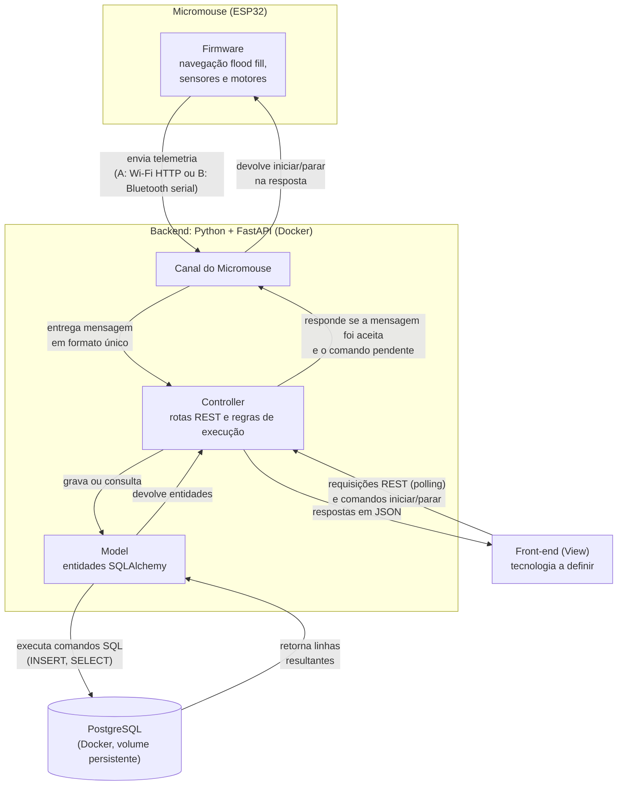

# Projeto Conceitual de Software

- [Explicações adicionais](https://drive.google.com/file/d/1WWIz6609c7Y7zAQRBWHSbX0t2vEJ2z1A/view?usp=sharing)
- [Noções de UML](https://drive.google.com/file/d/1l1yt2ittHuRKIXVXYT76P1HriR07pK-t/view?usp=sharing)


A documentação do _software_ deverá conter, no mínimo, os itens a seguir:

- **Diagrama BPMN para entender o software proposto:** deve deixar claro os principais atores do sistema, suas atividades (de negócios), insumos e resultados.
- **Backlog funcional do software:**
  - Escrito no formato de histórias de usuário ou casos de uso (decisão da equipe);
  - Ao declarar o backlog de requisitos funcionais, usar a classificação de MoSCoW (Must have, Should have e Could have), para um melhor entendimento do próprio backlog.
- **Backlog não-funcional do software:**
  - Descrever os requisitos não-funcionais de forma objetiva;
  - Mais facilmente, mais rapidamente, são descrições subjetivas não-válidas. Um exemplo de requisito não-funcional de desempenho: "a página deve carregar em até 5s quando em conexão 4G". 
- **Diagrama de casos de uso**, contendo os atores do sistema, os requisitos com os quais eles interagem e os tipos de relacionamentos entre requisitos realizados por um mesmo ator (ex.: include, extend). Obs.: este é um diagrama sobre requisitos funcionais.
- **Descrição da arquitetura da solução de software proposta:**
  - Propósito do software (qual o seu papel no sistema);
  - Estilo arquitetural contendo:
    - Padrão adotado: MVC, MVP, Microsserviços, Monolítico, etc (Justificar);
    - Linguagens de programação: Java, Python, C\#, JavaScript, etc.
    - Frameworks e bibliotecas: Spring Boot, .NET Core, React, Angular, Django, etc.
    - Banco de dados: Relacional (PostgreSQL, MySQL, etc) X NãoSQL (MongoDB,etc). 
  - Diagrama de alto nível: representação esquemática dos componentes da arquitetura, suas responsabilidades e comunicações, esclarecendo a composição do front-end e do back-end.
- **Persistência de dados:** diagrama de entidade relacionamento do banco de dados usado na solução proposta.
- **Análise de dados:** as variáveis definidas nos requisitos do projeto em abordagem numérica e gráfica.
- **Diagrama de estados** esclarecendo os estados assumidos pelo software e os eventos que causam as mudanças de estado do software.
- **Protótipo funcional do software, navegável**.

## Arquitetura da solução de software

### Propósito do software

O software do projeto tem dois papéis complementares dentro do sistema do Micromouse:

1. **Firmware embarcado (ESP32):** lê os sensores de parede à frente, à esquerda e à direita de cada célula, controla os motores de passo nos deslocamentos e nos giros de 90° e 180° e executa a navegação autônoma com o algoritmo **flood fill (método Adachi)**. O robô não recebe nenhuma informação prévia sobre o labirinto: sabe apenas que a área de objetivo fica no canto diametralmente oposto ao de partida. Para isso, o firmware:
    - mantém um mapa das paredes conhecidas em cada célula e recalcula as distâncias até o objetivo sempre que descobre uma parede nova;
    - deduz o tipo do labirinto (4x4, 8x4 ou 12x4) pela extensão das células visitadas e, a partir dele, escolhe a célula de objetivo candidata (RF27);
    - só declara a chegada depois de confirmar que as bordas daquele tamanho estão fechadas (RF26);
    - grava o mapa, a posição e o estado da execução na memória flash, para retomar de onde parou após uma falha de componente (RF38, RF42);
    - executa toda a exploração dentro do limite de 10 minutos por execução;
    - envia a telemetria (posição, trajeto e bateria) em uma tarefa separada, no outro núcleo da ESP32, sem interferir no laço de navegação.
2. **Sistema de Telemetria (web):** é a plataforma de acompanhamento usada pela equipe e pela banca. Recebe e valida as mensagens enviadas pelo Micromouse, registra cada execução (trajeto, bateria, velocidade, tempo, status, retomadas e falhas), mantém o histórico e disponibiliza esses dados para visualização, durante e após a execução.

O Sistema de Telemetria envia ao robô **apenas os comandos de iniciar e parar** a execução: nunca comandos de navegação, e nunca altera a memória do robô sobre o labirinto (RNF06). Uma falha no servidor ou na rede não interrompe a execução, que continua de forma autônoma (RNF07). Esta seção detalha principalmente a arquitetura do Sistema de Telemetria; o firmware aparece nos pontos em que se comunica com ele.

### Padrão arquitetural: MVC com a View desacoplada

O Sistema de Telemetria adota o padrão **MVC (Model-View-Controller)** em um **backend monolítico**, com a camada de visualização **desacoplada** e comunicando-se com o backend por uma API REST em JSON.

| Camada | Responsabilidade no sistema | Onde fica |
| :--- | :--- | :--- |
| **Model** | Representa as entidades do domínio (Execução, trajeto, retomadas, tentativas rejeitadas) e sua persistência, garantindo a integridade dos dados (RF17, RNF01, RNF05). | Backend: modelos SQLAlchemy sobre o PostgreSQL |
| **Controller** | Recebe a telemetria e as requisições do front-end, valida as mensagens (RNF09) e aplica as regras de execução: uma execução por vez (RF18), tentativa rejeitada (RF19), chegada à área de objetivo (RF26), perda de comunicação (RF31), tempo limite (RF32) e retomada (RF38). Também registra os comandos de iniciar e parar pedidos pelo operador (RF39). Devolve os dados em JSON. | Backend: rotas do FastAPI |
| **View** | Apresenta a execução em tempo real, o histórico e os detalhes de cada execução ao usuário, consumindo a API do backend. | Front-end: aplicação própria, com tecnologia a definir pela equipe de front-end |

**Justificativa da escolha:**

- **Domínio pequeno e bem delimitado.** O sistema recebe mensagens de um único robô, processa no máximo cerca de 10 mensagens por segundo (RNF11) e atende poucos usuários ao mesmo tempo. Um único backend organizado em MVC resolve esse volume sem a complexidade operacional de vários serviços.
- **Microsserviços foram descartados** porque exigiriam comunicação entre serviços, implantação de várias peças e observabilidade distribuída, um custo que não se justifica para o tamanho do problema e para o prazo da disciplina.
- **Separação clara de responsabilidades.** As regras de execução ficam concentradas no Controller, e o Model isola o acesso ao banco. Isso facilita dividir o trabalho entre os membros e testar as regras de forma independente da interface.

### Linguagens de programação, frameworks e bibliotecas

| Parte | Linguagem | Frameworks e bibliotecas | Papel |
| :--- | :--- | :--- | :--- |
| Backend | Python | **FastAPI** | Define as rotas da API REST (Controller) e gera automaticamente a documentação OpenAPI dos endpoints, atendendo ao RNF13. |
| Backend | Python | **Pydantic** | Valida o formato, os campos obrigatórios e as faixas das mensagens de telemetria antes de qualquer processamento (RNF09). |
| Backend | Python | **SQLAlchemy** | ORM que implementa a camada Model e faz o mapeamento das entidades para as tabelas do PostgreSQL. |
| Backend | Python | **Uvicorn** | Servidor ASGI que executa a aplicação FastAPI. |
| Front-end | A definir | A definir pela equipe de front-end | Implementa a View, consumindo a API REST. |
| Firmware | C | A definir pela equipe de firmware | Navegação com flood fill, leitura dos sensores, controle dos motores e envio de telemetria na ESP32. |

**Por que Python com FastAPI:**

- Python tem sintaxe simples e um ecossistema amplo e bem documentado, o que reduz a curva de aprendizado em um projeto de prazo curto.
- A documentação interativa dos endpoints é gerada a partir do próprio código, o que mantém a documentação da API sempre atualizada (RNF13).
- O suporte nativo a operações assíncronas permite receber telemetria e atender às consultas do front-end ao mesmo tempo, sem atraso acumulado (RNF11).
- Todo o backend é desenvolvido pela equipe, sem plataformas prontas de telemetria ou dashboard (RNF12).

**Por que usar o Pydantic:**

Toda mensagem de telemetria precisa ser conferida antes de ser gravada: se os campos obrigatórios existem, se têm o tipo certo e se os valores fazem sentido (RNF09). Sem o Pydantic, essa conferência teria que ser escrita à mão, campo por campo, em cada rota:

```python
# Sem Pydantic: cada campo é verificado manualmente
def receber_telemetria(mensagem: dict):
    if "celula" not in mensagem or not isinstance(mensagem["celula"], str):
        raise ErroDeValidacao("campo 'celula' ausente ou inválido")
    if "bateria" not in mensagem or not isinstance(mensagem["bateria"], (int, float)):
        raise ErroDeValidacao("campo 'bateria' ausente ou inválido")
    if mensagem["bateria"] < 0:
        raise ErroDeValidacao("campo 'bateria' fora da faixa")
    if mensagem.get("status") not in ("health-check", "running", "success", "failed"):
        raise ErroDeValidacao("campo 'status' inválido")
    # ... e ainda converter o texto do horário de envio para data e hora
```

Com o Pydantic, o formato da mensagem é declarado uma única vez, como uma classe:

```python
# Com Pydantic: as regras ficam declaradas em um só lugar
class Telemetria(BaseModel):
    celula: str
    bateria: float = Field(ge=0)
    status: Literal["health-check", "running", "success", "failed"]
    enviado_em: datetime
```

O exemplo é ilustrativo; o formato final das mensagens será definido no diagrama de componentes. Usar o Pydantic é mais simples e mais seguro do que não usá-lo porque:

- **Menos código repetido:** a regra de cada campo aparece uma vez, na classe, em vez de se repetir em cada rota que recebe ou devolve dados.
- **Validação automática:** o FastAPI aplica a classe na entrada da rota. Uma mensagem inválida é recusada antes de chegar à lógica da execução, com uma resposta que indica qual campo falhou, e o serviço continua funcionando (RNF09).
- **Conversão de tipos:** valores como o horário de envio chegam como texto e são convertidos automaticamente para data e hora, sem código extra.
- **Documentação gerada a partir do código:** a mesma classe aparece na documentação automática da API, então o formato documentado é sempre o formato validado (RNF13).
- **Menos chance de erro:** esquecer uma verificação manual em uma rota deixaria passar dados inválidos para o banco; com a classe, todas as rotas usam as mesmas regras.

### Banco de dados: relacional com PostgreSQL

O sistema usa um banco de dados **relacional**, o **PostgreSQL**.

**Por que relacional:**

- Os dados têm estrutura fixa e relações claras: cada execução pertence a um labirinto e possui um trajeto (sequência de células), eventos de retomada e, quando falha, um motivo. Esse formato se representa naturalmente em tabelas relacionadas, que serão detalhadas no diagrama entidade-relacionamento.
- As consultas previstas são típicas de banco relacional: filtrar execuções por labirinto (RF34), listar todas em ordem cronológica (RF03, RF35) e comparar tempos entre execuções (RF14).
- Chaves primárias, chaves estrangeiras e transações garantem a unicidade de cada execução (RF17) e impedem registros incompletos ou inconsistentes (RNF01).
- Um banco não relacional (como o MongoDB) seria vantajoso para dados sem esquema definido, o que não é o caso: a telemetria tem campos conhecidos e validados na entrada.

**Por que PostgreSQL:**

- Suporta com folga a escrita contínua da telemetria ao mesmo tempo que o front-end consulta a execução em andamento a cada 1 a 2 segundos.
- Oferece restrições de integridade (`UNIQUE`, `CHECK`, chaves estrangeiras) que reforçam no próprio banco as regras do domínio.
- Tem imagem oficial para Docker e integração madura com o SQLAlchemy.
- Os dados ficam em um volume persistente, preservados após reiniciar o servidor ou o computador (RNF05).

### Ambiente de execução

O backend e o banco são executados com **Docker Compose** no notebook da equipe, com dois serviços:

| Serviço | Conteúdo | Observação |
| :--- | :--- | :--- |
| `api` | Aplicação FastAPI executada pelo Uvicorn | Expõe a API REST para o Micromouse e para o front-end. |
| `db` | PostgreSQL | Usa um volume nomeado para persistir os dados (RNF05). |

Todo o sistema sobe com um único comando (`docker compose up`), da mesma forma em qualquer máquina da equipe, o que evita diferenças de ambiente entre os membros. O sistema funciona inteiramente em **rede local**, sem depender de acesso à internet (RNF10).

### Comunicação entre as partes

#### Entre o Micromouse e o Sistema de Telemetria

O Micromouse envia telemetria e o sistema devolve, na resposta de cada mensagem, apenas os comandos de iniciar ou parar a execução, quando houver algum pendente (RNF06, RF39). Para que a escolha do meio de transmissão não afete o restante da arquitetura, o backend possui um componente **Canal do Micromouse**. Ele recebe as mensagens por qualquer transporte, entrega-as ao Controller em um formato único e devolve ao robô a resposta com o comando pendente. O Controller, o Model, o banco e o front-end são os mesmos em qualquer caso.

A ESP32 oferece Wi-Fi e Bluetooth integrados, e as duas opções foram avaliadas:

| Critério | Opção A: Wi-Fi (HTTP) | Opção B: Bluetooth (serial) |
| :--- | :--- | :--- |
| Canal do Micromouse | Um endpoint do próprio FastAPI, cujo retorno leva o comando pendente. Não há componente extra. | Um processo "ponte" no notebook, que lê a porta serial Bluetooth, separa as mensagens, trata reconexões (RNF08), repassa à API e escreve de volta na porta serial o comando pendente. |
| Infraestrutura de rede | Rede local própria, sem internet: a própria ESP32 cria a rede (modo ponto de acesso) ou o notebook ou um celular cria um hotspot. Não depende da rede da universidade. | Conexão ponto a ponto com o notebook, sem rede nem endereço IP. |
| Dependência do sistema operacional | Nenhuma: qualquer máquina na rede recebe. | Pareamento e porta serial diferentes em cada sistema (`/dev/rfcomm0` no Linux, `COMx` no Windows). O WSL2 não acessa o adaptador Bluetooth. |
| Testes sem o robô | Simples: basta um script ou `curl` imitando o Micromouse. | Exige simular uma porta serial. |
| Ambiente com muitas redes de 2,4 GHz | Mais sujeito a congestionamento, pois opera em canal fixo. | Mais robusto, pois alterna de frequência continuamente. |
| Restrições de hardware | Com o Wi-Fi ativo, os pinos do ADC2 da ESP32 ficam indisponíveis; a leitura da bateria deve usar o ADC1. | Sem restrição relevante. |

**Consumo de energia não é critério de desempate.** Segundo o datasheet da ESP32 (Tabela 15), a transmissão consome cerca de 130 mA em Bluetooth (0 dBm) e de 180 a 240 mA em Wi-Fi (+14 a +19,5 dBm), enquanto a recepção consome de 95 a 100 mA nos dois casos [[1]](#ref-arq-1). Em três execuções de 10 minutos, essa diferença representa algumas dezenas de mAh, pouco perto do consumo dos motores de passo, que dominam o dimensionamento da bateria.

**Decisão:** a arquitetura é desenhada com o Canal do Micromouse abstrato. A **Opção A (Wi-Fi com rede local própria)** é a preferida, por ter o menor custo de integração no software. A **Opção B (Bluetooth)** fica documentada como alternativa, caso o congestionamento de 2,4 GHz se mostre um problema nos testes. A escolha final depende do alinhamento com as equipes de eletrônica e firmware.

**Como os comandos chegam ao robô.** O comando viaja na resposta da telemetria, e não em uma conexão própria, para que a ESP32 não precise manter um servidor escutando nem que o backend conheça o endereço do robô:

1. Com o robô parado, esperando o início, o firmware envia um health-check a cada 1 segundo. O backend abre a execução no primeiro deles.
2. O operador clica em **iniciar** na interface. O Controller guarda o comando, e a resposta ao health-check seguinte o entrega ao robô, que passa para "running".
3. Durante a corrida, o robô envia apenas a telemetria normal. Se o operador clicar em **parar**, o comando segue na resposta da mensagem seguinte; o robô para e envia "failed" com motivo encerrado_operador.
4. Se o robô não confirmar o comando em até 3 segundos, a interface mostra "parada não confirmada" (RF40). Nesse caso, e sempre que a rede cair, a parada é feita pelo botão BOOT do robô (RF41).

No firmware, o envio da telemetria roda em uma tarefa do FreeRTOS no outro núcleo da ESP32. O laço de navegação apenas consulta uma sinalização de "parar", sem nunca esperar pela rede. Assim, uma queda de comunicação não atrasa nem interrompe a corrida (RNF07).

#### Entre o front-end e o backend

O front-end consome a API REST do backend em JSON. Para o acompanhamento em tempo real, ele usa **polling**: consulta a execução em andamento a cada 1 a 2 segundos e exibe o tempo desde a última atualização (RF04). Esse intervalo atende aos limites de 2 segundos para exibir novos dados (RNF02) e de 3 a 5 segundos de atualização durante a execução (RNF04). O polling foi escolhido por ser o mecanismo mais simples de implementar em qualquer tecnologia de front-end. O uso de WebSocket, em que o backend empurra os dados ao front-end, fica como evolução futura.

### Diagrama de alto nível

O diagrama a seguir mostra os blocos da solução, suas responsabilidades e como se comunicam. Os componentes internos do backend e o formato das mensagens são detalhados no diagrama de componentes.



<font size="2"><p style="text-align: center">Fonte: [Wanjo Christopher Paraizo Escobar](https://github.com/wChrstphr), 2026.</p></font>

**Como os dados circulam em uma consulta.** Quando o front-end pede os dados da execução em andamento, a requisição chega ao Controller, que pede ao Model as informações necessárias. O Model não guarda os dados em memória: ele monta a consulta SQL, envia ao PostgreSQL e recebe de volta as linhas resultantes, que converte em entidades (execução, trajeto, retomadas). O Controller usa essas entidades para montar a resposta em JSON e devolve ao front-end, que atualiza a tela. Na gravação da telemetria o caminho é o mesmo, mas o Model envia um comando de inserção e o banco confirma o registro.

| Bloco | Responsabilidade |
| :--- | :--- |
| Firmware | Navega de forma autônoma pelo labirinto com o flood fill e envia a telemetria. Do sistema web, recebe apenas os comandos de iniciar e parar, nunca comandos de navegação (RNF06). |
| Canal do Micromouse | Recebe as mensagens do Micromouse, independentemente do transporte, entrega-as ao Controller e devolve ao robô o comando pendente. |
| Controller | Valida as mensagens, aplica as regras de execução (início, retomada, tentativa rejeitada, chegada ao objetivo, tempo limite), guarda os comandos de iniciar e parar e atende às consultas do front-end. |
| Model | Representa as entidades do domínio e faz a persistência no banco. |
| PostgreSQL | Armazena execuções, trajetos, retomadas e tentativas rejeitadas de forma persistente. |
| Front-end | Exibe a execução em tempo real, o histórico e os detalhes de cada execução, e oferece ao operador os botões de iniciar e parar. |

### Algoritmo de navegação

#### Restrições do problema

- O robô **não recebe nenhuma informação prévia** sobre o labirinto: nem o formato das paredes, nem o tamanho. Sabe apenas que parte de um beco sem saída em um canto e que a área de objetivo fica no **canto diametralmente oposto**.
- Os labirintos possíveis são 4x4, 8x4 e 12x4, com células de 18 cm, e cada execução tem limite de 10 minutos.
- Basta chegar ao objetivo uma vez por execução; não há corrida de volta nem corrida rápida posterior.
- Os sensores enxergam apenas as paredes da célula atual (frente, esquerda e direita), e os giros de 90° e 180° dos motores de passo custam tempo.

#### Estado da arte

| Algoritmo | Como funciona | Vantagens | Desvantagens | Fontes |
| :--- | :--- | :--- | :--- | :--- |
| Busca em profundidade (DFS) | Segue um caminho até não haver saída e então volta pela pilha até a última bifurcação com opção não explorada. | Não precisa saber onde fica o objetivo; implementação simples. | Não garante o menor caminho e perde tempo explorando o labirinto inteiro; o retrocesso gera muitos giros de 180°. | [[7, p. 24, 28]](#ref-arq-7) |
| Flood fill | Atribui a cada célula a distância até o objetivo e move o robô sempre para a vizinha de menor distância. | Direciona a busca ao objetivo; o mesmo mapa de distâncias serve para explorar e para seguir o caminho. | Precisa conhecer a posição do objetivo para numerar as células. | [[6, p. 503]](#ref-arq-6), [[9]](#ref-arq-9) |
| Flood fill modificado | Igual ao flood fill, mas recalcula apenas as células afetadas pela parede nova. | Percorre as mesmas células que o flood fill com muito menos atualizações de distância. | Implementação mais complexa; o ganho só aparece em labirintos grandes. | [[6, p. 503, 506]](#ref-arq-6), [[7, p. 29]](#ref-arq-7) |
| A\* | Busca guiada por uma estimativa da distância restante até o objetivo. | Encontra o menor caminho. | Usa mais memória, pois guarda toda a lista aberta; em um labirinto 5x5 não se diferenciou do flood fill. | [[8, p. 366, 368, 372]](#ref-arq-8) |

Segundo Law, o flood fill venceu primeiros lugares em competições internacionais de micromouse, e sua versão modificada é a mais usada nelas [[6, p. 503]](#ref-arq-6). Nos cinco labirintos de competição testados pelo autor, as duas versões percorreram exatamente o mesmo número de células; a diferença esteve só no esforço de cálculo, por exemplo 135.936 contra 3.197 atualizações de distância no labirinto da IEEE Region 6 de 2012 [[6, p. 506, Tabela I]](#ref-arq-6). Sharma e Munshi chegam à mesma recomendação para competições [[7, p. 29]](#ref-arq-7).

#### O método Adachi

O método Adachi (足立法) foi criado por Yoshihiko Adachi quando ele era estudante e membro do Fukuyama Microcomputer Club, e foi apresentado em 1984 [[10, seção 4-5]](#ref-arq-10), [[11]](#ref-arq-11). Até então, a abordagem comum era **percorrer o labirinto inteiro primeiro e só depois calcular o caminho mínimo** [[10, seção 4-5]](#ref-arq-10). A ideia do método, como descrita pela JSDKK, é:

1. Olhar para o labirinto como um **mapa em branco até o objetivo** e imaginar o caminho mais curto até ele.
2. Seguir esse caminho. Ao encontrar uma parede, **levá-la em conta, junto com as paredes já vistas, e recalcular** o caminho mais curto.
3. Repetir até chegar.

Em outras palavras, o método **trata toda parede desconhecida como inexistente** (未知の壁を無いものとして考える). É o mesmo raciocínio de uma pessoa perdida que sabe onde fica a saída: ela supõe o caminho mais curto, vai conferir e, se estiver bloqueado, pensa de novo [[10, seção 4-5]](#ref-arq-10). A mesma fonte afirma que os métodos de busca predominantes hoje são evoluções do método Adachi e que quase todos os mouses de nível mais alto o utilizam [[10, seção 4-5]](#ref-arq-10).

**Como o "caminho mais curto" é calculado: o flood fill.** Harrison descreve o flood fill (ou algoritmo de Bellman) como o método mais simples disponível a um micromouse [[9]](#ref-arq-9):

1. Guardar um valor por célula do labirinto.
2. Colocar o valor 0 na célula de objetivo.
3. Percorrer todas as células e garantir que cada uma tenha um valor igual a 1 a mais que o da sua vizinha acessível de menor valor.
4. Repetir o passo 3 até que os valores parem de mudar.

Depois disso, cada célula guarda sua distância até o objetivo, e basta o robô "descer" os valores, indo sempre para a vizinha de valor menor. O cálculo só precisa ser refeito quando uma decisão é necessária, isto é, em uma bifurcação, e pode ser distribuído em pequenos pedaços enquanto o robô se move [[9]](#ref-arq-9). Combinado com a hipótese de Adachi, as células ainda não visitadas entram no cálculo como se não tivessem paredes, então todo o labirinto tem distância definida desde o início.

**As quatro variantes de Adachi.** Harrison reconstruiu, a partir de anotações em japonês, os quatro métodos que Adachi apresentou para a fase de busca [[11]](#ref-arq-11):

| Variante | Comportamento | Observação |
| :--- | :--- | :--- |
| Método 0 | Vai e volta entre a largada e o objetivo, sempre pelo melhor caminho a partir de onde está, até que o melhor caminho entre os dois não passe por nenhuma célula inexplorada. | Pode desperdiçar tempo e corridas, pois precisa tocar a largada e o objetivo em cada passagem. |
| Método 1 | Procura as células inexploradas que estão no melhor caminho calculado entre a largada e o objetivo, calculando duas rotas a cada decisão. | O caminho ótimo pode mudar durante a exploração e fazer o robô trocar de alvo. |
| Método 2 | Alterna entre a largada e o objetivo, mas inverte o sentido assim que o caminho até o alvo atual já é ótimo, sem precisar tocá-lo. | Corrige o principal defeito do método 0. |
| Método 3 | Usa o método 0 para encontrar o objetivo pela primeira vez e depois passa para o método 1. | É uma otimização do método 1 com uma busca inicial mais rápida. |

Todas as variantes compartilham o núcleo descrito pela JSDKK; elas diferem no que fazer **depois** de chegar ao objetivo, quando o robô procura o caminho mínimo para as corridas rápidas. Como neste projeto basta chegar ao objetivo uma vez, o que interessa é esse núcleo, que corresponde à primeira ida do método 0 (e à fase inicial do método 3).

### Pendências da arquitetura

| Pendência | Responsáveis pelo alinhamento | Impacto na arquitetura |
| :--- | :--- | :--- |
| Escolha final do transporte da telemetria (Wi-Fi ou Bluetooth) | Software, eletrônica e firmware | Define se o Canal do Micromouse é um endpoint da API ou um processo ponte. O restante não muda. |
| Uso do DIP switch | Software, eletrônica e firmware | O DIP switch **não** seleciona o labirinto, porque o robô não pode receber nenhuma informação prévia sobre ele. Suas chaves ficam para modos que não revelam nada do labirinto, como teste e calibração, a definir com o firmware. |
| Lista de componentes do health-check | Software, eletrônica e firmware | Proposta: bateria, sensor_frontal, sensor_esquerdo, sensor_direito, motor_esquerdo e motor_direito. A lista fixa é validada na entrada (RNF09) e usada no motivo falha_componente e no evento de retomada. |
| Marcação física da área de objetivo | Software e professores | Os slides do tema não mencionam marcação. Se ela existir, pode encurtar a confirmação da borda (RF26); se não existir, vale a regra de confirmação da borda. |
| Tecnologia do front-end | Equipe de front-end | Nenhum no backend: a View consome a mesma API REST. |
| Formato das mensagens de telemetria | Software e firmware | Detalhado no diagrama de componentes. Além dos dados de telemetria, as mensagens precisam trazer o tipo de labirinto descoberto ("indeterminado" até lá, RF27), o tipo de início do health-check ("nova" ou "retomada", RF38) e, nas falhas e retomadas, o componente afetado. |

### Referências da arquitetura

> <a id="ref-arq-1">1.</a> ESPRESSIF SYSTEMS. *ESP32 Series Datasheet*, versão 3.0, 2019. Disponível em: [ESP32.pdf](dev-docs/ESP32.pdf). Acesso em: 23 de set. 2026.

> <a id="ref-arq-2">2.</a> FastAPI. Documentação oficial. Disponível em: https://fastapi.tiangolo.com/. Acesso em: 23 de set. 2026.

> <a id="ref-arq-3">3.</a> SQLAlchemy. Documentação oficial. Disponível em: https://docs.sqlalchemy.org/. Acesso em: 23 de set. 2026.

> <a id="ref-arq-4">4.</a> PostgreSQL. Documentação oficial. Disponível em: https://www.postgresql.org/docs/. Acesso em: 23 de set. 2026.

> <a id="ref-arq-5">5.</a> Docker. *Docker Compose overview*. Disponível em: https://docs.docker.com/compose/. Acesso em: 23 de set. 2026.

> <a id="ref-arq-6">6.</a> LAW, G. Quantitative comparison of flood fill and modified flood fill algorithms. *International Journal of Computer Theory and Engineering*, v. 5, n. 3, p. 503-508, 2013. Disponível em: [PDF](dev-docs/algoritmo-navegacao/Law-2013-IJCTE-flood-fill.pdf). Acesso em: 25 de set. 2026.

> <a id="ref-arq-7">7.</a> SHARMA, K.; MUNSHI, C. A comprehensive and comparative study of maze-solving techniques by implementing graph theory. *IOSR Journal of Computer Engineering*, v. 17, n. 1, p. 24-29, 2015. Disponível em: [PDF](dev-docs/algoritmo-navegacao/Sharma-Munshi-2015-IOSR-JCE.pdf). Acesso em: 25 de set. 2026.

> <a id="ref-arq-8">8.</a> TJIHARJADI, S.; WIJAYA, M. C.; SETIAWAN, E. Optimization maze robot using A* and flood fill algorithm. *International Journal of Mechanical Engineering and Robotics Research*, v. 6, n. 5, p. 366-372, 2017. Disponível em: [PDF](dev-docs/algoritmo-navegacao/Tjiharjadi-2017-IJMERR-Astar-flood-fill.pdf). Acesso em: 25 de set. 2026.

> <a id="ref-arq-9">9.</a> HARRISON, P. Solving the maze. *Micromouse Online*. Disponível em: https://micromouseonline.com/micromouse-book/mazes-and-maze-solving/solving-the-maze/. Acesso em: 25 de set. 2026.

> <a id="ref-arq-10">10.</a> JSDKK (Japan System Design). どこよりも詳しいマイクロマウス解説, seção 4-5 "足立法の冊子". Disponível em: https://jsdkk.com/home/glossary/glossary-micromouse/. Acesso em: 25 de set. 2026.

> <a id="ref-arq-11">11.</a> HARRISON, P. Adachi micromouse maze solving algorithms. *Micromouse Online*, 27 maio 2008. Disponível em: https://micromouseonline.com/2008/05/27/adachi-micromouse-maze-solving-algorithms/. Acesso em: 25 de set. 2026.
