# Projeto Conceitual de Software

- [Explicações adicionais](https://drive.google.com/file/d/1WWIz6609c7Y7zAQRBWHSbX0t2vEJ2z1A/view?usp=sharing)
- [Noções de UML](https://drive.google.com/file/d/1l1yt2ittHuRKIXVXYT76P1HriR07pK-t/view?usp=sharing)

A documentação do _software_ deverá conter, no mínimo, os itens a seguir:

- **Diagrama BPMN para entender o software proposto:** deve deixar claro os principais atores do sistema, suas atividades (de negócios), insumos e resultados.
- **Backlog funcional do software:**
  - Escrito no formato de histórias de usuário ou casos de uso (decisão da equipe);
  - Ao declarar o backlog de requisitos funcionais, usar a classificação de MoSCoW (Must have, Should have e Could have), para um melhor entendimento do próprio backlog.
- **Backlog não-funcional do software:**
  - Descrever os requisitos não-funcionais de forma objetiva;
  - Mais facilmente, mais rapidamente, são descrições subjetivas não-válidas. Um exemplo de requisito não-funcional de desempenho: "a página deve carregar em até 5s quando em conexão 4G".
- **Diagrama de casos de uso**, contendo os atores do sistema, os requisitos com os quais eles interagem e os tipos de relacionamentos entre requisitos realizados por um mesmo ator (ex.: include, extend). Obs.: este é um diagrama sobre requisitos funcionais.
- **Descrição da arquitetura da solução de software proposta:**
  - Propósito do software (qual o seu papel no sistema);
  - Estilo arquitetural contendo:
    - Padrão adotado: MVC, MVP, Microsserviços, Monolítico, etc (Justificar);
    - Linguagens de programação: Java, Python, C#, JavaScript, etc.
    - Frameworks e bibliotecas: Spring Boot, .NET Core, React, Angular, Django, etc.
    - Banco de dados: Relacional (PostgreSQL, MySQL, etc) X NãoSQL (MongoDB,etc).
  - Diagrama de alto nível: representação esquemática dos componentes da arquitetura, suas responsabilidades e comunicações, esclarecendo a composição do front-end e do back-end.
- **Persistência de dados:** diagrama de entidade relacionamento do banco de dados usado na solução proposta.
- **Análise de dados:** as variáveis definidas nos requisitos do projeto em abordagem numérica e gráfica.
- **Diagrama de estados** esclarecendo os estados assumidos pelo software e os eventos que causam as mudanças de estado do software.
- **Protótipo funcional do software, navegável**.

---

## Backlog do Software {#backlog-do-software}

> Formato adotado pela equipe: **histórias de usuário**, priorizadas com **MoSCoW** (Must have, Should have, Could have).
> Cada história rastreia o requisito de origem no documento de Requisitos, e o agrupamento segue a EAP de Software
> (4.2.1 Front End, 4.2.2 Back End, 4.2.3 Software Embarcado).
>
> **Atores:**
>
> - **Equipe** — integrantes do Grupo 01 que acompanham e analisam as execuções pelo sistema web.
> - **Operador** — integrante da equipe que opera o Micromouse durante uma tentativa.
> - **Banca** — professores que avaliam as execuções durante os testes de integração e a apresentação final.
>
> **Especificação complementar:** fluxos operacionais, casos de uso (**UC01–UC24**), limite **3 tentativas** por execução lógica (TAP) e rótulos **(*n*/3)** na interface estão detalhados em [2.1 - Backlog e Casos de Uso.md](2.1%20-%20Backlog%20e%20Casos%20de%20Uso.md). Este **4.4** mantém o backlog em **histórias de usuário** para a entrega AP5; em caso de divergência de comportamento, prevalece o **2.1** acordado com o TAP.
>
> **Decisões de alinhamento (TAP / 2.1):**
>
> - **Execução lógica** (`execucao_id`) agrupa até **3 tentativas** (`attempt_index` 1…3). Falha no **trajeto**, de **componente** ou **encerramento manual** encerra a tentativa (`failed`) e **consome** uma tentativa.
> - **Nova execução:** o operador informa o tipo de labirinto (4x4, 8x4 ou 12x4), registrado **apenas no backend** para desenhar a grade do labirinto na web enquanto o robô anda, e para histórico e filtros; nada é enviado ao robô, que descobre o tipo sozinho (RF27). A execução lógica abre já com a **tentativa 1/3**, e o relógio da execução começa nesse instante.
> - **Retomar tentativa (*n*/3):** após uma tentativa `failed`, continua a execução lógica de onde falhou (célula da falha, mapa preservado), abrindo a tentativa *n* (ex.: após a 1ª falha → **Retomar tentativa (2/3)**). Oculto após 3 tentativas sem sucesso ou com a execução cancelada.
> - **Encerrar tentativa (RF30):** modal com motivos `collision`, `stuck` ou `out_of_track` + observação (≤ 100 caracteres); encerra a **tentativa** e mantém a execução lógica `em_andamento`, permitindo **Retomar tentativa (*n*/3)**.
> - **Limite de tempo (RF32):** 10 minutos **no total** por **execução lógica** (um tipo de labirinto, até 3 tentativas), em relógio corrido desde **Nova execução**, incluindo os intervalos entre tentativas.
> - **Perda de link (RF31):** 10 s sem telemetria encerram automaticamente a tentativa aberta e cancelam a execução lógica (**UC21**).
> - **Downlink Bluetooth:** somente **interrupção** manual (**RF39**, encerramento **RF30**). **Não** há teleoperação nem par iniciar/parar genérico.


### 1. Backlog Funcional


#### 1.1 Front End (EAP 4.2.1)

Tabela 1: Histórias de usuário do Front End


| ID   | História de usuário                                                                                                                                                                                  | Critério de aceitação                                                                                                                                                                                                                                                                                                          | MoSCoW      | Requisito  |
| ---- | ---------------------------------------------------------------------------------------------------------------------------------------------------------------------------------------------------- | ------------------------------------------------------------------------------------------------------------------------------------------------------------------------------------------------------------------------------------------------------------------------------------------------------------------------------ | ----------- | ---------- |
| US01 | Como **equipe**, quero visualizar os dados de telemetria do Micromouse durante e após a execução, para acompanhar velocidade, bateria, tempo de percurso e status sem depender de observação física. | A tela exibe os campos de velocidade, bateria, tempo e status durante a execução e permanece com os valores finais após o término.                                                                                                                                                                                             | Must have   | RF01       |
| US02 | Como **equipe**, quero visualizar os dados principais de uma execução após sua finalização, para analisar o desempenho daquela tentativa.                                                            | A página da execução apresenta tempo, velocidade e desempenho em ordem cronológica.                                                                                                                                                                                                                                            | Must have   | RF02       |
| US03 | Como **equipe**, quero acessar uma seção com o histórico de todas as execuções já realizadas, para comparar tentativas.                                                                              | A listagem apresenta todas as execuções em ordem decrescente, da última para a primeira.                                                                                                                                                                                                                                       | Must have   | RF03       |
| US04 | Como **equipe**, quero ver na tela inicial a execução em andamento com o tempo desde a última atualização, para saber se o robô continua reportando.                                                 | Havendo tentativa com status `health-check` ou `running`, a tela exibe a telemetria recebida por SSE, "última atualização há X segundos", o indicador **Tentativa *n*/3** da execução lógica e a ação **Encerrar tentativa** (modal); após uma falha, exibe **Retomar tentativa (*n*/3)**.                                     | Should have | RF04       |
| US05 | Como **equipe**, quero ver os dados coletados no health-check em uma área separada, para distinguir a verificação inicial dos dados do trajeto.                                                      | Os dados de `health-check` aparecem em bloco próprio na página da execução, separados dos demais.                                                                                                                                                                                                                              | Must have   | RF05       |
| US06 | Como **equipe**, quero visualizar o trajeto percorrido sobre a representação do labirinto, para entender onde o robô passou e onde falhou.                                                           | O trajeto é desenhado célula a célula na ordem de visita, e a célula da falha é destacada quando houver.                                                                                                                                                                                                                       | Should have | RF09, RF15 |
| US07 | Como **operador**, quero ver em qual tentativa estou dentro do limite da prova e retomar após uma falha, para saber quantas chances ainda tenho.                                                     | Durante a execução lógica, a interface exibe **Tentativa *n*/3**. Com a última tentativa `failed` e nenhuma tentativa aberta, exibe **Retomar tentativa (*n*/3)**, com *n* = próxima tentativa (2/3 ou 3/3). Com 3 tentativas usadas ou a execução cancelada, o botão fica oculto e o sistema recusa nova abertura (**RF19**). | Must have   | RF18, RF19 |


Fonte: [João Marcos](https://github.com/JJOAOMARCOSS) e [Luiza da Silva](https://github.com/Luizaxx), 2026.

#### 1.2 Back End (EAP 4.2.2)

Tabela 2: Histórias de usuário do Back End


| ID   | História de usuário                                                                                                                                                      | Critério de aceitação                                                                                                                                                                                                                                                                                                                                                                                                                                                        | MoSCoW      | Requisito        |
| ---- | ------------------------------------------------------------------------------------------------------------------------------------------------------------------------ | ---------------------------------------------------------------------------------------------------------------------------------------------------------------------------------------------------------------------------------------------------------------------------------------------------------------------------------------------------------------------------------------------------------------------------------------------------------------------------- | ----------- | ---------------- |
| US08 | Como **equipe**, quero que o sistema disponibilize os dados de uma execução em andamento, para que a tela de tempo real tenha o que exibir.                              | Havendo tentativa com status `health-check` ou `running`, os dados da execução lógica em andamento são enviados ao front-end por **SSE** assim que registrados.                                                                                                                                                                                                                                                                                                              | Should have | RF06             |
| US09 | Como **equipe**, quero que o sistema disponibilize os dados das execuções anteriores, para sustentar a análise de desempenho no histórico.                               | A consulta devolve os dados registrados de cada tentativa de forma organizada.                                                                                                                                                                                                                                                                                                                                                                                               | Must have   | RF07             |
| US10 | Como **equipe**, quero que o sistema receba a telemetria enviada pelo Micromouse durante a corrida, para que os dados cheguem ao sistema web.                            | Cada mensagem recebida contém, no mínimo, a célula atual (x, y), o nível de bateria e o timestamp, e é associada à tentativa aberta da execução lógica em andamento.                                                                                                                                                                                                                                                                                                         | Must have   | RF08             |
| US11 | Como **equipe**, quero que o sistema registre a sequência de células visitadas em ordem cronológica, para reconstruir o trajeto completo.                                | A consulta da execução devolve a lista ordenada de células, permitindo redesenhar o percurso.                                                                                                                                                                                                                                                                                                                                                                                | Must have   | RF09             |
| US12 | Como **operador**, quero iniciar uma nova execução informando o tipo de labirinto, para vincular a telemetria ao labirinto e ao contador de tentativas.                  | Ao acionar **Nova execução**, o operador informa o tipo (4x4, 8x4 ou 12x4), registrado apenas no backend e nunca enviado ao robô (RF27). O backend abre a **execução lógica**, registra o início do relógio da execução e abre a **tentativa 1/3** com `tentativa_id` único (**RF17**) e `attempt_index` = 1; após **health-check** aprovado (**UC01**), a tentativa passa a `running` (**RF10**). Uma nova execução lógica encerra a anterior (`cancelada`).                | Must have   | RF10             |
| US13 | Como **equipe**, quero que o sistema calcule o consumo de bateria da corrida, para avaliar a autonomia real do robô.                                                     | O sistema informa o nível atual e o total consumido desde o início da execução.                                                                                                                                                                                                                                                                                                                                                                                              | Must have   | RF11             |
| US14 | Como **equipe**, quero que o sistema calcule a velocidade média do Micromouse, para comparar o desempenho entre tentativas.                                              | A velocidade média é obtida pela distância percorrida dividida pelo tempo decorrido.                                                                                                                                                                                                                                                                                                                                                                                         | Must have   | RF12             |
| US15 | Como **equipe**, quero que o sistema calcule o tempo de cada tentativa e o tempo corrido da execução lógica, para verificar o cumprimento do limite de 10 minutos.       | O tempo de cada tentativa é contado do seu início ao seu encerramento. O tempo da execução lógica é contado desde **Nova execução**, incluindo os intervalos entre tentativas. Ambos usam uma única fonte de relógio (a do backend).                                                                                                                                                                                                                                         | Must have   | RF13             |
| US16 | Como **equipe**, quero comparar em porcentagem o tempo da última execução com o melhor tempo já registrado, para medir a evolução do robô.                               | A execução exibe a variação percentual em relação ao melhor tempo do mesmo labirinto.                                                                                                                                                                                                                                                                                                                                                                                        | Should have | RF14             |
| US17 | Como **equipe**, quero que o sistema registre em qual célula a execução falhou e por qual motivo, para direcionar a correção.                                            | O registro guarda a célula (x, y) e um dos motivos: `collision`, `time_exceeded`, `stuck`, `out_of_track`, `falha_componente`, `low_battery`, `health_check_failed`, `link_lost` ou `encerrado_operador`. Encerramento manual (**UC24**): operador escolhe `collision`, `stuck` ou `out_of_track` + observação opcional (≤ 100 caracteres), e a tentativa é marcada também com a origem `encerrado_operador`. Em `falha_componente`, registra também qual componente falhou. | Must have   | RF15             |
| US18 | Como **equipe**, quero que cada tentativa e cada execução lógica tenham status registrados, para saber em que ponto do ciclo estão.                                      | Cada **tentativa**: `health-check`, `running`, `success` ou `failed`. A **execução lógica**: `em_andamento`, `concluida` ou `cancelada`.                                                                                                                                                                                                                                                                                                                                     | Must have   | RF16             |
| US19 | Como **equipe**, quero que cada tentativa persistida tenha identificador único, para garantir a integridade dos dados.                                                   | Toda **tentativa** recebe `tentativa_id` único (**RF17**), ligada a uma `execucao_id`.                                                                                                                                                                                                                                                                                                                                                                                       | Must have   | RF17             |
| US20 | Como **operador**, quero que o sistema recuse abrir outra tentativa enquanto houver uma em `health-check` ou `running`, para não misturar telemetria.                    | Enquanto existir tentativa aberta (**RF18**), nova abertura (**UC16** / retomada) é recusada com aviso (**RF19**). Após `success` ou `failed`, permitida retomada ou nova tentativa respeitando o limite **3** por execução lógica.                                                                                                                                                                                                                                          | Must have   | RF18             |
| US21 | Como **operador**, quero receber um aviso quando uma execução for recusada, para saber que a tentativa não foi registrada.                                               | O sistema informa a recusa de forma clara e registra o evento como tentativa rejeitada.                                                                                                                                                                                                                                                                                                                                                                                      | Must have   | RF19             |
| US22 | Como **operador**, quero encerrar manualmente a tentativa em andamento, para interromper a corrida com motivo registrado e ainda poder usar as tentativas restantes.     | Na UI, **Encerrar tentativa** abre modal (motivo obrigatório: `collision`, `stuck` ou `out_of_track`; observação ≤ 100 caracteres). A **tentativa** passa a `failed` com o motivo escolhido e a origem `encerrado_operador` (**RF15**), e a **execução lógica** permanece `em_andamento`. O backend envia a **interrupção** Bluetooth ao robô. Havendo tentativas restantes, libera **Retomar tentativa (*n*/3)**.                                                           | Must have   | RF30             |
| US23 | Como **equipe**, quero que o sistema detecte a perda de comunicação com o Micromouse, para que uma conexão caída não deixe a tentativa aberta indefinidamente.           | Após **10 s** sem mensagens, a tentativa aberta é encerrada automaticamente como `failed` (motivo `link_lost`) e a execução lógica passa a `cancelada` (**UC21**), sem downlink obrigatório ao robô.                                                                                                                                                                                                                                                                         | Must have   | RF31             |
| US24 | Como **banca**, quero que o sistema encerre automaticamente a execução lógica ao atingir 10 minutos, para que o limite da prova seja respeitado.                         | Ao completar **10 min** contados desde **Nova execução**, incluindo os intervalos entre tentativas (**RF32**), a tentativa aberta passa a `failed` (`time_exceeded`) e a execução lógica passa a `cancelada` (**UC21**), sem downlink obrigatório ao robô.                                                                                                                                                                                                                   | Must have   | RF32             |
| US25 | Como **equipe**, quero que os dados finais da execução sejam gravados em banco de dados, para consultá-los depois de encerrada a sessão.                                 | Ao término, são gravados tipo de labirinto, trajeto, consumo de bateria, velocidade média, tempo, status, motivo da falha, número da tentativa e data/hora.                                                                                                                                                                                                                                                                                                                  | Must have   | RF33             |
| US26 | Como **equipe**, quero consultar as execuções de um labirinto específico, para analisar as tentativas daquele desafio.                                                   | A consulta filtra as execuções pelo labirinto escolhido pelo usuário.                                                                                                                                                                                                                                                                                                                                                                                                        | Must have   | RF34             |
| US27 | Como **equipe**, quero consultar as execuções de todos os labirintos em uma exibição única, para ter a visão geral do projeto.                                           | A consulta devolve as execuções de todos os labirintos em uma mesma listagem.                                                                                                                                                                                                                                                                                                                                                                                                | Must have   | RF35             |
| US28 | Como **equipe**, quero consultar todos os dados de uma execução específica, para reexibir o percurso completo.                                                           | A consulta devolve os dados da execução, incluindo o trajeto célula a célula.                                                                                                                                                                                                                                                                                                                                                                                                | Must have   | RF36             |
| US29 | Como **equipe**, quero que as paredes detectadas em cada célula sejam armazenadas, para exibir o mapa descoberto pelo robô.                                              | O sistema guarda, por célula, quais paredes foram detectadas durante a execução.                                                                                                                                                                                                                                                                                                                                                                                             | Could have  | RF37             |
| US30 | Como **operador**, quero retomar a execução lógica após falha de **componente** resolvida, contando essa falha no limite de 3 tentativas.                                | A falha encerra a tentativa (`failed`, `falha_componente`, célula e componente — **RF15**). O operador aciona **Retomar tentativa (*n*/3)**; o sistema abre **nova** `tentativa_id`, incrementa `attempt_index`, executa **UC01** e continua de onde falhou, com o mapa preservado; a telemetria da nova tentativa pode marcar `retomada` (**RF38**).                                                                                                                        | Must have   | RF38             |
| US31 | Como **operador**, quero retomar a execução lógica após falha no **trajeto** (colisão, travamento ou desvio) ou encerramento manual, contando no limite de 3 tentativas. | Após **UC07** ou **UC24**, a tentativa está `failed` com a célula da falha (**RF28**). O operador aciona **Retomar tentativa (*n*/3)** (**UC15**): nova `tentativa_id`, `attempt_index` + 1, partida na célula da falha, **UC01** e navegação contínua com o mapa preservado.                                                                                                                                                                                                | Must have   | RF15, RF28, RF29 |
| US32 | Como **operador**, quero que o backend envie **interrupção** Bluetooth ao encerrar manualmente uma tentativa, para que o robô interrompa o trajeto.                      | Ao confirmar **Encerrar tentativa** (**UC24**), a ponte transmite a interrupção conforme **RF39**; falha no downlink não impede o registro `failed` da tentativa (RF30).                                                                                                                                                                                                                                                                                                     | Must have   | RF39             |


Fonte: [João Marcos](https://github.com/JJOAOMARCOSS) e [Luiza da Silva](https://github.com/Luizaxx), 2026.

#### 1.3 Software Embarcado (EAP 4.2.3)

Tabela 3: Histórias de usuário do Software Embarcado


| ID   | História de usuário                                                                                                                                  | Critério de aceitação                                                                                                                                                                                                                     | MoSCoW      | Requisito |
| ---- | ---------------------------------------------------------------------------------------------------------------------------------------------------- | ----------------------------------------------------------------------------------------------------------------------------------------------------------------------------------------------------------------------------------------- | ----------- | --------- |
| US33 | Como **equipe**, quero que o robô detecte paredes e obstáculos ao seu redor em tempo real, para navegar de forma autônoma.                           | Cada sensor ToF mede a distância; há parede quando ela fica abaixo de um limiar calibrado (a definir com a Eletrônica), à frente, à esquerda e à direita de cada célula.                                                                                                                                 | Must have   | RF20      |
| US34 | Como **equipe**, quero que o robô controle sua movimentação de avanço, curva e parada, para percorrer o labirinto.                                   | O robô avança uma célula, gira 90° e 180° e para, de forma repetível, com controle em malha fechada pelos encoders (PID de velocidade) e centralização no corredor pelos ToF laterais; erro de posição ao fim da célula de no máximo X mm (a definir nos testes).                                         | Must have   | RF21      |
| US35 | Como **equipe**, quero que o robô calcule sua velocidade a partir dos dados de movimento, para compor a telemetria.                                  | O firmware disponibiliza a velocidade medida pelos encoders junto com os demais dados enviados.                                                                                                                                           | Must have   | RF22      |
| US36 | Como **equipe**, quero que o robô monitore o nível e o consumo de bateria, para evitar parada sem aviso durante a corrida.                           | O firmware lê a grandeza fornecida pela Energia e a envia na telemetria.                                                                                                                                                                  | Must have   | RF23      |
| US37 | Como **equipe**, quero que o robô transmita a telemetria ao sistema web, para que os dados sejam exibidos durante a prova.                           | Os dados de bateria, velocidade e trajeto chegam ao sistema web durante a execução.                                                                                                                                                       | Must have   | RF24      |
| US38 | Como **operador**, quero que o robô sinalize seu estado por LED e buzzer, para acompanhar início, erro e conclusão sem olhar a tela.                 | Os estados de início, erro/colisão e conclusão são sinalizados de forma distinguível.                                                                                                                                                     | Could have  | RF25      |
| US39 | Como **equipe**, quero que o robô detecte a chegada à área de objetivo, para encerrar a tentativa como cumprida.                                     | Ao alcançar a célula no canto oposto ao de partida no tamanho de labirinto descoberto, e após confirmar que as bordas desse tamanho estão fechadas, o robô encerra o trajeto e reporta o status `success`.                                | Must have   | RF26      |
| US40 | Como **equipe**, quero que o robô descubra sozinho em qual labirinto está, para que nenhuma informação prévia precise ser passada a ele.             | O tipo (4x4, 8x4 ou 12x4) é deduzido pela extensão das células visitadas e enviado na telemetria como "indeterminado" até ser descoberto. O tipo informado pelo operador em **Nova execução** fica só no backend e não é enviado ao robô. | Must have   | RF27      |
| US41 | Como **equipe**, quero que o robô monitore sua localização e registre a sequência de células percorridas, para que o trajeto possa ser reconstruído. | O firmware mantém a posição atual e a lista ordenada de células visitadas.                                                                                                                                                                | Must have   | RF28      |
| US42 | Como **operador**, quero que o robô faça um health-check antes de iniciar a execução, para não começar uma tentativa com componente defeituoso.      | A verificação cobre comunicação, nível de bateria, mobilidade das rodas, inicialização dos 4 sensores ToF no barramento I²C e resposta dos encoders quando os motores são acionados; reprova a partida em caso de falha.                   | Should have | RF29      |
| US43 | Como **operador**, quero usar o botão BOOT da placa para parar o robô e apagar sua memória, para ter uma parada de emergência que funciona sem rede. | Durante a corrida, um toque para o robô e envia `failed` com motivo `encerrado_operador`; com o robô parado, um toque curto apaga o mapa e um toque longo, confirmado por bipe duplo, apaga também os tipos de labirinto já resolvidos.   | Must have   | RF41      |
| US44 | Como **equipe**, quero que o robô grave o mapa e o estado em memória não volátil, para retomar de onde parou depois de uma reinicialização.          | Mapa das paredes, posição, estado da execução e tipos de labirinto já resolvidos são gravados na flash (NVS) a cada célula nova.                                                                                                          | Must have   | RF42      |
| US45 | Como **equipe**, quero que o robô detecte automaticamente quando está travado, para que a falha seja registrada sem depender do operador.            | Com os motores acionados e os encoders sem pulsos por mais de X ms (a definir nos testes), o firmware encerra a tentativa como `failed` com motivo `stuck` e a célula atual.                                                              | Must have   | RF21      |


Fonte: [João Marcos](https://github.com/JJOAOMARCOSS) e [Luiza da Silva](https://github.com/Luizaxx), 2026.

### 2. Backlog Não Funcional

Tabela 4: Backlog não funcional do software


| ID      | Requisito não funcional                                                                                                                                                                                                                                                                                                      | Como será verificado                                                                                                               | MoSCoW      | Requisito |
| ------- | ---------------------------------------------------------------------------------------------------------------------------------------------------------------------------------------------------------------------------------------------------------------------------------------------------------------------------- | ---------------------------------------------------------------------------------------------------------------------------------- | ----------- | --------- |
| RNF-B01 | A aplicação web deve apresentar os dados de telemetria mantendo a unidade de medida recebida, sem arredondamento que altere o valor exibido.                                                                                                                                                                                 | Comparação entre o valor enviado pelo robô e o valor exibido na tela.                                                              | Must have   | RNF01     |
| RNF-B02 | A interface web deve exibir novos dados de telemetria em até 2 segundos após o backend recebê-los.                                                                                                                                                                                                                           | Medição do intervalo entre o registro no backend e a atualização da tela.                                                          | Must have   | RNF02     |
| RNF-B03 | A tela de uma execução deve apresentar, sem rolagem e em resolução de 1366x768, os seguintes dados: status, tempo decorrido, célula atual, nível de bateria e velocidade média. Os demais dados podem exigir rolagem.                                                                                                        | Inspeção visual na resolução de referência, com a lista de campos acima visível na primeira dobra.                                 | Must have   | RNF03     |
| RNF-B04 | Durante uma execução em tempo real, o intervalo entre o envio do dado pelo Micromouse e sua exibição na tela não deve passar de **3 segundos**, distribuídos em até 1 segundo entre o recebimento pelo backend e a disponibilização do dado, e até 2 segundos entre essa disponibilização e a atualização da tela (RNF-B02). | Medição fim a fim em execução real, comparando o timestamp de envio do robô com o instante de exibição na tela.                    | Should have | RNF04     |
| RNF-B05 | Os dados das execuções devem permanecer disponíveis após a reinicialização do servidor.                                                                                                                                                                                                                                      | Reinício do servidor seguido de consulta ao histórico.                                                                             | Must have   | RNF05     |
| RNF-B06 | O backend não deve enviar comandos de navegação nem alterar código/memória do robô sobre o labirinto; o **único downlink** permitido (TAP) é a **interrupção** Bluetooth no encerramento manual de tentativa (**UC24** / RF30). Encerramentos automáticos (**UC21**) não exigem downlink.                                    | Inspeção do tráfego Bluetooth durante uma tentativa completa: uplink de telemetria e, no máximo, um comando de interrupção manual. | Must have   | RNF06     |
| RNF-B07 | Uma falha no backend ou na rede não deve interromper a execução do Micromouse.                                                                                                                                                                                                                                               | Teste com o servidor desligado no meio de um percurso: o robô conclui o trajeto.                                                   | Must have   | RNF07     |
| RNF-B08 | Após uma queda de comunicação de **até 10 s**, o sistema deve aceitar a reconexão do Micromouse mantendo os dados já recebidos da tentativa.                                                                                                                                                                                 | Desconexão e reconexão em menos de 10 s durante uma execução, com verificação do trajeto registrado.                               | Must have   | RNF08     |
| RNF-B09 | Mensagens de telemetria com formato inválido ou célula fora dos limites do labirinto devem ser descartadas sem interromper o serviço.                                                                                                                                                                                        | Envio de mensagens malformadas durante uma execução de teste.                                                                      | Must have   | RNF09     |
| RNF-B10 | O sistema deve funcionar em rede local, sem acesso à internet.                                                                                                                                                                                                                                                               | Execução completa com o roteador sem enlace externo.                                                                               | Should have | RNF10     |
| RNF-B11 | O backend deve processar pelo menos 10 mensagens de telemetria por segundo sem atraso acumulado.                                                                                                                                                                                                                             | Teste de carga com envio contínuo na taxa especificada.                                                                            | Should have | RNF11     |
| RNF-B12 | O backend deve ser desenvolvido pela equipe, sem uso de plataformas prontas de telemetria ou dashboard.                                                                                                                                                                                                                      | Inspeção das dependências declaradas no repositório.                                                                               | Must have   | RNF12     |
| RNF-B13 | Os endpoints e o formato das mensagens de telemetria devem estar documentados no repositório.                                                                                                                                                                                                                                | Presença da documentação da API no repositório, atualizada com os endpoints em uso.                                                | Should have | RNF13     |


Fonte: [João Marcos](https://github.com/JJOAOMARCOSS) e [Luiza da Silva](https://github.com/Luizaxx), 2026.

### 3. Resumo por prioridade

Tabela 5: Resumo do backlog por prioridade


| Prioridade  | Histórias funcionais | Requisitos não funcionais |
| ----------- | -------------------- | ------------------------- |
| Must have   | 38                   | 9                         |
| Should have | 5                    | 4                         |
| Could have  | 2                    | 0                         |
| **Total**   | **45**               | **13**                    |


Fonte: [João Marcos](https://github.com/JJOAOMARCOSS) e [Luiza da Silva](https://github.com/Luizaxx), 2026.

---

## Diagrama de Casos de Uso

O diagrama de casos de uso apresenta os atores do sistema, os requisitos funcionais com os quais cada um interage e os relacionamentos entre esses requisitos. Por tratar-se de um diagrama sobre requisitos funcionais, os requisitos não funcionais não são representados.

A solução foi dividida em **duas fronteiras de sistema**, apresentadas em diagramas separados: o **Sistema Web de Telemetria**, que recebe e exibe os dados, e o **Software Embarcado do Micromouse**, que executa a navegação no labirinto. Cada um aparece como ator externo no diagrama do outro, o que evidencia a fronteira entre eles.

### Atores

<font size="3"><p style="text-align: center">Tabela 1: Atores do sistema</p></font>

| Ator | Tipo | Descrição |
| :--: | :--: | :-- |
| **Equipe** | Usuário | Integrantes do Grupo 01 que acompanham e analisam as execuções pelo sistema web. Ator generalizado, do qual derivam Operador e Banca. |
| **Operador** | Usuário | Integrante da equipe que opera o Micromouse durante uma tentativa. Especialização de Equipe: além de consultar, inicia e encerra execuções. |
| **Banca** | Usuário | Professores que avaliam as execuções nos testes de integração e na apresentação final. Especialização de Equipe, com acesso apenas de consulta. |
| **Micromouse** | Sistema | Robô autônomo que envia os dados de telemetria ao sistema web durante a execução. |
| **Temporizador** | Tempo | Ator temporal que dispara as verificações periódicas de tempo limite e de perda de comunicação, sem intervenção humana. |
| **Sistema Web de Telemetria** | Sistema | No diagrama do software embarcado, representa a origem dos comandos de iniciar e parar e o destino dos dados transmitidos pelo robô. |

<font size="2"><p style="text-align: center">Fonte: [João Marcos](https://github.com/JJOAOMARCOSS) e [Karoline Luz](https://github.com/KarolineLuz), 2026.</p></font>

### Casos de uso do Sistema Web de Telemetria

<font size="3"><p style="text-align: center">Tabela 2: Casos de uso do Sistema Web de Telemetria</p></font>

| ID | Caso de uso | Ator | Requisitos relacionados |
| :--: | :-- | :--: | :--: |
| **UC01** | Iniciar execução | Operador | RF10, RF17, RF40 |
| **UC02** | Verificar execução em andamento | — | RF18 |
| **UC03** | Informar recusa de execução | — | RF19 |
| **UC04** | Encerrar execução | Operador | RF30, RF40 |
| **UC05** | Armazenar dados finais | — | RF33 |
| **UC06** | Receber telemetria do Micromouse | Micromouse | RF08 |
| **UC07** | Registrar trajeto | — | RF09 |
| **UC08** | Calcular métricas da execução | — | RF11, RF12, RF13 |
| **UC09** | Registrar status da execução | — | RF16 |
| **UC10** | Registrar falha da execução | — | RF15 |
| **UC11** | Registrar paredes detectadas | — | RF37 |
| **UC12.1** | Detectar estouro de tempo | Temporizador | RF32 |
| **UC12.2** | Detectar perda de comunicação | Temporizador | RF31 |
| **UC13** | Acompanhar execução em tempo real | Equipe | RF01, RF04, RF06 |
| **UC14** | Consultar histórico de execuções | Equipe | RF03, RF07, RF35 |
| **UC15** | Filtrar histórico por labirinto | — | RF34 |
| **UC16** | Consultar detalhes de uma execução | Equipe | RF02, RF36 |
| **UC17** | Visualizar trajeto no labirinto | — | RF09, RF15 |
| **UC18** | Visualizar dados do health-check | — | RF05 |
| **UC19** | Comparar tempo entre execuções | — | RF14 |
| **UC30** | Enviar comando ao Micromouse | — | RF39 |
| **UC31** | Retomar execução após falha de componente | Micromouse | RF38 |
| **UC32** | Corrigir o tipo do labirinto | Operador | RF27 |

<font size="2"><p style="text-align: center">Fonte: [João Marcos](https://github.com/JJOAOMARCOSS) e [Karoline Luz](https://github.com/KarolineLuz), 2026.</p></font>

Os casos de uso sem ator associado não são acionados diretamente por nenhum ator: eles são alcançados por relacionamentos de `include` ou `extend` a partir de outro caso de uso, conforme a Tabela 4.

### Casos de uso do Software Embarcado

<font size="3"><p style="text-align: center">Tabela 3: Casos de uso do Software Embarcado do Micromouse</p></font>

| ID | Caso de uso | Ator | Requisitos relacionados |
| :--: | :-- | :--: | :--: |
| **UC20** | Realizar health-check | Operador | RF29 |
| **UC21** | Descobrir o tipo do labirinto | — | RF27 |
| **UC22** | Sinalizar estado do robô | Operador | RF25 |
| **UC23** | Executar navegação autônoma | Sistema Web de Telemetria | RF21, RF39 |
| **UC24** | Detectar paredes e obstáculos | — | RF20 |
| **UC25** | Rastrear localização e trajeto | — | RF28 |
| **UC26** | Detectar chegada ao objetivo | — | RF26 |
| **UC27** | Transmitir telemetria | Sistema Web de Telemetria | RF24 |
| **UC28** | Calcular velocidade | — | RF22 |
| **UC29** | Monitorar bateria | — | RF23 |
| **UC33** | Persistir mapa e estado em memória não volátil | — | RF42 |
| **UC34** | Parar e apagar memória pelo botão BOOT | Operador | RF41 |

<font size="2"><p style="text-align: center">Fonte: [João Marcos](https://github.com/JJOAOMARCOSS) e [Karoline Luz](https://github.com/KarolineLuz), 2026.</p></font>

### Relacionamentos

<font size="3"><p style="text-align: center">Tabela 4: Relacionamentos entre casos de uso e entre atores</p></font>

| Origem | Tipo | Destino | Justificativa |
| :--: | :--: | :--: | :-- |
| Operador | generalização | Equipe | O operador é um integrante da equipe e, além de operar, também consulta os dados. |
| Banca | generalização | Equipe | A banca consulta os mesmos dados que a equipe, sem operar o robô. |
| UC01 | `include` | UC02 | Toda tentativa de iniciar execução verifica obrigatoriamente se já existe outra em andamento. |
| UC01 | `include` | UC30 | O início da execução só se efetiva quando o comando de iniciar chega ao Micromouse. |
| UC03 | `extend` | UC01 | A recusa só ocorre quando a verificação encontra uma execução em andamento. |
| UC04 | `include` | UC30 | O encerramento envia ao Micromouse o comando de parar. |
| UC04 | `include` | UC05 | O encerramento sempre grava os dados finais em banco. |
| UC04 | `include` | UC10 | O encerramento manual registra a falha com o motivo `encerrado_operador`. |
| UC06 | `include` | UC07 | Cada mensagem recebida acrescenta a célula atual ao trajeto. |
| UC06 | `include` | UC08 | Cada mensagem recebida atualiza consumo, velocidade e tempo. |
| UC06 | `include` | UC09 | Cada mensagem recebida atualiza o status da execução. |
| UC10 | `extend` | UC06 | O registro de falha só ocorre quando a mensagem indica um erro no trajeto. |
| UC11 | `extend` | UC06 | O registro de paredes só ocorre se a mensagem trouxer esse dado, que é opcional. |
| UC31 | `extend` | UC06 | A retomada só ocorre quando chega uma mensagem de início do tipo "retomada" após uma falha de componente. |
| UC31 | `include` | UC09 | A retomada devolve a execução ao status `running`. |
| UC12.1 | `include` | UC30 | O estouro de tempo envia ao Micromouse o comando de parar. |
| UC12.1 | `include` | UC05 | O estouro de tempo encerra a execução e grava os dados finais. |
| UC12.1 | `include` | UC10 | O estouro de tempo registra a falha com o motivo `time_exceeded`. |
| UC12.2 | `extend` | UC09 | A perda de comunicação altera o status da execução quando ocorre. |
| UC13 | `include` | UC17 | O acompanhamento em tempo real desenha o trajeto conforme as células chegam. |
| UC15 | `extend` | UC14 | O filtro por labirinto é opcional: o histórico funciona exibindo todas as execuções. |
| UC16 | `include` | UC17 | A consulta de detalhes sempre reexibe o percurso completo. |
| UC18 | `extend` | UC13 | Os dados de health-check aparecem apenas quando a execução passou por esse estado. |
| UC18 | `extend` | UC16 | Idem, na consulta de uma execução já encerrada. |
| UC19 | `extend` | UC16 | A comparação de tempo só é exibida quando existe execução anterior no mesmo labirinto. |
| UC32 | `extend` | UC16 | A correção do tipo do labirinto só é oferecida quando a execução terminou como "indeterminado". |
| UC23 | `include` | UC24 | A navegação depende da leitura das paredes a cada célula. |
| UC23 | `include` | UC25 | A navegação mantém a posição atual e a sequência de células percorridas. |
| UC23 | `include` | UC21 | A navegação deduz o tamanho do labirinto a partir da extensão das células visitadas. |
| UC23 | `include` | UC26 | A navegação verifica a cada célula se o objetivo foi alcançado. |
| UC26 | `include` | UC21 | A chegada só é declarada depois de confirmado o tamanho do labirinto e o fechamento de suas bordas. |
| UC25 | `include` | UC33 | Cada célula nova atualiza o mapa e a posição gravados em memória não volátil. |
| UC22 | `extend` | UC26 | A sinalização sonora e visual de conclusão é opcional ao término do percurso. |
| UC34 | `include` | UC33 | A limpeza da memória pelo botão BOOT grava o novo estado na memória não volátil. |
| UC27 | `include` | UC28 | A telemetria transmitida carrega a velocidade calculada. |
| UC27 | `include` | UC29 | A telemetria transmitida carrega o nível de bateria monitorado. |

<font size="2"><p style="text-align: center">Fonte: [João Marcos](https://github.com/JJOAOMARCOSS) e [Karoline Luz](https://github.com/KarolineLuz), 2026.</p></font>

Alguns pontos merecem destaque:

- **A distinção entre `include` e `extend` segue o critério de obrigatoriedade.** O `include` representa comportamento sempre executado pelo caso de uso base, como o registro do trajeto a cada mensagem recebida. O `extend` representa comportamento condicional, que só ocorre em determinadas situações, como a recusa de uma execução ou a exibição da comparação de tempo.
- **O ator Temporizador cobre o que é disparado por tempo, e não por pessoa.** O estouro do limite de 10 minutos e a ausência prolongada de mensagens são verificações periódicas do próprio sistema, sem nenhum ator humano envolvido. Representá-las com um ator temporal evita casos de uso sem origem definida.
- **A generalização entre atores evita duplicar associações.** Operador e Banca herdam de Equipe o acesso às consultas (UC13, UC14 e UC16), e o Operador acrescenta as ações de iniciar e encerrar execução.
- **O Micromouse aparece como ator do tipo sistema.** Ele não é um usuário humano, mas um sistema externo que fornece dados ao sistema web. Da mesma forma, o Sistema Web de Telemetria é ator externo no diagrama do software embarcado, tanto como origem dos comandos de iniciar e parar quanto como destino da telemetria.
- **O envio de comandos é um caso de uso próprio (UC30).** Iniciar e parar são os únicos comandos que o sistema web envia ao robô, conforme o RNF06, e por isso foram isolados em um caso de uso incluído pelos três pontos que os disparam: o início pelo operador (UC01), o encerramento manual (UC04) e o estouro do tempo limite (UC12.1). Isolá-los deixa visível no diagrama que não existe nenhum outro comando de navegação.
- **O tipo do labirinto é descoberto pelo robô, não informado a ele (UC21).** O Micromouse não recebe nenhuma informação prévia sobre o labirinto e deduz o tamanho a partir das células visitadas. A correção manual pelo operador (UC32) é uma exceção, usada apenas quando a execução termina sem que o tipo tenha sido determinado.

### Diagramas

<font size="3"><p style="text-align: center">Imagem 1: Diagrama de Casos de Uso do Sistema Web de Telemetria</p></font>

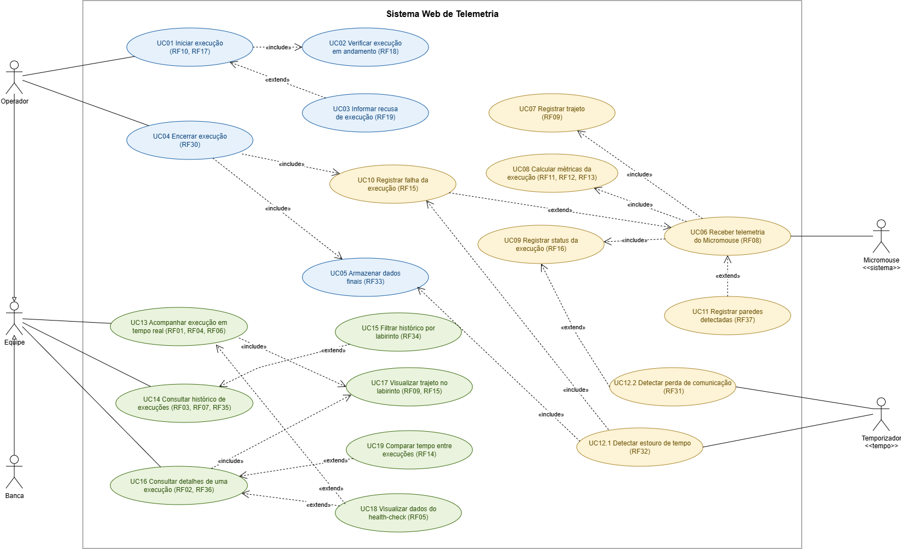

<font size="2"><p style="text-align: center">Fonte: [João Marcos](https://github.com/JJOAOMARCOSS) e [Karoline Luz](https://github.com/KarolineLuz), 2026.</p></font>

<font size="3"><p style="text-align: center">Imagem 2: Diagrama de Casos de Uso do Software Embarcado</p></font>

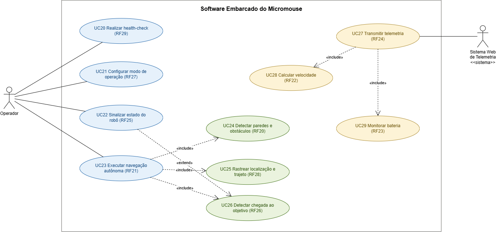

<font size="2"><p style="text-align: center">Fonte: [João Marcos](https://github.com/JJOAOMARCOSS) e [Karoline Luz](https://github.com/KarolineLuz), 2026.</p></font>

## Arquitetura da solução de software

> **Alinhamento operacional:** fluxos, casos de uso (**UC01–UC24**), execução lógica com até **3 tentativas** (TAP) e downlink Bluetooth restrito à **interrupção** manual estão definidos em [2.1 - Backlog e Casos de Uso.md](2.1%20-%20Backlog%20e%20Casos%20de%20Uso.md) e documentados na seção [Backlog do Software](#backlog-do-software) (acima). Em caso de divergência de comportamento, prevalece o **2.1**.


### Propósito do software

O software do projeto tem dois papéis complementares dentro do sistema do Micromouse:

1. **Firmware embarcado (ESP32):** lê os sensores de parede à frente, à esquerda e à direita de cada célula, controla os motores DC com encoder em malha fechada (PID) nos deslocamentos e nos giros de 90° e 180° e executa a navegação autônoma com o algoritmo **flood fill (método Adachi)** — algoritmo mais usado em competições de micromouse, alinhado à bibliografia do projeto (Law; Hilmer/Micromouse Online). O robô não recebe nenhuma informação prévia sobre o labirinto: sabe apenas que a área de objetivo fica no canto diametralmente oposto ao de partida. Para isso, o firmware:
  - mantém um mapa das paredes conhecidas em cada célula e recalcula as distâncias até o objetivo sempre que descobre uma parede nova;
    - deduz o tipo do labirinto (4x4, 8x4 ou 12x4) pela extensão das células visitadas e, a partir dele, escolhe a célula de objetivo candidata (RF27);
    - só declara a chegada depois de confirmar que as bordas daquele tamanho estão fechadas (RF26);
    - grava o mapa, a posição e o estado na memória flash (RF42), preservando o mapa entre tentativas da mesma execução lógica quando o operador retoma após falha (RF38);
    - executa a exploração dentro do limite de **10 minutos totais por tipo de labirinto**, que somam até 3 tentativas da mesma execução lógica (RF32, TAP);
    - mede o avanço pelos encoders; o ToF frontal corrige a posição quando há parede à frente; os ToF laterais centralizam o robô no corredor (RF21, RF22);
    - envia a telemetria (posição, trajeto e bateria) via **Bluetooth** em uma tarefa separada, no outro núcleo da ESP32, sem interferir no laço de navegação.
2. **Sistema de Telemetria (web):** é a plataforma de acompanhamento usada pela equipe e pela banca. Recebe e valida as mensagens enviadas pelo Micromouse, registra **execuções lógicas** e **tentativas** (até 3 por execução lógica), trajeto, bateria, velocidade, tempo, status, retomadas e falhas, mantém o histórico e disponibiliza esses dados para visualização, durante e após a execução.

O Sistema de Telemetria **não teleopera** o robô: não envia comandos de navegação nem altera código ou memória do labirinto (RNF06). O único **downlink** previsto no TAP é o comando de **interrupção** Bluetooth quando o operador encerra manualmente uma tentativa em andamento (RF30). **Nova execução**, **Encerrar tentativa** e **Retomar tentativa (*n*/3)** são coordenados pela interface e pelo firmware (**UC01**, **UC16**, **UC15**). O par genérico iniciar/parar por downlink **não** faz parte desta versão. Uma falha no servidor ou na rede não interrompe a navegação autônoma (RNF07). Esta seção detalha principalmente a arquitetura do Sistema de Telemetria; o firmware aparece nos pontos em que se comunica com ele.

### Padrão arquitetural: MVC com a View desacoplada

O Sistema de Telemetria adota o padrão **MVC (Model-View-Controller)** em um **backend monolítico**, com a camada de visualização **desacoplada** e comunicando-se com o backend por uma API REST em JSON.


| Camada         | Responsabilidade no sistema                                                                                                                                                                                                                                                                                                                                                                                                                                                                             | Onde fica                                                |
| -------------- | ------------------------------------------------------------------------------------------------------------------------------------------------------------------------------------------------------------------------------------------------------------------------------------------------------------------------------------------------------------------------------------------------------------------------------------------------------------------------------------------------------- | -------------------------------------------------------- |
| **Model**      | Representa as entidades do domínio (execução lógica, tentativa, trajeto, retomadas, tentativas rejeitadas) e sua persistência, garantindo a integridade dos dados (RF17, RNF01, RNF05).                                                                                                                                                                                                                                                                                                                 | Backend: modelos SQLAlchemy sobre o PostgreSQL           |
| **Controller** | Recebe a telemetria e as requisições do front-end, valida as mensagens (RNF09) e aplica as regras do TAP: abertura de execução lógica e tentativas (**UC16**), uma tentativa aberta por vez (RF18), limite de 3 tentativas, tentativa rejeitada (RF19), encerramento manual com interrupção downlink (RF30, **UC24**), encerramento automático por tempo de execução lógica ou perda de link (**UC21**, RF31, RF32), retomadas (RF38, **UC15**) e chegada ao objetivo (RF26). Devolve os dados em JSON. | Backend: rotas do FastAPI                                |
| **View**       | Apresenta a execução em tempo real, o histórico e os detalhes de cada tentativa ao usuário, com contador **(*n*/3)**, **Nova execução**, **Encerrar tentativa** e **Retomar tentativa (*n*/3)**, consumindo a API do backend.                                                                                                                                                                                                                                                                           | Front-end: **React** com **TypeScript** (`src/frontend`) |


**Justificativa da escolha:**

- **Domínio pequeno e bem delimitado.** O sistema recebe mensagens de um único robô, processa no máximo cerca de 10 mensagens por segundo (RNF11) e atende poucos usuários ao mesmo tempo. Um único backend organizado em MVC resolve esse volume sem a complexidade operacional de vários serviços.
- **Microsserviços foram descartados** porque exigiriam comunicação entre serviços, implantação de várias peças e observabilidade distribuída, um custo que não se justifica para o tamanho do problema e para o prazo da disciplina.
- **Separação clara de responsabilidades.** As regras de execução ficam concentradas no Controller, e o Model isola o acesso ao banco. Isso facilita dividir o trabalho entre os membros e testar as regras de forma independente da interface.


### Linguagens de programação, frameworks e bibliotecas


| Parte     | Linguagem  | Frameworks e bibliotecas          | Papel                                                                                                                     |
| --------- | ---------- | --------------------------------- | ------------------------------------------------------------------------------------------------------------------------- |
| Backend   | Python     | **FastAPI**                       | Define as rotas da API REST (Controller) e gera automaticamente a documentação OpenAPI dos endpoints, atendendo ao RNF13. |
| Backend   | Python     | **Pydantic**                      | Valida o formato, os campos obrigatórios e as faixas das mensagens de telemetria antes de qualquer processamento (RNF09). |
| Backend   | Python     | **SQLAlchemy**                    | ORM que implementa a camada Model e faz o mapeamento das entidades para as tabelas do PostgreSQL.                         |
| Backend   | Python     | **Uvicorn**                       | Servidor ASGI que executa a aplicação FastAPI.                                                                            |
| Front-end | TypeScript | **React**                         | Implementa a View em SPA: telas de tempo real, histórico, detalhe e labirinto, consumindo REST (comandos/consultas) e **SSE** para execução em andamento (RF04, RF06).     |
| Firmware  | C          | A definir pela equipe de firmware | Navegação com flood fill, leitura dos sensores ToF, controle dos motores (PID) e envio de telemetria na ESP32; previstos a biblioteca do sensor ToF, o contador de pulsos do ESP32 (PCNT) para os encoders e o PWM (LEDC) para a ponte H. |


**Por que React com TypeScript no front-end:**

- **React** organiza a interface em componentes reutilizáveis (telemetria, contador *n*/3, modais de encerramento), o que facilita manter as telas previstas no protótipo e no diagrama de componentes.
- **TypeScript** tipa as respostas JSON da API e os estados da execução, reduzindo erros de integração com o backend (RNF01) e documentando o contrato da API no próprio código.
- A stack é amplamente usada na indústria e tem documentação madura, o que ajuda a equipe a evoluir a View sem acoplar regras de negócio ao front-end (MVC com View desacoplada).

**Por que Python com FastAPI:**

- Python tem sintaxe simples e um ecossistema amplo e bem documentado, o que reduz a curva de aprendizado em um projeto de prazo curto.
- A documentação interativa dos endpoints é gerada a partir do próprio código, o que mantém a documentação da API sempre atualizada (RNF13).
- O suporte nativo a operações assíncronas permite receber telemetria e atender às consultas do front-end ao mesmo tempo, sem atraso acumulado (RNF11).
- Todo o backend é desenvolvido pela equipe, sem plataformas prontas de telemetria ou dashboard (RNF12).

**Por que usar o Pydantic:**

Toda mensagem de telemetria precisa ser conferida antes de ser gravada: se os campos obrigatórios existem, se têm o tipo certo e se os valores fazem sentido (RNF09). Sem o Pydantic, essa conferência teria que ser escrita à mão, campo por campo, em cada rota:

```python
# Sem Pydantic: cada campo é verificado manualmente
def receber_telemetria(mensagem: dict):
    if "celula" not in mensagem or not isinstance(mensagem["celula"], str):
        raise ErroDeValidacao("campo 'celula' ausente ou inválido")
    if "bateria" not in mensagem or not isinstance(mensagem["bateria"], (int, float)):
        raise ErroDeValidacao("campo 'bateria' ausente ou inválido")
    if mensagem["bateria"] < 0:
        raise ErroDeValidacao("campo 'bateria' fora da faixa")
    if mensagem.get("status") not in ("health-check", "running", "success", "failed"):
        raise ErroDeValidacao("campo 'status' inválido")
    # ... e ainda converter o texto do horário de envio para data e hora
```

Com o Pydantic, o formato da mensagem é declarado uma única vez, como uma classe:

```python
# Com Pydantic: as regras ficam declaradas em um só lugar
class Telemetria(BaseModel):
    celula: str
    bateria: float = Field(ge=0)
    status: Literal["health-check", "running", "success", "failed"]
    enviado_em: datetime
```

O exemplo é ilustrativo; o formato final das mensagens será definido no diagrama de componentes. Usar o Pydantic é mais simples e mais seguro do que não usá-lo porque:

- **Menos código repetido:** a regra de cada campo aparece uma vez, na classe, em vez de se repetir em cada rota que recebe ou devolve dados.
- **Validação automática:** o FastAPI aplica a classe na entrada da rota. Uma mensagem inválida é recusada antes de chegar à lógica da execução, com uma resposta que indica qual campo falhou, e o serviço continua funcionando (RNF09).
- **Conversão de tipos:** valores como o horário de envio chegam como texto e são convertidos automaticamente para data e hora, sem código extra.
- **Documentação gerada a partir do código:** a mesma classe aparece na documentação automática da API, então o formato documentado é sempre o formato validado (RNF13).
- **Menos chance de erro:** esquecer uma verificação manual em uma rota deixaria passar dados inválidos para o banco; com a classe, todas as rotas usam as mesmas regras.


### Banco de dados: relacional com PostgreSQL

O sistema usa um banco de dados **relacional**, o **PostgreSQL**.

**Por que relacional:**

- Os dados têm estrutura fixa e relações claras: cada **execução lógica** agrupa até três **tentativas**; cada tentativa pertence a um labirinto, possui trajeto (sequência de células), eventos de retomada e, quando falha, um motivo. Esse formato se representa naturalmente em tabelas relacionadas, que serão detalhadas no diagrama entidade-relacionamento.
- As consultas previstas são típicas de banco relacional: filtrar execuções por labirinto (RF34), listar todas em ordem cronológica (RF03, RF35) e comparar tempos entre execuções (RF14).
- Chaves primárias, chaves estrangeiras e transações garantem a unicidade de cada execução (RF17) e impedem registros incompletos ou inconsistentes (RNF01).
- Um banco não relacional (como o MongoDB) seria vantajoso para dados sem esquema definido, o que não é o caso: a telemetria tem campos conhecidos e validados na entrada.

**Por que PostgreSQL:**

- Suporta com folga a escrita contínua da telemetria ao mesmo tempo que o front-end consulta a execução em andamento a cada 1 a 2 segundos.
- Oferece restrições de integridade (`UNIQUE`, `CHECK`, chaves estrangeiras) que reforçam no próprio banco as regras do domínio.
- Tem imagem oficial para Docker e integração madura com o SQLAlchemy.
- Os dados ficam em um volume persistente, preservados após reiniciar o servidor ou o computador (RNF05).


### Ambiente de execução

O backend e o banco são executados com **Docker Compose** no notebook da equipe, com dois serviços:


| Serviço | Conteúdo                                 | Observação                                                  |
| ------- | ---------------------------------------- | ----------------------------------------------------------- |
| `api`   | Aplicação FastAPI executada pelo Uvicorn | Expõe a API REST para a ponte Bluetooth e para o front-end. |
| `db`    | PostgreSQL                               | Usa um volume nomeado para persistir os dados (RNF05).      |


O backend e o banco sobem com **Docker Compose** (`docker compose up`). A **ponte Bluetooth** (Canal do Micromouse) roda no notebook da equipe, fora do container, lendo a porta serial pareada e repassando telemetria à API — alinhado ao RF4 da Eletrônica (TAP). O sistema funciona em **rede local** no notebook, sem depender de acesso à internet (RNF10).

### Comunicação entre as partes


#### Entre o Micromouse e o Sistema de Telemetria

O Micromouse envia telemetria por **Bluetooth (serial)**; o sistema web recebe os dados pela ponte e, quando o operador encerra manualmente uma tentativa (**RF30**, **UC24**), envia de volta apenas o comando de **interrupção** — nunca navegação nem iniciar/parar genérico (RNF06). O componente **Canal do Micromouse** isola o transporte: a ponte entrega mensagens ao Controller em formato único e, se houver interrupção pendente, escreve-a na porta serial. Controller, Model, banco e front-end permanecem independentes do detalhe da serial.

A ESP32 oferece Wi-Fi e Bluetooth integrados; o **TAP e o RF4 da Eletrônica** fixam Bluetooth para telemetria. A Opção Wi-Fi foi avaliada para referência:


| Critério            | Opção A: Wi-Fi (HTTP) — referência                | Opção B: Bluetooth (serial) — **adotada (TAP)**                                                                                   |
| ------------------- | ------------------------------------------------- | --------------------------------------------------------------------------------------------------------------------------------- |
| Canal do Micromouse | Endpoint do FastAPI com comando na resposta HTTP. | Processo ponte no notebook: lê serial Bluetooth, trata reconexões (RNF08), repassa à API e envia **interrupção** quando pendente. |
| Infraestrutura      | Rede local ou AP da ESP32.                        | Conexão ponto a ponto com o notebook (alcance curto, adequado ao acompanhamento ao lado do carrinho).                                                                                             |
| Ambiente UnB        | Wi-Fi institucional instável e imprevisível na prova. | Não depende da rede campus; enlace dedicado notebook ↔ robô.                                                                 |
| Alinhamento TAP     | Não previsto no orçamento eletrônico.             | Previsto no TAP (módulo Bluetooth).                                                                                               |


**Decisão:** **Bluetooth serial** com ponte no notebook. Wi-Fi e Bluetooth são tecnicamente viáveis na ESP32; para este projeto, Bluetooth reduz risco operacional na UnB e está no TAP. Wi-Fi permanece documentado apenas como alternativa de estudo.

**Fluxo operacional (TAP / 2.1).**

1. O operador aciona **Nova execução**, informa o tipo de labirinto (só no backend, para a web desenhar a grade do labirinto) e abre a **execução lógica** com **tentativa 1/3** (**UC16**), respeitando uma tentativa aberta por vez (RF18).
2. O firmware executa **health-check** (**UC01**) e envia telemetria com status `health-check`. O backend associa os dados à `tentativa_id` e ao `attempt_index` (RF10, RF17).
3. Com health-check aprovado, o firmware inicia o trajeto de forma autônoma (`running`); o backend registra a transição pela telemetria recebida — **sem** downlink de “iniciar” (RF39 reservado à **interrupção** Bluetooth).
4. **Encerramento manual (RF30):** o operador usa **Encerrar tentativa** (modal com motivo `collision`, `stuck` ou `out_of_track` e observação opcional). A tentativa passa a `failed`, com o motivo escolhido e a origem `encerrado_operador`; a execução lógica permanece `em_andamento`. A ponte envia **interrupção** Bluetooth quando aplicável (**UC24**).
5. **Encerramento automático (UC21):** **10 s** sem telemetria (RF31) ou **10 min** de execução lógica desde **Nova execução** (RF32) encerram a tentativa aberta e cancelam a execução lógica, **sem** downlink obrigatório ao robô.
6. Após falha recuperável, o operador aciona **Retomar tentativa (*n*/3)** (**UC15**), abrindo nova `tentativa_id` com mapa preservado (RF38, RF42).
7. Parada de emergência sem rede: botão **BOOT** (RF41).

No firmware, o envio da telemetria roda em tarefa FreeRTOS no outro núcleo. O laço de navegação consulta apenas sinalização local de interrupção (Bluetooth ou BOOT), sem bloquear na rede (RNF07).

#### Entre o front-end e o backend

O front-end consome a API REST do backend em JSON para consultas e comandos (**Nova execução**, **Encerrar tentativa**, **Retomar tentativa**). Para o acompanhamento em tempo real, a View assina um fluxo **SSE** (`EventSource`) exposto por `getStream(execucaoId)`, conforme o [diagrama de classes MVC](#diagrama-de-classes-mvc). A interface exibe o tempo desde a última atualização e o indicador **Tentativa *n*/3** (RF04), dentro do orçamento de latência de até 2 segundos na interface (RNF02) e de **3 segundos fim a fim** entre envio pelo robô e exibição (RNF04).

### Diagrama de alto nível 

O diagrama a seguir mostra os blocos da solução, suas responsabilidades e como se comunicam. As classes de cada camada MVC e o contrato REST/SSE entre View e Controller estão no [diagrama de classes](#diagrama-de-classes-mvc).

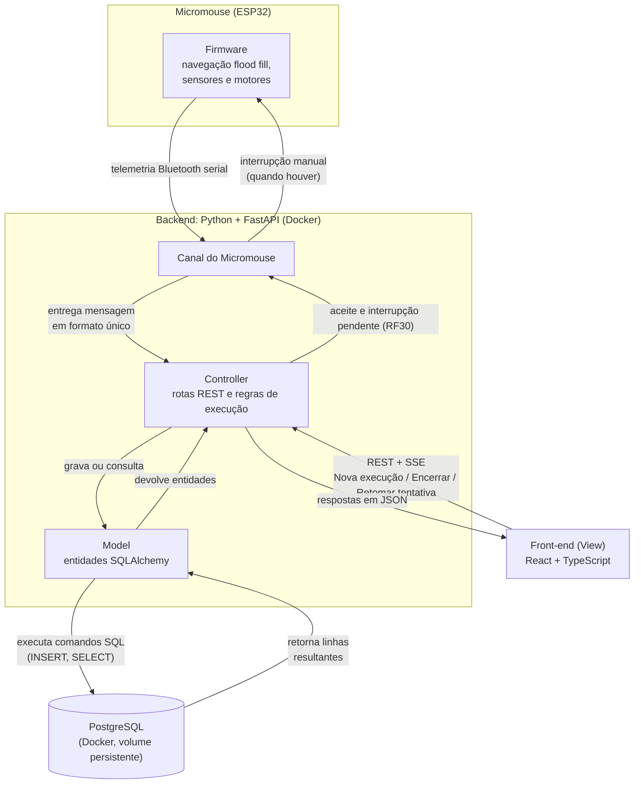
```mermaid
%%{init: {"flowchart": {"nodeSpacing": 90, "rankSpacing": 90}}}%%
flowchart TB
    subgraph ROBO["Micromouse (ESP32)"]
        FW["Firmware<br/>navegação flood fill,<br/>sensores e motores"]
    end

    subgraph BACK["Backend: Python + FastAPI (Docker)"]
        RT["Canal do Micromouse"]
        CT["Controller<br/>rotas REST e regras de execução"]
        MD["Model<br/>entidades SQLAlchemy"]
    end

    DB[("PostgreSQL<br/>(Docker, volume persistente)")]
    FE["Front-end (View)<br/>React + TypeScript"]

    FE -- "REST + SSE<br/>Nova execução / Encerrar / Retomar tentativa" --> CT
    CT -- "respostas em JSON" --> FE
    FW -- "telemetria Bluetooth serial" --> RT
    RT -- "entrega mensagem<br/>em formato único" --> CT
    CT -- "aceite e interrupção pendente (RF30)" --> RT
    RT -- "interrupção manual<br/>(quando houver)" --> FW
    CT -- "grava ou consulta" --> MD
    MD -- "devolve entidades" --> CT
    MD -- "executa comandos SQL<br/>(INSERT, SELECT)" --> DB
    DB -- "retorna linhas<br/>resultantes" --> MD
```


Fonte: [Wanjo Christopher Paraizo Escobar](https://github.com/wChrstphr), 2026.

**Como os dados circulam em uma consulta.** Quando o front-end pede os dados da execução em andamento, a requisição chega ao Controller, que pede ao Model as informações necessárias. O Model não guarda os dados em memória: ele monta a consulta SQL, envia ao PostgreSQL e recebe de volta as linhas resultantes, que converte em entidades (execução, trajeto, retomadas). O Controller usa essas entidades para montar a resposta em JSON e devolve ao front-end, que atualiza a tela. Na gravação da telemetria o caminho é o mesmo, mas o Model envia um comando de inserção e o banco confirma o registro.


| Bloco                          | Responsabilidade                                                                                                                                              |
| ------------------------------ | ------------------------------------------------------------------------------------------------------------------------------------------------------------- |
| Firmware                       | Navega de forma autônoma com flood fill e envia telemetria por Bluetooth. Pode receber apenas **interrupção** downlink (RNF06); parada local via BOOT (RF41). |
| Canal do Micromouse            | Ponte serial Bluetooth: entrega telemetria ao Controller e transmite interrupção manual pendente (RF30).                                                      |
| Controller                     | Valida mensagens; aplica regras TAP (execução lógica, tentativas, RF18–RF19, RF30–RF32, RF38); atende consultas do front-end.                                 |
| Model                          | Persiste execuções lógicas, tentativas, trajetos, retomadas e tentativas rejeitadas.                                                                          |
| PostgreSQL                     | Armazena os dados de forma persistente (RNF05).                                                                                                               |
| Front-end (React + TypeScript) | Tempo real, histórico, contador (*n*/3), Nova execução, Encerrar e Retomar tentativa (RF04, RF30).                                                            |


### Diagrama de classes (MVC)

O diagrama de classes UML detalha o **Sistema de Telemetria** segundo o padrão **MVC**: estereótipos `«interface»` na View (React + TypeScript), `«control»` e serviços auxiliares no Controller (FastAPI), entidades e repositório no Model (SQLAlchemy + PostgreSQL), além do firmware na ESP32 e da ponte Bluetooth no notebook. Ele complementa o [diagrama de alto nível](#diagrama-de-alto-nível) com atributos, métodos e cardinalidades do domínio (execução lógica, tentativas, telemetria e retomadas).

<font size="3"><p style="text-align: center">Figura 2: Diagrama de classes UML — arquitetura MVC (Sistema de Telemetria)</p></font>

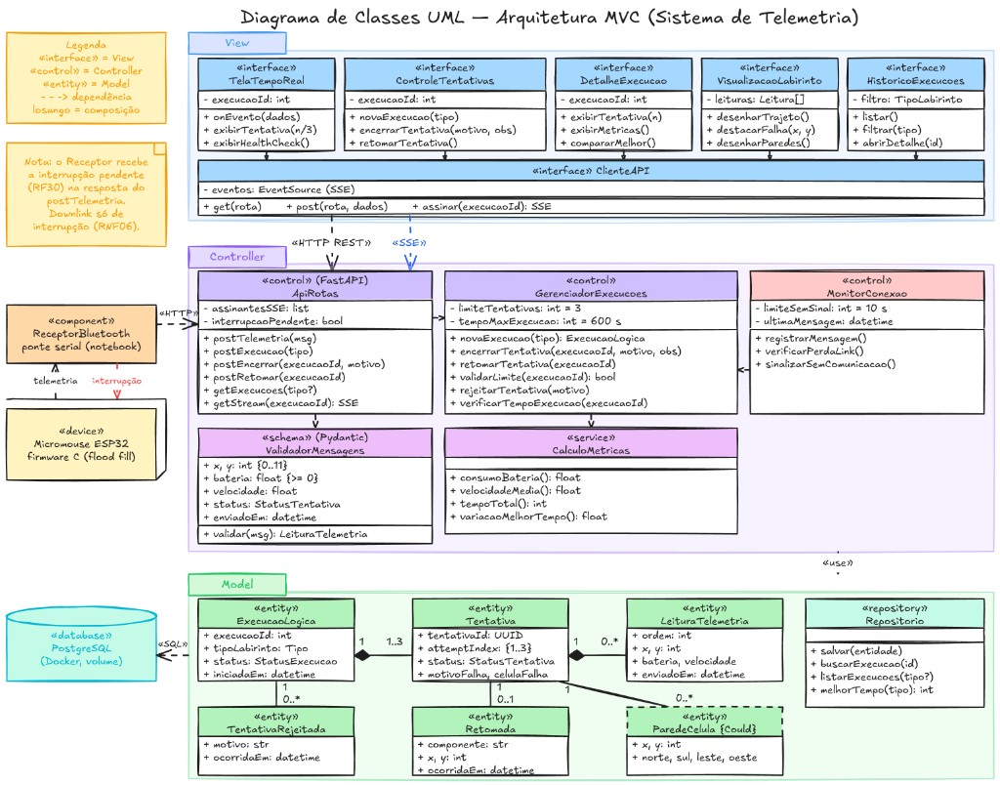

<font size="2"><p style="text-align: center">Fonte: [Amanda de Moura](https://github.com/AmandaaMoura), 2026. [Abrir o diagrama no Excalidraw](https://excalidraw.com/#json=St2AzYKtwrvQTFnbaUy8n,tAtXa2tKqxyaDsyxdI9GOg).</p></font>

#### Notação utilizada


| Elemento       | Representação                  | Significado                                                             |
| -------------- | ------------------------------ | ----------------------------------------------------------------------- |
| `«interface»`  | Classe na faixa **View**       | Contrato ou módulo de interface do front-end (telas e `ClienteAPI`).    |
| `«control»`    | Classe na faixa **Controller** | Orquestra requisições, regras de execução e monitoramento.              |
| `«schema»`     | Classe Pydantic                | Validação de mensagens de telemetria (RNF09).                           |
| `«service»`    | Classe de serviço              | Cálculo de métricas sem estado persistente próprio.                     |
| `«entity»`     | Classe no **Model**            | Entidade de domínio persistida ou agregada ao repositório.              |
| `«repository»` | Classe de repositório          | Acesso a leitura/gravação no PostgreSQL.                                |
| Composição     | Losango preenchido             | Parte não existe sem o todo (ex.: tentativa dentro da execução lógica). |
| Dependência    | Seta tracejada                 | Uso temporário (ex.: leitura referencia paredes da célula).             |


Fonte: Autoria própria, 2026.

#### View (front-end)


| Classe                  | Papel                                               | Métodos principais                                      |
| ----------------------- | --------------------------------------------------- | ------------------------------------------------------- |
| `ClienteAPI`            | Ponto único de HTTP e SSE (`eventos: EventSource`). | `get`, `post`, `assinar(execucaoId)`                    |
| `TelaTempoReal`         | Telemetria da tentativa aberta e health-check.      | `onEvento`, `exibirTentativa(n/3)`, `exibirHealthCheck` |
| `ControleTentativas`    | Ações operacionais e contador *n*/3.                | `novaExecucao`, `encerrarTentativa`, `retomarTentativa` |
| `DetalheExecucao`       | Métricas finais e comparação com melhor tempo.      | `exibirTentativa`, `exibirMetricas`, `compararMelhor`   |
| `VisualizacaoLabirinto` | Trajeto, paredes e célula de falha.                 | `desenharTrajeto`, `destacarFalha`, `desenharParedes`   |
| `HistoricoExecucoes`    | Listagem e filtro por tipo de labirinto.            | `listar`, `filtrar`, `abrirDetalhe`                     |


A View comunica com o Controller por **HTTP REST** (comandos e consultas) e **SSE** (stream da execução em andamento).

#### Controller (backend)


| Classe                 | Papel                                                             | Métodos / campos principais                                                                                                                                                 |
| ---------------------- | ----------------------------------------------------------------- | --------------------------------------------------------------------------------------------------------------------------------------------------------------------------- |
| `ApiRotas`             | Entrada HTTP: telemetria da ponte, CRUD de execuções, stream SSE. | `postTelemetria`, `postExecucao`, `postEncerrar`, `postRetomar`, `getExecucoes`, `getStream`; `interrupcaoPendente`                                                         |
| `GerenciadorExecucoes` | Ciclo de vida da execução lógica e das tentativas.                | `limiteTentativas = 3`, `tempoMaximo = 600 s` (RF32); `novaExecucao`, `encerrarTentativa`, `retomarTentativa`, `validarLimite`, `rejeitarTentativa`, `verificarTempoLimite` |
| `MonitorConexao`       | Perda de link e tempo sem mensagem.                               | `registrarMensagem`, `verificarPerdaLink`, `sinalizarSemComunicacao`; `limiteSemSinal = 10 s`                                                                               |
| `ValidadorMensagens`   | Schema Pydantic da telemetria (`x`, `y`, `bateria`, `status`, …). | `validar(msg) → LeituraTelemetria`                                                                                                                                          |
| `CalculoMetricas`      | Consumo, velocidade média, tempo total e variação.                | `consumoBateria`, `velocidadeMedia`, `tempoTotal`, `variacaoMelhorTempo`                                                                                                    |


**Nota de integração (RF30 / RNF06):** o `ReceptorBluetooth` recebe a **interrupção pendente** na resposta de `postTelemetria`; o downlink Bluetooth serve **apenas** à interrupção manual, nunca à navegação.

#### Model (persistência)


| Classe              | Cardinalidade / relação                         | Conteúdo principal                                                           |
| ------------------- | ----------------------------------------------- | ---------------------------------------------------------------------------- |
| `ExecucaoLogica`    | 1 → 1..3 `Tentativa`; 0..* `TentativaRejeitada` | `execucaoId: UUID`, `tipoLabirinto`, `status`, `iniciadaEm`                  |
| `Tentativa`         | 0..* `LeituraTelemetria`; 0..1 `Retomada`       | `tentativaId`, `attemptIndex` (1..3), `status`, `motivoFalha`, `celulaFalha` |
| `LeituraTelemetria` | Dependência opcional em `ParedeCelula`          | `ordem`, `x`, `y`, `bateria`, `velocidade`, `enviadoEm`                      |
| `Retomada`          | Ligada a uma tentativa                          | `componente`, `x`, `y`, `ocorridaEm`                                         |
| `ParedeCelula`      | Mapa descoberto (Could)                         | `x`, `y`, `norte`, `sul`, `leste`, `oeste`                                   |
| `Repositorio`       | Acesso SQL ao PostgreSQL                        | `salvar`, `buscarExecucao`, `listarExecucoes`, `melhorTempo`                 |


#### Atores externos ao MVC


| Elemento                            | Papel                                                                  |
| ----------------------------------- | ---------------------------------------------------------------------- |
| `Micromouse ESP32` (`«device»`)     | Firmware em C (flood fill): envia telemetria e recebe interrupção.     |
| `ReceptorBluetooth` (`«component»`) | Ponte serial no notebook: HTTP com `ApiRotas`, repasse de interrupção. |
| `PostgreSQL` (`«database»`)         | Persistência em volume Docker (RNF05).                                 |


Fonte: Autoria própria, 2026.

### Diagrama BPMN

O diagrama BPMN 2.0 descreve o processo de **uma execução lógica**, do acionamento de **Nova execução** até um dos cinco fins possíveis: concluída ou cancelada por 3 tentativas esgotadas, por estouro de tempo, por perda de link ou por nova execução. Ele complementa o [diagrama de alto nível](#diagrama-de-alto-nível), que mostra as partes do sistema, e o [diagrama de classes](#diagrama-de-classes-mvc), que mostra as responsabilidades: aqui aparecem a **ordem** das atividades, quem executa cada uma e as mensagens que os participantes trocam. O modelo tem duas páginas, a execução lógica (Figura 3) e o laço de navegação do firmware (Figura 4).

<font size="3"><p style="text-align: center">Figura 3: Diagrama BPMN — execução lógica</p></font>

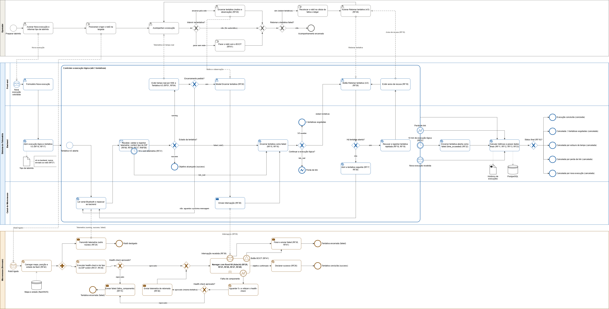

<font size="2"><p style="text-align: center">Fonte: [Luiza da Silva Pugas](https://github.com/Luizaxx) (versão original) e [Wanjo Christopher Paraizo Escobar](https://github.com/wChrstphr) (revisão), 2026. [Abrir o diagrama no draw.io](modelagem/bpmn-micromouse.drawio).</p></font>

#### Legenda BPMN


| Elemento                         | Representação                                    | Significado                                                                     |
| -------------------------------- | ------------------------------------------------ | ------------------------------------------------------------------------------- |
| Pool                             | Faixa horizontal com o nome na lateral           | Participante do processo (Operador, Sistema de Telemetria, Micromouse).         |
| Raia                             | Subdivisão de um pool                            | Parte do participante responsável pelas atividades (Front-end, Backend, Canal). |
| Tarefa                           | Retângulo de cantos arredondados                 | Atividade executada por uma pessoa ou pelo sistema.                             |
| Subprocesso expandido            | Retângulo grande com atividades dentro           | Conjunto de atividades que se repete a cada tentativa (até 3).                  |
| Subprocesso colapsado            | Tarefa com o marcador "+"                        | Atividade detalhada em outro diagrama (o laço de navegação da Figura 4).        |
| Evento de início e de fim        | Círculo de borda fina (início) ou grossa (fim)   | Onde o fluxo começa e onde termina.                                             |
| Gateway exclusivo                | Losango com "X"                                  | Decisão em que só um dos caminhos segue.                                        |
| Gateway paralelo                 | Losango com "+"                                  | Caminhos que seguem ao mesmo tempo.                                             |
| Evento de mensagem               | Círculo com envelope                             | Envio ou recebimento de uma mensagem de outro participante.                     |
| Evento de timer                  | Círculo com relógio                              | Prazo que dispara o fluxo (10 min por execução lógica, 10 s sem telemetria).    |
| Evento de sinal                  | Círculo com triângulo                            | Aviso local, sem mensagem (o botão BOOT).                                       |
| Evento de erro                   | Círculo com raio                                 | Falha que interrompe a atividade (falha de componente, perda de link).          |
| Evento de fronteira interruptivo | Evento de borda dupla sobre a borda da atividade | Ocorrência que interrompe a atividade e desvia o fluxo.                         |
| Fluxo de sequência               | Seta contínua                                    | Ordem das atividades dentro de um participante.                                 |
| Fluxo de mensagem                | Seta tracejada com círculo na origem             | Comunicação entre participantes diferentes.                                     |
| Objeto de dados                  | Folha com canto dobrado                          | Insumo ou resultado do processo (tipo de labirinto, histórico de execuções).    |
| Depósito de dados                | Cilindro                                         | Armazenamento que continua depois do processo (PostgreSQL, flash/NVS).          |


Fonte: Autoria própria, 2026.

#### Participantes


| Participante                                   | Papel no processo                           | Atividades principais                                                                                                                                                                                                                                                                                               |
| ---------------------------------------------- | ------------------------------------------- | ------------------------------------------------------------------------------------------------------------------------------------------------------------------------------------------------------------------------------------------------------------------------------------------------------------------- |
| **Operador**                                   | Pessoa da equipe que conduz a prova.        | Aciona **Nova execução** e informa o tipo de labirinto; posiciona e liga o robô; acompanha; encerra a tentativa pela web (RF30) ou pelo BOOT (RF41); recoloca o robô e aciona **Retomar tentativa (*n*/3)** (RF38).                                                                                                 |
| **Sistema de Telemetria: Front-end**           | Interface web (View).                       | Formulário de Nova execução; tempo real por SSE com o contador *n*/3 (RF01, RF04); modal **Encerrar tentativa** (RF30); botão **Retomar tentativa (*n*/3)** (RF38); aviso de recusa (RF19).                                                                                                                         |
| **Sistema de Telemetria: Backend**             | Regras das tentativas (Controller e Model). | Abre a execução lógica e a tentativa 1/3 (RF10, RF17); valida e registra a telemetria (RF08, RF09, RNF09); encerra tentativas como `failed` (RF15, RF16); recusa uma segunda tentativa aberta (RF18, RF19); aplica os limites de 10 s (RF31) e 10 min (RF32); calcula e grava as métricas (RF11, RF12, RF13, RF33). |
| **Sistema de Telemetria: Canal do Micromouse** | Ponte Bluetooth serial no notebook.         | Lê a serial e repassa a telemetria ao backend; envia a **interrupção** ao robô (RF39).                                                                                                                                                                                                                              |
| **Micromouse (firmware)**                      | Robô autônomo na ESP32.                     | Carrega o estado da flash (RF42); faz o health-check (RF29); transmite telemetria em outro núcleo (RF24); navega com flood fill e o método Adachi; para ao receber a interrupção ou ao toque do BOOT.                                                                                                               |


Fonte: Autoria própria, 2026.

O **Micromouse** é autônomo (RNF07): ele não recebe ordens de navegação nem informação prévia do labirinto. Por isso os pools só se comunicam por fluxos de mensagem, descritos a seguir.

#### Mensagens entre os participantes


| Mensagem                              | De                  | Para                | Quando                                                                                        |
| ------------------------------------- | ------------------- | ------------------- | --------------------------------------------------------------------------------------------- |
| Nova execução                         | Operador            | Front-end           | O operador preenche o formulário, com o tipo de labirinto.                                    |
| Robô ligado                           | Operador            | Micromouse          | O operador posiciona o robô na largada e o liga; é uma ação física, não uma mensagem de rede. |
| Telemetria (running, success, failed) | Micromouse          | Canal do Micromouse | Durante toda a tentativa, por Bluetooth serial (RF24).                                        |
| Telemetria em tempo real              | Front-end           | Operador            | A cada leitura aceita pelo backend, por SSE (RF01, RF04).                                     |
| Motivo e observação                   | Operador            | Front-end           | O operador decide encerrar a tentativa pela web (RF30).                                       |
| **Interrupção (RF39)**                | Canal do Micromouse | Micromouse          | **Só** no encerramento manual pela web. É o único fluxo do Sistema de Telemetria para o robô. |
| Retomar tentativa                     | Operador            | Front-end           | Depois de uma tentativa `failed`, se restarem tentativas (RF38).                              |
| Aviso de recusa (RF19)                | Front-end           | Operador            | O backend recusou abrir a tentativa porque já havia uma aberta (RF18).                        |


Fonte: Autoria própria, 2026.

#### Dados do processo


| Dado                      | Tipo                    | Uso                                                                                                                                 |
| ------------------------- | ----------------------- | ----------------------------------------------------------------------------------------------------------------------------------- |
| Tipo de labirinto         | Objeto de dados         | Informado em Nova execução e guardado **só no backend**, para a web desenhar a grade. **Nunca** é enviado ao robô (RF27).           |
| Mapa e estado (flash/NVS) | Depósito de dados       | Mapa das paredes, posição, estado da execução e tipos já resolvidos. O firmware carrega ao ligar e grava a cada célula nova (RF42). |
| PostgreSQL                | Depósito de dados       | Tentativas, telemetria, métricas e status final (RF33).                                                                             |
| Histórico de execuções    | Objeto de dados (saída) | Resultado consultado depois pela web (RF34, RF35, RF36).                                                                            |


Fonte: Autoria própria, 2026.

#### Caminhos da execução lógica

O subprocesso expandido "Controlar a execução lógica (até 3 tentativas)" concentra as regras das tentativas no Sistema de Telemetria. Os caminhos possíveis são:

1. **Abertura.** O operador aciona **Nova execução** e informa o tipo de labirinto. O backend abre a execução lógica e a tentativa 1/3 (RF10, RF17) e começa a contar os 10 minutos. O operador então posiciona e liga o robô. O firmware carrega da flash o mapa e o estado (RF42) e, em paralelo, começa a transmitir telemetria por outro núcleo (RF24) e executa o health-check (RF29).
2. **Tentativa em andamento.** Cada mensagem passa pelo Canal do Micromouse e é validada e registrada pelo backend (RF08, RF09, RNF09). Com status `running`, o front-end atualiza o tempo real por SSE e o fluxo aguarda a próxima mensagem. Não existe comando de "iniciar": com o health-check aprovado, o robô parte sozinho.
3. **Sucesso.** O firmware só declara sucesso depois de provar a borda do tipo de labirinto (RF26) e grava o tipo resolvido na flash (RF42). O backend recebe `success`, calcula as métricas e fecha a execução lógica como **concluída**.
4. **Falha de componente.** O evento de erro na borda da navegação desvia o firmware para "Aguardar 5 s e refazer o health-check". Se o health-check passar, o robô envia a telemetria de retomada e continua **na mesma tentativa**, com o mesmo relógio e sem consumir tentativa. Se reprovar, ou se o health-check inicial já reprovar, o firmware envia `failed` com motivo `falha_componente` (RF15).
5. **Encerramento manual.** O operador escolhe o motivo e a observação no modal **Encerrar tentativa** (RF30), e o Canal do Micromouse envia a **interrupção** (RF39). O firmware para e envia `failed`. Sem rede, o operador para o robô com o botão **BOOT** (RF41), com o mesmo resultado.
6. **Tentativa `failed` e retomada.** O backend encerra a tentativa como `failed` (RF15, RF16) e decide: com as 3 tentativas usadas, a execução lógica termina como **cancelada**; se restarem tentativas, o operador recoloca o robô na célula da falha, religa e aciona **Retomar tentativa (*n*/3)** (RF38). O backend recusa o pedido se já houver tentativa aberta (RF18, RF19); caso contrário, abre a tentativa seguinte (RF17, RF38).
7. **Encerramentos automáticos.** Três eventos na borda do subprocesso encerram a execução lógica como **cancelada**:
    - **10 s sem telemetria** (RF31): a tentativa passa a `failed` com `link_lost` e o erro "Perda de link" sai do subprocesso;
    - **10 min de execução lógica** (RF32), contados desde Nova execução e somando as tentativas e os intervalos: a tentativa aberta passa a `failed` com `time_exceeded`;
    - **Nova execução recebida**: o operador abre outra execução lógica.

    Nenhum desses caminhos envia comando ao robô. Se ele ainda estiver andando, o operador o para com o **BOOT** (RF41).
8. **Fechamento.** Em todos os casos, o backend calcula as métricas e grava os dados finais no PostgreSQL (RF11, RF12, RF13, RF33), e a execução lógica termina com o status do fim correspondente (RF16).

#### Laço de navegação do firmware

A Figura 4 detalha o subprocesso colapsado "Navegar com flood fill (Adachi)" do pool Micromouse. O laço roda uma vez por célula e segue o pseudocódigo da seção [Algoritmo de navegação](#algoritmo-de-navegação), onde está a justificativa da escolha.

<font size="3"><p style="text-align: center">Figura 4: Diagrama BPMN — laço de navegação do firmware</p></font>

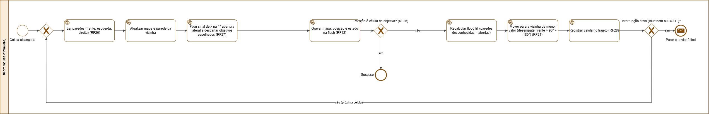

<font size="2"><p style="text-align: center">Fonte: [Luiza da Silva Pugas](https://github.com/Luizaxx) (versão original) e [Wanjo Christopher Paraizo Escobar](https://github.com/wChrstphr) (revisão), 2026. [Abrir o diagrama no draw.io](modelagem/bpmn-micromouse.drawio).</p></font>


| Passo | O que o firmware faz                                                                                                                                                                        | Requisito  |
| ----- | ------------------------------------------------------------------------------------------------------------------------------------------------------------------------------------------- | ---------- |
| 1     | Lê as paredes da frente, da esquerda e da direita.                                                                                                                                          | RF20       |
| 2     | Atualiza o mapa, incluindo a parede vista pela célula vizinha.                                                                                                                              | —          |
| 3     | Na primeira abertura lateral, fixa o sinal do eixo x.                                                                                                                                       | —          |
| 4     | Atualiza a extensão conhecida, o tipo de labirinto provável e os objetivos candidatos.                                                                                                      | RF27       |
| 5     | Grava mapa, posição e estado na flash.                                                                                                                                                      | RF42       |
| 6     | Se a posição é um objetivo candidato e a borda do tipo atual já está provada, declara **sucesso**. Se a borda não está provada, marca os segmentos de borda desconhecidos como novos alvos. | RF26       |
| 7     | Recalcula o flood fill, tratando paredes desconhecidas como abertas.                                                                                                                        | —          |
| 8     | Move para a vizinha de menor valor, com desempate frente > 90° > 180°.                                                                                                                      | RF21       |
| 9     | Registra a célula no trajeto.                                                                                                                                                               | RF28       |
| 10    | Se há interrupção ativa (Bluetooth ou BOOT), para e envia `failed`. Senão, volta ao passo 1 na próxima célula.                                                                              | RF39, RF41 |


Fonte: Autoria própria, 2026.

### Algoritmo de navegação


#### Restrições do problema

- O robô **não recebe nenhuma informação prévia** sobre o labirinto: nem o formato das paredes, nem o tamanho. Sabe apenas que parte de um beco sem saída em um canto e que a área de objetivo fica no **canto diametralmente oposto**.
- Os labirintos possíveis são 4x4, 8x4 e 12x4, com células de 18 cm. Cada tipo de labirinto tem **10 minutos no total**, somando até 3 tentativas.
- Basta chegar ao objetivo uma vez por execução; não há corrida de volta nem corrida rápida posterior.
- Os sensores enxergam apenas as paredes da célula atual (frente, esquerda e direita), e os giros de 90° e 180° custam tempo.


#### Estado da arte


| Algoritmo                   | Como funciona                                                                                                  | Vantagens                                                                                              | Desvantagens                                                                                                      | Fontes                                                   |
| --------------------------- | -------------------------------------------------------------------------------------------------------------- | ------------------------------------------------------------------------------------------------------ | ----------------------------------------------------------------------------------------------------------------- | -------------------------------------------------------- |
| Busca em profundidade (DFS) | Segue um caminho até não haver saída e então volta pela pilha até a última bifurcação com opção não explorada. | Não precisa saber onde fica o objetivo; implementação simples.                                         | Não garante o menor caminho e perde tempo explorando o labirinto inteiro; o retrocesso gera muitos giros de 180°. | [[7, p. 24, 28]](#ref-arq-7)                             |
| Flood fill                  | Atribui a cada célula a distância até o objetivo e move o robô sempre para a vizinha de menor distância.       | Direciona a busca ao objetivo; o mesmo mapa de distâncias serve para explorar e para seguir o caminho. | Precisa conhecer a posição do objetivo para numerar as células.                                                   | [[6, p. 503]](#ref-arq-6), [[9]](#ref-arq-9)             |
| Flood fill modificado       | Igual ao flood fill, mas recalcula apenas as células afetadas pela parede nova.                                | Percorre as mesmas células que o flood fill com muito menos atualizações de distância.                 | Implementação mais complexa; o ganho só aparece em labirintos grandes.                                            | [[6, p. 503, 506]](#ref-arq-6), [[7, p. 29]](#ref-arq-7) |
| A                           | Busca guiada por uma estimativa da distância restante até o objetivo.                                          | Encontra o menor caminho.                                                                              | Usa mais memória, pois guarda toda a lista aberta; em um labirinto 5x5 não se diferenciou do flood fill.          | [[8, p. 366, 368, 372]](#ref-arq-8)                      |


Segundo Law, o flood fill venceu primeiros lugares em competições internacionais de micromouse, e sua versão modificada é a mais usada nelas [[6, p. 503]](#ref-arq-6). Nos cinco labirintos de competição testados pelo autor, as duas versões percorreram exatamente o mesmo número de células; a diferença esteve só no esforço de cálculo, por exemplo 135.936 contra 3.197 atualizações de distância no labirinto da IEEE Region 6 de 2012 [[6, p. 506, Tabela I]](#ref-arq-6). Sharma e Munshi chegam à mesma recomendação para competições [[7, p. 29]](#ref-arq-7).

#### O método Adachi

O método Adachi (足立法) foi criado por Yoshihiko Adachi quando ele era estudante e membro do Fukuyama Microcomputer Club, e foi apresentado em 1984 [[10, seção 4-5]](#ref-arq-10), [[11]](#ref-arq-11). Até então, a abordagem comum era **percorrer o labirinto inteiro primeiro e só depois calcular o caminho mínimo** [[10, seção 4-5]](#ref-arq-10). A ideia do método, como descrita pela JSDKK, é:

1. Olhar para o labirinto como um **mapa em branco até o objetivo** e imaginar o caminho mais curto até ele.
2. Seguir esse caminho. Ao encontrar uma parede, **levá-la em conta, junto com as paredes já vistas, e recalcular** o caminho mais curto.
3. Repetir até chegar.

Em outras palavras, o método **trata toda parede desconhecida como inexistente** (未知の壁を無いものとして考える). É o mesmo raciocínio de uma pessoa perdida que sabe onde fica a saída: ela supõe o caminho mais curto, vai conferir e, se estiver bloqueado, pensa de novo [[10, seção 4-5]](#ref-arq-10). A mesma fonte afirma que os métodos de busca predominantes hoje são evoluções do método Adachi e que quase todos os mouses de nível mais alto o utilizam [[10, seção 4-5]](#ref-arq-10).

**Como o "caminho mais curto" é calculado: o flood fill.** Harrison descreve o flood fill (ou algoritmo de Bellman) como o método mais simples disponível a um micromouse [[9]](#ref-arq-9):

1. Guardar um valor por célula do labirinto.
2. Colocar o valor 0 na célula de objetivo.
3. Percorrer todas as células e garantir que cada uma tenha um valor igual a 1 a mais que o da sua vizinha acessível de menor valor.
4. Repetir o passo 3 até que os valores parem de mudar.

Depois disso, cada célula guarda sua distância até o objetivo, e basta o robô "descer" os valores, indo sempre para a vizinha de valor menor. O cálculo só precisa ser refeito quando uma decisão é necessária, isto é, em uma bifurcação, e pode ser distribuído em pequenos pedaços enquanto o robô se move [[9]](#ref-arq-9). Combinado com a hipótese de Adachi, as células ainda não visitadas entram no cálculo como se não tivessem paredes, então todo o labirinto tem distância definida desde o início.

**As quatro variantes de Adachi.** Harrison reconstruiu, a partir de anotações em japonês, os quatro métodos que Adachi apresentou para a fase de busca [[11]](#ref-arq-11):


| Variante | Comportamento                                                                                                                                                                | Observação                                                                                     |
| -------- | ---------------------------------------------------------------------------------------------------------------------------------------------------------------------------- | ---------------------------------------------------------------------------------------------- |
| Método 0 | Vai e volta entre a largada e o objetivo, sempre pelo melhor caminho a partir de onde está, até que o melhor caminho entre os dois não passe por nenhuma célula inexplorada. | Pode desperdiçar tempo e corridas, pois precisa tocar a largada e o objetivo em cada passagem. |
| Método 1 | Procura as células inexploradas que estão no melhor caminho calculado entre a largada e o objetivo, calculando duas rotas a cada decisão.                                    | O caminho ótimo pode mudar durante a exploração e fazer o robô trocar de alvo.                 |
| Método 2 | Alterna entre a largada e o objetivo, mas inverte o sentido assim que o caminho até o alvo atual já é ótimo, sem precisar tocá-lo.                                           | Corrige o principal defeito do método 0.                                                       |
| Método 3 | Usa o método 0 para encontrar o objetivo pela primeira vez e depois passa para o método 1.                                                                                   | É uma otimização do método 1 com uma busca inicial mais rápida.                                |


Todas as variantes compartilham o núcleo descrito pela JSDKK; elas diferem no que fazer **depois** de chegar ao objetivo, quando o robô procura o caminho mínimo para as corridas rápidas. Como neste projeto basta chegar ao objetivo uma vez, o que interessa é esse núcleo, que corresponde à primeira ida do método 0 (e à fase inicial do método 3).

#### Decisão: flood fill com o método Adachi {#decisao-flood-fill-adachi}

O firmware adota o **flood fill com a hipótese de Adachi** (paredes desconhecidas tratadas como inexistentes e recálculo a cada parede nova), conforme o item **4.2.3.2.1** da [EAP de Software](3%20-%20EAP.md#423-software-embarcado). A DFS foi descartada após a análise do estado da arte. Os motivos são:

- **É o que a literatura e as competições indicam.** O flood fill e suas variantes são os mais usados e premiados [[6, p. 503]](#ref-arq-6), [[10, seção 4-5]](#ref-arq-10). Nas fontes consultadas, a DFS aparece apenas como alternativa inferior, por não garantir o menor caminho e explorar o labirinto inteiro [[7, p. 24, 28]](#ref-arq-7).
- **Vai direto ao objetivo.** O robô não precisa varrer o labirinto, o que reduz tempo, giros de 180° e desgaste da bateria dentro do limite de 10 minutos.
- **Tolera erro no mapa.** Como o caminho é recalculado a cada parede descoberta, uma leitura diferente da esperada apenas muda as distâncias. Na DFS, uma parede lida errada corrompe a pilha de retrocesso. A odometria por encoders reduz o principal risco do mapa em malha aberta: a patinação não percebida.
- **Custo computacional desprezível.** Com no máximo 144 células no mapa (ver abaixo), recalcular todas as distâncias leva muito menos que o tempo de atravessar uma célula. Por isso, o flood fill simples é suficiente e mais fácil de depurar do que a versão modificada, cujo ganho só aparece em labirintos grandes [[6, p. 506]](#ref-arq-6).


#### Adaptação ao labirinto de tamanho desconhecido

Nas fontes consultadas, o flood fill é aplicado a labirintos de **tamanho e objetivo conhecidos**. Neste projeto, o tamanho só é descoberto durante a execução. As regras abaixo são **inferências da equipe** a partir dessa restrição, não resultados tirados da literatura.

**Referencial do robô.** A largada é a célula (0, 0). O eixo **y** aponta para a abertura do beco da largada e é sempre positivo. O eixo **x** é o lateral: na largada, o robô não sabe se o labirinto se estende para a direita ou para a esquerda, e o sinal de x é fixado na primeira abertura lateral que ele encontrar. Com o sinal fixado, x também passa a ser sempre positivo, e o mapa cabe em uma matriz de 12 × 12 células.

**Mapa na memória.** Cada célula guarda 4 bits de paredes (norte, sul, leste e oeste), um bit de "visitada" e a distância até o objetivo. O mapa, a posição, o estado da execução e os tipos de labirinto já resolvidos ficam gravados na flash (RF42).

**Tipo do labirinto e objetivo candidato.** O firmware acompanha a maior coordenada visitada em cada eixo (a extensão). Como os labirintos são sempre Nx4:


| Extensão observada                | Tipo             | Objetivo candidato                      |
| --------------------------------- | ---------------- | --------------------------------------- |
| Nenhum eixo passou de 3           | 4x4 (provisório) | (3, 3)                                  |
| Um eixo passou de 3, mas não de 7 | 8x4              | (7, 3) ou (3, 7), conforme o eixo longo |
| Um eixo passou de 7               | 12x4             | (11, 3) ou (3, 11)                      |


Enquanto o sinal de x não estiver fixado, os objetivos espelhados também entram no cálculo. O flood fill aceita vários objetivos ao mesmo tempo: basta colocar 0 em todas as células candidatas. Os tipos já resolvidos com sucesso em execuções anteriores são retirados dos candidatos (por exemplo, com o 4x4 resolvido, o robô começa com (7, 3) e (3, 7)).

**Prova de borda antes de declarar a chegada (RF26).** Paredes internas e externas são iguais, então chegar ao (3, 3) com parede à direita e acima não prova que o labirinto é 4x4. A regra usa um fato das regras do desafio: **o objetivo é sempre alcançável a partir da largada**. Se uma linha inteira de 4 paredes estiver fechada, nada além dela é alcançável e, portanto, ali termina o labirinto.


| Tipo | Linhas que precisam estar inteiramente fechadas                         |
| ---- | ----------------------------------------------------------------------- |
| 4x4  | x = 3|4 e y = 3|4                                                       |
| 8x4  | a linha 7|8 do eixo longo (o eixo curto já tem 4 células por definição) |
| 12x4 | nenhuma, pois não existe labirinto maior                                |


Enquanto a borda não estiver provada, os segmentos ainda desconhecidos dessa linha viram alvos do flood fill, e o robô vai conferi-los. Se algum estiver aberto, o labirinto continua, o tipo avança e o objetivo candidato muda.

**Desempate por giros.** Quando duas vizinhas têm a mesma distância, o robô prefere seguir em frente, depois girar 90° e, por último, girar 180°. Um peso de giro no próprio cálculo das distâncias fica como melhoria a avaliar nos testes.

**Falha de componente, retomada TAP e botão BOOT.** Falha de componente encerra a **tentativa** (`failed`, RF15). O operador aciona **Retomar tentativa (*n*/3)**; o backend abre nova tentativa, o firmware refaz **UC01** e pode marcar telemetria de **retomada** (RF38), preservando mapa e posição na flash (RF42). Se o health-check falhar de novo, nova tentativa `failed` com `falha_componente`. Recolhimento físico: toque curto no BOOT apaga o mapa antes de recolocar na largada; toque longo apaga também tipos de labirinto já resolvidos (RF41). Durante corrida, BOOT envia parada local com motivo `encerrado_operador`.

**Pseudocódigo do laço de navegação:**

```text
ao iniciar:
    carregar mapa, posição, estado e tipos resolvidos da flash
    se estado == "running":  # Retomar tentativa (n/3): continua da célula gravada, com o mapa
        continuar da posição gravada
    senão:
        posição = (0, 0); mapa = vazio, exceto as paredes da largada

a cada célula alcançada:
    ler paredes (frente, esquerda, direita) e gravá-las no mapa e na vizinha
    se houver abertura lateral e o sinal de x não estiver fixado: fixar o sinal
    atualizar a extensão, o tipo e o conjunto de objetivos candidatos
    gravar mapa, posição e estado na flash
    se posição é um objetivo candidato:
        se a borda do tipo atual estiver provada:
            declarar sucesso, gravar o tipo como resolvido e parar
        senão:
            marcar os segmentos de borda desconhecidos como alvos
    recalcular o flood fill:
        alvos = 0; paredes desconhecidas = abertas
        repetir até nada mudar: valor(c) = 1 + menor valor entre as vizinhas acessíveis de c
    mover para a vizinha acessível de menor valor
        (empate: frente > giro de 90° > giro de 180°)
    se interrupção (Bluetooth ou BOOT) estiver ativa: parar e enviar "failed" conforme motivo
```

**O que depende dos testes (7.4).** Os pulsos de encoder por célula e por giro, a sintonia dos PIDs (velocidade e centralização) e o limiar de parede dos ToF, a confiabilidade da leitura de paredes (que determina a prova de borda) e a eventual adoção de um peso de giro no cálculo das distâncias.

#### Exemplo resolvido: labirinto 4x4

Para simplificar, o exemplo começa depois de o robô ter passado pela célula (0, 1) e visto ali uma abertura para a direita: isso fixa o sinal de x e elimina os objetivos espelhados. Nenhum eixo passou de 3, então o único objetivo candidato é (3, 3).

**1. Antes de descobrir paredes.** Com as paredes desconhecidas tratadas como abertas, a distância de cada célula é simplesmente o número de passos até (3, 3). A única parede conhecida é a da largada, que só tem saída para cima.


| y \ x | 0     | 1   | 2   | 3     |
| ----- | ----- | --- | --- | ----- |
| **3** | 3     | 2   | 1   | **0** |
| **2** | 4     | 3   | 2   | 1     |
| **1** | 5     | 4   | 3   | 2     |
| **0** | 6 (S) | 5   | 4   | 3     |


O robô desce os valores: (0, 0) = 6 → (0, 1) = 5 → (0, 2) = 4. Em (0, 2) há empate entre (0, 3) e (1, 2), ambas com valor 3; pelo desempate, ele segue em frente para (0, 3). Depois gira à direita e passa por (1, 3) = 2 até (2, 3) = 1.

**2. Parede descoberta.** Em (2, 3), o sensor da frente encontra uma parede entre (2, 3) e (3, 3). O flood fill é recalculado com essa parede:


| y \ x | 0     | 1   | 2     | 3     |
| ----- | ----- | --- | ----- | ----- |
| **3** | 5     | 4   | **3** | **0** |
| **2** | 4     | 3   | 2     | 1     |
| **1** | 5     | 4   | 3     | 2     |
| **0** | 6 (S) | 5   | 4     | 3     |


A célula (2, 3) passa de 1 para 3, porque agora só alcança o objetivo passando por (2, 2), e as células que dependiam dela também sobem. O robô desce de novo: (2, 3) = 3 → (2, 2) = 2 → (3, 2) = 1 → (3, 3) = 0.

**3. Prova de borda.** Em (3, 3), há parede à direita e acima, mas isso ainda não prova que o labirinto é 4x4. Das linhas que precisam estar fechadas:

- **y = 3|4 (acima da linha 3):** o robô passou por (0, 3), (1, 3), (2, 3) e (3, 3) e viu as quatro paredes de cima fechadas. Linha provada.
- **x = 3|4 (à direita da coluna 3):** conhece as paredes de (3, 3) e (3, 2), mas não as de (3, 1) e (3, 0).

Esses dois segmentos viram alvos, e o robô desce até (3, 1) e (3, 0) para conferi-los. Se os dois estiverem fechados, a borda está provada, o labirinto é 4x4 e o robô declara sucesso. Se algum estiver aberto, o labirinto é maior, o objetivo passa a ser (7, 3) e a navegação continua.

### Pendências da arquitetura


| Pendência                                               | Responsáveis pelo alinhamento   | Impacto na arquitetura                                                                                                                                                                                                                                                         |
| ------------------------------------------------------- | ------------------------------- | ------------------------------------------------------------------------------------------------------------------------------------------------------------------------------------------------------------------------------------------------------------------------------ |
| Detalhes da ponte Bluetooth (formato serial, reconexão) | Software, eletrônica e firmware | Transporte fixado no TAP (Bluetooth). Impacta empacotamento de mensagens e envio de interrupção (RF30).                                                                                                                                                                        |
| Uso do DIP switch                                       | Software, eletrônica e firmware | O DIP switch **não** seleciona o labirinto, porque o robô não pode receber nenhuma informação prévia sobre ele. Suas chaves ficam para modos que não revelam nada do labirinto, como teste e calibração, a definir com o firmware.                                             |
| Lista de componentes do health-check                    | Software, eletrônica e firmware | Proposta: bateria, tof_frontal, tof_esquerdo, tof_direito, tof_4 (posição a definir), motor_esquerdo, motor_direito, encoder_esquerdo, encoder_direito. A lista fixa é validada na entrada (RNF09) e usada no motivo falha_componente e no evento de retomada.                   |
| Especificação dos sensores e encoders                   | Software, eletrônica e firmware | O modelo do ToF, a posição dos 4 sensores, a resolução do encoder e a escolha entre XSHUT e multiplexador I²C afetam o código de leitura, a calibração e os pinos do ESP32.                                                                                                    |
| Marcação física da área de objetivo                     | Software e professores          | Os slides do tema não mencionam marcação. Se ela existir, pode encurtar a confirmação da borda (RF26); se não existir, vale a regra de confirmação da borda.                                                                                                                   |
| Formato das mensagens de telemetria                     | Software e firmware             | Detalhado no diagrama de componentes. Além dos dados de telemetria, as mensagens precisam trazer o tipo de labirinto descoberto ("indeterminado" até lá, RF27), o tipo de início do health-check ("nova" ou "retomada", RF38) e, nas falhas e retomadas, o componente afetado. |


---

## Persistência de dados

O Sistema de Telemetria usa um banco **relacional PostgreSQL**. O diagrama entidade-relacionamento (DER) a seguir mostra as tabelas, seus atributos, as chaves e as cardinalidades entre elas. O modelo segue as decisões do TAP e do [2.1 - Backlog e Casos de Uso](2.1%20-%20Backlog%20e%20Casos%20de%20Uso.md): uma **execução lógica** agrupa até **3 tentativas**, e o trajeto do robô é transmitido e exibido em tempo real no front-end.

<font size="3"><p style="text-align: center">Figura 3: Diagrama entidade-relacionamento do Sistema de Telemetria</p></font>

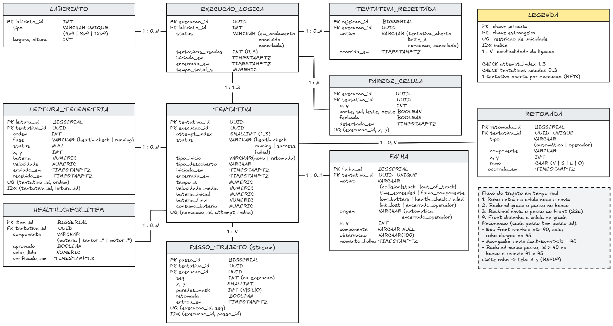

<font size="2"><p style="text-align: center">Fonte: [Amanda de Moura](https://github.com/AmandaaMoura), 2026. · [Acesso pelo Excalidraw](https://excalidraw.com/#json=8BL4oNFkKwRy2OvaZ_Fs0,lDMgfZwNfo2xalIHZpcXlg)</p></font>

### Legenda

| Sigla   | Significado                                                                        |
| ------- | ---------------------------------------------------------------------------------- |
| `PK`    | Chave primária: identifica cada linha da tabela.                                   |
| `FK`    | Chave estrangeira: referencia a chave primária de outra tabela.                    |
| `UQ`    | Restrição de unicidade: o banco não aceita valores repetidos na coluna ou combinação. |
| `IDX`   | Índice: acelera consultas sobre as colunas indicadas, sem impor regra.             |
| `1 : N` | Cardinalidade da ligação (lado esquerdo : lado direito).                           |

### Entidades

<font size="3"><p style="text-align: center">Tabela 6: Entidades do modelo de dados</p></font>

| Entidade              | Finalidade                                                                                                   |
| --------------------- | ------------------------------------------------------------------------------------------------------------ |
| `LABIRINTO`           | Tipos de labirinto possíveis (4x4, 8x4, 12x4). Permite filtrar execuções e comparar tempos do mesmo labirinto. |
| `EXECUCAO_LOGICA`     | Uma rodada em um tipo de labirinto, aberta em **Nova execução**. Agrupa até 3 tentativas e controla o limite de 10 minutos. |
| `TENTATIVA`           | Cada tentativa (*n*/3) dentro da execução lógica, com status, tempos e métricas finais.                      |
| `LEITURA_TELEMETRIA`  | Todas as mensagens recebidas do robô (bateria, velocidade, célula atual), inclusive as do health-check.     |
| `PASSO_TRAJETO`       | Uma linha por célula nova em que o robô entra. É a fonte do desenho do trajeto em tempo real.               |
| `PAREDE_CELULA`       | Paredes detectadas em cada célula, formando o mapa descoberto pelo robô.                                    |
| `HEALTH_CHECK_ITEM`   | Resultado da verificação de cada componente no health-check de uma tentativa.                               |
| `FALHA`               | Motivo, célula, componente e origem da falha que encerrou uma tentativa.                                    |
| `TENTATIVA_REJEITADA` | Pedidos de abertura de tentativa recusados pelo sistema.                                                     |

<font size="2"><p style="text-align: center">Fonte: [Amanda de Moura](https://github.com/AmandaaMoura), 2026.</p></font>

### Relacionamentos e cardinalidades

<font size="3"><p style="text-align: center">Tabela 7: Relacionamentos do modelo de dados</p></font>

| Relacionamento                          | Cardinalidade | Explicação                                                                                                 |
| --------------------------------------- | ------------- | ---------------------------------------------------------------------------------------------------------- |
| `LABIRINTO` → `EXECUCAO_LOGICA`         | 1 : N         | Um tipo de labirinto tem várias execuções; cada execução usa um único tipo.                               |
| `EXECUCAO_LOGICA` → `TENTATIVA`         | 1 : 1..3      | Toda execução abre com a tentativa 1/3 e pode ter no máximo 3 tentativas (TAP).                           |
| `EXECUCAO_LOGICA` → `TENTATIVA_REJEITADA` | 1 : N       | Os pedidos recusados ficam ligados à execução, pois nenhuma tentativa chegou a ser criada.                |
| `EXECUCAO_LOGICA` → `PAREDE_CELULA`     | 1 : N         | O mapa pertence à execução, e não à tentativa, porque é preservado entre retomadas (RF38, RF42).          |
| `TENTATIVA` → `LEITURA_TELEMETRIA`      | 1 : N         | Cada tentativa recebe várias mensagens de telemetria.                                                      |
| `TENTATIVA` → `PASSO_TRAJETO`           | 1 : N         | Cada tentativa registra as células percorridas.                                                            |
| `TENTATIVA` → `HEALTH_CHECK_ITEM`       | 1 : N         | Cada health-check verifica vários componentes.                                                             |
| `TENTATIVA` → `FALHA`                   | 1 : 0..1      | Uma tentativa termina em `success` (sem falha) ou em `failed` (uma falha, que a encerra).                 |

<font size="2"><p style="text-align: center">Fonte: [Amanda de Moura](https://github.com/AmandaaMoura), 2026.</p></font>

### Dicionário de dados

#### LABIRINTO

| Atributo          | Tipo         | Restrição   | Descrição                          |
| ----------------- | ------------ | ----------- | ---------------------------------- |
| `labirinto_id`    | `INT`        | PK          | Identificador do tipo de labirinto. |
| `tipo`            | `VARCHAR(5)` | UQ          | `4x4`, `8x4` ou `12x4`.            |
| `largura`, `altura` | `INT`      | —           | Dimensões em células.              |

#### EXECUCAO_LOGICA

| Atributo            | Tipo          | Restrição         | Descrição                                                                   |
| ------------------- | ------------- | ----------------- | --------------------------------------------------------------------------- |
| `execucao_id`       | `UUID`        | PK                | Identificador da execução lógica.                                           |
| `labirinto_id`      | `INT`         | FK                | Tipo informado pelo operador em **Nova execução** (fica só no backend, RF27). |
| `status`            | `VARCHAR`     | CHECK             | `em_andamento`, `concluida` ou `cancelada`.                                 |
| `tentativas_usadas` | `INT`         | CHECK 0..3        | Quantidade de tentativas já consumidas; devolvida ao usuário (US07).        |
| `iniciada_em`       | `TIMESTAMPTZ` | —                 | Início do relógio da execução, usado no limite de 10 minutos (RF32).        |
| `encerrada_em`      | `TIMESTAMPTZ` | —                 | Fim da execução.                                                            |
| `tempo_total_s`     | `NUMERIC`     | —                 | Tempo corrido desde **Nova execução**, incluindo intervalos (RF13).         |

#### TENTATIVA

| Atributo            | Tipo          | Restrição                          | Descrição                                                          |
| ------------------- | ------------- | ---------------------------------- | ------------------------------------------------------------------ |
| `tentativa_id`      | `UUID`        | PK                                 | Identificador único da tentativa (RF17).                           |
| `execucao_id`       | `UUID`        | FK                                 | Execução lógica a que pertence.                                    |
| `attempt_index`     | `INT`         | CHECK 1..3; UQ com `execucao_id`   | Número *n* exibido em **Tentativa *n*/3**.                         |
| `status`            | `VARCHAR`     | CHECK                              | `health-check`, `running`, `success` ou `failed` (RF16).           |
| `tipo_inicio`       | `VARCHAR`     | CHECK                              | `nova` ou `retomada`; marca as tentativas abertas por **Retomar tentativa (*n*/3)** (RF38). |
| `tipo_descoberto`   | `VARCHAR`     | —                                  | Tipo de labirinto deduzido pelo robô (RF27).                       |
| `iniciada_em`, `encerrada_em` | `TIMESTAMPTZ` | —                        | Início e fim da tentativa.                                         |
| `tempo_s`           | `NUMERIC`     | —                                  | Duração da tentativa (RF13).                                       |
| `velocidade_media`  | `NUMERIC`     | —                                  | Distância percorrida dividida pelo tempo (RF12).                   |
| `bateria_inicial`, `bateria_final`, `consumo_bateria` | `NUMERIC` | —         | Nível de bateria e consumo na tentativa (RF11).                    |

#### LEITURA_TELEMETRIA

| Atributo        | Tipo          | Restrição                     | Descrição                                           |
| --------------- | ------------- | ----------------------------- | --------------------------------------------------- |
| `leitura_id`    | `BIGSERIAL`   | PK                            | Identificador da mensagem.                          |
| `tentativa_id`  | `UUID`        | FK                            | Tentativa aberta no momento do recebimento.         |
| `ordem`         | `INT`         | UQ com `tentativa_id`         | Ordem de chegada dentro da tentativa.               |
| `fase`          | `VARCHAR`     | CHECK                         | `health-check` ou `running`; separa os dados do health-check (RF05). |
| `x`, `y`        | `INT`         | —                             | Célula atual do robô.                               |
| `bateria`       | `NUMERIC`     | —                             | Nível de bateria informado.                         |
| `velocidade`    | `NUMERIC`     | —                             | Velocidade estimada pelo firmware (RF22).           |
| `enviado_em`    | `TIMESTAMPTZ` | —                             | Momento do envio pelo robô.                         |
| `recebido_em`   | `TIMESTAMPTZ` | —                             | Momento do recebimento pelo backend (medição do RNF04). |

Índice: `IDX (tentativa_id, leitura_id)`.

#### PASSO_TRAJETO

| Atributo        | Tipo          | Restrição               | Descrição                                                         |
| --------------- | ------------- | ----------------------- | ----------------------------------------------------------------- |
| `passo_id`      | `BIGSERIAL`   | PK                      | Identificador do passo; também é o id do evento SSE.              |
| `tentativa_id`  | `UUID`        | FK                      | Tentativa em que o passo ocorreu.                                 |
| `execucao_id`   | `UUID`        | FK                      | Execução lógica; permite tratar as 3 tentativas como um só trajeto. |
| `seq`           | `INT`         | UQ com `execucao_id`    | Ordem da célula no trajeto da execução inteira (RF09).            |
| `x`, `y`        | `INT`         | —                       | Célula em que o robô entrou.                                      |
| `paredes_mask`  | `INT`         | —                       | Paredes lidas na célula, codificadas em bits (N, S, L, O).        |
| `retomada`      | `BOOLEAN`     | —                       | Indica o ponto em que o trajeto recomeçou após uma retomada.      |
| `entrou_em`     | `TIMESTAMPTZ` | —                       | Momento em que o robô entrou na célula.                           |

Índice: `IDX (execucao_id, passo_id)`.

#### PAREDE_CELULA

| Atributo                     | Tipo          | Restrição                 | Descrição                              |
| ---------------------------- | ------------- | ------------------------- | -------------------------------------- |
| `parede_id`                  | `BIGSERIAL`   | PK                        | Identificador do registro.             |
| `execucao_id`                | `UUID`        | FK                        | Execução lógica dona do mapa.          |
| `x`, `y`                     | `INT`         | UQ com `execucao_id`      | Célula do labirinto.                   |
| `norte`, `sul`, `leste`, `oeste` | `BOOLEAN` | —                         | Presença de parede em cada lado.       |
| `detectada_em`               | `TIMESTAMPTZ` | —                         | Momento da última detecção.            |

#### HEALTH_CHECK_ITEM

| Atributo        | Tipo          | Restrição | Descrição                                                                                           |
| --------------- | ------------- | --------- | --------------------------------------------------------------------------------------------------- |
| `item_id`       | `BIGSERIAL`   | PK        | Identificador do item verificado.                                                                   |
| `tentativa_id`  | `UUID`        | FK        | Tentativa cujo health-check foi feito.                                                              |
| `componente`    | `VARCHAR`     | CHECK     | `bateria`, `sensor_frontal`, `sensor_esquerdo`, `sensor_direito`, `motor_esquerdo` ou `motor_direito`. |
| `aprovado`      | `BOOLEAN`     | —         | Resultado da verificação.                                                                           |
| `valor_lido`    | `NUMERIC`     | —         | Valor medido, quando houver.                                                                        |
| `verificado_em` | `TIMESTAMPTZ` | —         | Momento da verificação.                                                                             |

#### FALHA

| Atributo              | Tipo           | Restrição       | Descrição                                                                                                                                        |
| --------------------- | -------------- | --------------- | ------------------------------------------------------------------------------------------------------------------------------------------------ |
| `falha_id`            | `BIGSERIAL`    | PK              | Identificador da falha.                                                                                                                          |
| `tentativa_id`        | `UUID`         | FK, UQ          | Tentativa encerrada pela falha (no máximo uma falha por tentativa).                                                                             |
| `motivo`              | `VARCHAR`      | CHECK           | `collision`, `stuck`, `out_of_track`, `time_exceeded`, `falha_componente`, `low_battery`, `health_check_failed`, `link_lost` ou `encerrado_operador` (RF15). |
| `origem`              | `VARCHAR`      | CHECK           | `automatica` ou `encerrado_operador` (encerramento manual, RF30).                                                                               |
| `celula_x`, `celula_y` | `INT`         | —               | Célula em que a falha ocorreu; ponto de partida da retomada.                                                                                    |
| `componente`          | `VARCHAR`      | NULL            | Componente que falhou; preenchido só quando `motivo = falha_componente`.                                                                        |
| `observacao`          | `VARCHAR(100)` | —               | Observação opcional do operador no encerramento manual.                                                                                         |
| `momento_falha`       | `TIMESTAMPTZ`  | —               | Momento da falha.                                                                                                                                |

#### TENTATIVA_REJEITADA

| Atributo       | Tipo          | Restrição | Descrição                                                              |
| -------------- | ------------- | --------- | ---------------------------------------------------------------------- |
| `rejeicao_id`  | `BIGSERIAL`   | PK        | Identificador do pedido recusado.                                      |
| `execucao_id`  | `UUID`        | FK        | Execução em que o pedido foi feito.                                    |
| `motivo`       | `VARCHAR`     | CHECK     | `tentativa_aberta`, `limite_3` ou `execucao_cancelada` (RF19).         |
| `ocorrida_em`  | `TIMESTAMPTZ` | —         | Momento da recusa.                                                     |

### Regras de integridade no banco

- **Limite de 3 tentativas (TAP):** `CHECK (attempt_index BETWEEN 1 AND 3)` e `UQ (execucao_id, attempt_index)` em `TENTATIVA`, junto com `CHECK (tentativas_usadas BETWEEN 0 AND 3)` em `EXECUCAO_LOGICA`. O backend incrementa `tentativas_usadas` na mesma transação em que cria a tentativa.
- **Uma tentativa aberta por vez (RF18):** índice único parcial em `TENTATIVA (execucao_id)` restrito às linhas com `status` `health-check` ou `running`.
- **Valores fixos:** `status`, `motivo`, `origem`, `fase`, `tipo_inicio` e `componente` têm `CHECK` com a lista de valores aceitos, a mesma validada pelo Pydantic na entrada (RNF09).
- **Persistência:** os dados ficam em volume Docker e sobrevivem à reinicialização do servidor (RNF05).

### Trajeto em tempo real

O trajeto precisa ser transmitido e consumido em tempo real para ser desenhado no front-end. Por isso ele fica em uma tabela própria, `PASSO_TRAJETO`, separada da telemetria geral: o robô envia várias mensagens na mesma célula, mas o desenho só precisa de um evento quando ele entra em uma célula nova.

1. O robô entra em uma célula nova e envia a mensagem.
2. O backend grava o passo em `PASSO_TRAJETO` e atualiza `PAREDE_CELULA` na mesma transação.
3. Depois da confirmação (COMMIT), o backend envia o passo ao front-end por SSE, usando o `passo_id` como id do evento.
4. O front-end desenha a célula recebida na grade do labirinto.

**Reconexão:** cada passo chega ao front-end com o seu `passo_id`. Se a página recebeu os passos até o 40 e perdeu a conexão enquanto o robô chegava ao 45, ao reconectar o navegador envia automaticamente o cabeçalho `Last-Event-ID = 40`. O backend busca no banco os passos com `passo_id` maior que 40, em ordem, e reenvia os passos 41 a 45. O índice `IDX (execucao_id, passo_id)` torna essa consulta rápida, e a mesma consulta serve para quem abre a tela no meio da corrida.

**Latência:** do envio pelo robô até a célula aparecer na tela, o limite é de 3 segundos (RNF04).

### Decisões de modelagem

- **Retomada como atributo.** A retomada não é uma tabela própria: é representada por `TENTATIVA.tipo_inicio = retomada`. A falha que a originou é a da tentativa anterior da mesma execução (`attempt_index` − 1), e a célula de partida é a `celula_x`, `celula_y` dessa falha.
- **Falha separada da tentativa.** Só as tentativas `failed` têm motivo, célula e componente; guardar isso em `FALHA` evita colunas vazias em `TENTATIVA`.
- **Tentativa rejeitada ligada à execução.** Um pedido recusado nunca vira tentativa, então não existe `tentativa_id` para referenciar (US21).
- **Mapa ligado à execução.** `PAREDE_CELULA` pertence à execução lógica porque o mapa é preservado entre as tentativas (RF38, RF42).
- **Contagem de tentativas armazenada.** `tentativas_usadas` evita contar as tentativas a cada consulta e é devolvida ao usuário no contador (*n*/3).

---

## Diagrama de Estados {#diagrama-de-estados}

### Estados do software

O diagrama representa o ciclo de uma tentativa do Micromouse no labirinto, desde a verificação inicial dos componentes até o encerramento com sucesso ou com falha. A navegação segue o **flood fill (método Adachi)** definido na EAP e no [projeto conceitual](#decisao-flood-fill-adachi): a cada célula, o mapa é atualizado, as distâncias ao objetivo candidato são recalculadas e o robô move-se pela direção que reduz essa distância (com desempate fixo). Após health-check aprovado, o firmware inicia o trajeto **sem downlink** do sistema web (RF10). O robô pode retomar a tentativa depois de uma falha de componente resolvida e grava seu progresso em memória não volátil a cada célula nova (RF42).

<font size="3"><p style="text-align: center">Tabela A: Estados do software do Micromouse</p></font>

| Estado | Descrição | Requisitos relacionados |
| :--: | :-- | :--: |
| **Health-check** | Estado inicial. Verifica se sensores, motores e bateria estão aptos antes de iniciar o percurso. | RF29, RF05, RF16 |
| **Lendo sensores** | Estado central de decisão. Lê os sensores, identifica as paredes ao redor da célula atual, atualiza o mapa, recalcula o flood fill e deduz o tipo do labirinto pela extensão das células visitadas. | RF20, RF26, RF27, RF37 |
| **Deslocando** | Move o robô na direção escolhida pelo flood fill (método Adachi), com movimento controlado em malha fechada pelos encoders, e grava o mapa e a posição na memória não volátil (NVS). | RF20, RF21, RF28, RF42 |
| **Falha de componente** | Um componente falhou durante a corrida. O robô para, aguarda 5 segundos e refaz o health-check para decidir se retoma a tentativa. | RF38, RF15 |
| **Objetivo alcançado** | Estado final de sucesso. O robô chegou à área de objetivo e a execução é registrada como `success`. | RF26, RF13, RF16 |
| **Falha** | Estado final de erro. A execução é registrada como `failed`, com o motivo (`collision`, `time_exceeded`, `stuck`, `out_of_track`, `falha_componente` ou `encerrado_operador`) e a célula em que a falha ocorreu. | RF15, RF16, RF30, RF32, RF41 |

<font size="2"><p style="text-align: center">Fonte: [João Marcos](https://github.com/JJOAOMARCOSS) e [Luiza da Silva](https://github.com/Luizaxx), 2026.</p></font>

### Eventos e transições

As mudanças de estado ocorrem a partir das condições de guarda (entre colchetes no diagrama) e dos eventos de conclusão de cada ação:

<font size="3"><p style="text-align: center">Tabela B: Transições entre estados</p></font>

| Origem | Evento / condição | Destino |
| :--: | :-- | :--: |
| Início | Robô ligado | Health-check |
| Health-check | `[componentes ok]` | Lendo sensores |
| Health-check | `[componente reprovado]` | Falha |
| Health-check / parado | Toque no BOOT: curto apaga o mapa, longo apaga também os tipos de labirinto resolvidos | Health-check |
| Lendo sensores | `[próximo passo definido pelo flood fill]` | Deslocando |
| Lendo sensores | `[mapa inconsistente / sem passo válido]` | Falha |
| Lendo sensores | `[célula objetivo do tamanho descoberto e bordas fechadas]` | Objetivo alcançado |
| Lendo sensores | `[falha de componente]` | Falha de componente |
| Lendo sensores | `[colisão, travamento ou fora da pista]` | Falha |
| Deslocando | Após mover | Lendo sensores |
| Deslocando | `[motores acionados e encoders parados por mais de X ms]` | Falha |
| Falha de componente | Após 5 s, `[novo health-check ok]` / telemetria `retomada` | Lendo sensores |
| Falha de componente | Após 5 s, `[novo health-check reprovado]` | Falha |
| Qualquer estado da corrida | Interrupção Bluetooth (RF39), encerramento manual (RF30) ou toque no BOOT (RF41) | Falha |

<font size="2"><p style="text-align: center">Fonte: [João Marcos](https://github.com/JJOAOMARCOSS) e [Luiza da Silva](https://github.com/Luizaxx), 2026.</p></font>

Alguns pontos merecem destaque:

- **Lendo sensores é o ponto de decisão do laço.** Todo deslocamento retorna a esse estado, garantindo que cada passo use a leitura mais recente das paredes e o flood fill atualizado.
- **A partida é autônoma após o health-check.** Com componentes aprovados, o firmware passa a `running` e inicia o trajeto (RF10). O único downlink permitido é a **interrupção** Bluetooth no encerramento manual (RF39, RNF06); o trajeto continua decidido apenas pelo firmware.
- **A chegada só é declarada com o tamanho do labirinto confirmado.** Como o robô não recebe nenhuma informação prévia, ele deduz o tipo do labirinto pelas células visitadas e só considera o objetivo alcançado depois de confirmar que as bordas daquele tamanho estão fechadas, evitando um sucesso falso.
- **Uma falha de componente não encerra a tentativa de imediato.** O robô refaz o health-check após 5 segundos e, se aprovado, retoma de onde parou com o tempo ainda contando. Só vai para Falha, com motivo `falha_componente`, se o novo health-check também reprovar.
- **A parada pode vir da interface ou do botão BOOT.** Encerramento manual na web envia interrupção (RF39) e registra o motivo escolhido; o BOOT durante a corrida também leva a Falha com origem `encerrado_operador` (RF41), sem depender da rede.
- **O limite de 10 minutos** por execução lógica (TAP) é aplicado no backend (RF32); o firmware registra falhas locais (colisão, travamento etc.) que encerram a tentativa.
- **Travamento detectado pelo robô.** Com motores acionados e encoders parados além do limiar configurado, o firmware encerra a tentativa com motivo `stuck`, sem depender do operador (US45).
- **Mapa inconsistente** (sem passo válido no flood fill) leva a Falha, indicando leitura incorreta de paredes ou estado inválido.
- **O progresso fica gravado na NVS.** Mapa, posição, estado da execução e tipos de labirinto já resolvidos são atualizados a cada célula nova, o que permite retomar de onde parou após uma reinicialização.
- **A telemetria é paralela ao laço de decisão.** A coleta e o envio dos dados ocorrem em todos os estados, sem bloquear a navegação, atendendo aos RF08 e RF24.

### Diagrama

<font size="3"><p style="text-align: center">Imagem: Diagrama de Estados do Micromouse</p></font>

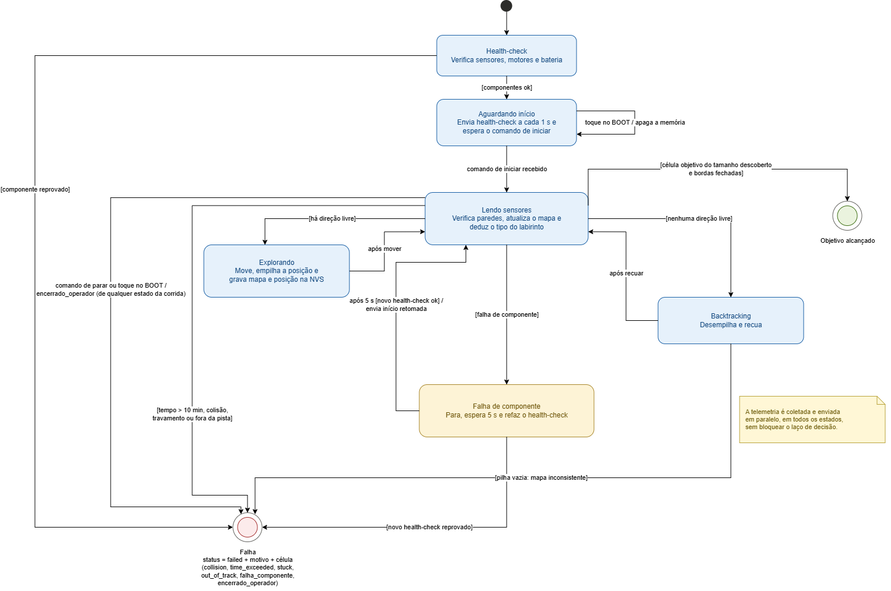

<font size="2"><p style="text-align: center">Fonte: [João Marcos](https://github.com/JJOAOMARCOSS) e [Luiza da Silva](https://github.com/Luizaxx), 2026.</p></font>

---

## Protótipo

- [Protótipo navegável no Figma (Ratatui — PI1)](https://www.figma.com/proto/1xt8XSJqmBrJoqNEfO8uI0/Ratatui---PI1?node-id=52-3561&p=f&t=5ihWseKKKMSo4QkF-0&scaling=min-zoom&content-scaling=fixed&page-id=52%3A1346&starting-point-node-id=52%3A3561&show-proto-sidebar=1)

### Ratatouille · telas do labirinto 4×4

Protótipo da interface de telemetria do robô Ratatouille. O exemplo acompanha a execução **#0042** no labirinto **4×4**: 72 × 72 cm, 16 células, largada em **A1** e objetivo em **D4**, no canto oposto.

O robô envia os dados por Bluetooth (HM-10) e a interface **só recebe e exibe esses dados**, sem mandar nenhum comando ao robô. O operador cria a execução, liga o robô e acompanha a corrida. Se a execução terminar em falha, ele pode retomá-la do último checkpoint.

**Fluxo principal:** Início → Health-check → Em execução → Concluída

**Exceções:** Execução recusada · Sem comunicação · Encerrar execução → Encerrada como falha

**Retomada:** Retomar do checkpoint → Retomada (tentativa 2) → Concluída após retomada, ou Falha sem retomada depois de 3 tentativas

#### Telas do labirinto 4×4

### 1. Início

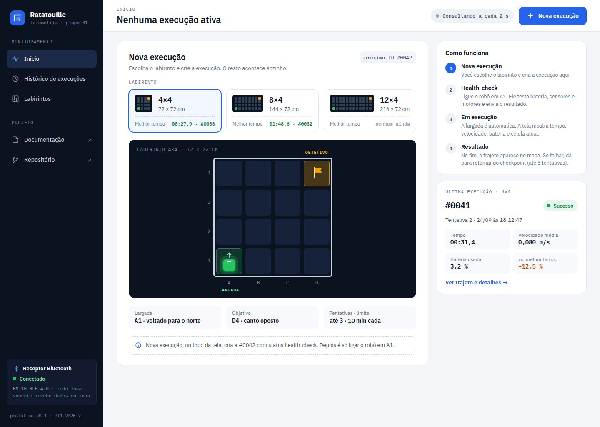

Tela de preparação, exibida quando não há nenhuma execução ativa. O operador escolhe o labirinto (4×4, 8×4 ou 12×4) e cria uma execução pelo botão **Nova execução**, na barra do topo. Cada labirinto mostra o **melhor tempo** e qual execução o fez (ex.: `00:27,9 · #0036`). Ao lado estão um resumo de como funciona uma execução e os dados da última execução, com link para o detalhe.

### 2. Health-check

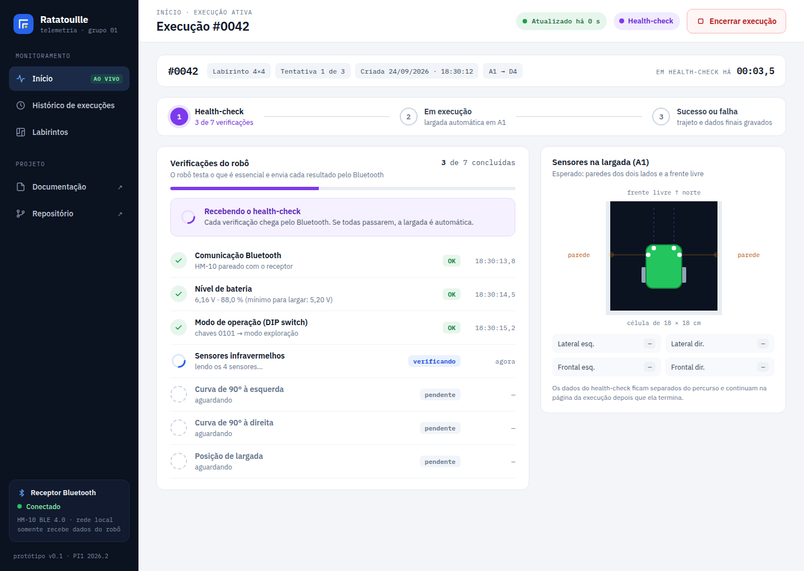

Primeira etapa da execução. Antes da largada, o robô testa sozinho o que é essencial (Bluetooth, bateria, modo de operação, sensores infravermelhos, curvas e posição de largada) e envia cada resultado. A tela mostra o progresso das verificações e a leitura dos sensores. Quando todas passam, a largada é automática.

### 3. Em execução

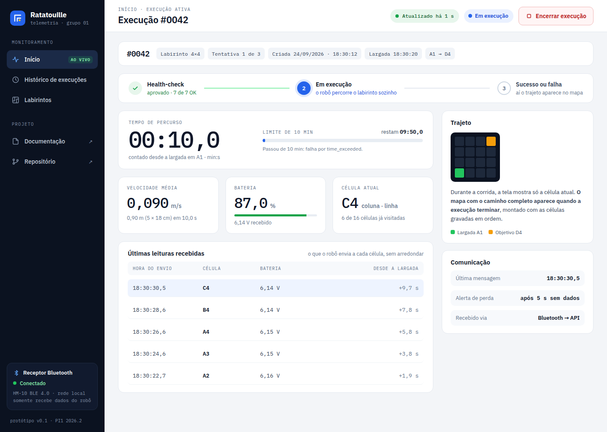

Acompanhamento ao vivo da corrida. Mostra o tempo de percurso comparado ao **limite de 10 min**, a velocidade média, a bateria, a célula atual e as últimas leituras recebidas. Durante a corrida o mapa mostra só a célula atual; o trajeto completo aparece quando a execução termina. O botão **Encerrar execução** fica sempre disponível no topo.

### 4. Concluída

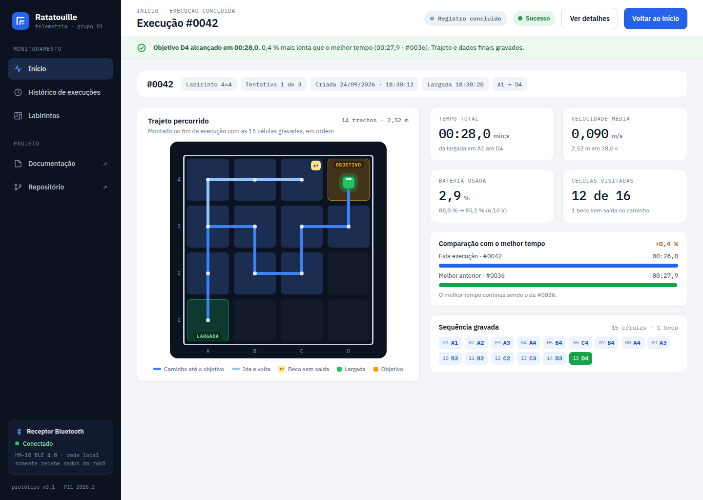

Resultado de uma execução com sucesso: o robô chegou ao objetivo D4. Apresenta o trajeto completo no mapa, o tempo total, a velocidade média, a bateria usada, as células visitadas, a sequência gravada e a **comparação com o melhor tempo** do labirinto. Daqui o operador vai para o detalhe ou volta ao início.

### 5. Execução recusada

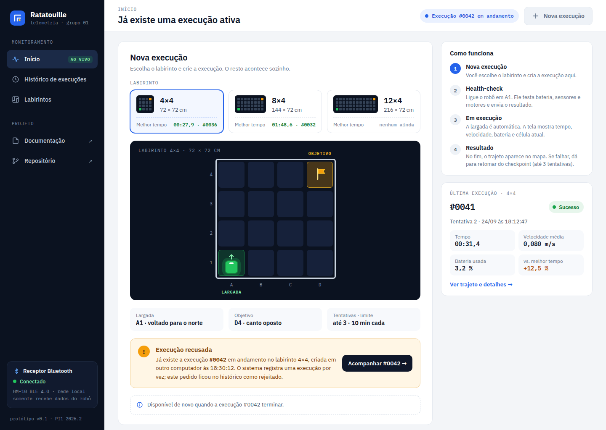

Exceção que aparece quando alguém tenta criar uma execução enquanto outra já está em andamento. O sistema registra **uma execução por vez**, então o pedido fica no histórico como rejeitado. O botão **Acompanhar #0042** leva à execução que está ativa.

### 6. Sem comunicação

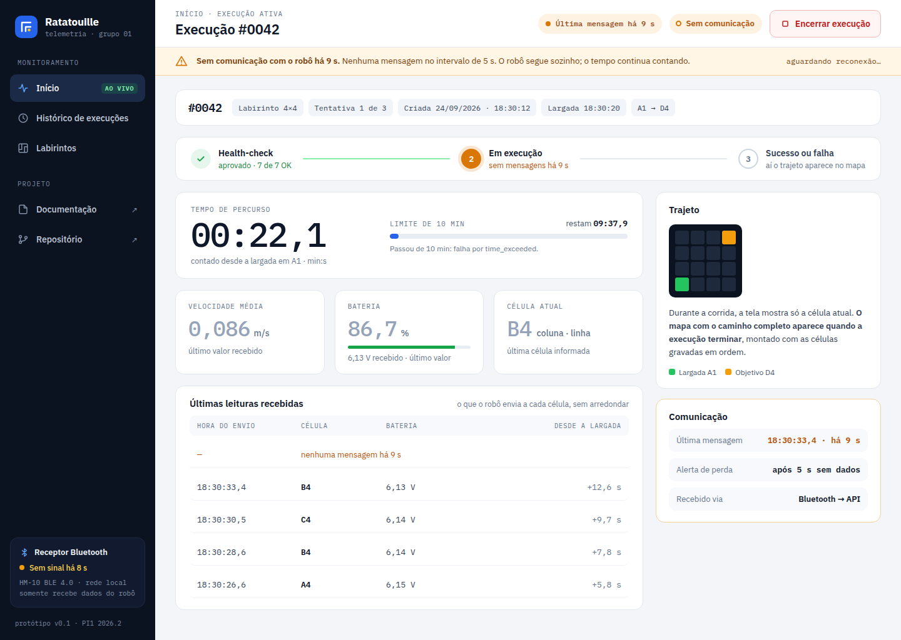

Exceção que aparece quando o robô passa **mais de 5 s sem enviar mensagens**. O alerta fica no topo e os valores aparecem esmaecidos como "último valor recebido". O robô continua a corrida sozinho e o tempo continua contando. Quando a comunicação volta, a tela retorna ao acompanhamento normal.

### 7. Encerrar execução

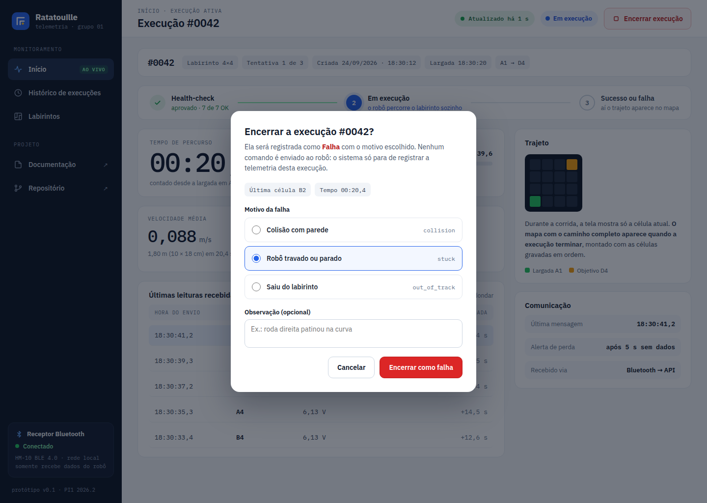

Janela de confirmação para o operador encerrar a execução manualmente. Ele escolhe o motivo da falha (colisão com parede, robô travado ou saiu do labirinto) e pode deixar uma observação. Nada é enviado ao robô: o encerramento serve só para registrar a falha na telemetria.

### 8. Encerrada como falha

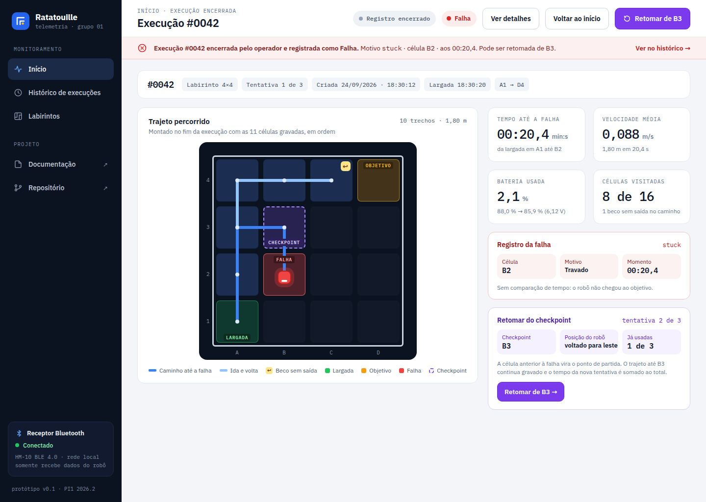

Resultado de uma execução encerrada como falha. O mapa mostra o trajeto até a falha e marca a célula onde ela ocorreu (B2). O **checkpoint** é a célula anterior (B3). O cartão *Registro da falha* resume célula, motivo e momento. O cartão *Retomar do checkpoint* informa quantas tentativas ainda restam (**até 3 por execução**).

### 9. Retomar do checkpoint

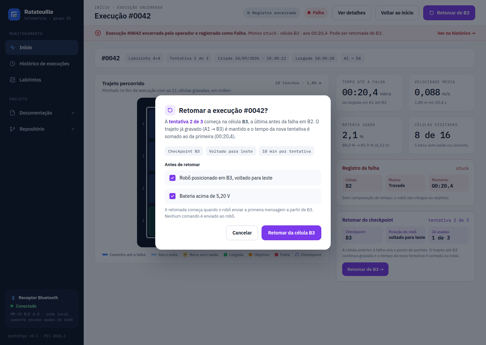

Confirmação da retomada. Explica que a tentativa 2 começa no checkpoint B3, que o trajeto já gravado (A1 → B3) é mantido e que o tempo da nova tentativa é somado ao da primeira. Antes de retomar, o operador confirma que o robô está posicionado em B3 na direção certa e que a bateria está acima de 5,20 V.

### 10. Retomada · tentativa 2

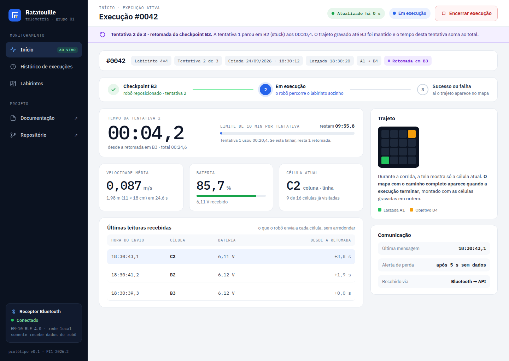

Acompanhamento ao vivo de uma tentativa retomada. É igual à tela *Em execução*, com três diferenças: um aviso indica "tentativa 2 de 3, retomada do checkpoint B3"; o cronômetro conta o tempo **desta tentativa**, mas mostra também o total acumulado; e cada tentativa tem o próprio limite de 10 min.

### 11. Concluída após retomada

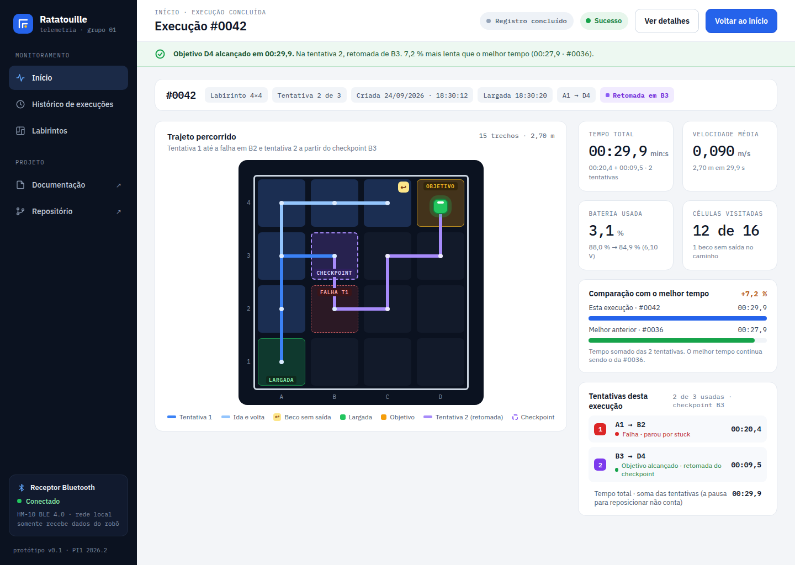

Sucesso depois de uma retomada. O mapa mostra as duas tentativas com cores diferentes (tentativa 1 até a falha e tentativa 2 a partir do checkpoint). O tempo total é a **soma das tentativas**, sem contar a pausa para reposicionar o robô. O cartão *Tentativas desta execução* detalha o trecho e o tempo de cada uma.

### 12. Falha sem retomada (3 de 3)

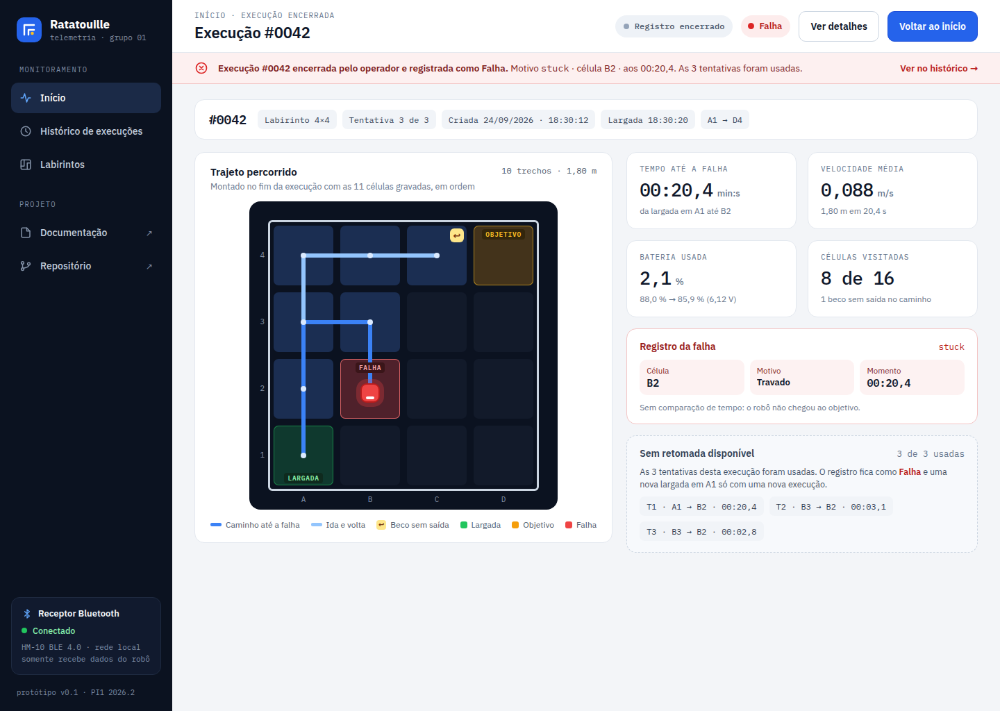

Falha depois que as 3 tentativas já foram usadas. A tela mostra o trajeto e o registro da falha, e o cartão *Sem retomada disponível* lista o trecho e o tempo de cada tentativa. Não é possível retomar de novo: para correr outra vez a partir de A1, é preciso criar uma **nova execução**.

---

### Ratatouille · telas do labirinto 8×4

Protótipo da interface de telemetria do robô Ratatouille. O exemplo acompanha a execução **#0043** no labirinto **8×4**: 144 × 72 cm, 32 células, largada em **A1** e objetivo em **H4**, no canto oposto.

O robô envia os dados por Bluetooth (HM-10) e a interface **só recebe e exibe esses dados**, sem mandar nenhum comando ao robô. O operador cria a execução, liga o robô e acompanha a corrida. Se a execução terminar em falha, ele pode retomá-la do último checkpoint.

**Fluxo principal:** Início → Health-check → Em execução → Concluída

**Exceções:** Execução recusada · Sem comunicação · Encerrar execução → Encerrada como falha

**Retomada:** Retomar do checkpoint → Retomada (tentativa 2) → Concluída após retomada, ou Falha sem retomada depois de 3 tentativas

#### Telas do labirinto 8×4

### 1. Início

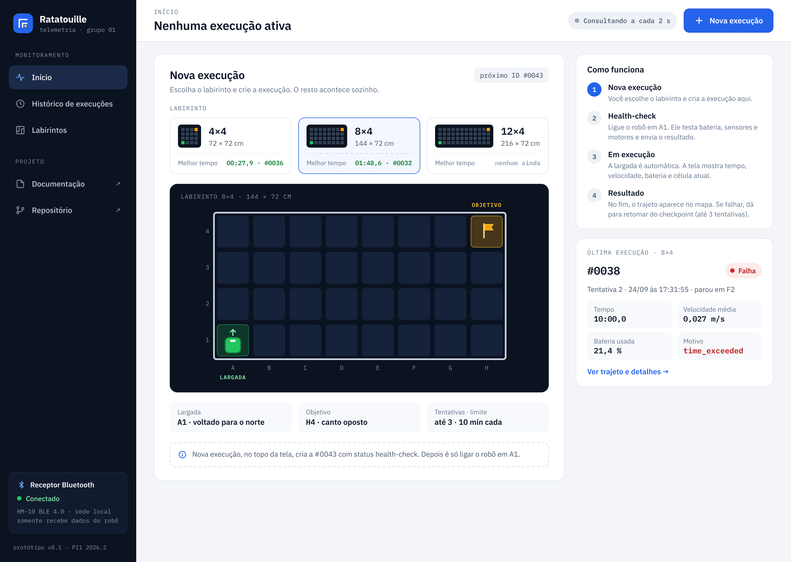

Tela de preparação, exibida quando não há nenhuma execução ativa. O operador escolhe o labirinto (4×4, 8×4 ou 12×4) e cria uma execução pelo botão **Nova execução**, na barra do topo. Cada labirinto mostra o **melhor tempo** e qual execução o fez (ex.: `01:48,6 · #0032`). Ao lado estão um resumo de como funciona uma execução e os dados da última execução, com link para o detalhe.

### 2. Health-check

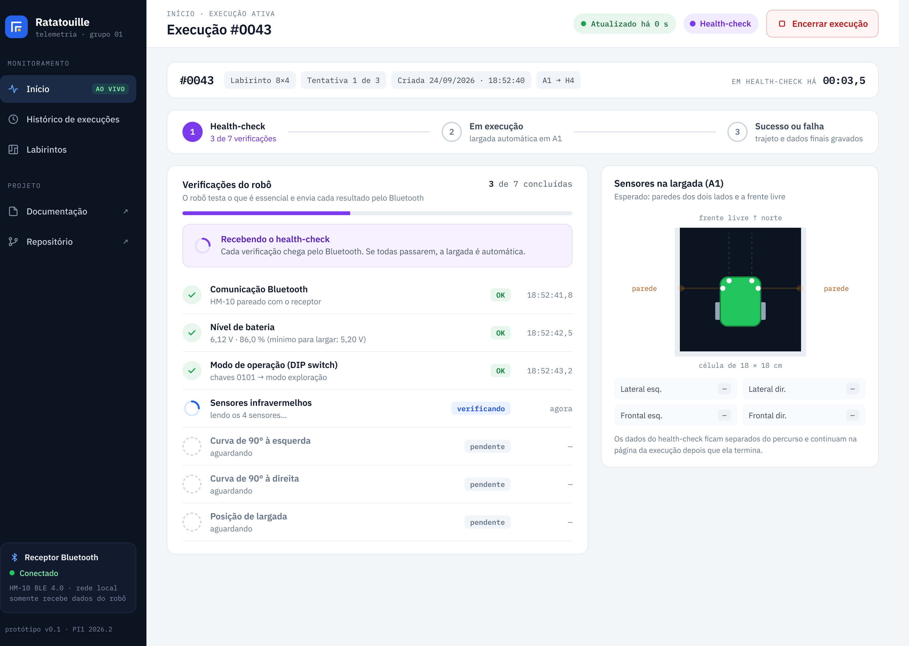

Primeira etapa da execução. Antes da largada, o robô testa sozinho o que é essencial (Bluetooth, bateria, modo de operação, sensores infravermelhos, curvas e posição de largada) e envia cada resultado. A tela mostra o progresso das verificações e a leitura dos sensores. Quando todas passam, a largada é automática.

### 3. Em execução

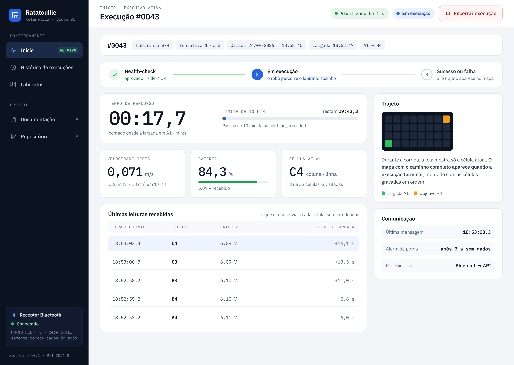

Acompanhamento ao vivo da corrida. Mostra o tempo de percurso comparado ao **limite de 10 min**, a velocidade média, a bateria, a célula atual e as últimas leituras recebidas. Durante a corrida o mapa mostra só a célula atual; o trajeto completo aparece quando a execução termina. O botão **Encerrar execução** fica sempre disponível no topo.

### 4. Concluída

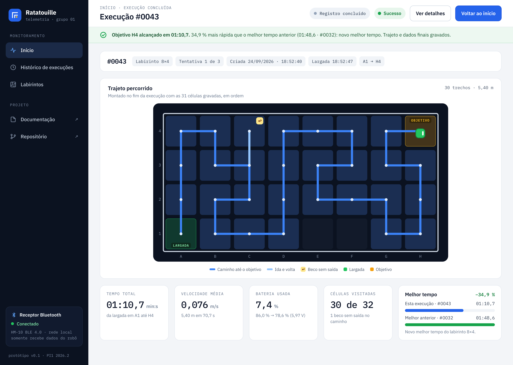

Resultado de uma execução com sucesso: o robô chegou ao objetivo H4. Apresenta o trajeto completo no mapa, o tempo total, a velocidade média, a bateria usada, as células visitadas, a sequência gravada e a **comparação com o melhor tempo** do labirinto. Daqui o operador vai para o detalhe ou volta ao início.

### 5. Execução recusada

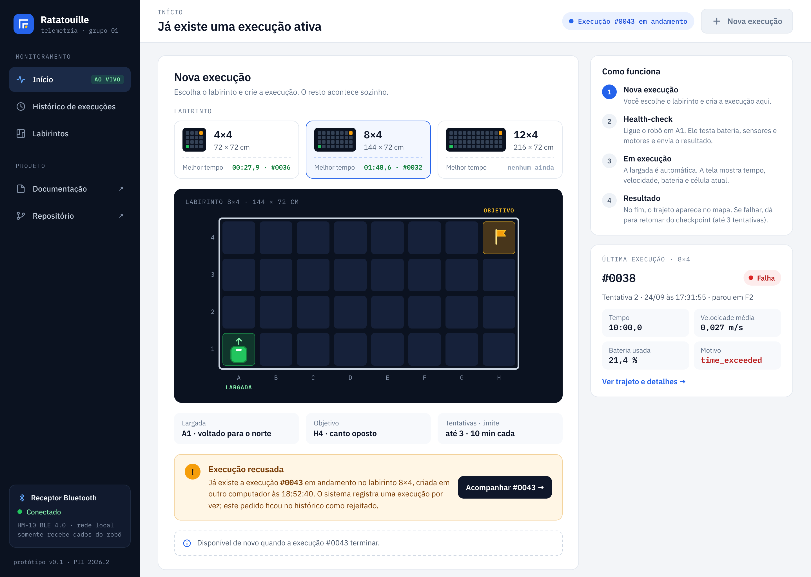

Exceção que aparece quando alguém tenta criar uma execução enquanto outra já está em andamento. O sistema registra **uma execução por vez**, então o pedido fica no histórico como rejeitado. O botão **Acompanhar #0043** leva à execução que está ativa.

### 6. Sem comunicação

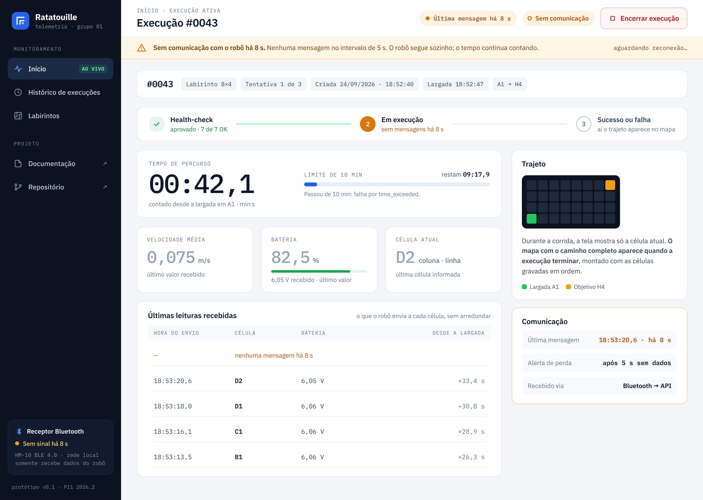

Exceção que aparece quando o robô passa **mais de 5 s sem enviar mensagens**. O alerta fica no topo e os valores aparecem esmaecidos como "último valor recebido". O robô continua a corrida sozinho e o tempo continua contando. Quando a comunicação volta, a tela retorna ao acompanhamento normal.

### 7. Encerrar execução

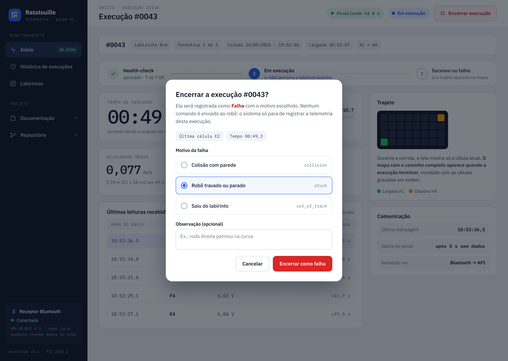

Janela de confirmação para o operador encerrar a execução manualmente. Ele escolhe o motivo da falha (colisão com parede, robô travado ou saiu do labirinto) e pode deixar uma observação. Nada é enviado ao robô: o encerramento serve só para registrar a falha na telemetria.

### 8. Encerrada como falha

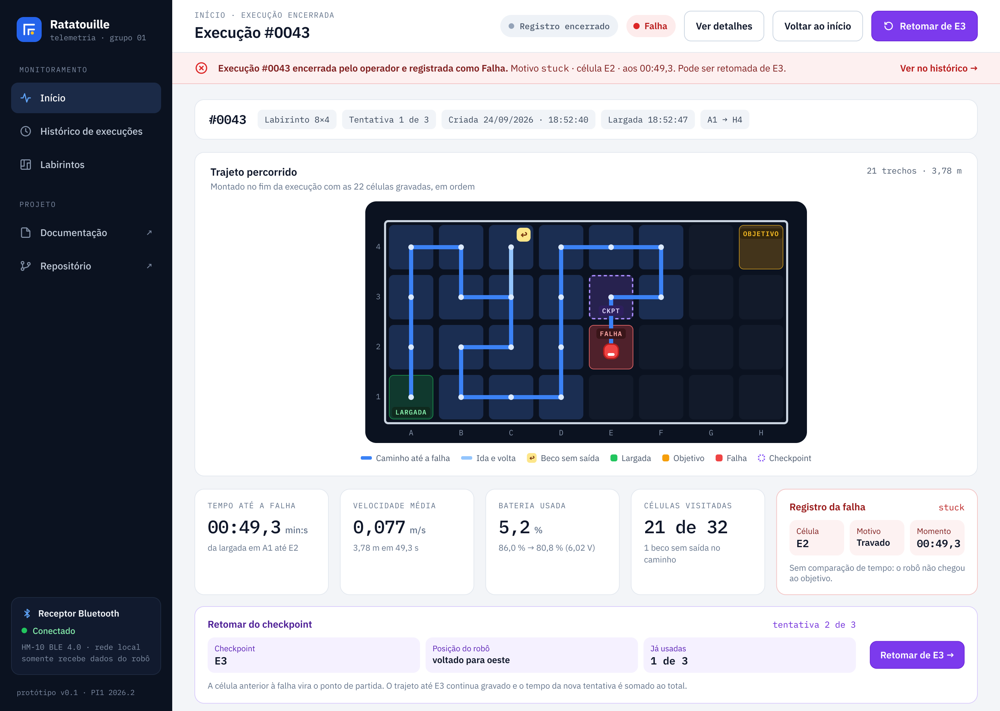

Resultado de uma execução encerrada como falha. O mapa mostra o trajeto até a falha e marca a célula onde ela ocorreu (E2). O **checkpoint** é a célula anterior (E3). O cartão *Registro da falha* resume célula, motivo e momento. O cartão *Retomar do checkpoint* informa quantas tentativas ainda restam (**até 3 por execução**).

### 9. Retomar do checkpoint

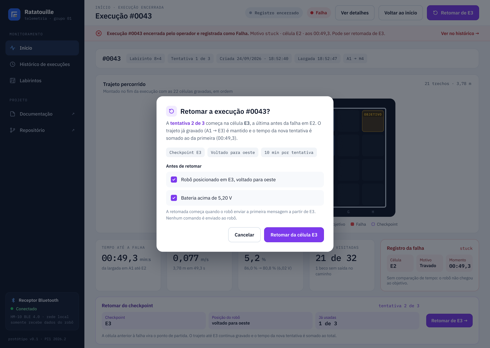

Confirmação da retomada. Explica que a tentativa 2 começa no checkpoint E3, que o trajeto já gravado (A1 → E3) é mantido e que o tempo da nova tentativa é somado ao da primeira. Antes de retomar, o operador confirma que o robô está posicionado em E3 na direção certa e que a bateria está acima de 5,20 V.

### 10. Retomada · tentativa 2

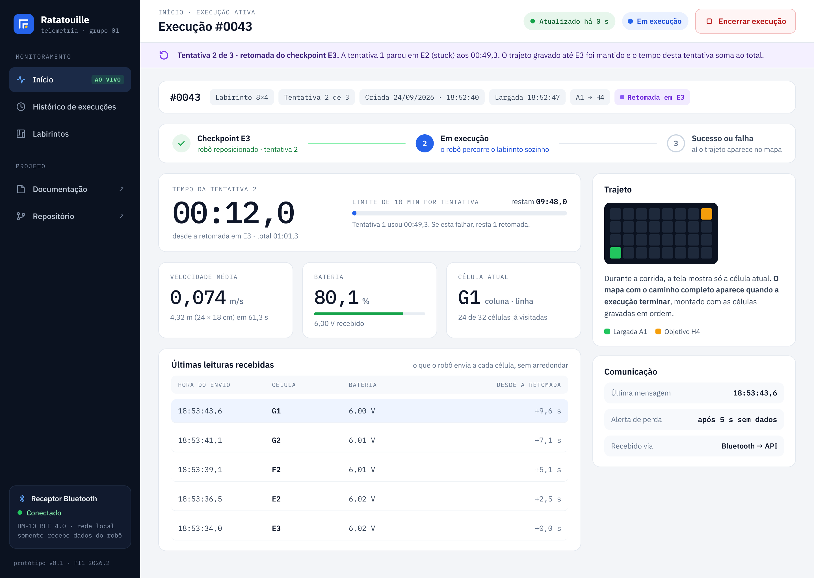

Acompanhamento ao vivo de uma tentativa retomada. É igual à tela *Em execução*, com três diferenças: um aviso indica "tentativa 2 de 3, retomada do checkpoint E3"; o cronômetro conta o tempo **desta tentativa**, mas mostra também o total acumulado; e cada tentativa tem o próprio limite de 10 min.

### 11. Concluída após retomada

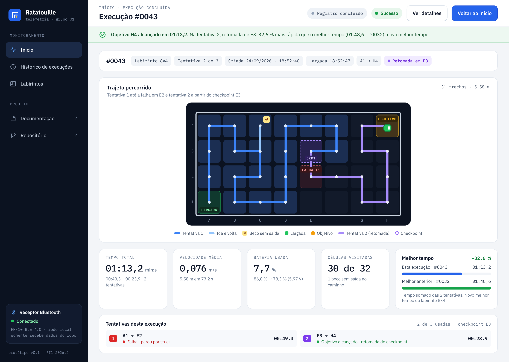

Sucesso depois de uma retomada. O mapa mostra as duas tentativas com cores diferentes (tentativa 1 até a falha e tentativa 2 a partir do checkpoint). O tempo total é a **soma das tentativas**, sem contar a pausa para reposicionar o robô. O cartão *Tentativas desta execução* detalha o trecho e o tempo de cada uma.

### 12. Falha sem retomada (3 de 3)

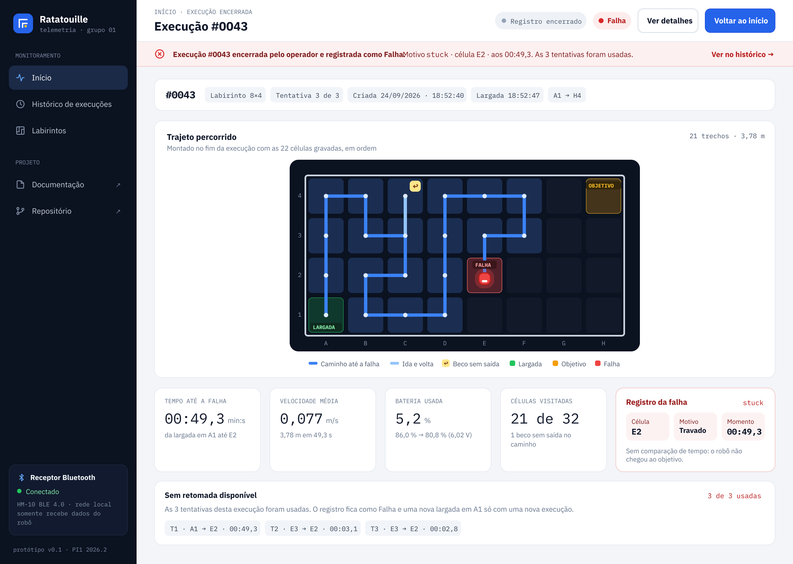

Falha depois que as 3 tentativas já foram usadas. A tela mostra o trajeto e o registro da falha, e o cartão *Sem retomada disponível* lista o trecho e o tempo de cada tentativa. Não é possível retomar de novo: para correr outra vez a partir de A1, é preciso criar uma **nova execução**.

---

### Ratatouille · telas do labirinto 12×4

Protótipo da interface de telemetria do robô Ratatouille. O exemplo acompanha a execução **#0044** no labirinto **12×4**: 216 × 72 cm, 48 células, largada em **A1** e objetivo em **L4**, no canto oposto.

O robô envia os dados por Bluetooth (HM-10) e a interface **só recebe e exibe esses dados**, sem mandar nenhum comando ao robô. O operador cria a execução, liga o robô e acompanha a corrida. Se a execução terminar em falha, ele pode retomá-la do último checkpoint.

**Fluxo principal:** Início → Health-check → Em execução → Concluída

**Exceções:** Execução recusada · Sem comunicação · Encerrar execução → Encerrada como falha

**Retomada:** Retomar do checkpoint → Retomada (tentativa 2) → Concluída após retomada, ou Falha sem retomada depois de 3 tentativas

#### Telas do labirinto 12×4

### 1. Início

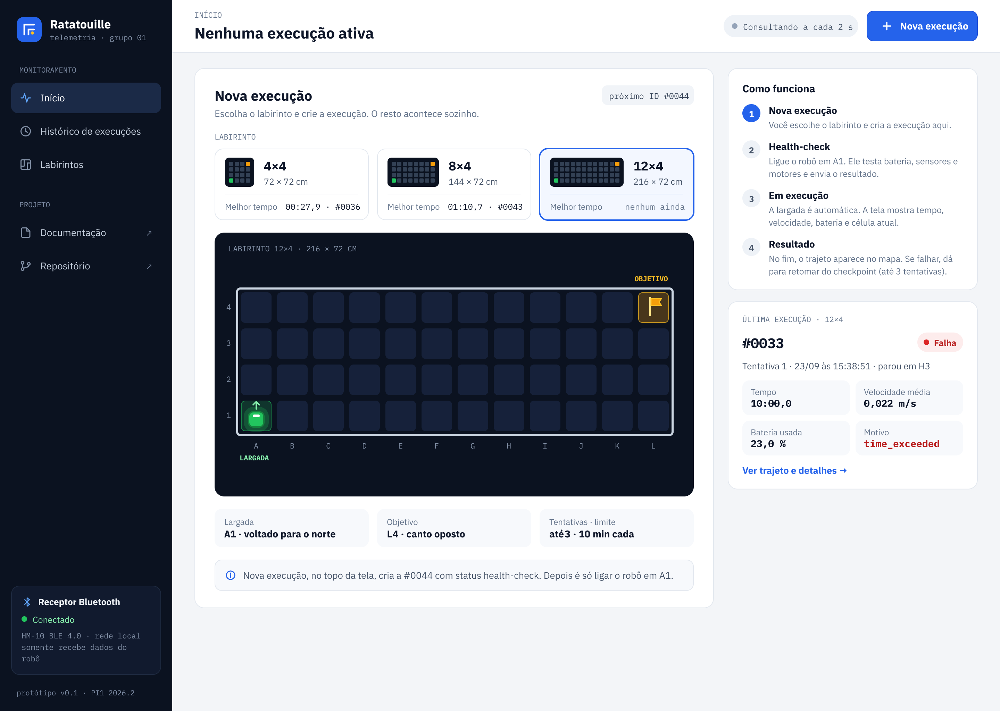

Tela de preparação, exibida quando não há nenhuma execução ativa. O operador escolhe o labirinto (4×4, 8×4 ou 12×4) e cria uma execução pelo botão **Nova execução**, na barra do topo. Cada labirinto mostra o **melhor tempo** e qual execução o fez; no 12×4 ainda não há melhor tempo, então aparece "nenhum ainda". Ao lado estão um resumo de como funciona uma execução e os dados da última execução, com link para o detalhe.

### 2. Health-check


Primeira etapa da execução. Antes da largada, o robô testa sozinho o que é essencial (Bluetooth, bateria, modo de operação, sensores infravermelhos, curvas e posição de largada) e envia cada resultado. A tela mostra o progresso das verificações e a leitura dos sensores. Quando todas passam, a largada é automática.

### 3. Em execução

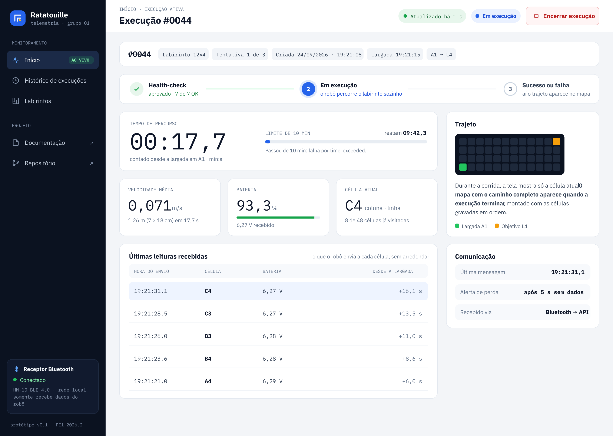

Acompanhamento ao vivo da corrida. Mostra o tempo de percurso comparado ao **limite de 10 min**, a velocidade média, a bateria, a célula atual e as últimas leituras recebidas. Durante a corrida o mapa mostra só a célula atual; o trajeto completo aparece quando a execução termina. O botão **Encerrar execução** fica sempre disponível no topo.

### 4. Concluída

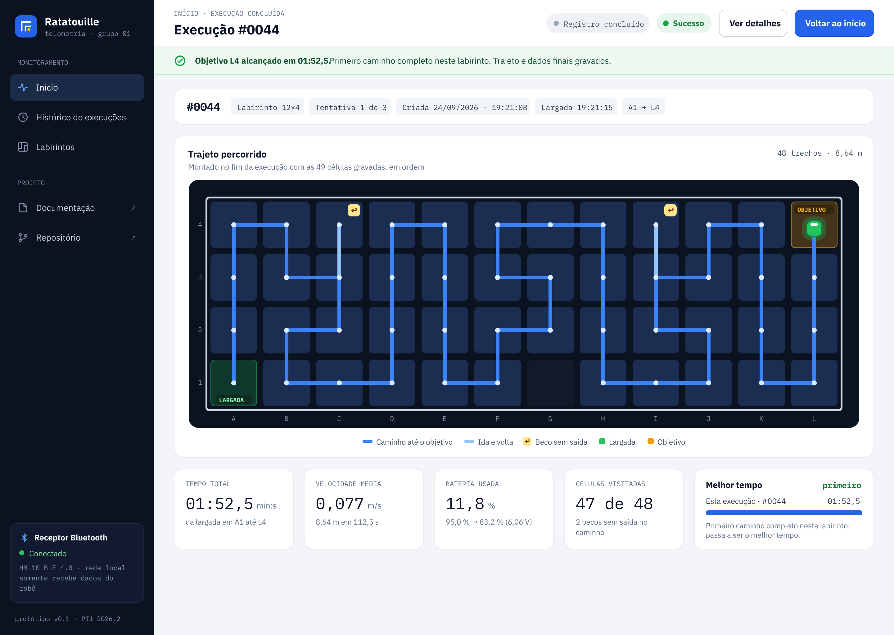

Resultado de uma execução com sucesso: o robô chegou ao objetivo L4. Apresenta o trajeto completo no mapa, o tempo total, a velocidade média, a bateria usada, as células visitadas, a sequência gravada e a **comparação com o melhor tempo** do labirinto. Daqui o operador vai para o detalhe ou volta ao início.

### 5. Execução recusada

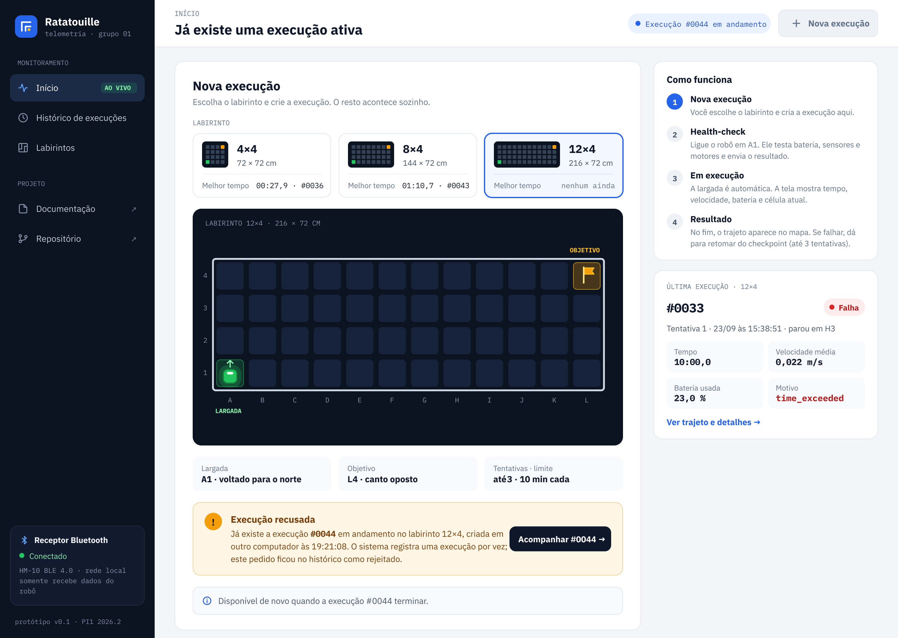

Exceção que aparece quando alguém tenta criar uma execução enquanto outra já está em andamento. O sistema registra **uma execução por vez**, então o pedido fica no histórico como rejeitado. O botão **Acompanhar #0044** leva à execução que está ativa.

### 6. Sem comunicação

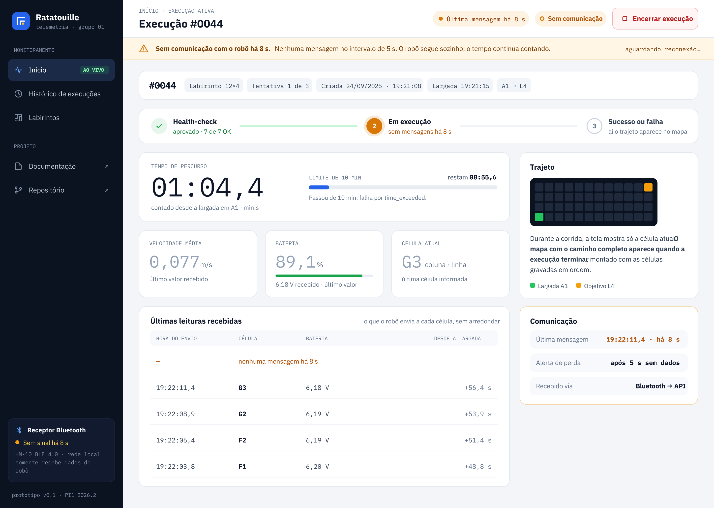

Exceção que aparece quando o robô passa **mais de 5 s sem enviar mensagens**. O alerta fica no topo e os valores aparecem esmaecidos como "último valor recebido". O robô continua a corrida sozinho e o tempo continua contando. Quando a comunicação volta, a tela retorna ao acompanhamento normal.

### 7. Encerrar execução


Janela de confirmação para o operador encerrar a execução manualmente. Ele escolhe o motivo da falha (colisão com parede, robô travado ou saiu do labirinto) e pode deixar uma observação. Nada é enviado ao robô: o encerramento serve só para registrar a falha na telemetria.

### 8. Encerrada como falha


Resultado de uma execução encerrada como falha. O mapa mostra o trajeto até a falha e marca a célula onde ela ocorreu (H2). O **checkpoint** é a célula anterior (H3). O cartão *Registro da falha* resume célula, motivo e momento. O cartão *Retomar do checkpoint* informa quantas tentativas ainda restam (**até 3 por execução**).

### 9. Retomar do checkpoint

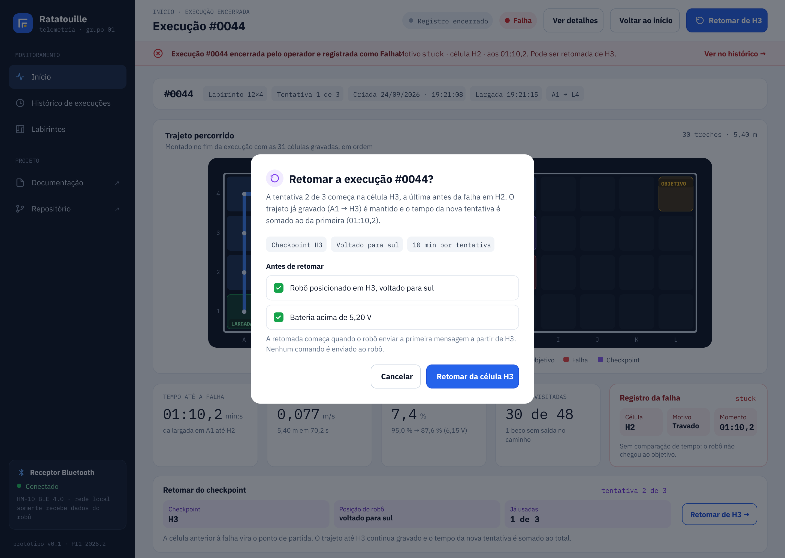

Confirmação da retomada. Explica que a tentativa 2 começa no checkpoint H3, que o trajeto já gravado (A1 → H3) é mantido e que o tempo da nova tentativa é somado ao da primeira. Antes de retomar, o operador confirma que o robô está posicionado em H3 na direção certa e que a bateria está acima de 5,20 V.

### 10. Retomada · tentativa 2

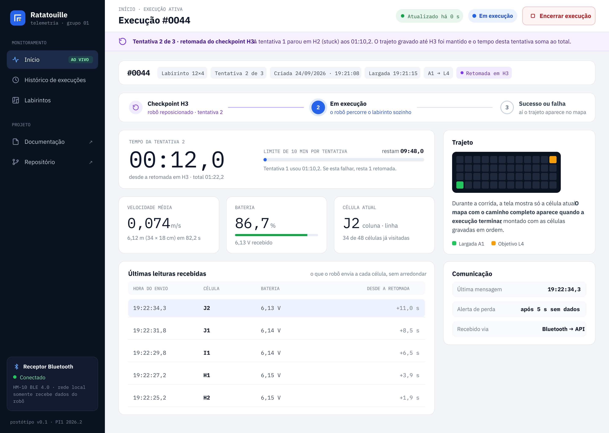

Acompanhamento ao vivo de uma tentativa retomada. É igual à tela *Em execução*, com três diferenças: um aviso indica "tentativa 2 de 3, retomada do checkpoint H3"; o cronômetro conta o tempo **desta tentativa**, mas mostra também o total acumulado; e cada tentativa tem o próprio limite de 10 min.

### 11. Concluída após retomada

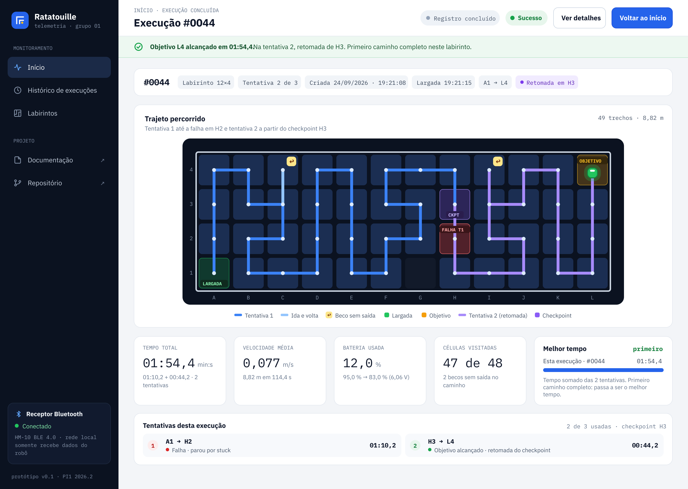

Sucesso depois de uma retomada. O mapa mostra as duas tentativas com cores diferentes (tentativa 1 até a falha e tentativa 2 a partir do checkpoint). O tempo total é a **soma das tentativas**, sem contar a pausa para reposicionar o robô. O cartão *Tentativas desta execução* detalha o trecho e o tempo de cada uma.

### 12. Falha sem retomada (3 de 3)

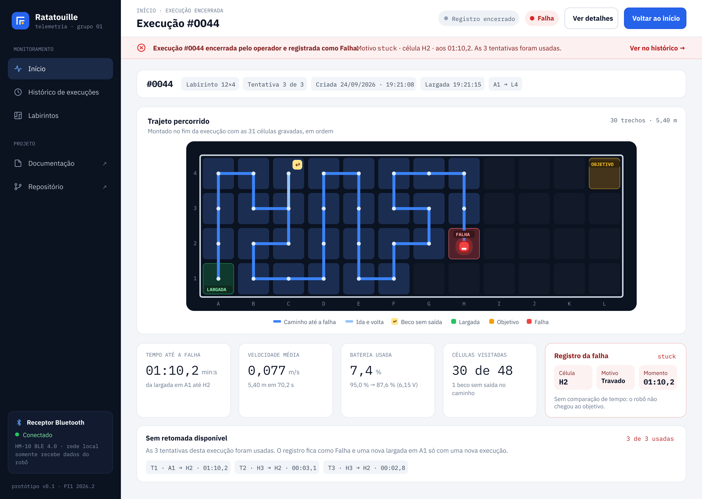

Falha depois que as 3 tentativas já foram usadas. A tela mostra o trajeto e o registro da falha, e o cartão *Sem retomada disponível* lista o trecho e o tempo de cada tentativa. Não é possível retomar de novo: para correr outra vez a partir de A1, é preciso criar uma **nova execução**.

---

### Link de acesso ao Figma

**[Figma do projeto Ratatouille](https://www.figma.com/design/1xt8XSJqmBrJoqNEfO8uI0/Ratatui---PI1?node-id=52-1346&p=f&t=raHY51qrArLJHD1H-0)**


---

## Referências

> 1. ESPRESSIF SYSTEMS. *ESP32 Series Datasheet*, versão 3.0, 2019. Disponível em: [ESP32.pdf](dev-docs/ESP32.pdf). Acesso em: 23 de set. 2026.

> 2. FastAPI. Documentação oficial. Disponível em: [https://fastapi.tiangolo.com/](https://fastapi.tiangolo.com/). Acesso em: 23 de set. 2026.

> 3. SQLAlchemy. Documentação oficial. Disponível em: [https://docs.sqlalchemy.org/](https://docs.sqlalchemy.org/). Acesso em: 23 de set. 2026.

> 4. PostgreSQL. Documentação oficial. Disponível em: [https://www.postgresql.org/docs/](https://www.postgresql.org/docs/). Acesso em: 23 de set. 2026.

> 5. Docker. *Docker Compose overview*. Disponível em: [https://docs.docker.com/compose/](https://docs.docker.com/compose/). Acesso em: 23 de set. 2026.

> 6. LAW, G. Quantitative comparison of flood fill and modified flood fill algorithms. *International Journal of Computer Theory and Engineering*, v. 5, n. 3, p. 503-508, 2013. Disponível em: [PDF](dev-docs/algoritmo-navegacao/Law-2013-IJCTE-flood-fill.pdf). Acesso em: 25 de set. 2026.

> 7. SHARMA, K.; MUNSHI, C. A comprehensive and comparative study of maze-solving techniques by implementing graph theory. *IOSR Journal of Computer Engineering*, v. 17, n. 1, p. 24-29, 2015. Disponível em: [PDF](dev-docs/algoritmo-navegacao/Sharma-Munshi-2015-IOSR-JCE.pdf). Acesso em: 25 de set. 2026.

> 8. TJIHARJADI, S.; WIJAYA, M. C.; SETIAWAN, E. Optimization maze robot using A* and flood fill algorithm. *International Journal of Mechanical Engineering and Robotics Research*, v. 6, n. 5, p. 366-372, 2017. Disponível em: [PDF](dev-docs/algoritmo-navegacao/Tjiharjadi-2017-IJMERR-Astar-flood-fill.pdf). Acesso em: 25 de set. 2026.

> 9. HARRISON, P. Solving the maze. *Micromouse Online*. Disponível em: [https://micromouseonline.com/micromouse-book/mazes-and-maze-solving/solving-the-maze/](https://micromouseonline.com/micromouse-book/mazes-and-maze-solving/solving-the-maze/). Acesso em: 25 de set. 2026.

> 10. JSDKK (Japan System Design). どこよりも詳しいマイクロマウス解説, seção 4-5 "足立法の冊子". Disponível em: [https://jsdkk.com/home/glossary/glossary-micromouse/](https://jsdkk.com/home/glossary/glossary-micromouse/). Acesso em: 25 de set. 2026.

> 11. HARRISON, P. Adachi micromouse maze solving algorithms. *Micromouse Online*, 27 maio 2008. Disponível em: [https://micromouseonline.com/2008/05/27/adachi-micromouse-maze-solving-algorithms/](https://micromouseonline.com/2008/05/27/adachi-micromouse-maze-solving-algorithms/). Acesso em: 25 de set. 2026.
