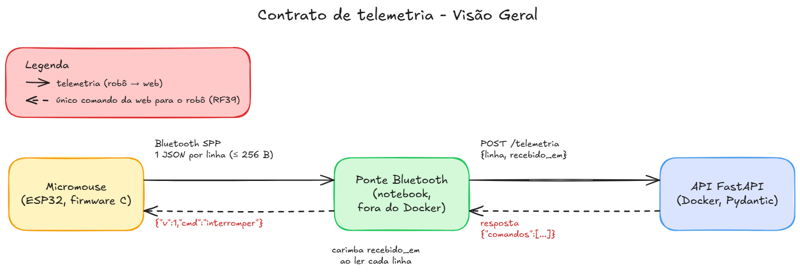

# Contrato de Telemetria

Apêndice do [Projeto conceitual de software](4.4%20-%20Projeto%20conceitual%20de%20software.md). Define, sem ambiguidade, as mensagens trocadas entre o **Micromouse**, a **ponte Bluetooth** e o **backend**, para que as três partes possam ser implementadas e testadas separadamente ([RNF-B13](4.4%20-%20Projeto%20conceitual%20de%20software.md#2-backlog-nao-funcional)). Resolve as pendências "Formato das mensagens de telemetria" e "Detalhes da ponte Bluetooth" da [arquitetura](4.4%20-%20Projeto%20conceitual%20de%20software.md#pendencias-da-arquitetura).

**Versão do contrato:** 1.

**Fonte única dos exemplos:** [`src/contrato/exemplos.jsonl`](https://github.com/fcte-pi1/2026_2_PI1_Grupo01_Juliana/blob/main/src/contrato/exemplos.jsonl). Os exemplos desta página são cópias desse arquivo, e os testes do backend e do firmware conferem que cada lado gera exatamente essas linhas (seção [Implementações e testes](#implementacoes-e-testes)).

## Visão geral

<font size="3"><p style="text-align: center">Figura 1: Visão geral do contrato de telemetria</p></font>



<font size="2"><p style="text-align: center">Fonte: [Wanjo Christopher Paraizo Escobar](https://github.com/wChrstphr), 2026. · [Fonte editável (Excalidraw)](https://github.com/fcte-pi1/2026_2_PI1_Grupo01_Juliana/blob/main/docs/modelagem/contrato-telemetria.excalidraw)</p></font>

- O robô só **envia** telemetria. O único comando que ele recebe é a **interrupção** do encerramento manual ([RF39](2%20-%20Requisitos.md#software), [RNF06](2%20-%20Requisitos.md#software)).
- A ponte é "burra": não interpreta as mensagens. Ela lê cada linha da serial, anota a hora em que leu e repassa à [API](Gloss%C3%A1rio.md#sigla-api). Toda a validação fica no backend.

## Enquadramento

- Uma mensagem por linha, em **[JSON](Gloss%C3%A1rio.md#sigla-json) compacto** (sem espaços), codificado em **[UTF-8](Gloss%C3%A1rio.md#sigla-utf8)** e terminado em `\n`.
- Cada linha tem no máximo **256 bytes**, contando o `\n`.
- A ordem das chaves é a dos exemplos. O backend não depende da ordem, mas o firmware sempre gera nessa ordem, o que permite comparar byte a byte nos testes.

## Campos comuns

Toda mensagem do robô começa com estes campos.

<font size="3"><p style="text-align: center">Tabela 1: Campos comuns a todas as mensagens</p></font>

| Campo  | Tipo    | Unidade / faixa            | Descrição                                                                                                       |
| ------ | ------- | -------------------------- | --------------------------------------------------------------------------------------------------------------- |
| `v`    | inteiro | sempre `1`                 | Versão do contrato. O backend descarta qualquer outro valor (seção [Versionamento](#versionamento)).          |
| `boot` | inteiro | 0 a 4 294 967 295          | Contador de inicializações do robô, guardado na [NVS](Gloss%C3%A1rio.md#sigla-nvs) e somado em 1 a cada vez que ele liga.                     |
| `seq`  | inteiro | 0 a 4 294 967 295          | Número da mensagem dentro do `boot`. Volta a 0 quando o robô liga e soma 1 a cada mensagem, de qualquer tipo. |
| `t_ms` | inteiro | ms, 0 a 4 294 967 295      | Milissegundos desde que o robô ligou, no instante do envio.                                                     |
| `tipo` | texto   | ver [Mensagens do robô](#mensagens-do-robo) | Define os demais campos.                                                                        |

<font size="2"><p style="text-align: center">Fonte: [Wanjo Christopher Paraizo Escobar](https://github.com/wChrstphr), 2026.</p></font>

O par (`boot`, `seq`) identifica cada mensagem de forma única, mesmo depois de o robô reiniciar em uma retomada ([RF38](2%20-%20Requisitos.md#software)).

## Mensagens do robô

As mensagens se dividem em dois grupos:

- **Amostra:** a `tel`. Se uma se perder, a seguinte chega logo e a substitui. Não é reenviada.
- **Eventos:** `hc_item`, `hc_resultado`, `passo`, `falha` e `sucesso`. Cada um registra algo que aconteceu uma vez e não pode se perder; por isso entram no buffer de reenvio (seção [Reconexão](#reconexao-e-mensagens-repetidas)).

### `tel`: estado atual do robô

Enviada continuamente: **5 por segundo** com o robô em movimento e **1 por segundo** parado. Alimenta o painel ao vivo, serve de sinal de vida para o [RF31](2%20-%20Requisitos.md#software) (10 s sem mensagem = link perdido) e cumpre o [RF08](2%20-%20Requisitos.md#software) (célula, bateria e instante de envio).

```json
{"v":1,"boot":7,"seq":42,"t_ms":11250,"tipo":"tel","estado":"running","x":0,"y":2,"rumo":"N","bat_mv":7810,"vel_mm_s":210,"eixo_longo":null}
```

<font size="3"><p style="text-align: center">Tabela 2: Campos da mensagem tel</p></font>

| Campo        | Tipo           | Unidade / faixa                                   | Descrição                                                                                         |
| ------------ | -------------- | ------------------------------------------------- | ------------------------------------------------------------------------------------------------- |
| `estado`     | texto          | `health-check`, `running`, `success` ou `failed` | Fase da tentativa do ponto de vista do robô ([RF16](2%20-%20Requisitos.md#software)).                                               |
| `x`, `y`     | inteiro        | célula, 0 a 11                                    | Célula atual, no [referencial do robô](#referencial-e-paredes).                                  |
| `rumo`       | texto          | `N`, `S`, `L` ou `O`                              | Direção para a qual o robô aponta, no mesmo referencial. A web a usa para desenhar o robô.        |
| `bat_mv`     | inteiro        | mV, 0 a 10 000                                    | Tensão da bateria. O backend converte para % pela curva da fonte definida pela Energia ([RF11](2%20-%20Requisitos.md#software)).   |
| `vel_mm_s`   | inteiro        | mm/s, 0 a 2 000                                   | Velocidade medida pelos encoders ([RF22](2%20-%20Requisitos.md#software)).                                                          |
| `eixo_longo` | texto ou nulo  | `x`, `y` ou `null`                                | Eixo em que o labirinto 8x4 ou 12x4 se estende. `null` enquanto o robô não sabe, e sempre no 4x4. |

<font size="2"><p style="text-align: center">Fonte: [Wanjo Christopher Paraizo Escobar](https://github.com/wChrstphr), 2026.</p></font>

### `hc_item`: um componente do health-check

Enviada uma vez por componente, assim que o robô termina de testá-lo ([RF29](2%20-%20Requisitos.md#software)). A web marca o checklist em tempo real e mostra qual componente reprovou.

```json
{"v":1,"boot":7,"seq":0,"t_ms":412,"tipo":"hc_item","componente":"bateria","aprovado":true,"valor":7840}
{"v":1,"boot":7,"seq":5,"t_ms":1630,"tipo":"hc_item","componente":"motor_esquerdo","aprovado":true,"valor":null}
```

<font size="3"><p style="text-align: center">Tabela 3: Campos da mensagem hc_item</p></font>

| Campo        | Tipo             | Unidade / faixa                                   | Descrição                                                                 |
| ------------ | ---------------- | ------------------------------------------------- | ------------------------------------------------------------------------- |
| `componente` | texto            | um dos 8 da lista fixa (Tabela 4)                 | Componente verificado.                                                    |
| `aprovado`   | booleano         | `true` ou `false`                                 | Resultado da verificação.                                                 |
| `valor`      | inteiro ou nulo  | unidade conforme o componente (Tabela 4)          | Medida que justificou o resultado.                                        |

<font size="2"><p style="text-align: center">Fonte: [Wanjo Christopher Paraizo Escobar](https://github.com/wChrstphr), 2026.</p></font>

<font size="3"><p style="text-align: center">Tabela 4: Componentes do health-check e unidade do valor</p></font>

| Componente                                                     | `valor`                                         |
| -------------------------------------------------------------- | ----------------------------------------------- |
| `bateria`                                                      | Tensão em mV.                                   |
| `tof_frontal`, `tof_esquerdo`, `tof_direito`                   | Distância lida, em mm.                          |
| `encoder_esquerdo`, `encoder_direito`                          | Pulsos contados ao girar o motor no teste.      |
| `motor_esquerdo`, `motor_direito`                              | `null`: o motor é aprovado pelo próprio encoder. |

<font size="2"><p style="text-align: center">Fonte: [Wanjo Christopher Paraizo Escobar](https://github.com/wChrstphr), 2026.</p></font>

### `hc_resultado`: fim do health-check

Enviada uma vez, depois do último `hc_item`. Traz o tipo de labirinto lido no [DIP](Gloss%C3%A1rio.md#sigla-dip) switch ([RF27](2%20-%20Requisitos.md#software)) e se a tentativa começa do zero ou continua o mapa gravado ([RF38](2%20-%20Requisitos.md#software)).

```json
{"v":1,"boot":7,"seq":10,"t_ms":2380,"tipo":"hc_resultado","aprovado":true,"tipo_dip":"4x4","inicio":"nova"}
```

<font size="3"><p style="text-align: center">Tabela 5: Campos da mensagem hc_resultado</p></font>

| Campo      | Tipo     | Unidade / faixa                            | Descrição                                                                                             |
| ---------- | -------- | ------------------------------------------ | ----------------------------------------------------------------------------------------------------- |
| `aprovado` | booleano | `true` ou `false`                          | Resultado geral. Se `false`, o robô não anda e a tentativa termina em `health_check_failed`.          |
| `tipo_dip` | texto    | `4x4`, `8x4`, `12x4` ou `invalido`         | Tipo lido nas vias 1 e 2 do [DIP](Gloss%C3%A1rio.md#sigla-dip) switch. `invalido` (código `11`) sempre vem com `aprovado` = `false`. |
| `inicio`   | texto    | `nova` ou `retomada`                       | `retomada` quando o robô continua o mapa e a posição gravados na flash ([RF42](2%20-%20Requisitos.md#software)).                        |

<font size="2"><p style="text-align: center">Fonte: [Wanjo Christopher Paraizo Escobar](https://github.com/wChrstphr), 2026.</p></font>

O backend compara o `tipo_dip` com o tipo informado em **Nova execução**. Se divergirem, a tentativa termina como `failed` com `health_check_failed` e a web mostra um alerta (ver [Tipo do labirinto e orientação](4.4%20-%20Projeto%20conceitual%20de%20software.md#tipo-do-labirinto-e-orientacao)).

### `passo`: uma célula do trajeto

Enviada **toda vez que o robô entra em uma célula**, inclusive quando volta a uma célula já visitada; senão, o trajeto ficaria com buracos. Alimenta o desenho do mapa e do trajeto na web ([RF09](2%20-%20Requisitos.md#software), [RF37](2%20-%20Requisitos.md#software)).

```json
{"v":1,"boot":7,"seq":43,"t_ms":11400,"tipo":"passo","x":0,"y":3,"paredes":9}
```

<font size="3"><p style="text-align: center">Tabela 6: Campos da mensagem passo</p></font>

| Campo     | Tipo    | Unidade / faixa   | Descrição                                                                 |
| --------- | ------- | ----------------- | ------------------------------------------------------------------------- |
| `x`, `y`  | inteiro | célula, 0 a 11    | Célula em que o robô entrou.                                              |
| `paredes` | inteiro | máscara, 0 a 15   | Soma das paredes presentes: N = 1, S = 2, L = 4, O = 8.                    |

<font size="2"><p style="text-align: center">Fonte: [Wanjo Christopher Paraizo Escobar](https://github.com/wChrstphr), 2026.</p></font>

No exemplo, `9` = 1 + 8: paredes ao **norte** e a **oeste**.

### `falha`: a tentativa parou sem chegar

Enviada quando o robô para por conta própria, quando confirma uma interrupção da web ou quando o operador toca no BOOT durante a corrida ([RF41](2%20-%20Requisitos.md#software)).

```json
{"v":1,"boot":7,"seq":88,"t_ms":25120,"tipo":"falha","motivo":"falha_componente","origem":"automatica","x":2,"y":3,"componente":"tof_direito"}
{"v":1,"boot":8,"seq":57,"t_ms":19870,"tipo":"falha","motivo":null,"origem":"web","x":1,"y":2,"componente":null}
{"v":1,"boot":9,"seq":63,"t_ms":21040,"tipo":"falha","motivo":"encerrado_operador","origem":"boot","x":1,"y":3,"componente":null}
```

<font size="3"><p style="text-align: center">Tabela 7: Campos da mensagem falha</p></font>

| Campo        | Tipo           | Unidade / faixa                                                               | Descrição                                                     |
| ------------ | -------------- | ----------------------------------------------------------------------------- | ------------------------------------------------------------- |
| `motivo`     | texto ou nulo  | `collision`, `stuck`, `falha_componente`, `low_battery`, `encerrado_operador` ou `null` | Motivo da parada ([RF15](2%20-%20Requisitos.md#software)). Depende da origem (Tabela 8). |
| `origem`     | texto          | `automatica`, `web` ou `boot`                                                 | Quem causou a parada.                                         |
| `x`, `y`     | inteiro        | célula, 0 a 11                                                                | Célula em que o robô parou; ponto de partida da retomada.     |
| `componente` | texto ou nulo  | um dos 8 da Tabela 4, ou `null`                                               | Preenchido só quando `motivo` = `falha_componente`.           |

<font size="2"><p style="text-align: center">Fonte: [Wanjo Christopher Paraizo Escobar](https://github.com/wChrstphr), 2026.</p></font>

<font size="3"><p style="text-align: center">Tabela 8: Combinações válidas de origem e motivo</p></font>

| `origem`     | `motivo`                                                        | Como o backend registra                                                                                                           |
| ------------ | --------------------------------------------------------------- | --------------------------------------------------------------------------------------------------------------------------------- |
| `automatica` | `collision`, `stuck`, `falha_componente` ou `low_battery`      | Cria a `FALHA` com o motivo e a origem `automatica`.                                                                              |
| `web`        | `null`                                                          | Só confirma a interrupção. A `FALHA` já foi criada pelo modal **Encerrar tentativa**, com o motivo escolhido; o backend atualiza a célula com o `x`, `y` recebidos, porque é onde o robô de fato parou. |
| `boot`       | `encerrado_operador`                                            | Cria a `FALHA` com motivo e origem `encerrado_operador` ([RF41](2%20-%20Requisitos.md#software)).                                                                   |

<font size="2"><p style="text-align: center">Fonte: [Wanjo Christopher Paraizo Escobar](https://github.com/wChrstphr), 2026.</p></font>

Os motivos `time_exceeded` e `link_lost` são decididos só pelo backend ([RF31](2%20-%20Requisitos.md#software), [RF32](2%20-%20Requisitos.md#software)) e nunca vêm do robô. O `out_of_track` só é escolhido pelo operador no modal. Um health-check reprovado vai no `hc_resultado`, sem `falha` separada.

### `sucesso`: o robô chegou ao objetivo

Enviada uma vez, quando o robô entra em uma célula de objetivo do tipo selecionado no [DIP](Gloss%C3%A1rio.md#sigla-dip) switch ([RF26](2%20-%20Requisitos.md#software)).

```json
{"v":1,"boot":11,"seq":131,"t_ms":48200,"tipo":"sucesso","x":3,"y":3}
```

<font size="3"><p style="text-align: center">Tabela 9: Campos da mensagem sucesso</p></font>

| Campo    | Tipo    | Unidade / faixa | Descrição                    |
| -------- | ------- | --------------- | ---------------------------- |
| `x`, `y` | inteiro | célula, 0 a 11  | Célula de objetivo alcançada. |

<font size="2"><p style="text-align: center">Fonte: [Wanjo Christopher Paraizo Escobar](https://github.com/wChrstphr), 2026.</p></font>

## Referencial e paredes

As coordenadas estão no **referencial do robô**, descrito em [Tipo do labirinto e orientação](4.4%20-%20Projeto%20conceitual%20de%20software.md#tipo-do-labirinto-e-orientacao):

- A largada é a célula (0, 0). O eixo **y** aponta para a saída do beco da largada.
- O sinal de **x** é fixado na primeira abertura lateral. Antes disso o robô só anda em y, com x = 0.
- Com isso, `x` e `y` estão sempre entre 0 e 11.

A máscara de `paredes` e o `rumo` usam direções **absolutas** nesse referencial: **N** = +y, **S** = −y, **L** = +x e **O** = −x. Enquanto o sinal de x não está fixado, as células visitadas têm parede dos dois lados, então L e O não são ambíguos. O firmware só envia o `passo` da célula da primeira abertura lateral depois de fixar o sinal.

**Desenho na web.** No 8x4 e no 12x4, o robô não sabe de antemão se o lado longo do labirinto fica em x ou em y. Enquanto `eixo_longo` for `null`, a web desenha só o canto 4x4 junto à largada e expande a grade quando ele passa a `x` ou `y`. O robô define o `eixo_longo` ao entrar na primeira célula com `x` > 3 ou `y` > 3.

## Taxas

<font size="3"><p style="text-align: center">Tabela 10: Taxas de envio</p></font>

| Mensagem                          | Taxa                                                        |
| --------------------------------- | ----------------------------------------------------------- |
| `tel`                             | 5 por segundo em movimento; 1 por segundo parado.           |
| Eventos                           | Na hora em que acontecem (um `passo` a cada célula).        |
| Reenvio depois de uma reconexão   | No máximo 20 por segundo, além da `tel`.                    |

<font size="2"><p style="text-align: center">Fonte: [Wanjo Christopher Paraizo Escobar](https://github.com/wChrstphr), 2026.</p></font>

Em regime normal, o total fica abaixo das 10 mensagens por segundo do [RNF-B11](4.4%20-%20Projeto%20conceitual%20de%20software.md#2-backlog-nao-funcional). A `tel` a 1 Hz com o robô parado mantém o sinal de vida, sem uma mensagem `heartbeat` separada.

## Comando da web para o robô

O único comando é a interrupção do encerramento manual ([RF30](2%20-%20Requisitos.md#software), [RF39](2%20-%20Requisitos.md#software)):

```json
{"v":1,"cmd":"interromper"}
```

- O backend devolve o comando em **toda** resposta ao `POST /telemetria` até receber a `falha` com `origem` = `web` que confirma a parada, ou até abrir uma nova tentativa. Assim, a interrupção não se perde se uma resposta cair.
- O robô para, envia a `falha` de confirmação e ignora o comando se já estiver parado, apenas repetindo a confirmação. Repetir o comando não tem efeito colateral.
- Com o robô em movimento, a `tel` a 5 Hz faz o comando chegar em até cerca de 200 ms. Sem link, o comando chega na reconexão; a parada sem rede continua sendo o botão BOOT ([RF41](2%20-%20Requisitos.md#software)).

## Ponte e API

A ponte roda no notebook, fora do Docker, e conversa com a [API](Gloss%C3%A1rio.md#sigla-api) por um único endpoint.

**`POST /telemetria`**

```json
{"linha":"{\"v\":1,\"boot\":7,\"seq\":42,...}","recebido_em":"2026-10-05T14:03:21.512-03:00"}
```

- `linha`: a linha lida da serial, sem o `\n`, sem nenhuma alteração.
- `recebido_em`: instante em que a ponte leu a linha, com fuso horário. É o ponto mais próximo do rádio, então o [RNF-B04](4.4%20-%20Projeto%20conceitual%20de%20software.md#2-backlog-nao-funcional) mede o backend sem o atraso da ponte.

**Resposta**

```json
{"comandos":[{"v":1,"cmd":"interromper"}]}
```

A lista vem vazia (`{"comandos":[]}`) quando não há comando. A ponte escreve cada comando na serial como [JSON](Gloss%C3%A1rio.md#sigla-json) compacto, terminado em `\n`.

**[API](Gloss%C3%A1rio.md#sigla-api) fora do ar.** Se o POST falhar, a ponte guarda as linhas numa fila em memória e as reenvia em ordem quando a [API](Gloss%C3%A1rio.md#sigla-api) voltar, com no máximo 100 linhas (10 s a 10 mensagens por segundo). O robô continua a corrida normalmente ([RNF-B07](4.4%20-%20Projeto%20conceitual%20de%20software.md#2-backlog-nao-funcional)).

## Validação no backend

O backend valida cada linha com o schema Pydantic do contrato. Uma linha é **descartada e registrada só em log**, sem interromper o serviço ([RNF-B09](4.4%20-%20Projeto%20conceitual%20de%20software.md#2-backlog-nao-funcional)), quando:

- passa de 256 bytes ou não é [JSON](Gloss%C3%A1rio.md#sigla-json);
- tem `v` diferente de 1 ou `tipo` desconhecido;
- falta um campo, um campo tem o tipo errado ou um valor sai da faixa das tabelas;
- `origem`, `motivo` e `componente` da `falha` não combinam (Tabela 8);
- a célula está fora dos limites do labirinto da execução. Por exemplo, num 4x4, `x` ou `y` maior que 3.

Campos extras desconhecidos são **ignorados**, sem descartar a mensagem.

**Mensagem sem tentativa aberta.** Se não houver tentativa em `health-check` ou `running` (por exemplo, o robô foi ligado antes de **Nova execução**, ou a mensagem chegou atrasada depois de um encerramento), a mensagem é descartada e registrada só em log. A exceção é a `falha` com `origem` = `web`, que confirma a interrupção da tentativa recém-encerrada.

## Reconexão e mensagens repetidas

Regra para quedas de até 10 s ([RNF-B08](4.4%20-%20Projeto%20conceitual%20de%20software.md#2-backlog-nao-funcional)). A partir de 10 s sem mensagem, vale o [RF31](2%20-%20Requisitos.md#software) (`link_lost`).

1. **No firmware:** todo evento entra num **buffer circular de 64 eventos** no momento em que é gerado, em ordem de `seq`. Em 10 s de queda, o pior caso é de cerca de 15 `passo` e alguns outros eventos, então o buffer não enche. Se encher, o evento mais antigo é descartado.
2. **Ao reconectar:** o robô reenvia o buffer inteiro, do mais antigo para o mais novo, a no máximo 20 por segundo. Eventos novos entram no fim do buffer e saem depois dos antigos, então os eventos sempre chegam em ordem de `seq`. A `tel` continua saindo normalmente e não é reenviada.
3. **No backend:** para cada `boot`, guarda o maior `seq` de **evento** já aceito. Um evento com `seq` menor ou igual a esse é repetido e é descartado. A `tel` não passa por essa regra.

Não há confirmação (*ack*) do backend para o robô: reenviar o buffer inteiro custa no máximo 64 linhas por reconexão e mantém o downlink com um único comando ([RNF06](2%20-%20Requisitos.md#software)).

## Tempo e horário de Brasília

- O **relógio oficial** é o do backend. O `recebido_em` é gravado como `TIMESTAMPTZ`: o PostgreSQL guarda em [UTC](Gloss%C3%A1rio.md#sigla-utc) e a web mostra em `America/Sao_Paulo`. Os tempos de tentativa e de execução ([RF13](2%20-%20Requisitos.md#software), [RF32](2%20-%20Requisitos.md#software)) usam esse relógio.
- O robô não tem relógio de parede nem recebe comando de sincronia. O `t_ms` mede o instante de envio no relógio interno do robô.
- O backend converte o `t_ms` em hora real e grava em `enviado_em` ([RF08](2%20-%20Requisitos.md#software)). Na primeira mensagem de cada `boot`, ele calcula uma **âncora** = `recebido_em` − `t_ms`; em cada mensagem seguinte do mesmo `boot`, `enviado_em` = âncora + `t_ms`. O erro é a latência do Bluetooth na primeira mensagem, da ordem de dezenas de milissegundos, e os intervalos entre mensagens do mesmo `boot` saem exatos. Assim, o `enviado_em` também é exibido em horário de Brasília.
- A interrupção é gerada pelo próprio backend, então o horário dela é exato.

## Versionamento

O campo `v` protege contra firmware e backend em versões diferentes do contrato, por exemplo um robô gravado com firmware antigo.

<font size="3"><p style="text-align: center">Tabela 11: Quando mudar a versão</p></font>

| Mudança                                         | Exemplo                       | Versão                                                                          |
| ----------------------------------------------- | ----------------------------- | ------------------------------------------------------------------------------- |
| Acrescentar um campo opcional                   | `temp_c` na `tel`             | Continua `v` = 1. Quem não conhece o campo o ignora.                            |
| Mudar ou remover um campo, ou mudar uma unidade | `bat_mv` → `bat` em %         | Passa a `v` = 2, com firmware e backend mudando juntos, num [PR](Gloss%C3%A1rio.md#sigla-pr) aprovado pelos dois. |

<font size="2"><p style="text-align: center">Fonte: [Wanjo Christopher Paraizo Escobar](https://github.com/wChrstphr), 2026.</p></font>

O backend aceita só `v` = 1 e descarta as outras versões com registro em log, o que deixa o erro visível em vez de gravar dados errados.

## Onde cada mensagem é gravada

<font size="3"><p style="text-align: center">Tabela 12: Mensagens e tabelas do banco</p></font>

| Mensagem       | Tabela do [DER](4.4%20-%20Projeto%20conceitual%20de%20software.md#persistencia-de-dados) | Observação                                                                    |
| -------------- | ---------------------------------------------------------------------------------------- | ----------------------------------------------------------------------------- |
| `tel`          | `LEITURA_TELEMETRIA`                                                                     | Uma linha por `tel`. `bat_mv` → `bateria` (em mV); `vel_mm_s` → `velocidade`; `t_ms` → `enviado_em` (seção [Tempo](#tempo-e-horario-de-brasilia)). O `boot` e o `seq` só servem à deduplicação, em memória, e não são gravados. |
| `hc_item`      | `HEALTH_CHECK_ITEM`                                                                      | `valor` → `valor_lido`.                                                       |
| `hc_resultado` | `TENTATIVA`                                                                              | `tipo_dip` e `inicio` → `tipo_dip` e `tipo_inicio`; muda o status para `running` ou `failed`. |
| `passo`        | `PASSO_TRAJETO` e `PAREDE_CELULA`                                                        | Na mesma transação; `paredes` → `paredes_mask` e as quatro colunas de parede. |
| `falha`        | `FALHA` e `TENTATIVA`                                                                    | Conforme a Tabela 8.                                                          |
| `sucesso`      | `TENTATIVA`                                                                              | Status `success` e métricas finais.                                           |

<font size="2"><p style="text-align: center">Fonte: [Wanjo Christopher Paraizo Escobar](https://github.com/wChrstphr), 2026.</p></font>

## Implementações e testes

<font size="3"><p style="text-align: center">Tabela 13: Arquivos do contrato</p></font>

| Arquivo                                     | Conteúdo                                                                                         |
| ------------------------------------------- | ------------------------------------------------------------------------------------------------ |
| `src/contrato/exemplos.jsonl`               | Um exemplo real de cada tipo de mensagem. Fonte única dos exemplos desta página.                 |
| `src/backend/contrato/telemetria.py`        | Schema Pydantic, leitura e escrita das linhas, deduplicação, conversão do `t_ms` em `enviado_em` e modelos do `POST /telemetria`. |
| `src/backend/tests/test_contrato_telemetria.py` | Lê cada exemplo e o gera de volta byte a byte; testa as linhas inválidas e a deduplicação.   |
| `src/firmware/contrato/telemetria.h` e `.c` | Estruturas e serializador em C, com `snprintf` e sem alocação dinâmica.                          |
| `src/firmware/contrato/teste/teste_telemetria.c` | Monta as mesmas mensagens e compara byte a byte com o arquivo de exemplos.                  |

<font size="2"><p style="text-align: center">Fonte: [Wanjo Christopher Paraizo Escobar](https://github.com/wChrstphr), 2026.</p></font>

Para rodar os testes:

```sh
cd src/backend && pip install -e ".[dev]" && pytest   # backend (Python 3.11+)
make -C src/firmware/contrato teste    # firmware, compilado com gcc no PC
```

Qualquer mudança no contrato começa pelo `exemplos.jsonl`. Se o schema Pydantic ou o serializador em C não acompanharem, o teste correspondente falha.
